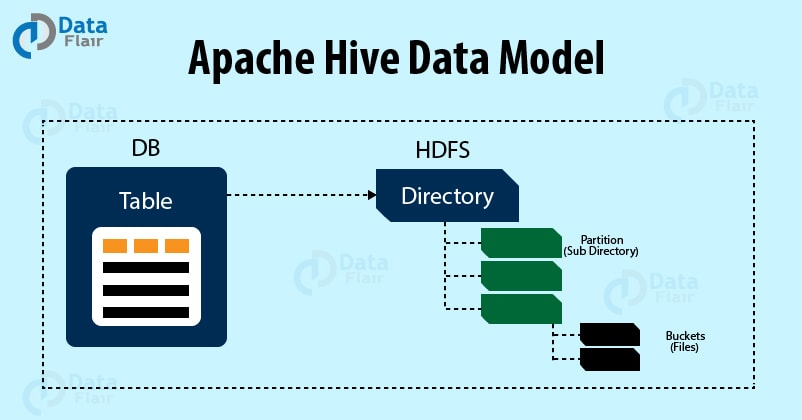
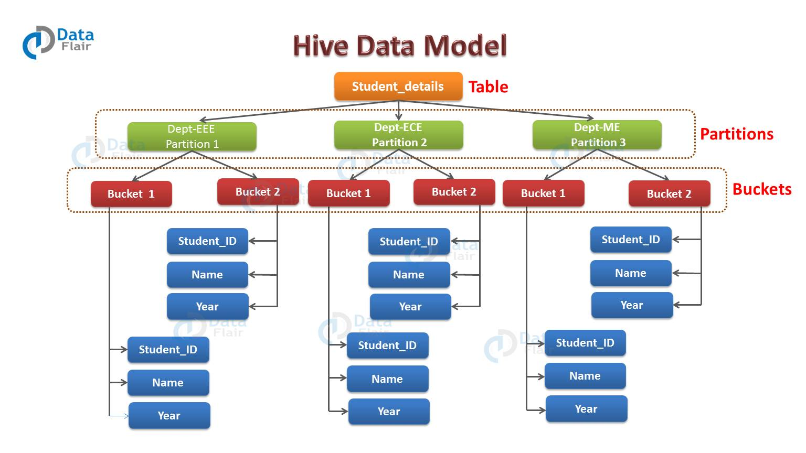

Hive 是一个基于 Hadoop 的开源数据仓库系统，主要用于对存储在 Hadoop 上的数据进行查询和分析。
它可以处理结构化和半结构化数据。而 Hive 中的数据可以分成以下几类：

* 表
* 分区
* 桶


Hive 里面的数据在逻辑上都是存储在这三种数据模型里面。下面对这三个数据模型进行详细介绍。



## 表
Hive 表跟关系数据库里面的表类似。逻辑上，数据是存储在 Hive 表里面的，而表的元数据描述了数据的布局。
我们可以对表执行过滤，关联，合并等操作。

在 Hadoop 里面，物理数据一般是存储在 HDFS 的，而元数据是存储在关系型数据库的。

Hive 有下面两种表：
* 内部表
* 外部表

当我们在 Hive 创建表的时候，Hive 将以默认的方式管理表数据，
也就是说，Hive 会默认把数据存储到 /user/hive/warehouse 目录里面。

除了内部表，我们可以创建外部表，外部表需要指定数据的目录。
我们可以看到这两种不同类型的表在使用 LOAD 和 DROP 命令时的差异。

### 内部表
当我们把数据 load 到内部表的时候，Hive 会把数据存储在 /user/hive/warehouse 目录下。
```text
CREATE TABLE managed_table (dummy STRING);
LOAD DATA INPATH '/user/tom/data.txt' INTO table managed_table;
```

根据上面的代码，Hive 会把文件 data.txt 文件存储在 managed_table 表的 warehouse 目录下，
即 hdfs://user/hive/warehouse/managed_table 目录。

如果我们用 drop 命令把表删除：
```text
DROP TABLE managed_table
```

这样将会把表以及表里面的数据和表的元数据都一起删除。

### 外部表
外部表与内部表的行为上有些差别，我们能够控制数据的创建和删除。
删除外部表的时候，Hive 只会删除表的元数据，不会删除表数据。
数据路径是在创建表的时候指定的：
```text
CREATE EXTERNAL TABLE external_table (dummy STRING)
LOCATION '/user/tom/external_table';
LOAD DATA INPATH '/user/tom/data.txt' INTO TABLE external_table;
```

利用 EXTERNAL 关键字创建外部表，Hive 不会去管理表数据，所以它不会把数据移到 /user/hive/warehouse 目录下。
甚至在执行创建语句的时候，它不会去检查建表语句中指定的外部数据路径是否存在。
这个是比较有用的特性，我们可以在表创建之后，再创建数据。

外部表还有一个比较重要的特性，上面有提到的，就是删除外部表的时候，Hive 只有删除表的元数据，而不会删除表数据。

## 分区



为了提高查询数据的效率，Hive 提供了表分区机制。
分区表基于分区键把具有相同分区键的数据存储在一个目录下，在查询某一个分区的数据的时候，只需要查询相对应目录下的数据，
而不会执行全表扫描，也就是说，Hive 在查询的时候会进行分区剪裁。每个表可以有一个或多个分区键。

创建分区表语法：
```text
CREATE TABLE table_name (column1 data_type, column2 data_type)
PARTITIONED BY (partition1 data_type, partition2 data_type,….);
```

下面通过一个例子来更好的理解分区概念。

如上图所示，假如你有一个存储学生信息的表，表名为 student_details，列分别是 student_id，name，department，year 等。
现在，如果你想基于 department 列对数据进行分区。那么属于同一个 department 的学生将会被分在同一个分区里面。
在物理上，一个分区其实就是表目录下的一个子目录。

假如你在 student_details 表里面有三个 department 的数据，分别为 EEE，ECE 和 ME。
那么这个表总共就会有三个分区，也就是图中的绿色方块部分。
对于每个 department ，您将拥有与该 department 相关的所有数据，这些数据位于表目录下的单独子目录中。

假如所有 department = EEE 的学生数据被存储在 /user/hive/warehouse/student_details/department=EEE 目录下。
那么查询 department 为 EEE 的学生信息，只需要查询 EEE 目录下的数据即可，不需要全表扫描，这样查询的效率就比较高。
而在真实生产环境中，你需要处理的数据可能会有几百 TB，如果不分区，在你只需要表的其中一小部分数据的时候，你不得不走全表扫描，
这样的查询将会非常慢而且浪费资源，可能 95% 的数据跟你的查询语句并没有关系。

## 桶
Hive 可以对每一个表或者是分区，进一步组织成桶，也就是说桶是更为细粒度的数据范围划分。
Hive 是针对表的某一列进行分桶。Hive 采用对表的列值进行哈希计算，然后除以桶的个数求余的方式决定该条记录存放在哪个桶中。
分桶的好处是可以获得更高的查询处理效率。使取样更高效。

分桶表创建命令：
```text
CREATE TABLE table_name
PARTITIONED BY (partition1 data_type, partition2 data_type,….)
CLUSTERED BY (column_name1, column_name2, …)
SORTED BY (column_name [ASC|DESC], …)]
INTO num_buckets BUCKETS;
```

每个桶只是表目录或者分区目录下的一个文件，如果表不是分区表，那么桶文件会存储在表目录下，
如果表是分区表，那么桶文件会存储在分区目录下。
所以你可以选择把分区分成 n 个桶，那么每个分区目录下就会有 n 个文件。从上图可以看到，每个分区有 2 个桶。
因此每个分区就会有 2 个文件，每个文件将会存储该分区下的数据。