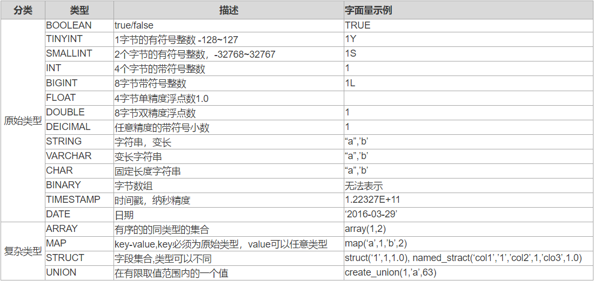

Hive支持原始数据类型和复杂类型，原始类型包括数值型，Boolean，字符串，时间戳。复杂类型包括数组，map，struct。

下面是Hive数据类型汇总：



## 基本类型
HQL 的基本类型和 Java 的基本类型很接近，虽然受到一些 MySQL 命名的影响。

### 整数类型
Hive 有 4 种带符号的整数类型：TINYINT，SMALLINT，INT，BIGINT，
分别对应 Java 中的 byte，short，int，long。
字节长度分别为 1，2，4，8 字节。
在使用整数字面量时，默认情况下为 INT，如果要声明为其他类型，通过后缀来标识：

| 类型	       | 后缀	 | 例子   |
|-----------|-----|------|
| TINYINT	  | Y	  | 100Y |
| SMALLINT	 | S	  | 100S |
| BIGINT	   | L	  | 100L |

### 小数
浮点类型包括 FLOAT 和 DOUBLE 两种，对应到 Java 的 float 和 double，分别为 32 位和 64 位浮点数。
DECIMAL 用于表示任意精度的小树，类似于 Java 的 BigDecimal，通常在货币当中使用。
例如 DECIMAL(5,2) 用于存储 -999.99 到 999.99 的数字，省略掉小数位，
DECIAML(5) 表示 -99999 到 99999 的数字。
DECIMAL 则等同于 DECIMAL(10,0)。
小数点左边允许的最大位数为 38 位。

数值类型总结如下表：

| 类型名称	     | 大小	  | 范围	                                         | 示例            |
|-----------|------|---------------------------------------------|---------------|
| TINYINT	  | 1字节	 | -128 ~ 127	                                 | 45Y           |
| SMALLINT	 | 2字节	 | -32768 ~ 32767	                             | 100S          |
| INT	      | 4字节	 | -2147483648 ~ 2147483647	                   | 36            |
| BIGINT	   | 8字节	 | -9223372036854770000 ~ 9223372036854770000	 | 2000L         |
| FLOAT	    | 4字节	 | —	                                          | 4字节单精度        |
| DOUBLE	   | 8字节	 | —	                                          | 8字节双精度        |
| DECIMAL	  | —	   | —	                                          | DECIMAL(9, 7) |

### 文本类型
Hive 有 3 种类型用于存储字文本。

STRING 存储变长的文本，对长度没有限制。
理论上将STRING 可以存储的大小为 2GB，但是存储特别大的对象时效率可能受到影响，可以考虑使用 Sqoop 提供的大对象支持。

VARCHAR 与 STRING 类似，但是长度上只允许在 1-65355 之间。例如 VARCHAR(100)。

CHAR 则用固定长度来存储数据。

| 类型名称	    | 描述	                                                                                 | 示例                |
|----------|-------------------------------------------------------------------------------------|-------------------|
| STRING	  | string类型可以用单引号（’）或双引号（”）定义，Hive 在 string 中使用 C-style。	                              | ‘hadoop tutorial’ |
| VARCHAR	 | varchar类型由长度定义，范围为 1-65355 ，如果存入的字符串长度超过了定义的长度，超出部分会被截断。尾部的空格也会作为字符串的一部分，影响字符串的比较。	 | ‘hadoop tutorial’ |
| CHAR	    | char是固定长度的，最大长度 255，而且尾部的空格不影响字符串的比较。	                                              | ‘Hadooptutorial’  |

### 布尔及二进制
BOOLEAN：表示二元的 true 或 false。

BINARY：用于存储变长的二进制数据。

### 时间类型
TIMESTAMP则存储【纳秒级别】的时间戳，同时Hive提供了一些内置函数用于在TIMESTAMP与Unix时间戳（秒）和字符串之间做转换。

例如：
```text
cast(date as date)
cast(timestamp as date)
cast(string as date)
cast(date as string)
```

时间戳类型的数据不包含任务的时区信息，但是 to_utc_timestamp 和 from_utc_timestamp 函数可以用于时区转换。
DATE 类型则表示日期，对应年月日三个部分。

### 类型转换
Hive 的类型层次中，可以根据需要进行隐式的类型转换，
例如 TINYINT 与 INT 相加，则会将TINYINT 转化成 INT 然后 INT 做加法。

隐式转换的规则大致可以归纳如下：
* 任意数值类型都可以转换成更宽的数据类型（不会导致精度丢失）或者文本类型。
* 所有的文本类型都可以隐式地转换成另一种文本类型。也可以被转换成 DOUBLE 或者 DECIMAL，转换失败时抛出异常。
* BOOLEAN 不能做任何的类型转换。
* 时间戳和日期可以隐式地转换成文本类型。

同时，可以使用 CAST 进行显式的类型转换，例如：
```text
CAST('1' as INT)
```

如果转换失败，CAST 返回 NULL。

## 复杂类型
Hive 有 4 种复杂类型的数据结构:ARRAY，MAP，STRUCT，UNION。

### STRUCT
类似于 C、C# 语言，Hive 中定义的 struct 类型也可以使用点来访问。从文件加载数据时，文件里的数据分隔符要和建表指定的一致。
```text
CREATE TABLE IF NOT EXISTS person_1 (id int,info struct<name:string,country:string>)  
ROW FORMAT DELIMITED FIELDS TERMINATED BY ','
COLLECTION ITEMS TERMINATED BY ':'
STORED AS TEXTFILE;
//创建一个文本文件test_struct.txt
1,'dd':'jp'
2,'ee':'cn'
3,'gg':'jp'
4,'ff':'cn'
5,'tt':'jp'
//导入数据
LOAD DATA LOCAL INPATH '/data/test_struct.txt' OVERWRITE INTO TABLE person_1;
//查询数据
hive> select * from person_1;
OK
1   {"name":"'dd'","country":"'jp'"}
2   {"name":"'ee'","country":"'cn'"}
3   {"name":"'gg'","country":"'jp'"}
4   {"name":"'ff'","country":"'cn'"}
5   {"name":"'tt'","country":"'jp'"}
Time taken: 0.046 seconds, Fetched: 5 row(s)
hive> select id,info.name,info.country from person_1 where info.name='dd';
OK
1   dd  jp
Time taken: 1.166 seconds, Fetched: 1 row(s)
```

### ARRAY
ARRAY 表示一组相同数据类型的集合，下标从零开始，可以用下标访问。
```text
CREATE TABLE IF NOT EXISTS array_1 (id int,name array<STRING>)
ROW FORMAT DELIMITED FIELDS TERMINATED BY ','
COLLECTION ITEMS TERMINATED BY ':'
STORED AS TEXTFILE;
//导入数据
LOAD DATA LOCAL INPATH '/data/test_array.txt' OVERWRITE INTO TABLE array_1;
//查询数据
hive> select * from array_1;
OK
1   ["dd","jp"]
2   ["ee","cn"]
3   ["gg","jp"]
4   ["ff","cn"]
5   ["tt","jp"]
Time taken: 0.041 seconds, Fetched: 5 row(s)
hive> select id,name[0],name[1] from array_1 where name[1]='cn';
OK
2   ee  cn
4   ff  cn
Time taken: 1.124 seconds, Fetched: 2 row(s)
```

### MAP
MAP 是一组键值对的组合，可以通过 KEY 访问 VALUE，键值之间同样要在创建表时指定分隔符。
```text
CREATE TABLE IF NOT EXISTS map_1 (id int,name map<STRING,STRING>)
ROW FORMAT DELIMITED FIELDS TERMINATED BY ','
COLLECTION ITEMS TERMINATED BY ':'
MAP KEYS TERMINATED BY ':'
STORED AS TEXTFILE;
//加载数据
LOAD DATA LOCAL INPATH '/data/test_map.txt' OVERWRITE INTO TABLE map_1;
//查询数据
hive> select * from map_1;
OK
1   {"name":"dd","country":"jp"}
2   {"name":"ee","country":"cn"}
3   {"name":"gg","country":"jp"}
4   {"name":"ff","country":"cn"}
5   {"name":"tt","country":"jp"}
Time taken: 0.038 seconds, Fetched: 5 row(s)
select id,info['name'],info['country'] from map_1 where info['country']='cn';
OK
2   ee  cn
4   ff  cn
Time taken: 1.088 seconds, Fetched: 2 row(s)
```

### UINON
Hive 除了支持 STRUCT、ARRAY、MAP 这些原生集合类型，还支持集合的组合，不支持集合里再组合多个集合。

简单示例 MAP 嵌套 ARRAY，手动设置集合格式的数据非常麻烦，建议采用 INSERT INTO SELECT 形式构造数据再插入UNION 表。

```text
//创建DUAL表，插入一条记录，用于生成数据
create table dual(d string);
insert into dual values('X');

//创建UNION表
CREATE TABLE IF NOT EXISTS uniontype_1
(
id int,
info map<STRING,array<STRING>>
)
ROW FORMAT DELIMITED FIELDS TERMINATED BY ','
COLLECTION ITEMS TERMINATED BY '-'
MAP KEYS TERMINATED BY ':'
STORED AS TEXTFILE;
//插入数据
insert overwrite table uniontype_1
select 1 as id,map('english',array(99,21,33)) as info from dual
union all
select 2 as id,map('english',array(44,33,76)) as info from dual
union all
select 3 as id,map('english',array(76,88,66)) as info from dual;
//查询数据
hive> select * from uniontype_1;
OK
3   {"german":[76,88,66]}
2   {"chinese":[44,33,76]}
1   {"english":[99,21,33]}
Time taken: 0.033 seconds, Fetched: 3 row(s)
hive> select * from uniontype_1 where info['english'][2]>30;
OK
1   {"english":[99,21,33]}
Time taken: 1.08 seconds, Fetched: 1 row(s)
```