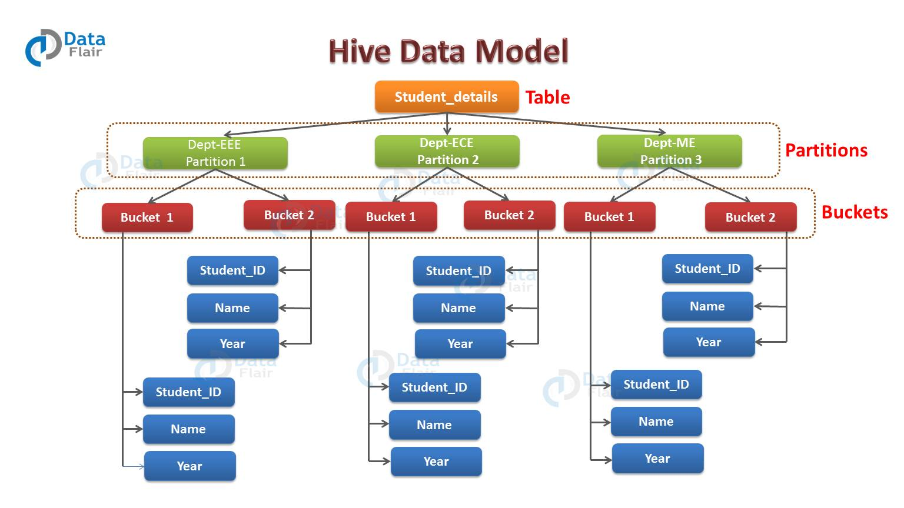

分区和分桶的概念以及用法以及详细讨论过，现在来仔细看一下他们两者的差别和共同点。

## Hive 分区与分桶
Apache Hive 是用于【查询】和【分析】【大数据集】的【开源数据仓库工具】。

Hive 里面把数据划分成三种【数据模型】，即【表】、【分区】、【分桶】。

表和关系型数据库的表概念类似，也是以行和列来呈现数据，不同的是 Hive 中的表可以分成内部表和外部表。

本节我们讨论 Hive 中的另外两个数据模型的 —— 分区和分桶。

## 分区
【分区】按表定义的【分区字段】，把具有相同字段值的数据存储到一个目录中。

Hive中的每个表可能有一个或多个分区键来标识特定的分区。
在查询数据分片的时候，使用分区可以使查询效率更高。

## 分桶
在Hive中，通过对表中的【列】运用【哈希函数】做哈希计算，根据计算出来的哈希值将表或分区细分为多个桶。
而且【每个桶的大小几乎一样】。以便提高查询效率。

## 分区与分桶的比较
我们已经简短的说明了什么是 Hive分区 以及什么是 Hive分桶，你可以重新复习一下之前的相关的课程《Hive 数据模型》。

在本节我们将详细讨论分区和分桶之间的差别。

### 分区与分桶创建命令
创建分区语句如下：
```text
CREATE TABLE table_name (
column1 data_type,
column2 data_type
)
PARTITIONED BY (partition1 data_type, partition2 data_type,….);
```

创建分桶语句如下：
```text
CREATE TABLE table_name (
column1 data_type,
column2 data_type
)
PARTITIONED BY (partition1 data_type, partition2 data_type,….)
CLUSTERED BY (column_name1, column_name2, …)
SORTED BY (column_name [ASC|DESC], …)] INTO num_buckets BUCKETS;
```

### Hive 分区与分桶示例



#### Hive 分区示例
假如我们有一个员工表，表名为 employee_details，表字段有 employee_id，name， department， year 等几个。
现在如果我们想要基于 department 做分区。
那么，属于特定部门的所有员工的数据将一起存储在该分区中。
而物理上，一个分区其实就是表目录下的一个子目录而已。

如果在 employee_details 表中有三个部门的数据，分别是 Technical，Marketing 和 Sale，即技术部，市场部和销售部。
因此最终会产生 3 个分区。
每个分区都是表目录下的一个子目录，其中子目录名称格式如下：
```text
department=Technical
department=Marketing
department=Sale
```

所以所有属于 Technical 部分的员工数据都会被存储在下面这个目录下
```text
/hive/warehouse/employee_details/department=Technical
```

在查询该部分的员工数据时，Hive 只需要在该分区搜索即可，不需要全表扫描。进而提升查询效率。

#### Hive 分桶示例
从上图中我们可以看到，每个分区被分成 2 个桶。
因此每个分区，比如 Technical 分区将会有 2 个文件，每个文件存储的都是 Technical 部门员工的数据。

### Hive 分区与分桶优缺点
让我们来分别讨论一下 Hive 分桶以及分区两者的优缺点。

#### Hive 分区优缺点
优点：
```text
Hive 的分区可以水平分散执行压力。
数据查询性能比较好。
不需要在整个表列中搜索单个记录。
```

缺点：
```text
可能会创建太多的小分区，也就是说可能会创建很多目录。
分区对于低容量数据是有效的，但有些查询比如对大的数据量进行分组需要消耗很长时间。
```

#### Hive 分桶优缺点
优点：
* 与非分桶表相比，分桶表提供了高效采样。
  通过采样，我们可以尝试对一小部分数据进行查询，以便在原始数据集非常庞大时进行测试和调试。
* 由于数据文件的大小是几乎一样的，map 端的 join 在分桶表上执行的速度会比分区表快很多。
  在做 map 端 join 时，处理左侧表的 map 知道要匹配的右表的行在相关的桶中，因此只需要检索该桶即可。
* 分桶表查询速度快于非分桶表。
* 分桶的还提供了灵活性，可以使每个桶中的记录按一列或多列进行排序。
  这使得 map 端 join 更加高效，因为每个桶之间的 join 变为更加高效的合并排序（merge-sort）。

缺点：
* 分桶并不能确保数据加载的恰当性。数据加载到分桶的逻辑需要由我们自己处理。