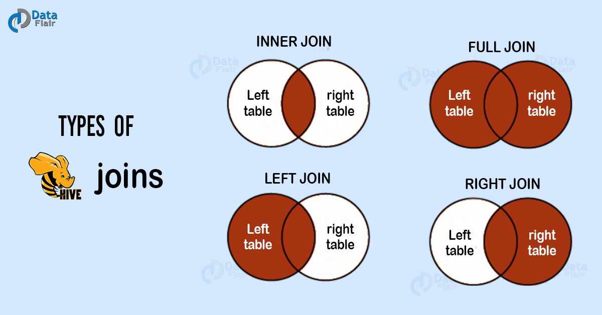

Hive 中 的 Join 可分为 Common Join（Reduce阶段完成join）和 Map Join（Map 阶段完成 join）。

## Hive Common Join
如果不指定 MapJoin 或者不符合 MapJoin 的条件，那么 Hive 解析器会默认执行 Common Join，即在 Reduce 阶段完成 join。
整个过程包含 Map、Shuffle、Reduce 阶段。

### Map 阶段
读取源表的数据，Map输出时候以Join on条件中的列为key，如果Join有多个关联键，则以这些关联键的组合作为key；
Map输出的value为join之后所关心的(select或者where中需要用到的)列，同时在value中还会包含表的Tag信息，
用于标明此value对应哪个表。

### Shuffle 阶段
根据key的值进行hash，并将key/value按照hash值推送至不同的reduce中，这样确保两个表中相同的key位于同一个reduce中。

### Reduce 阶段
根据key的值完成join操作，期间通过Tag来识别不同表中的数据。

以下面的HQL为例，图解其过程：
```text
SELECT a.id,a.dept,b.age
FROM a join b
ON (a.id = b.id);
```


## Hive Map Join
MapJoin通常用于一个很小的表和一个大表进行join的场景，具体小表有多小，
由参数hive.mapjoin.smalltable.filesize来决定，默认值为25M。
满足条件的话，Hive在执行时候会自动转化为MapJoin，或使用hint提示 /*+ mapjoin(table) */ 执行 MapJoin。


如上图中的流程，首先Task A在客户端本地执行，负责扫描小表b的数据，将其转换成一个HashTable的数据结构，并写入本地的文件中，
之后将该文件加载到DistributeCache中。

接下来的Task B任务是一个没有Reduce的MapReduce，启动MapTasks扫描大表a，
在Map阶段，根据a的每一条记录去和DistributeCache中b表对应的HashTable关联，
并直接输出结果，因为没有Reduce，所以有多少个Map Task，就有多少个结果文件。

注意：Map JOIN 不适合 FULL/RIGHT OUTER JOIN。

## Join 的几种类型
Hive 中 join 有 4 种类型。分别是：
* 内关联（inner join 或者简写成 join）
* 左关联（left outer join 或者简写成 left join）
* 右关联（right outer join 或者简写成 right join）
* 全关联（full outer join 或者简写成 full join）



下面以例子介绍各个Join的用法。假如有两个表，一个是客户表（表名：customers），一个是订单表（表名：order）。

客户表数据如下：
```text
ID	Name	Age	Address	Salary
1	Ross	32	Ahmedabad	2000
2	Rachel	25	Delhi	1500
3	Chandler	23	Kota	2000
4	Monika	25	Mumbai	6500
5	Mike	27	Bhopal	8500
6	Phoebe	22	MP	4500
7	Joey	24	Indore	10000
```

订单表数据如下：
```text
OID	Date	Customer_ID	Amount
102	2016-10-08 00:00:00	3	3000
100	2016-10-08 00:00:00	3	1500
101	2016-11-20 00:00:00	2	1560
103	2015-05-20 00:00:00	4	2060
```

### 内关联（inner join、join）
常规join，类似交集，只显示关联成功的行。如上图所示，它会按照关联条件把左表与右表两者的交集提取出来，作为最终结果。
```text
hive> SELECT c.ID, c.NAME, c.AGE, o.AMOUNT
FROM CUSTOMERS c JOIN ORDERS o
ON (c.ID = o.CUSTOMER_ID);
```

执行后结果如下：
```text
ID	Name	Age	Amount
3	Chandler	23	1300
3	Chandler	23	1500
2	Rachel	25	1560
4	Monika	25	2060
```

### 左关联（left outer join、left join）
以left [outer] join关键字【前面的表】作为主表，和其他表进行关联，返回记录和主表的记录数一致，关联不上的字段会被置为NULL。 
另外是否指定outer关键字，对查询结果无影响。
```text
hive> SELECT c.ID, c.NAME, o.AMOUNT, o.DATE
FROM CUSTOMERS c
LEFT OUTER JOIN ORDERS o
ON (c.ID = o.CUSTOMER_ID);
```

结果如下：
```text
ID	Name	Amount	Date
1	Ross	NULL	NULL
2	Rachel	1560	2016-11-20 00:00:00
3	Chandler	3000	2016-10-08 00:00:00
3	Chandler	1500	2016-10-08 00:00:00
4	Monika	2060	2015-05-20 00:00:00
5	Mike	NULL	NULL
6	Phoebe	NULL	NULL
7	Joey	NULL	NULL
```

### 右关联（right outer join、right join）
和左外关联相反，以right [outer] join关键词【后面的表】作为主表，和前面的表做关联，返回记录数和主表一致，关联不上的字段为NULL。
是否指定outer关键字，对查询结果无影响。
```text
hive> SELECT c.ID, c.NAME, o.AMOUNT, o.DATE
FROM CUSTOMERS c
RIGHT OUTER JOIN ORDERS o
ON (c.ID = o.CUSTOMER_ID);
```

结果如下：
```text
ID	Name	Amount	Date
3	Chandler	1300	2016-10-08 00:00:00
3	Chandler	1500	2016-10-08 00:00:00
2	Rachel	1560	2016-11-20 00:00:00
4	Monika	2060	2015-05-20 00:00:00
```

### 全关联（full outer join、full join）
全关联的原理是先左关联再右关联，然后把结果用 union all 合并在一起，关联不到的字段被自动置为 NULL。是否指定 outer 关键字，对查询结果无影响。
```text
hive> SELECT c.ID, c.NAME, o.AMOUNT, o.DATE
FROM CUSTOMERS c
FULL OUTER JOIN ORDERS o
ON (c.ID = o.CUSTOMER_ID);
```

执行结果如下：
```text
ID	Name	Amount	Date
1	Ross	NULL	NULL
2	Rachel	1560	2016-11-20 00:00:00
3	Chandler	3000	2016-10-08 00:00:00
3	Chandler	1500	2016-10-08 00:00:00
4	Monika	2060	2015-05-20 00:00:00
5	Mike	NULL	NULL
6	Phoebe	NULL	NULL
7	Joey	NULL	NULL
3	Chandler	3000	2016-10-08 00:00:00
3	Chandler	1500	2016-10-08 00:00:00
2	Rachel	1560	2016-11-20 00:00:00
4	Monika	2060	2015-05-20 00:00:00
```
