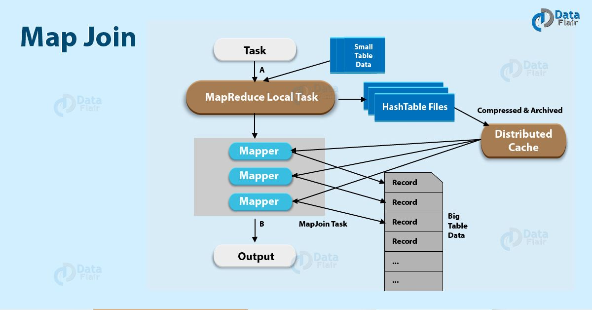
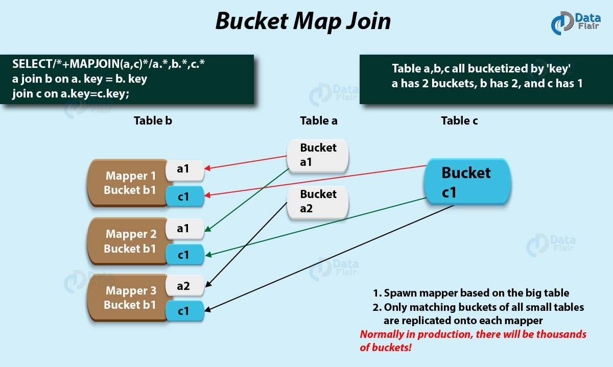

Apache hive中的map join就是之前提到的【Map端的join】或者叫【广播 join】。
还有一种 join 是common join或者sort merge join。
common join 和 sort merge join 在执行的时候消耗的资源比较多，运行较慢。

为了提高join的运行效率，我们可能需要用到hive中的 map join。
使用map join的前提是，两个表做关联时需要有一个表是可以加载到内存的小表，
这样join可以在一个mapper里面完成，而不需要reduce。



尽管查询经常依赖于小表连接，但是map join的使用加快了查询的执行速度。

在MapReduce任务中，
第一步就是创建一个MapReduce本地任务，然后该map/reduce任务从HDFS读取小表的数据，然后把数据保存到内存中的哈希表，
然后再存储到一个哈希表文件。
接着，当MapReduce join任务启动的时候，它会把哈希表文件移到Hadoop分布式内存中，并把哈希表文件存储到每个mapper的本地磁盘上。
所有的mapper都能把这个哈希表文件加载到内存，然后在map阶段做join操作。

用一个例子来理解一下上面的过程，假如有两个表，一个大表A和一个小表B。
对于每个大表A的mapper来说，table B都能完全读取，因为小表B已经被加载到内存了。
然后，join会在MapReduce作业的map阶段被执行，而不需要reducer任务，即reducer任务会被跳过不执行。
因此，hive中的map join比普通join要高效。

## Map Join 相关参数
下面详细讨论一下 Map join 涉及的相关配置参数。

### hive.auto.convert.join
该参数表示是否自动把任务转为map join，默认该配置为 true。
当一个表的大小小于25 MB（配置参数：hive.mapjoin.smalltable.filesize）时，表之间的join会被自动转成map join。

### hive.auto.convert.join.noconditionaltask
是否将多个map join合并为一个，默认为 true。
多个map join转换成1个时，所有小表的文件大小总和的最大值由hive.auto.convert.join.noconditionaltask.size配置项控制。

例如，一个大表顺序关联3个小表 a(10M)，b(8M)，c(12M)，如果hive.auto.convert.join.noconditionaltask.size 的值：
* 小于18M，则无法合并map join，必须执行3个map join。
* 大于18M小于30M，则可以合并a和b表的map join，所以只需要执行2个map join。
* 大于30M，则可以将3个map join都合并为1个。

为什么要合并map join呢？因为每个map join都要执行一次map，需要读写一次数据，所以多个map join就要做多次的数据读写，
合并map join后只用读写一次，这样就能大大加快速度。
但是执行map时内存大小是有限制的，在一次map里对多个小表做map join就必须把多个小表都加入内存，
为了防止内存溢出，所以加了hive.auto.convert.join.noconditionaltask.size参数来做限制。
不过，这个值只是限制输入的表文件的大小，并不代表实际map join时hashtable的大小。

### hive.mapjoin.localtask.max.memory.usage
将小表转成hashtable的本地任务的最大内存使用率，默认0.9。

### hive.mapjoin.followby.gby.localtask.max.memory.usage
如果map join后面紧跟着一个group by任务，这种情况下本地任务的最大内存使用率，默认是0.55。

### hive.mapjoin.check.memory.rows
local task每处理完多少行，就执行内存检查，默认为 100000。

## Mapjoin 的局限性
下面是 mapjoin 的一些局限：

* 不能把全连接（full outer join）转换成map join。
* 可以把左连接转换成map join，但是右边的表的大小必须小于25MB。
* 可以把右连接转换成map join，但是左边的表的大小必须小于25MB。

## 如何知道 Hive 使用了 map join
可以使用 explain命令 查看 HiveQL代码 的执行计划，在 Map操作树 我们可以看到Map Side Join Operator关键字，
就说明join是map join。
```text
hive> explain select a.* from passwords a,passwords3 b where a.col0=b.col0;
OK
STAGE DEPENDENCIES:
 Stage-4 is a root stage
 Stage-3 depends on stages: Stage-4
 Stage-0 is a root stage
STAGE PLANS:
 Stage: Stage-4
   Map Reduce Local Work
     Alias -> Map Local Tables:
       b
         Fetch Operator
           limit: -1
     Alias -> Map Local Operator Tree:
       b
         TableScan
           alias: b
           Statistics: Num rows: 1 Data size: 31 Basic stats: COMPLETE Column stats: NONE
           HashTable Sink Operator
             condition expressions:
               0 {col0} {col1} {col2} {col3} {col4} {col5} {col6}
               1 {col0}
             keys:
               0 col0 (type: string)
               1 col0 (type: string)
 Stage: Stage-3
   Map Reduce
     Map Operator Tree:
         TableScan
           alias: a
           Statistics: Num rows: 9963904 Data size: 477218560 Basic stats: COMPLETE Column stats: NONE
           Map Join Operator
             condition map:
                  Inner Join 0 to 1
             condition expressions:
               0 {col0} {col1} {col2} {col3} {col4} {col5} {col6}
               1 {col0}
keys:
               0 col0 (type: string)
               1 col0 (type: string)
             outputColumnNames: _col0, _col1, _col2, _col3, _col4, _col5, _col6, _col9
             Statistics: Num rows: 10960295 Data size: 524940416 Basic stats: COMPLETE Column stats: NONE
             Filter Operator
               predicate: (_col0 = _col9) (type: boolean)
               Statistics: Num rows: 5480147 Data size: 262470184 Basic stats: COMPLETE Column stats: NONE
               Select Operator
                 expressions: _col0 (type: string), _col1 (type: string), _col2 (type: string), _col3 (type: string), _col4 (type: string), _col5 (type: string), _col6 (type: string)
                 outputColumnNames: _col0, _col1, _col2, _col3, _col4, _col5, _col6
                 Statistics: Num rows: 5480147 Data size: 262470184 Basic stats: COMPLETE Column stats: NONE
                 File Output Operator
                   compressed: false
                   Statistics: Num rows: 5480147 Data size: 262470184 Basic stats: COMPLETE Column stats: NONE
                   table:
                       input format: org.apache.hadoop.mapred.TextInputFormat
                       output format: org.apache.hadoop.hive.ql.io.HiveIgnoreKeyTextOutputFormat
                       serde: org.apache.hadoop.hive.serde2.lazy.LazySimpleSerDe
     Local Work:
       Map Reduce Local Work
 Stage: Stage-0
   Fetch Operator
     limit: -1
```

## 使用 MAPJOIN 提示指定小表
可以使用 /*+ MAPJOIN(小表表名)*/ 提示让 Hive 执行引擎知道哪个表作为小表。代码如下：
```text
hive> set hive.auto.convert.join=true;
hive> set hive.auto.convert.join.noconditionaltask=true;
hive> set hive.auto.convert.join.noconditionaltask.size=20971520
hive> set hive.auto.convert.join.use.nonstaged=true;
hive> set hive.mapjoin.smalltable.filesize = 30000000;
hive> set hive.ignore.mapjoin.hint=false;
hive> Select /*+ MAPJOIN(b) */ a.key, a.value
from a join b
on a.key = b.key
```

上面代码指定b表作为小表。
需要注意的是，使用map join提示需要把 hive.ignore.mapjoin.hint 参数设置为 false，表示不要忽略 HQL 代码中的提示，
该配置默认为 true。

# Hive bucket map join

在Hive中，当表非常大，而且所有需要关联的表都是分桶表，并且关联字段都是分桶字段，那么我们就可以使用bucket map join来关联表。
另外需要注意的是，一个表的分桶数是另一个表的分桶数的倍数。



用例子来理解一下什么是bucket map join。
如果一个表的分桶数是2 ，那么其他表的分桶数必须是2或者是2的倍数（2，4，6等等）。
因此，如果满足了前面这些条件，那么表的join操作就只会在mapper端进行。否则，表的join就是一个普通的inner join。

在每个mapper中，所有表的分桶中只有匹配的分桶会被复制到mapper内存中。
因此，bucket map join的执行效率是非常高的。注意在bucket map join中，确保数据没有排序。

另外需要注意的，默认情况下，Hive不支持bucket map join。所以我们需要把下面的属性设置为true：
```text
set hive.optimize.bucketmapjoin = true
```

## bucket map join 原理
多个表使用bucket map join来关联的时候，关联操作只会【在mapper端进行】。
换一种方式来理解就是，mapper处理A表的分桶1的时候，它只会从B表的分桶1取数据，即分桶之间做关联。

## bucket map join 使用场景
bucket map join 适用于以下场景：
* 所有的表都非常大
* 关联字段使用的是表的分桶字段
* 一个表的分桶数是另一个表的分桶数的倍数
* 所有的表都是不排序的

## bucket map join 缺点
使用bucket map join主要的缺点，就是必须要根据SQL代码的特点来对表做分桶，也就是说，SQL中的关联字段和表的分桶字段要一致才行。
只要关联字段和分桶字段不一致，我们就没办法使用bucket map join了。

## 使用 bucket map join 相关技巧
首先，表的分桶字段与关联字段要保持一致。
另外，在插入数据的时候要对表做分桶，其中有一种方式就是在插入数据之前把hive.enforce.bucketing参数设置为true。
```text
set hive.enforce.bucketing=true
```

比如：
```text
create table b1(
col0 string,
col1 string,
col2 string,
col3 string,
col4 string,
col5 string,
col6 string
)
clustered by (col0) into 32 buckets;

create table b2(
col0 string,
col1 string,
col2 string,
col3 string,
col4 string,
col5 string,
col6 string
)
clustered by (col0) into 8 buckets;

set hive.enforce.bucketing = true;
insert OVERWRITE  table b1 select * limit 10000;
insert OVERWRITE  table b2 select * limit 10000;
```

在做关联的时候把下面参数设置为 true
```text
set hive.optimize.bucketmapjoin=true;
```

关联代码：
```text
select /*+ MAPJOIN(b2) */ b1.*
from b1,b2
where b1.col0=b2.col0;
```
