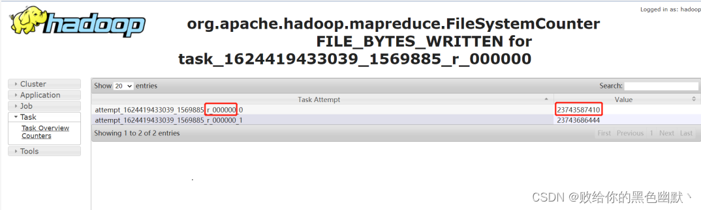

## 一、explain 的用法
Hive提供了explain命令来展示一个查询的执行计划，
这个执行计划对于我们了解底层原理、Hive调优、排查数据倾斜等很有帮助。

使用语法：
```text
explain query;
```
```text
explain select sum(id) from test1;

STAGE DEPENDENCIES:  --1. 各个stage之间的依赖性
  Stage-1 is a root stage     -- 1.1 根stage,开始的stage
  Stage-0 depends on stages: Stage-1  --依赖 Stage-1，Stage-1执行完成后执行Stage-0

STAGE PLANS:         -- 2. 各个stage的执行计划
  Stage: Stage-1
    Map Reduce       -- 2.1 Map Reduce
      Map Operator Tree:   -- 2.2 MAP端的执行计划树
          TableScan        -- 2.2.1 表扫描操作  map端第一个操作肯定是加载表，所以就是表扫描操作
            alias: test1   -- 2.2.2 表名称
            Statistics: Num rows: 6 Data size: 75 Basic stats:  COMPLETE Column stats: NONE
            Select Operator
              expressions: id (type: int)
              outputColumnNames: id
              Statistics: Num rows: 6 Data size: 75 Basic stats: COMPLETE Column stats: NONE
              Group By Operator
                aggregations: sum(id)
                mode: hash
                outputColumnNames: _col0
                Statistics: Num rows: 1 Data size: 8 Basic stats: COMPLETE Column stats: NONE
                Reduce Output Operator
                  sort order:
                  Statistics: Num rows: 1 Data size: 8 Basic stats: COMPLETE Column stats: NONE
                  value expressions: _col0 (type: bigint)
      Reduce Operator Tree:  -- 2.3 Reduce端的执行计划树
        Group By Operator
          aggregations: sum(VALUE._col0)
          mode: mergepartial
          outputColumnNames: _col0
          Statistics: Num rows: 1 Data size: 8 Basic stats: COMPLETE Column stats: NONE
          File Output Operator
            compressed: false
            Statistics: Num rows: 1 Data size: 8 Basic stats: COMPLETE Column stats: NONE
            table:
                input format: org.apache.hadoop.mapred.SequenceFileInputFormat
                output format: org.apache.hadoop.hive.ql.io.HiveSequenceFileOutputFormat
                serde: org.apache.hadoop.hive.serde2.lazy.LazySimpleSerDe

  Stage: Stage-0
    Fetch Operator
      limit: -1
      Processor Tree:
        ListSink
```

### 使用说明：
explain执行计划中，key：value形式的 语句为描述性质的；Operator为一个操作；
```text
一个HIVE查询被转换为一个由一个或多个stage组成的序列（有向无环图DAG）。
这些stage可以是MapReduce stage，也可以是负责元数据存储的stage，也可以是负责文件系统的操作（比如移动和重命名）的stage。
```

### 纵览全局：
我们将上述结果拆分看，先从最外层开始，包含两个大的部分：
* stage dependencies：各个stage之间的依赖性
* stage plan：各个stage的执行计划

#### 第一部分stage dependencies 
包含两个stage，Stage-1 是根stage，说明这是开始的stage，Stage-0 依赖 Stage-1，Stage-1执行完成后执行Stage-0。

#### 第二部分stage plan
里面有一个Map Reduce，一个MR的执行计划分为两个部分：
* Map Operator Tree：MAP端的执行计划树
* Reduce Operator Tree：Reduce端的执行计划树

```text
Operator
这Map Operator Tree 和 Reduce Operator Tree里面包含这条sql语句的 operator
```

**TableScan**：表扫描操作；map端第一个操作肯定是加载表，所以就是表扫描操作，常见的属性：
* alias：表名称
* Statistics：表统计信息，包含表中数据条数，数据大小等

**Select Operator**：选取操作，常见的属性 ：
* expressions：需要的字段名称及字段类型
* outputColumnNames：输出的列名称
* Statistics：表统计信息，包含表中数据条数，数据大小等

**Group By Operator**：分组聚合操作；常见的属性：
* aggregations：显示聚合函数信息
* mode：聚合模式；
  ```text
  hash：随机聚合，就是hash partition；
  partial：局部聚合；
  final：最终聚合
  ```
* keys：分组的字段，如果没有分组，则没有此字段
* outputColumnNames：聚合之后输出列名
* Statistics：表统计信息，包含分组聚合之后的数据条数，数据大小等

**Reduce Output Operator**：输出到reduce操作，常见属性：
* sort order：值为空 不排序；值为 + 正序排序，值为 - 倒序排序；
* 值为 ± 排序的列为两列，第一列为正序，第二列为倒序；

**Filter Operator**：过滤操作，常见的属性：
* predicate：过滤条件，如sql语句中的where id>=1，则此处显示(id >= 1)

**Map Join Operator**：join 操作，常见的属性：
* condition map：join方式 ，如Inner Join 0 to 1 Left Outer Join0 to 2
* keys: join 的条件字段
* outputColumnNames：join 完成之后输出的字段
* Statistics：join 完成之后生成的数据条数，大小等

**Map Join Operator**：join 操作，常见的属性：
* condition map：join方式 ，如Inner Join 0 to 1 Left Outer Join0 to 2
* keys: join 的条件字段
* outputColumnNames：join 完成之后输出的字段
* Statistics：join 完成之后生成的数据条数，大小等

**File Output Operator**：文件输出操作，常见的属性：
* compressed：是否压缩
* table：表的信息，包含输入输出文件格式化方式，序列化方式等

**Fetch Operator**：客户端获取数据操作，常见的属性：
* limit，值为 -1 表示不限制条数，其他值为限制的条数

## 二、explain 的使用场景
本节介绍 explain 能够为我们在生产实践中带来哪些便利及解决我们哪些迷惑

### 案例一：join 语句会过滤 null 的值吗？
现在，我们在hive cli 输入以下查询计划语句
```text
select a.id,b.user_name from test1 a join test2 b on a.id=b.id;
```
问：上面这条 join 语句会过滤 id 为 null 的值吗
执行下面语句：
```text
explain select a.id,b.user_name from test1 a join test2 b on a.id=b.id;
```
我们来看结果 (为了适应页面展示，仅截取了部分输出信息)：
```text
TableScan
 alias: a
 Statistics: Num rows: 6 Data size: 75 Basic stats: COMPLETE Column stats: NONE
 Filter Operator
    predicate: id is not null (type: boolean)
    Statistics: Num rows: 6 Data size: 75 Basic stats: COMPLETE Column stats: NONE
    Select Operator
        expressions: id (type: int)
        outputColumnNames: _col0
        Statistics: Num rows: 6 Data size: 75 Basic stats: COMPLETE Column stats: NONE
        HashTable Sink Operator
           keys:
             0 _col0 (type: int)
             1 _col0 (type: int)
 ...
```
从上述结果可以看到 predicate: id is not null 这样一行，说明 join 时会自动过滤掉关联字段为 null 值的情况，
但 left join 或 full join 是不会自动过滤null值的，大家可以自行尝试下。

### 案例二：group by 分组语句会进行排序吗？
看下面这条sql
```text
select id,max(user_name) from test1 group by id;
```
直接来看 explain 之后结果 (为了适应页面展示，仅截取了部分输出信息)
```text
 TableScan
    alias: test1
    Statistics: Num rows: 9 Data size: 108 Basic stats: COMPLETE Column stats: NONE
    Select Operator
        expressions: id (type: int), user_name (type: string)
        outputColumnNames: id, user_name
        Statistics: Num rows: 9 Data size: 108 Basic stats: COMPLETE Column stats: NONE
        Group By Operator
           aggregations: max(user_name)
           keys: id (type: int)
           mode: hash
           outputColumnNames: _col0, _col1
           Statistics: Num rows: 9 Data size: 108 Basic stats: COMPLETE Column stats: NONE
           Reduce Output Operator
             key expressions: _col0 (type: int)
             sort order: +
             Map-reduce partition columns: _col0 (type: int)
             Statistics: Num rows: 9 Data size: 108 Basic stats: COMPLETE Column stats: NONE
             value expressions: _col1 (type: string)
 ...
```
我们看 Group By Operator，里面有 keys: id (type: int) 说明按照 id 进行分组的，再往下看还有 sort order: + ，
说明是按照 id 字段进行正序排序的。

### 案例三：哪条sql执行效率高呢？
观察两条sql语句
```text
SELECT a.id, b.user_name FROM
test1 a
JOIN test2 b ON a.id = b.id
WHERE a.id > 2;

SELECT a.id, b.user_name FROM
(SELECT * FROM test1 WHERE id > 2) a
JOIN test2 b ON a.id = b.id;
```
这两条sql语句输出的结果是一样的，但是哪条sql执行效率高呢？

有人说第一条sql执行效率高，因为第二条sql有子查询，子查询会影响性能；

有人说第二条sql执行效率高，因为先过滤之后，在进行join时的条数减少了，所以执行效率就高了。

到底哪条sql效率高呢，我们直接在sql语句前面加上 explain，看下执行计划不就知道了嘛！

在第一条sql语句前加上 explain，得到如下结果
```text
hive (default)> explain select a.id,b.user_name from test1 a join test2 b on a.id=b.id where a.id >2;
OK
Explain
STAGE DEPENDENCIES:
  Stage-4 is a root stage
  Stage-3 depends on stages: Stage-4
  Stage-0 depends on stages: Stage-3

STAGE PLANS:
  Stage: Stage-4
    Map Reduce Local Work
      Alias -> Map Local Tables:
        $hdt$_0:a
          Fetch Operator
            limit: -1
      Alias -> Map Local Operator Tree:
        $hdt$_0:a
          TableScan
            alias: a
            Statistics: Num rows: 6 Data size: 75 Basic stats: COMPLETE Column stats: NONE
            Filter Operator
              predicate: (id > 2) (type: boolean)
              Statistics: Num rows: 2 Data size: 25 Basic stats: COMPLETE Column stats: NONE
              Select Operator
                expressions: id (type: int)
                outputColumnNames: _col0
                Statistics: Num rows: 2 Data size: 25 Basic stats: COMPLETE Column stats: NONE
                HashTable Sink Operator
                  keys:
                    0 _col0 (type: int)
                    1 _col0 (type: int)

  Stage: Stage-3
    Map Reduce
      Map Operator Tree:
          TableScan
            alias: b
            Statistics: Num rows: 6 Data size: 75 Basic stats: COMPLETE Column stats: NONE
            Filter Operator
              predicate: (id > 2) (type: boolean)
              Statistics: Num rows: 2 Data size: 25 Basic stats: COMPLETE Column stats: NONE
              Select Operator
                expressions: id (type: int), user_name (type: string)
                outputColumnNames: _col0, _col1
                Statistics: Num rows: 2 Data size: 25 Basic stats: COMPLETE Column stats: NONE
                Map Join Operator
                  condition map:
                       Inner Join 0 to 1
                  keys:
                    0 _col0 (type: int)
                    1 _col0 (type: int)
                  outputColumnNames: _col0, _col2
                  Statistics: Num rows: 2 Data size: 27 Basic stats: COMPLETE Column stats: NONE
                  Select Operator
                    expressions: _col0 (type: int), _col2 (type: string)
                    outputColumnNames: _col0, _col1
                    Statistics: Num rows: 2 Data size: 27 Basic stats: COMPLETE Column stats: NONE
                    File Output Operator
                      compressed: false
                      Statistics: Num rows: 2 Data size: 27 Basic stats: COMPLETE Column stats: NONE
                      table:
                          input format: org.apache.hadoop.mapred.SequenceFileInputFormat
                          output format: org.apache.hadoop.hive.ql.io.HiveSequenceFileOutputFormat
                          serde: org.apache.hadoop.hive.serde2.lazy.LazySimpleSerDe
      Local Work:
        Map Reduce Local Work

  Stage: Stage-0
    Fetch Operator
      limit: -1
      Processor Tree:
        ListSink
```
在第二条sql语句前加上 explain，得到如下结果
```text
hive (default)> explain select a.id,b.user_name from(select * from  test1 where id>2 ) a join test2 b on a.id=b.id;
OK
Explain
STAGE DEPENDENCIES:
  Stage-4 is a root stage
  Stage-3 depends on stages: Stage-4
  Stage-0 depends on stages: Stage-3

STAGE PLANS:
  Stage: Stage-4
    Map Reduce Local Work
      Alias -> Map Local Tables:
        $hdt$_0:test1
          Fetch Operator
            limit: -1
      Alias -> Map Local Operator Tree:
        $hdt$_0:test1
          TableScan
            alias: test1
            Statistics: Num rows: 6 Data size: 75 Basic stats: COMPLETE Column stats: NONE
            Filter Operator
              predicate: (id > 2) (type: boolean)
              Statistics: Num rows: 2 Data size: 25 Basic stats: COMPLETE Column stats: NONE
              Select Operator
                expressions: id (type: int)
                outputColumnNames: _col0
                Statistics: Num rows: 2 Data size: 25 Basic stats: COMPLETE Column stats: NONE
                HashTable Sink Operator
                  keys:
                    0 _col0 (type: int)
                    1 _col0 (type: int)

  Stage: Stage-3
    Map Reduce
      Map Operator Tree:
          TableScan
            alias: b
            Statistics: Num rows: 6 Data size: 75 Basic stats: COMPLETE Column stats: NONE
            Filter Operator
              predicate: (id > 2) (type: boolean)
              Statistics: Num rows: 2 Data size: 25 Basic stats: COMPLETE Column stats: NONE
              Select Operator
                expressions: id (type: int), user_name (type: string)
                outputColumnNames: _col0, _col1
                Statistics: Num rows: 2 Data size: 25 Basic stats: COMPLETE Column stats: NONE
                Map Join Operator
                  condition map:
                       Inner Join 0 to 1
                  keys:
                    0 _col0 (type: int)
                    1 _col0 (type: int)
                  outputColumnNames: _col0, _col2
                  Statistics: Num rows: 2 Data size: 27 Basic stats: COMPLETE Column stats: NONE
                  Select Operator
                    expressions: _col0 (type: int), _col2 (type: string)
                    outputColumnNames: _col0, _col1
                    Statistics: Num rows: 2 Data size: 27 Basic stats: COMPLETE Column stats: NONE
                    File Output Operator
                      compressed: false
                      Statistics: Num rows: 2 Data size: 27 Basic stats: COMPLETE Column stats: NONE
                      table:
                          input format: org.apache.hadoop.mapred.SequenceFileInputFormat
                          output format: org.apache.hadoop.hive.ql.io.HiveSequenceFileOutputFormat
                          serde: org.apache.hadoop.hive.serde2.lazy.LazySimpleSerDe
      Local Work:
        Map Reduce Local Work

  Stage: Stage-0
    Fetch Operator
      limit: -1
      Processor Tree:
        ListSink
```

大家有什么发现，除了表别名不一样，其他的执行计划完全一样，都是先进行 where 条件过滤，在进行 join 条件关联。
说明 hive 底层会自动帮我们进行优化，所以这两条sql语句执行效率是一样的。

### 案例四：定位产生数据倾斜的代码段
数据倾斜大多数都是大 key 问题导致的。

如何判断是大 key 导致的问题，可以通过下面方法：

#### 1. 通过时间判断
如果某个 reduce 的时间比其他 reduce 时间长的多，如下图，大部分 task 在 1 分钟之内完成，
只有 r_000000 这个 task 执行 20 多分钟了还没完成。


注意：要排除两种情况：
* 如果每个 reduce 执行时间差不多，都特别长，不一定是数据倾斜导致的，可能是 reduce 设置过少导致的。
* 有时候，某个 task 执行的节点可能有问题，导致任务跑的特别慢。这个时候，mapreduce 的推测执行，会重启一个任务。
  如果新的任务在很短时间内能完成，通常则是由于 task 执行节点问题导致的个别 task 慢。
  但是如果推测执行后的 task 执行任务也特别慢，那更说明该 task 可能会有倾斜问题。

#### 2. 通过任务 Counter 判断
Counter 会记录整个 job 以及每个 task 的统计信息。

counter 的 url 一般类似：
```text
http://bd001:8088/proxy/application_1624419433039_1569885/mapreduce/singletaskcounter
/task_1624419433039_1569885_r_000000/org.apache.hadoop.mapreduce.FileSystemCounte
```

通过输入记录数，普通的 task counter 如下，输入的记录数是 13 亿多:


而 task=000000 的 counter 如下，其输入记录数是 230 多亿。是其他任务的 100 多倍：



#### 3. 定位 SQL 代码

##### 1)确定任务卡住的 stage
* 通过 jobname 确定 stage：
  一般 Hive 默认的 jobname 名称会带上 stage 阶段，如下通过 jobname 看到任务卡住的为 Stage-4：
  
  

* 如果 jobname 是自定义的，那可能没法通过 jobname 判断 stage。需要借助于任务日志：
  找到执行特别慢的那个 task，然后 Ctrl+F 搜索 “CommonJoinOperator: JOIN struct” 。
  Hive 在 join 的时候，会把 join 的 key 打印到日志中。如下：
  
  
  
  上图中的关键信息是：struct<_col0:string, _col1:string, _col3:string>
   
这时候，需要参考该 SQL 的执行计划。通过参考执行计划，可以断定该阶段为 Stage-4 阶段：
   


就可以推测出是在执行下面红框中代码时出现了数据倾斜，因为这行的表的别名是 d：


   
以上仅列举了4个我们生产中既熟悉又有点迷糊的例子，explain 还有很多其他的用途，如查看stage的依赖情况、hive 调优等，小伙伴们可以自行尝试。

##### 2) 确定 SQL 执行代码
确定了执行阶段，即 Stage-4 阶段。通过执行计划，则可以判断出是执行哪段代码时出现了倾斜。
还是从此图，这个 Stage-4 阶段中进行连接操作的表别名是 d：


就可以推测出是在执行下面红框中代码时出现了数据倾斜，因为这行的表的别名是 d：

## 三、explain dependency的用法

explain dependency用于描述一段SQL需要的数据来源，输出是一个json格式的数据，里面包含以下两个部分的内容：
* input_partitions：描述一段SQL依赖的数据来源表分区，里面存储的是分区名的列表，如果整段SQL包含的所有表都是非分区表，则显示为空。
* input_tables：描述一段SQL依赖的数据来源表，里面存储的是Hive表名的列表。

使用explain dependency查看SQL查询非分区普通表，在 hive cli 中输入以下命令：
```text
explain dependency select s_age,count(1) num from student_orc;
```

得到结果：
```text
{"input_partitions":[],"input_tables":[{"tablename":"default@student_tb _orc","tabletype":"MANAGED_TABLE"}]}
```

使用explain dependency查看SQL查询分区表，在 hive cli 中输入以下命令：
```text
explain dependency select s_age,count(1) num from student_orc_partition;

{"input_partitions":[{"partitionName":"default@student_orc_partition@ part=0"}, 
{"partitionName":"default@student_orc_partition@part=1"}, 
{"partitionName":"default@student_orc_partition@part=2"}, 
{"partitionName":"default@student_orc_partition@part=3"},
{"partitionName":"default@student_orc_partition@part=4"}, 
{"partitionName":"default@student_orc_partition@part=5"},
{"partitionName":"default@student_orc_partition@part=6"},
{"partitionName":"default@student_orc_partition@part=7"},
{"partitionName":"default@student_orc_partition@part=8"},
{"partitionName":"default@student_orc_partition@part=9"}], 
"input_tables":[{"tablename":"default@student_orc_partition", "tabletype":"MANAGED_TABLE"}]
```

explain dependency的使用场景有两个：
* 场景一：快速排除。快速排除因为读取不到相应分区的数据而导致任务数据输出异常。
  例如，在一个以天分区的任务中，上游任务因为生产过程不可控因素出现异常或者空跑，导致下游任务引发异常。
  通过这种方式，可以快速查看SQL读取的分区是否出现异常。

* 场景二：理清表的输入，帮助理解程序的运行，特别是有助于理解有多重子查询，多表连接的依赖输入。

下面通过两个案例来看explain dependency的实际运用：

### 案例一：识别看似等价的代码
对于刚接触SQL的程序员，很容易将
```text
select * from a inner join b on a.no=b.no and a.f>1 and a.f<3;
```
等价于
```text
select * from a inner join b on a.no=b.no where a.f>1 and a.f<3;
```
我们可以通过案例来查看下它们的区别：
```text
select
    a.s_no
from student_orc_partition a
inner join student_orc_partition_only b
on a.s_no = b.s_no and a.part = b.part and a.part >= 1 and a.part <= 2;
```

```text
select
    a.s_no
from student_orc_partition a
inner join student_orc_partition_only b on a.s_no = b.s_no and a.part = b.part
where a.part >= 1 and a.part <= 2;
```

我们看下上述两段代码explain dependency的输出结果：
```text
{
"input_partitions":
  [{"partitionName":"default@student_orc_partition@part=1"},
  {"partitionName":"default@student_orc_partition@part=2"},
  {"partitionName":"default@student_orc_partition_only@part=0"},
  {"partitionName":"default@student_orc_partition_only@part=1"},
  {"partitionName":"default@student_orc_partition_only@part=2"}],
"input_tables": 
  [{"tablename":"default@student_orc_partition","tabletype":"MANAGED_TABLE"}, 
  {"tablename":"default@student_orc_partition_only","tabletype":"MANAGED_TABLE"}]
}
```

```text
{
"input_partitions":
  [{"partitionName":"default@student_orc_partition@part=1"},
  {"partitionName" : "default@student_orc_partition@part=2"},
  {"partitionName" :"default@student_orc_partition_only@part=1"},
  {"partitionName":"default@student_orc_partition_only@part=2"}],
"input_tables": 
  [{"tablename":"default@student_orc_partition","tabletype":"MANAGED_TABLE"}, 
  {"tablename":"default@student_orc_partition_only","tabletype":"MANAGED_TABLE"}]
}
```

通过上面的输出结果可以看到，其实上述的两个SQL并不等价，代码1在内连接（inner join）中的连接条件（on）中加入非等值的过滤条件后，
并没有将内连接的右表按照过滤条件进行过滤，内连接在执行时会多读取part=0的分区数据。而在代码2中，会过滤掉不符合条件的分区。

### 案例二：识别SQL读取数据范围的差别
```text
explain dependency
select
  a.s_no
from student_orc_partition a
left join student_orc_partition_only b
on a.s_no = b.s_no and a.part = b.part and b.part >= 1 and b.part <= 2;
```

```text
explain dependency
select
    a.s_no
from student_orc_partition a
left join student_orc_partition_only b
on a.s_no = b.s_no and a.part = b.part and a.part >= 1 and a.part <= 2;
```

以上两个代码的数据读取范围是一样的吗？答案是不一样，我们通过explain dependency来看下：

```text
{
"input_partitions":
  [{"partitionName": "default@student_orc_partition@part=0"},
  {"partitionName":"default@student_orc_partition@part=1"}, …中间省略7个分区
  {"partitionName":"default@student_orc_partition@part=9"},
  {"partitionName":"default@student_orc_partition_only@part=1"},
  {"partitionName":"default@student_orc_partition_only@part=2"}],
"input_tables": 
  [{"tablename":"default@student_orc_partition","tabletype":"MANAGED_TABLE"}, 
  {"tablename":"default@student_orc_partition_only","tabletype":"MANAGED_TABLE"}]
}
```

```text
{
"input_partitions":
  [{"partitionName":"default@student_orc_partition@part=0"},
  {"partitionName":"default@student_orc_partition@part=1"}, …中间省略7个分区
  {"partitionName":"default@student_orc_partition@part=9"},
  {"partitionName":"default@student_orc_partition_only@part=0"},
  {"partitionName":"default@student_orc_partition_only@part=1"}, …中间省略7个分区
  {"partitionName":"default@student_orc_partition_only@part=9"}],
"input_tables": 
  [{"tablename":"default@student_orc_partition","tabletype":"MANAGED_TABLE"}, 
  {"tablename":"default@student_orc_partition_only","tabletype":"MANAGED_TABLE"}]
}
```

可以看到，对左外连接在连接条件中加入非等值过滤的条件，
如果过滤条件是作用于右表（b表）有起到过滤的效果，则右表只要扫描两个分区即可，但是左表（a表）会进行全表扫描。
如果过滤条件是针对左表，则完全没有起到过滤的作用，那么两个表将进行全表扫描。
这时的情况就如同全外连接一样都需要对两个数据进行全表扫描。

在使用过程中，容易认为代码片段2可以像代码片段1一样进行数据过滤，通过查看explain dependency的输出结果，可以知道不是如此。

## 四、explain authorization 的用法
通过explain authorization可以知道当前SQL访问的数据来源（INPUTS） 和数据输出（OUTPUTS），
以及当前Hive的访问用户 （CURRENT_USER）和操作（OPERATION）。
```text
explain authorization
select variance(s_score) from student_tb_orc;
```
```text
INPUTS: 
  default@student_tb_orc 
OUTPUTS: 
  hdfs://node01:8020/tmp/hive/hdfs/cbf182a5-8258-4157-9194- 90f1475a3ed5/-mr-10000 
CURRENT_USER: 
  hdfs 
OPERATION: 
  QUERY 
AUTHORIZATION_FAILURES: 
  No privilege 'Select' found for inputs { database:default, table:student_ tb_orc, columnName:s_score}
```
从上面的信息可知：
* 上面案例的数据来源是default数据库中的 student_tb_orc表；
* 数据的输出路径是hdfs://node01:8020/tmp/hive/hdfs/cbf182a5-8258-4157-9194-90f1475a3ed5/-mr-10000;
* 当前的操作用户是hdfs，操作是查询；

观察上面的信息我们还会看到AUTHORIZATION_FAILURES信息，提示对当前的输入没有查询权限，但如果运行上面的SQL的话也能够正常运行。
为什么会出现这种情况？
Hive在默认不配置权限管理的情况下不进行权限验证，所有的用户在Hive里面都是超级管理员，即使不对特定的用户进行赋权，也能够正常查询。