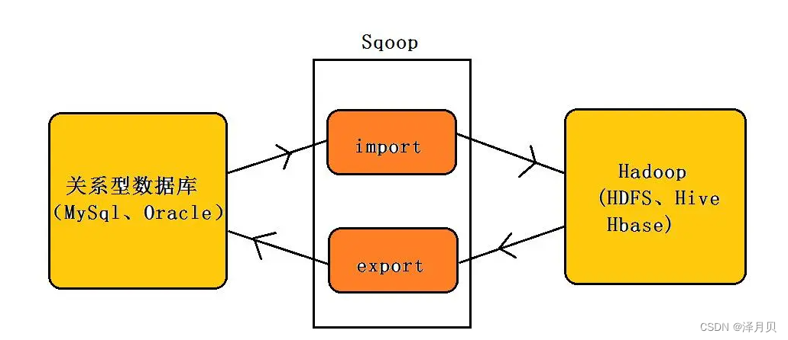

# 一、Sqoop介绍
sqoop是apache旗下一款“Hadoop和关系数据库服务器之间传送数据”的工具。
- 导入数据：MySQL，Oracle导入数据到Hadoop的HDFS、HIVE、HBASE等数据存储系统；
- 导出数据：从Hadoop的HDFS、HIVE中导出数据到关系数据库mysql等。



Sqoop工作机制是将导入或导出命令翻译成mapreduce程序来实现。
在翻译出的mapreduce中主要是对InputFormat和OutputFormat进行定制。

# 二、Sqoop数据导入
## 2.1.全量导入MySQL数据到HDFS
代码如下（示例）：
```text
sqoop import \
--connect jdbc:mysql://hadoop01:3306/userdb \
--table emp \
--username root \
--password 123456 \
--target-dir /sqoop/result1 \
--delete-target-dir \
--m 1
```
其中：
```text
--table emp：要导入mysql中的userdb数据库的emp表数据
--target-dir /sqoop/result1：表示要导入到hdfs的目标路径
--delete-target-dir：如果目标目录存在，则删除
--m 1：使用一个Map线程来导入,如果你要指定多个maptask来完成数据的导入则必须添加一个参数 --split-by 数据列字段split-by后边的字段必须是数字类型，或者是数字字符串类型（‘123’）
    如果是数字字符串类型，则需要添加以下内容
    sqoop import
    -Dorg.apache.sqoop.splitter.allow_text_splitter=true \
--fields-terminated-by '\t'：指定HDFS上文件的分隔符是’\t’
```

## 2.2. Sqoop数据导入至Hive
方式一-先复制mysql的表结构到Hive，然后再导入数据
```text
1、先复制表结构到hive中再导入数据，将关系型数据的表结构复制到hive中
sqoop create-hive-table \
--connect jdbc:mysql://hadoop01:3306/userdb \
--table emp_add \
--username root \
--password 123456 \
--hive-table test.emp_add_sp

其中：
--table emp_add为mysql中的数据库userdb中的表。   
--hive-table emp_add_sp 为hive中新建的表名称。
复制表结构默认分隔符是'\001'

2、从关系数据库导入文件到hive中
sqoop import \
--connect jdbc:mysql://hadoop01:3306/userdb \
--username root \
--password 123456 \
--table emp_add \
--hive-table test.emp_add_sp \
--hive-import \
--m 1
```

方式二-直接导入数据（建表 + 导入数据）
```text
-- 1、使用hive默认分隔符 '\001'

sqoop import \
--connect jdbc:mysql://192.168.88.80:3306/userdb \
--table emp_conn \
--username root \
--password 123456 \
--hive-import \
--hive-database test \
--m 1


#从MySQL的userdb数据库的emp_conn表导入到hive的test数据库的emp_conn表
#如果多次导入，则会进行数据追加

#如果要覆盖操作，需要加参数:
--hive-overwrite

-- 2、使用指定分隔符  '\t'
sqoop import \
--connect jdbc:mysql://192.168.88.80:3306/userdb \
--username root \
--password 123456 \
--table emp_conn \
--hive-import \
--hive-database test \
--fields-terminated-by '\t' \
--m 1
```

如果hive创建的表指定了文件存储格式为ORC（从存储效率来说，ORC格式胜于Hive默认的textfile格式）需要将：
```text
–hive-database test \ 更改为 --hcatalog-database test
–hive-table emp_hive \ 更改为 --hcatalog-table emp_hive 
```

## 2.3. Sqoop数据导入–条件部分导入
```text
sqoop import \
--connect jdbc:mysql://192.168.88.80:3306/userdb \
--username root \
--password 123456 \
--target-dir /sqoop/result5 \
--query 'select id,name,deg from emp WHERE  id>1203 and $CONDITIONS' \
--delete-target-dir \
--fields-terminated-by '\001' \
--m 1

注意：
使用sql query语句来进行查找时，==不能加参数--table==；
并且==必须要添加where条件==；
并且where条件后面==必须带一个$CONDITIONS==这个字符串；
并且这个sql语句==必须用单引号==，不能用双引号。
Sqoop的增量导入也可以通过--query实现，在where加上时间段即可实现
```

# 三、Sqoop数据导出
sqoop导出操作最大的特点是，目标表需要自己手动提前创建。
```text
1、在大数据中，数据的导出一般发生在大数据分析的最后一个阶段
2、将分析后的指标导入一些通用的数据库系统中，用于进一步使用
3、导入到MySQL时，需要在MySQL中提前创建表
```

## 3.1. 全量数据导出
```text
sqoop export \
--connect "jdbc:mysql://192.168.88.80:3306/userdb? useUnicode=true&characterEncoding=utf-8" \
--username root \
--password 123456 \
--table employee \
--hcatalog-database test \
--hcatalog-table emp_hive \
--input-fields-terminated-by '\t' \
-m 1
```
```text
--input-fields-terminated-by '\t' ：表示sqoop去hive的表目录下读取文件时，
使用’\t’对文件进行切割，如果hive文件分隔符是’\001’，则该参数不用指定

如果Hive中的表底层是使用ORC格式存储的，那么必须使用hcatalog API进行操作
```

## 3.2.增量数据导出
增量数据导出的前提都是经过全量导出

- updateonly模式：只增量导出更新的数据
  ```text
    sqoop export \
    --connect jdbc:mysql://192.168.88.80:3306/userdb \
    --username root \
    --password 123456 \
    --table updateonly \
    --export-dir /sqoop/updateonly/updateonly_2.txt \
    --update-key id \
    --update-mode updateonly
    ```
    --update-key id根据id这列来判断id两次导出的数据是否是同一条数据，如果是则更新。

    --update-mode updateonly导出时，只导出第一次和第二次的id都有的数据，进行更新，不会导出HDFS中新增加的数据。

- allowerinsert模式：既导出更新的数据，也导出新增的数据
    ```text
    sqoop export \
    --connect jdbc:mysql://192.168.88.80:3306/userdb \
    --username root --password 123456 \
    --table allowinsert \
    --export-dir /sqoop/updateonly/updateonly_2.txt \
    --update-key id \
    --update-mode allowinsert
    ```

# 总结
Sqoop最重要的就是导入、导出语句，Sqoop的导入导出语句参数非常多，但常用的几乎没段导入导出语句都包含，
需要将常用的语句理解，知道怎么使用。
