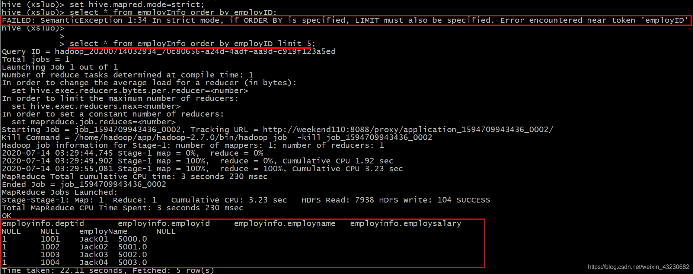
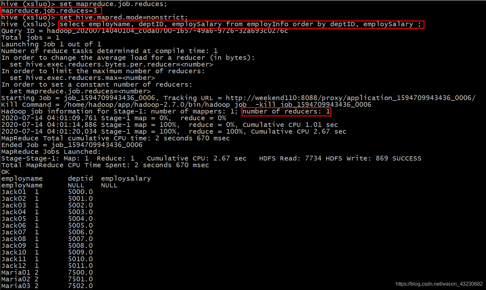
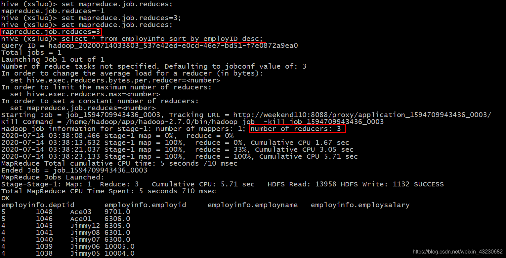
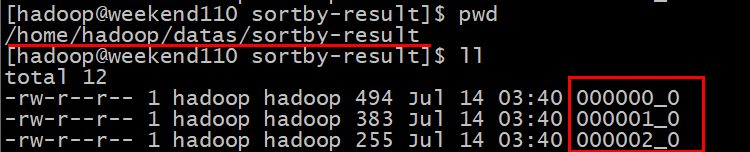
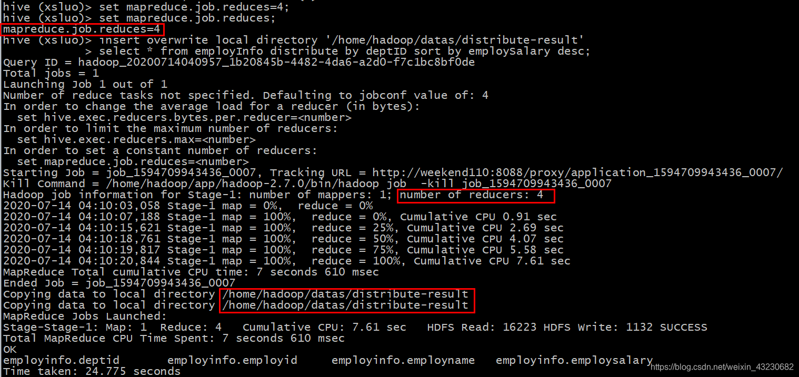
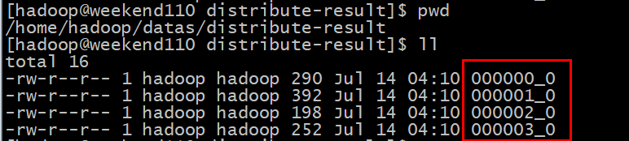
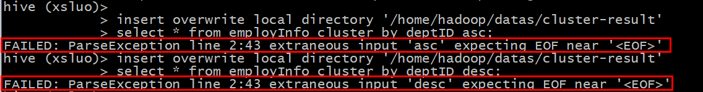
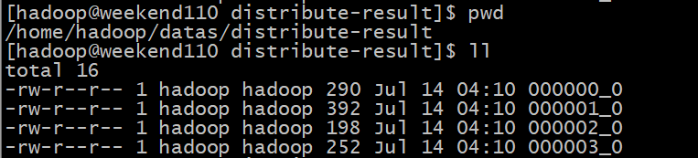

# Hive中的四种排序方式

在平时的Hive数仓开发工作中经常会用到排序，而Hive中支持的排序方式有四种，这里结合具体的案例详细介绍一下他们的使用与区别：
- order by
- sort by
- distribute by
- cluster by

准备工作：
```text
新建一个测试用表employInfo：
create table employInfo(deptID int,employID int,employName string,employSalary double)
row format delimited fields terminated by ',';

向测试用表中导入测试数据：
load data local inpath '/home/hadoop/datas/employInfo.txt' into table employInfo;
```

以下为测试用的数据：
```text
[hadoop@weekend110 datas]$ cat employInfo.txt
deptID,employID,employName,employSalary
1,1001,Jack01,5000
1,1002,Jack02,5001
1,1003,Jack03,5002
1,1004,Jack04,5003
1,1005,Jack05,5004
1,1006,Jack06,5005
1,1007,Jack07,5006
1,1008,Jack08,5007
1,1009,Jack09,5008
1,1010,Jack10,5009
1,1011,Jack11,5010
1,1012,Jack12,5011
2,1013,Maria01,7500
2,1014,Maria02,7501
2,1015,Maria03,7502
2,1016,Maria04,7503
2,1017,Maria05,7504
2,1018,Maria06,7505
2,1019,Maria07,7506
2,1020,Maria08,7507
2,1021,Maria09,7508
3,1022,Lucy01,8540
3,1023,Lucy02,8541
3,1024,Lucy03,8542
3,1025,Lucy04,8543
3,1026,Lucy05,8544
3,1027,Lucy06,8545
3,1028,Lucy07,8546
3,1029,Lucy08,8547
3,1030,Lucy09,8548
3,1031,Lucy10,8549
3,1032,Lucy11,8550
3,1033,Lucy12,8551
4,1034,Jimmy01,10000
4,1035,Jimmy02,10001
4,1036,Jimmy03,10002
4,1037,Jimmy04,10003
4,1038,Jimmy05,10004
4,1039,Jimmy06,10005
4,1040,Jimmy07,6300
4,1041,Jimmy08,6301
4,1042,Jimmy09,6302
4,1043,Jimmy10,6303
4,1044,Jimmy11,6304
4,1045,Jimmy12,6305
5,1046,Ace01,6306
5,1047,Ace02,9700
5,1048,Ace03,9701
5,1049,Ace04,9702
5,1050,Ace05,9703
5,1051,Ace06,9704
5,1052,Ace07,9705
```

下面详细介绍四种排序：

## 一、order by（全局排序）

### 1、作用：
全局排序，只有一个reducer。

order by 会对输入做全局排序，因此只有一个reducer（多个reducer无法保证全局有序），也正因为只有一个reducer，所以当输入的数据规模较大时会导致计算时间较长。
```text
set hive.mapred.mode=nonstrict; (default value / 默认值)
set hive.mapred.mode=strict;
```
order by 和数据库中的Order by 功能一致，按照某一项&几项排序输出。
与数据库中 order by 的区别在于在hive.mapred.mode = strict 模式下必须指定 limit 否则执行会报错。



原因：
在order by 状态下所有数据会到一台服务器进行reduce操作也即只有一个reduce，
如果在数据量大的情况下会出现无法输出结果的情况，如果进行 limit n ，那只有 n * map number 条记录而已。只有一个reduce也可以处理过来。

### 2、案例实操：
在使用 ORDER BY 子句排序时默认的是升序ASC（ascend），DESC（descend）为降序，且ORDER BY 子句在SELECT语句的结尾使用。

```text
（1）查询员工信息按工资升序排序
select * from employInfo order by employSalary;
（2）查询员工信息按工资降序排序
select * from employInfo order by employSalary desc;
（3）按照员工薪水的2倍升序排序
select employName, employSalary*2 twoSalary from employInfo order by twoSalary;
（4）按照部门和工资升序排序
select employName, deptID, employSalary from employInfo order by deptID, employSalary ;
```

查看执行结果：



可见，order by全局排序时只分配了一个reducer。

## 二、sort by（每个MapReduce内部排序）

### 1、作用：
每个Reducer内部进行排序，对全局结果集来说不是排序。

- sort by不是全局排序，其在数据进入reducer前完成排序。
  因此，如果用sort by进行排序，并且设置 mapred.reduce.tasks > 1， 则sort by只保证每个reducer的输出有序，不保证全局有序。
- sort by 不受 hive.mapred.mode 是否为 strict,nostrict 的影响。
- sort by 的数据只能保证在同一reduce中的数据可以按指定字段排序。
- 使用sort by 你可以指定执行的reduce 个数 （set mapred.reduce.tasks=）,对输出的数据再执行归并排序，即可以得到全部结果。

注意：可以用limit子句大大减少数据量。使用limit n 后，传输到reduce端（单机）的数据记录数就减少到n * （map个数）。否则由于数据过大可能出不了结果。

### 2、案例实操：

```text
（1）设置reduce个数
set mapreduce.job.reduces=3;
（2）查看设置reduce个数
set mapreduce.job.reduces;
（3）根据员工编号降序查看员工信息
select * from employInfo sort by employID desc;
```

查看执行结果：



以下是全部的显示信息：
```text
employinfo.deptid       employinfo.employid     employinfo.employname   employinfo.employsalary
5       1048    Ace03   9701.0
5       1046    Ace01   6306.0
4       1045    Jimmy12 6305.0
4       1041    Jimmy08 6301.0
4       1040    Jimmy07 6300.0
4       1039    Jimmy06 10005.0
4       1038    Jimmy05 10004.0
4       1035    Jimmy02 10001.0
3       1033    Lucy12  8551.0
3       1031    Lucy10  8549.0
3       1029    Lucy08  8547.0
3       1024    Lucy03  8542.0
3       1023    Lucy02  8541.0
2       1021    Maria09 7508.0
2       1018    Maria06 7505.0
2       1017    Maria05 7504.0
2       1014    Maria02 7501.0
1       1009    Jack09  5008.0
1       1008    Jack08  5007.0
1       1007    Jack07  5006.0
1       1006    Jack06  5005.0
1       1005    Jack05  5004.0
1       1004    Jack04  5003.0
5       1052    Ace07   9705.0
5       1050    Ace05   9703.0
5       1049    Ace04   9702.0
5       1047    Ace02   9700.0
4       1037    Jimmy04 10003.0
4       1036    Jimmy03 10002.0
4       1034    Jimmy01 10000.0
3       1028    Lucy07  8546.0
3       1026    Lucy05  8544.0
3       1025    Lucy04  8543.0
2       1019    Maria07 7506.0
2       1016    Maria04 7503.0
2       1013    Maria01 7500.0
1       1011    Jack11  5010.0
1       1010    Jack10  5009.0
1       1003    Jack03  5002.0
1       1002    Jack02  5001.0
1       1001    Jack01  5000.0
5       1051    Ace06   9704.0
4       1044    Jimmy11 6304.0
4       1043    Jimmy10 6303.0
4       1042    Jimmy09 6302.0
3       1032    Lucy11  8550.0
3       1030    Lucy09  8548.0
3       1027    Lucy06  8545.0
3       1022    Lucy01  8540.0
2       1020    Maria08 7507.0
2       1015    Maria03 7502.0
1       1012    Jack12  5011.0
NULL    NULL    employName      NULL
```

可见，具有3个reducer，每个reducer内部进行排序，对全局结果集来说不是排序。

```text
（4）将查询结果导入到文件中（按照员工编号降序排序）
insert overwrite local directory '/home/hadoop/datas/sortby-result'
select * from employInfo sort by employID desc;
```



可见，在输出目录下有3个reducer对应的3个输出文件。

查看每个文件里面的内容：每个文件中内按照员工编号降序排序
```text
[hadoop@weekend110 sortby-result]$ cat 000000_0
5 1048 Ace03 9701.0
5 1046 Ace01 6306.0
4 1045 Jimmy12 6305.0
4 1041 Jimmy08 6301.0
4 1040 Jimmy07 6300.0
4 1039 Jimmy06 10005.0
4 1038 Jimmy05 10004.0
4 1035 Jimmy02 10001.0
3 1033 Lucy12 8551.0
3 1031 Lucy10 8549.0
3 1029 Lucy08 8547.0
3 1024 Lucy03 8542.0
3 1023 Lucy02 8541.0
2 1021 Maria09 7508.0
2 1018 Maria06 7505.0
2 1017 Maria05 7504.0
2 1014 Maria02 7501.0
1 1009 Jack09 5008.0
1 1008 Jack08 5007.0
1 1007 Jack07 5006.0
1 1006 Jack06 5005.0
1 1005 Jack05 5004.0
1 1004 Jack04 5003.0
[hadoop@weekend110 sortby-result]$ cat 000001_0   
5 1052 Ace07 9705.0
5 1050 Ace05 9703.0
5 1049 Ace04 9702.0
5 1047 Ace02 9700.0
4 1037 Jimmy04 10003.0
4 1036 Jimmy03 10002.0
4 1034 Jimmy01 10000.0
3 1028 Lucy07 8546.0
3 1026 Lucy05 8544.0
3 1025 Lucy04 8543.0
2 1019 Maria07 7506.0
2 1016 Maria04 7503.0
2 1013 Maria01 7500.0
1 1011 Jack11 5010.0
1 1010 Jack10 5009.0
1 1003 Jack03 5002.0
1 1002 Jack02 5001.0
1 1001 Jack01 5000.0
[hadoop@weekend110 sortby-result]$ cat 000002_0  
5 1051 Ace06 9704.0
4 1044 Jimmy11 6304.0
4 1043 Jimmy10 6303.0
4 1042 Jimmy09 6302.0
3 1032 Lucy11 8550.0
3 1030 Lucy09 8548.0
3 1027 Lucy06 8545.0
3 1022 Lucy01 8540.0
2 1020 Maria08 7507.0
2 1015 Maria03 7502.0
1 1012 Jack12 5011.0
\N \N employName \N
```

## 三、distribute by（分区排序）

### 1、作用：
在有些情况下，我们需要控制某个特定行应该到哪个reducer，通常是为了进行后续的聚集操作。distribute by 子句可以做这件事。
distribute by类似MR中partition（自定义分区），进行分区，结合sort by使用。

distribute by和sort by的常见使用场景有：
- Map输出的文件大小不均
- Reduce输出文件大小不均
- 小文件过多
- 文件超大


### 2、案例实操：
提示：对于distribute by进行测试，一定要分配多reduce进行处理，否则无法看到distribute by的效果。

```text
（1）设置reducer的个数为4
set mapreduce.job.reduces=4;

（2）将查询结果导入到文件中（按照部门编号分区且按照薪资降序排序）
insert overwrite local directory '/home/hadoop/datas/distribute-result'
select * from employInfo distribute by deptID sort by employSalary desc;
```

查看执行结果：





可见，在输出目录下是4个reducer所对应的4个输出文件，再查看每个文件的内容：
```text
[hadoop@weekend110 distribute-result]$ cat 000000_0
4 1039 Jimmy06 10005.0
4 1038 Jimmy05 10004.0
4 1037 Jimmy04 10003.0
4 1036 Jimmy03 10002.0
4 1035 Jimmy02 10001.0
4 1034 Jimmy01 10000.0
4 1045 Jimmy12 6305.0
4 1044 Jimmy11 6304.0
4 1043 Jimmy10 6303.0
4 1042 Jimmy09 6302.0
4 1041 Jimmy08 6301.0
4 1040 Jimmy07 6300.0
\N \N employName \N
[hadoop@weekend110 distribute-result]$ cat 000001_0
5 1052 Ace07 9705.0
5 1051 Ace06 9704.0
5 1050 Ace05 9703.0
5 1049 Ace04 9702.0
5 1048 Ace03 9701.0
5 1047 Ace02 9700.0
5 1046 Ace01 6306.0
1 1012 Jack12 5011.0
1 1011 Jack11 5010.0
1 1010 Jack10 5009.0
1 1009 Jack09 5008.0
1 1008 Jack08 5007.0
1 1007 Jack07 5006.0
1 1006 Jack06 5005.0
1 1005 Jack05 5004.0
1 1004 Jack04 5003.0
1 1003 Jack03 5002.0
1 1002 Jack02 5001.0
1 1001 Jack01 5000.0
[hadoop@weekend110 distribute-result]$ cat 000002_0
2 1021 Maria09 7508.0
2 1020 Maria08 7507.0
2 1019 Maria07 7506.0
2 1018 Maria06 7505.0
2 1017 Maria05 7504.0
2 1016 Maria04 7503.0
2 1015 Maria03 7502.0
2 1014 Maria02 7501.0
2 1013 Maria01 7500.0
[hadoop@weekend110 distribute-result]$ cat 000003_0
3 1033 Lucy12 8551.0
3 1032 Lucy11 8550.0
3 1031 Lucy10 8549.0
3 1030 Lucy09 8548.0
3 1029 Lucy08 8547.0
3 1028 Lucy07 8546.0
3 1027 Lucy06 8545.0
3 1026 Lucy05 8544.0
3 1025 Lucy04 8543.0
3 1024 Lucy03 8542.0
3 1023 Lucy02 8541.0
3 1022 Lucy01 8540.0
```

显然，有个文件中有两个分区且分区是降序排序的，有两个分区这个可以理解，因为reducer只有4个，而部门有5个。
另外，每个文件中都是按照部门编号分区降序且分区下又是按照员工的薪资降序排序的。

## 四、cluster by

### 1、作用：
当distribute by和sorts by字段相同时，可以使用cluster by方式代替。

cluster by除了具有distribute by的功能外还兼具sort by的功能。
但是排序只能是升序排序，不能像distribute by一样去指定排序的规则为ASC或者DESC，否则报错：



以下两种写法等价：
```text
select * from employInfo cluster by deptID;
select * from employInfo distribute by deptID sort by deptID;
```

### 2、案例实操：

```text
将查询结果导入到文件中（按照部门编号分区且默认以升序排序）
insert overwrite local directory '/home/hadoop/datas/cluster-result'
select * from employInfo cluster by deptID;
```

查看目标目录下的输出文件：



查看每个文件的内容：
```text
[hadoop@weekend110 cluster-result]$ cat 000000_0
\N \N employName \N
4 1039 Jimmy06 10005.0
4 1038 Jimmy05 10004.0
4 1037 Jimmy04 10003.0
4 1036 Jimmy03 10002.0
4 1035 Jimmy02 10001.0
4 1034 Jimmy01 10000.0
4 1045 Jimmy12 6305.0
4 1044 Jimmy11 6304.0
4 1043 Jimmy10 6303.0
4 1042 Jimmy09 6302.0
4 1041 Jimmy08 6301.0
4 1040 Jimmy07 6300.0
[hadoop@weekend110 cluster-result]$ cat 000001_0
1 1007 Jack07 5006.0
1 1008 Jack08 5007.0
1 1009 Jack09 5008.0
1 1010 Jack10 5009.0
1 1011 Jack11 5010.0
1 1012 Jack12 5011.0
1 1001 Jack01 5000.0
1 1002 Jack02 5001.0
1 1003 Jack03 5002.0
1 1004 Jack04 5003.0
1 1005 Jack05 5004.0
1 1006 Jack06 5005.0
5 1052 Ace07 9705.0
5 1051 Ace06 9704.0
5 1050 Ace05 9703.0
5 1049 Ace04 9702.0
5 1048 Ace03 9701.0
5 1047 Ace02 9700.0
5 1046 Ace01 6306.0
[hadoop@weekend110 cluster-result]$ cat 000002_0
2 1019 Maria07 7506.0
2 1020 Maria08 7507.0
2 1018 Maria06 7505.0
2 1017 Maria05 7504.0
2 1016 Maria04 7503.0
2 1015 Maria03 7502.0
2 1014 Maria02 7501.0
2 1013 Maria01 7500.0
2 1021 Maria09 7508.0
[hadoop@weekend110 cluster-result]$ cat 000003_0
3 1023 Lucy02 8541.0
3 1022 Lucy01 8540.0
3 1024 Lucy03 8542.0
3 1025 Lucy04 8543.0
3 1027 Lucy06 8545.0
3 1028 Lucy07 8546.0
3 1029 Lucy08 8547.0
3 1030 Lucy09 8548.0
3 1031 Lucy10 8549.0
3 1032 Lucy11 8550.0
3 1033 Lucy12 8551.0
3 1026 Lucy05 8544.0
```

可见，每个输出文件中是按照部门分区且多个分区的话默认是升序排序的。

