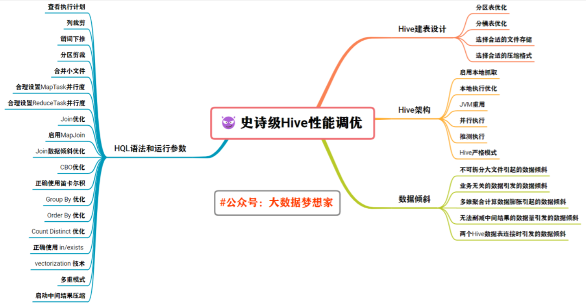
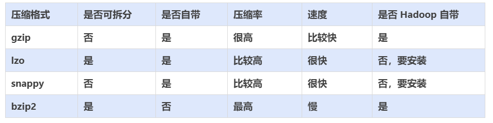
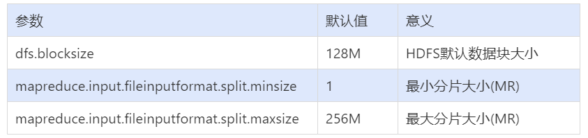

https://cloud.tencent.com/developer/article/2024022

# 前言
Hive 作为大数据领域常用的【数据仓库】组件，在平时设计和查询的时候要特别注意效率。
影响 Hive 效率的几乎从不是数据量过大，而是数据倾斜、数据冗余、Job或I/O过多、MapReduce 分配不合理等等。 
对Hive 的调优既包含 Hive 的建表设计方面，对 HiveHQL 语句本身的优化，也包含 Hive 配置参数 和 底层引擎 MapReduce 方面的调整 。

本篇文章，我将带着大家主要从以下四个方面展开。



为了不盲目地学习，我们需要先知道 Hive 调优的重要性：**在保证业务结果不变的前提下，降低资源的使用量，减少任务的执行时间。**

---

# 调优须知
在开始之前，需要对下面的“ 注意事项” 有个大致的印象 。

- 对于大数据计算引擎来说：数据量大不是问题，数据倾斜是个问题。
- Hive的复杂HQL底层会转换成多个MapReduce Job并行或者串行执行，Job数比较多的作业运行效率相对比较低，
  比如即使只有几百行数据的表，如果多次关联多次汇总，产生十几个Job，耗时很长。
  原因是MapReduce作业初始化的时间是比较长的。
- 在进行Hive大数据分析时，常见的聚合操作比如 sum，count，max，min，UDAF等 ，不怕数据倾斜问题，MapReduce在Mapper阶段的预聚合操作，使数据倾斜不成问题。
- 好的建表设计，模型设计事半功倍。
- 设置合理的 MapReduce 的 Task 并行度，能有效提升性能。
  (比如，10w+数据量 级别的计算，用 100 个 reduceTask，那是相当的浪费，1个足够，但是如果是 亿级别的数据量，那么1个Task又显得捉襟见肘)
- 了解数据分布，自己动手解决数据倾斜问题是个不错的选择。
  这是通用的算法优化，但算法优化有时不能适应特定业务背景，开发人员了解业务，了解数据，可以通过业务逻辑精确有效地解决数据倾斜问题。
- 数据量较大的情况下，慎用 count(distinct)，group by 容易产生倾斜问题。
- 对小文件进行合并，是行之有效地提高调度效率的方法，假如所有的作业设置合理的文件数，对任务的整体调度效率也会产生积极的正向影响 。
- 优化时把握整体，单个作业最优不如整体最优。

---

# 调优具体细节
好了， 下面正式开始谈论调优过程中的细节。

## Hive建表设计层面
Hive的建表设计层面调优，主要讲的怎么样合理的组织数据，方便后续的高效计算。比如建表的类型，文件存储格式，是否压缩等等。

### 利用分区表优化
先来回顾一下 hive 的表类型有哪些？

- 1、分区表
- 2、分桶表

**分区表** 是在某一个或者几个维度上对数据进行分类存储，一个分区对应一个目录。
如果筛选条件里有分区字段，那么 Hive 只需要遍历对应分区目录下的文件即可，不需要遍历全局数据，使得处理的数据量大大减少，从而提高查询效率。

你也可以这样理解：当一个 Hive 表的查询大多数情况下，会根据某一个字段进行筛选时，那么非常适合创建为分区表，该字段即为分区字段。

举个例子：
```text
select1: select .... where country = "china"

select2: select .... where country = "china"

select3: select .... where country = "china"

select4: select .... where country = "china"
```

这就像是分门别类：这个city字段的每个值，就单独形成为一个分区。其实每个分区就对应着 HDFS的一个目录 。
在创建表时通过启用 partitioned by 实现，用来 partition 的维度并不是实际数据的某一列，具体分区的标志是由插入内容时给定的。
当要查询某一分区的内容时可以采用 where 语句，形似 where tablename.partition_column = a 来实现 。

接下来，请尝试操作一下：

1、创建含分区的表：
```text
CREATE TABLE page_view
(
viewTime INT, 
userid   BIGINT, 
page_url STRING, 
referrer_url STRING, 
ip STRING COMMENT 'IP Address of the User'
)
PARTITIONED BY
(
date STRING, 
country STRING
)
ROW FORMAT DELIMITED FIELDS TERMINATED BY '|' 
STORED AS TEXTFILE;
```

2、载入内容，并指定分区标志：
```text
load data local inpath '/home/bigdata/pv_2018-07-08_us.txt' 
overwrite into table page_view partition(date='2018-07-08', country='US');
```

3、查询指定标志的分区内容：
```text
SELECT
    page_views.*
FROM
    page_views
WHERE
    page_views.date               >= '2008-03-01'
    AND page_views.date           <= '2008-03-31'
    AND page_views.referrer_url like '%xyz.com'
;
```

让我们来简单总结一下：
```text
1、当你意识到一个字段经常用来做where，建分区表，使用这个字段当做分区字段          
2、在查询的时候，使用分区字段来过滤，就可以避免全表扫描。只需要扫描这张表的一个分区的数据即可
```

### 利用分桶表优化
分桶跟分区的概念很相似，都是把数据分成多个不同的类别，区别就是规则不一样！

```text
1、分区：按照字段值来进行：一个分区，就只是包含这一个值的所有记录，不是当前分区的数据一定不在当前分区，当前分区也只会包含当前这个分区值的数据。          
2、分桶：默认规则：Hash散列，一个分桶中会有多个不同的值，如果一个分桶中，包含了某个值，这个值的所有记录，必然都在这个分桶。
```

Hive Bucket，分桶，是指将数据以指定列的值为 key 进行 hash，hash 到指定数目的桶中，
这样做的目的和分区表类似，使得筛选时不用全局遍历所有的数据，只需要遍历所在桶就可以了。这样也可以支持高效采样。

分桶表的主要应用场景有：
```text
1、采样         
2、join
```

如下例就是以 userid 这一列为 bucket 的依据，共设置 32 个 buckets 。
```text
CREATE TABLE page_view
(
viewTime INT, 
userid   BIGINT, 
page_url STRING, 
referrer_url STRING, 
ip STRING COMMENT 'IP Address of the User'
)
COMMENT 'This is the page view table' 
PARTITIONED BY
(
dt STRING, 
country STRING
)
CLUSTERED BY(userid)
SORTED BY(viewTime) INTO 32 BUCKETS 
ROW FORMAT DELIMITED FIELDS TERMINATED BY '1' 
COLLECTION ITEMS TERMINATED BY '2' 
MAP KEYS TERMINATED BY '3' 
STORED AS SEQUENCEFILE;
```

分桶的语法也很简单：
```text
CLUSTERED BY(userid) SORTED BY(viewTime) INTO 32 BUCKETS
CLUSTERED BY(userid) 表示按照 userid 来分桶        
SORTED BY(viewTime) 按照 viewtime 来进行桶内排序         
INTO 32 BUCKETS 分成多少个桶
```

通常情况下，抽样会在全体数据上进行采样，这样效率自然就低，它要去访问所有数据。而如果一个表已经对某一列制作了 bucket，就可以采样所有桶中指定序号的某个桶，这就减少了访问量 。

如下例所示就是采样了 page_view 中 32 个桶中的第三个桶的全部数据：
```text
SELECT * FROM page_view TABLESAMPLE(BUCKET 3 OUT OF 32);
```

如下例所示就是采样了 page_view 中 32 个桶中的第三个桶的一半数据：
```text
SELECT * FROM page_view TABLESAMPLE(BUCKET 3 OUT OF 64);
```

总结一下常见的三种采样方式：
```text
-- 分桶抽样：
select * from student tablesample(bucket 3 out of 32);

-- 随机采样：rand() 函数
select * from student order by rand() limit 100; // 效率低
select * from student distribute by rand() sort by rand() limit 100; // 推荐使用这种

-- 数据块抽样：tablesample()函数
select * from student tablesample(10 percent); # 百分比
select * from student tablesample(5 rows); # 行数
select * from student tablesample(5 M); # 大小
```

### 选择合适的文件存储格式
在 HiveSQL 的 create table 语句中，可以使用 stored as ... 指定表的存储格式。
Apache Hive 支持 Apache Hadoop 中使用的几种熟悉的文件格式，比如 TextFile、SequenceFile、RCFile、Avro、ORC、ParquetFile等 。

存储格式一般需要根据业务进行选择，在我们的实操中，绝大多数表都采用TextFile与Parquet两种存储格式之一。
TextFile是最简单的存储格式，它是纯文本记录，也是Hive的默认格式。
虽然它的磁盘开销比较大，查询效率也低，但它更多的是作为跳板来使用。
RCFile、ORC、Parquet等格式的表都不能由文件直接导入数据，必须由TextFile来做中转。Parquet和ORC都是 Apache 旗下的开源列式存储格式。
列式存储比起传统的行式存储更适合批量OLAP查询，并且也支持更好的压缩和编码。

创建表时，特别是宽表，尽量使用 ORC、ParquetFile这些列式存储格式，因为列式存储的表，每一列的数据在物理上是存储在一起的，
Hive查询时会只遍历需要列数据，大大减少处理的数据量。

- 1、TextFile
  - 存储方式：行存储。默认格式，如果建表时不指定默认为此格式。
  - 每一行都是一条记录，每行都以换行符"\n"结尾。数据不做压缩时，磁盘会开销比较大，数据解析开销也 比较大。
  - 可结合Gzip、Bzip2等压缩方式一起使用（系统会自动检查，查询时会自动解压）, 推荐选用可切分的压缩算法。
  
- 2、Sequence File
  - 一种 Hadoop API提供的二进制文件，使用方便、可分割压缩的特点。
  - 支持三种压缩选择：NONE、RECORD、BLOCK。RECORD压缩率低，一般建议使用BLOCK压缩。
  
- 3、RC File
  - 存储方式：数据按行分块，每块按照列存储。
    A、首先，将数据按行分块，保证同一个 record 在一个块上，避免读一个记录需要读取多个 block。
    B、其次，块数据列式存储，有利于数据压缩和快速的列存取。
  - 相对来说，RCFile对于提升任务执行性能提升不大，但是能节省一些存储空间。可以使用升级版的ORC格式。
  
- 4、ORC File
  - 存储方式：数据按行分块，每块按照列存储
  - Hive提供的新格式，属于RCFile的升级版，性能有大幅度提升，而且数据可以压缩存储，压缩快，快速列存取。
  - ORC File会基于列创建索引，当查询的时候会很快。
  
- 5、Parquet File
  - 存储方式：列式存储。
  - Parquet 对于大型查询的类型是高效的。对于扫描特定表格中的特定列查询，Parquet 特别有用。Parquet 一般使用Snappy、Gzip压缩。默认Snappy。
  - Parquet 支持 Impala 查询引擎。
  - 表的文件存储格式尽量采用Parquet或ORC，不仅降低存储量，还优化了查询，压缩，表关联等性能。

### 选择合适的压缩格式
Hive语句最终是转化为MapReduce程序来执行的，而MapReduce的性能瓶颈在与网络IO 和 磁盘 IO，要解决性能瓶颈，最主要的是 减少数据量，对数据进行压缩是个好方式。
压缩虽然是减少了数据量，但是压缩过程要消耗CPU，但是在Hadoop中，往往性能瓶颈不在于CPU，CPU压力并不大，所以压缩充分利用了比较空闲的CPU。

常用的压缩方法对比



如何选择压缩方式
```text
1、压缩比率
2、压缩解压速度
3、是否支持split
```
支持分割的文件可以并行的有多个 mapper 程序处理大数据文件，大多数文件不支持可分割是因为这些文件只能从头开始读。

是否压缩
```text
1、计算密集型，不压缩，否则进一步增加了CPU的负担
2、网络密集型，推荐压缩，减小网络数据传输
```

各个压缩方式所对应的Class类


压缩使用：

Job 输出文件按照 Block 以 GZip 的方式进行压缩：

```text
## 默认值是false
set mapreduce.output.fileoutputformat.compress=true;

## 默认值是Record
set mapreduce.output.fileoutputformat.compress.type=BLOCK

## 默认值是org.apache.hadoop.io.compress.DefaultCodec
set mapreduce.output.fileoutputformat.compress.codec=org.apache.hadoop.io.compress.GzipCodec
```

Map 输出结果也以 Gzip 进行压缩：
```text
## 启用map端输出压缩
set mapred.map.output.compress=true

## 默认值是org.apache.hadoop.io.compress.DefaultCodec
set mapreduce.map.output.compress.codec=org.apache.hadoop.io.compress.GzipCod
```

对 Hive 输出结果和中间都进行压缩：
```text
## 默认值是false，不压缩
set hive.exec.compress.output=true

## 默认值是false，为true时MR设置的压缩才 启用
set hive.exec.compress.intermediate=true
```

## HQL语法和运行参数层面
为了写出高效的SQL，我们有必要知道HQL的执行语法，以及通过一些控制参数来调整 HQL 的执行。

### 1、查看Hive执行计划
Hive 的 SQL 语句在执行之前需要将 SQL 语句转换成 MapReduce 任务，因此需要了解具体的转换过程，可以在 SQL 语句中输入如下命令查看具体的执行计划。
```text
## 查看执行计划，添加extended关键字可以查看更加详细的执行计划
explain [extended] query
```

### 2、列裁剪
列裁剪就是在查询时只读取需要的列，分区裁剪就是只读取需要的分区。当列很多或者数据量很大时，如果 select * 或者不指定分区，全列扫描和全表扫描效率都很低。

Hive 在读数据的时候，可以只读取查询中所需要用到的列，而忽略其他的列。这样做可以节省读取开销：中间表存储开销和数据整合开销。
```text
## 列裁剪，取数只取查询中需要用到的列，默认是true
set hive.optimize.cp = true;
```

### 3、谓词下推
将 SQL 语句中的 where 谓词逻辑都尽可能提前执行，减少下游处理的数据量。对应逻辑优化器是 PredicatePushDown。
```text
## 默认是true
set hive.optimize.ppd=true;
```

示例程序：
```text
## 优化之前
SELECT 
  a.*,
  b.*
FROM
  a
  JOIN b ON a.id = b.id
WHERE
b.age > 20;

## 优化之后
SELECT
  a.*,
  c.*
FROM
  a
  JOIN (
    SELECT
      *
    FROM
      b
    WHERE
      age > 20
  ) c ON a.id = c.id;
```

### 4、分区裁剪
列裁剪就是在查询时只读取需要的列，分区裁剪就是只读取需要的分区。当列很多或者数据量很大时，如果 select * 或者不指定分区，全列扫描和全表扫描效率都很低。

在查询的过程中只选择需要的分区，可以减少读入的分区数目，减少读入的数据量 。

Hive 中与分区裁剪优化相关的则是：
```text
## 默认是true
set hive.optimize.pruner=true;
```

在 HiveQL 解析阶段对应的则是 ColumnPruner 逻辑优化器。
```text
SELECT
  *
FROM
student
WHERE
department = "AAAA";
```

### 5、合并小文件
Map 输入合并：

在执行 MapReduce 程序的时候，一般情况是一个文件的一个数据分块需要一个 mapTask 来处理。
但是如果数据源是大量的小文件，这样就会启动大量的 mapTask 任务，这样会浪费大量资源。可以将输入的小文件进行合并，从而减少 mapTask 任务数量。

```text
## Map端输入、合并文件之后按照block的大小分割（默认）
set hive.input.format=org.apache.hadoop.hive.ql.io.CombineHiveInputFormat;

## Map端输入，不合并
set hive.input.format=org.apache.hadoop.hive.ql.io.HiveInputFormat;
```

Map/Reduce输出合并：

大量的小文件会给 HDFS 带来压力，影响处理效率。可以通过合并 Map 和 Reduce 的结果文件来消除影响 。

```text
## 是否合并Map输出文件, 默认值为true
set hive.merge.mapfiles=true;

## 是否合并Reduce端输出文件,默认值为false
set hive.merge.mapredfiles=true;

## 合并文件的大小,默认值为256000000
set hive.merge.size.per.task=256000000;

## 每个Map 最大分割大小
set mapred.max.split.size=256000000;

## 一个节点上split的最少值
set mapred.min.split.size.per.node=1;  // 服务器节点

## 一个机架上split的最少值
set mapred.min.split.size.per.rack=1;  // 服务器机架
```

hive.merge.size.per.task 和 mapred.min.split.size.per.node 联合起来：
```text
1、默认情况先把这个节点上的所有数据进行合并，如果合并的那个文件的大小超过了256M就开启另外一个文件继续合并 
2、如果当前这个节点上的数据不足256M，那么就都合并成一个逻辑切片。
```

### 6、合理设置MapTask并行度
#### 第一：MapReduce中的MapTask的并行度机制

**Map数过大：** 
当输入文件特别大，MapTask 特别多，每个计算节点分配执行的 MapTask 都很多，
这时候可以考虑减少 MapTask 的数量 ，增大每个 MapTask 处理的数据量。如果 MapTask 过多，最终生成的结果文件数会太多 。

原因:
```text
1、Map阶段输出文件太小，产生大量小文件
2、初始化和创建Map的开销很大
```

**Map数太小：**
当输入文件都很大，任务逻辑复杂，MapTask 执行非常慢的时候，
可以考虑增加 MapTask 数，来使得每个 MapTask 处理的数据量减少，从而提高任务的执行效率。

原因：
```text
1、文件处理或查询并发度小，Job执行时间过长
2、大量作业时，容易堵塞集群
```

在 MapReduce 的编程案例中，
我们得知，一个 MapReduce Job 的 MapTask 数量是由输入分片 InputSplit 决定的。
而输入分片是由 FileInputFormat.getSplit() 决定的。
一个输入分片对应一个 MapTask，而输入分片是由三个参数决定的：



输入分片大小的计算是这么计算出来的：
```text
long splitSize = Math.max(minSize, Math.min(maxSize, blockSize))
```
默认情况下，输入分片大小和 HDFS 集群默认数据块大小一致，也就是默认一个数据块，启用一个 MapTask 进行处理，
这样做的好处是避免了服务器节点之间的数据传输，提高 job 处理效率 。

两种经典的控制 MapTask 的个数方案：减少 MapTask 数 或者 增加 MapTask 数：
```text
1、减少 MapTask 数是通过合并小文件来实现，这一点主要是针对数据源
2、增加 MapTask 数可以通过控制上一个 job 的 reduceTask 个数 重点注意：不推荐把这个值进行随意设置！
推荐的方式：使用默认的切块大小即可。如果非要调整，最好是切块的N倍数。
```

#### 第二：合理控制 MapTask 数量
- 减少 MapTask 数可以通过合并小文件来实现
- 增加 MapTask 数可以通过控制上一个 ReduceTask 默认的 MapTask 个数

计算方式
```text
输入文件总大小：total_size HDFS 设置的数据块大小：dfs_block_size default_mapper_num = total_size / dfs_block_size
```

MapReduce 中提供了如下参数来控制 map 任务个数，从字面上看，貌似是可以直接设置 MapTask 个数的样子，
但是很遗憾不行，这个参数设置只有在大于 default_mapper_num 的时候，才会生效。
```text
## 默认值是2
set mapred.map.tasks=10;
```

那如果我们需要减少 MapTask 数量，但是文件大小是固定的，那该怎么办呢?

可以通过 mapred.min.split.size 设置每个任务处理的文件的大小，这个大小只有在大于 dfs_block_size 的时候才会生效。
```text
split_size = max(mapred.min.split.size, dfs_block_size)
split_num = total_size / split_size
compute_map_num = Math.min(split_num, Math.max(default_mapper_num, mapred.map.tasks))
```

这样就可以减少 MapTask 数量了 。

总结一下控制 mapper 个数的方法：
```text
1、如果想增加 MapTask 个数，可以设置 mapred.map.tasks 为一个较大的值
2、如果想减少 MapTask 个数，可以设置 maperd.min.split.size 为一个较大的值
3、如果输入是大量小文件，想减少 mapper 个数，可以通过设置 hive.input.format 合并小文件
```

如果想要调整 mapper 个数，在调整之前，需要确定处理的文件大概大小以及文件的存在形式（是大量小文件，还是单个大文件），然后再设置合适的参数。
不能盲目进行暴力设置，不然适得其反。

MapTask 数量与输入文件的 split 数息息相关，
在 Hadoop 源码org.apache.hadoop.mapreduce.lib.input.FileInputFormat 类中可以看到 split 划分的具体逻辑。
可以直接通过参数 mapred.map.tasks （默认值2）来设定 MapTask 数的期望值，但它不一定会生效。

### 7、合理设置ReduceTask并行度
如果 ReduceTask 数量过多，一个 ReduceTask 会产生一个结果文件，这样就会生成很多小文件，
那么如果这些结果文件会作为下一个 Job 的输入，则会出现小文件需要进行合并的问题，而且启动和初始化ReduceTask 需要耗费资源。

如果 ReduceTask 数量过少，这样一个 ReduceTask 就需要处理大量的数据，容易拖慢运行时间或者造成 OOM，可能会出现数据倾斜的问题，
使得整个查询耗时长。默认情况下，Hive 分配的 reducer 个数由下列参数决定：
```text
参数1：hive.exec.reducers.bytes.per.reducer (默认256M)
参数2：hive.exec.reducers.max (默认为1009)
参数3：mapreduce.job.reduces (默认值为-1，表示没有设置，那么就按照以上两个参数 进行设置)
```

ReduceTask 的计算公式为：
```text
N = Math.min(参数2，总输入数据大小 / 参数1)
```

可以通过改变上述两个参数的值来控制 ReduceTask 的数量。也可以通过：
```text
set mapred.map.tasks=10;
set mapreduce.job.reduces=10;
```

通常情况下，有必要手动指定 ReduceTask 个数。
考虑到 Mapper 阶段的输出数据量通常会比输入有大幅减少，因此即使不设定 ReduceTask 个数，重设 参数2 还是必要的。

依据经验，可以将 参数2 设定为 M * （0.95 * N） (N为集群中 NodeManager 个数)。
一般来说，NodeManage 和 DataNode 的个数是一样的。

### 8、 Join优化
Join优化整体原则：
```text
1、优先过滤后再进行Join操作，最大限度的减少参与join的数据量
2、小表join大表，最好启动map join，hive自动启用map join, 小表不能超过25M，可以更改
3、Join on的条件相同的话，最好放入同一个job，并且join表的排列顺序从小到大：
    select a., b., c.* from a join b on a.id = b.id join c on a.id = c.i
4、如果多张表做join, 如果多个链接条件都相同，会转换成一个Job
```

优先过滤数据
```text
尽量减少每个阶段的数据量，对于分区表能用上分区字段的尽量使用，同时只选择后面需要使用到的列，最大 限度的减少参与 Join 的数据量。
```

小表 join 大表原则
```text
小表 join 大表的时应遵守小表 join 大表原则，原因是 join 操作的 reduce 阶段，位于 join 左边 的表内容会被加载进内存，
将条目少的表放在左边，可以有效减少发生内存溢出的几率。
join 中执行顺序是从左到右生成 Job，应该保证连续查询中的表的大小从左到右是依次增加的。
```

使用相同的连接键
```text
在 hive 中，当对 3 个或更多张表进行 join 时，如果 on 条件使用相同字段，那么它们会合并为一个 MapReduce Job，
利用这种特性，可以将相同的 join on 放入一个 job 来节省执行时间。
```

尽量原子操作
```text
尽量避免一个SQL包含复杂的逻辑，可以使用中间表来完成复杂的逻辑。
```

大表Join大表
```text
1、空key过滤：有时join超时是因为某些key对应的数据太多，而相同key对应的数据都会发送到相同的 reducer上，从而导致内存不够。
此时我们应该仔细分析这些异常的key，很多情况下，这些key对应的数据是异常数据，我们需要在SQL语句中进行过滤。         
2、空key转换：有时虽然某个key为空对应的数据很多，但是相应的数据不是异常数据，必须要包含在join 的结果中，
此时我们可以表a中key为空的字段赋一个随机的值，使得数据随机均匀地分到不同的reducer上。
```

### 9、 启用 MapJoin
```text
这个优化措施，但凡能用就用！
大表 join 小表 小表满足需求：小表数据小于控制条件时。
```

MapJoin是将join双方比较小的表直接分发到各个map进程的内存中，在map进程中进行join操作，这样就不用进行reduce步骤，从而提高了速度。
只有 join 操作才能启用 MapJoin。
```text
## 是否根据输入小表的大小，自动将reduce端的common join 转化为map join，将小表刷入内存中。
## 对应逻辑优化器是MapJoinProcessor
set hive.auto.convert.join = true;

## 刷入内存表的大小(字节)
set hive.mapjoin.smalltable.filesize = 25000000;

## hive会基于表的size自动的将普通join转换成mapjoin
set hive.auto.convert.join.noconditionaltask=true;

## 多大的表可以自动触发放到内层 LocalTask 中，默认大小10M
set hive.auto.convert.join.noconditionaltask.size=10000000;
```

Hive 可以进行多表 Join。Join 操作尤其是 Join 大表的时候代价是非常大的。MapJoin 特别适合大小表 join 的情况。
在Hive join场景中，一般总有一张相对小的表和一张相对大的表，小表叫 build table，大表叫 probe table。
Hive 在解析带 join 的 SQL 语句时，会默认将最后一个表作为 probe table，将前面的表作为 build table 并试图将它们读进内存。
如果表顺序写反，probe table 在前面，引发 OOM 的风险就高了。
在维度建模数据仓库中，事实表就是 probe table，维度表就是 build table。
这种 Join 方式在 map 端直接完成 join 过程，消灭了 reduce，效率很高。而且 MapJoin 还支持非等值连接 。

当 Hive 执行 Join 时，需要选择哪个表被流式传输（stream），哪个表被缓存（cache）。
Hive 将JOIN 语句中的最后一个表用于流式传输，因此我们需要确保这个流表在两者之间是最大的。
如果要在不同的 key 上 join 更多的表，那么对于每个 join 集，只需在 ON 条件右侧指定较大的表 。

也可以手动开启map join：
```text
-- SQL方式，在SQL语句中添加MapJoin标记（mapjoin hint）
-- 将小表放到内存中，省去shffle操作

// 在没有开启mapjoin的情况下，执行的是reduceJoin
SELECT /*+ MAPJOIN(smallTable) */  smallTable.key, bigTable.value FROM smallTable 
JOIN bigTable ON smallTable.key = bigTable.key;

/*+mapjoin(smalltable)*/
```

**Sort-Merge-Bucket(SMB) Map Join**

它是另一种Hive Join优化技术，使用这个技术的前提是所有的表都必须是分桶表（bucket）和分桶排序的（sort）。分桶表的优化！

具体实现：
```text
1、针对参与join的这两张做相同的hash散列，每个桶里面的数据还要排序
2、这两张表的分桶个数要成倍数。
3、开启 SMB join 的开关！
```

一些常见参数设置：
```text
## 当用户执行bucket map join的时候，发现不能执行时，禁止查询;
set hive.enforce.sortmergebucketmapjoin=false;

## 如果join的表通过sort merge join的条件，join是否会自动转换为sort merge join;
set hive.auto.convert.sortmerge.join=true;

## 当两个分桶表 join 时，如果 join on的是分桶字段，小表的分桶数是大表的倍数时，可以启用 mapjoin 来提高效率。 
## bucket map join优化，默认值是 false
set hive.optimize.bucketmapjoin=false;

## bucket map join 优化，默认值是 false;
set hive.optimize.bucketmapjoin.sortedmerge=false;
```

### 10、Join数据倾斜优化
在编写 Join 查询语句时，如果确定是由于 join 出现的数据倾斜，那么请做如下设置：
```text
# join的键对应的记录条数超过这个值则会进行分拆，值根据具体数据量设置
set hive.skewjoin.key=100000;

# 如果是join过程出现倾斜应该设置为true
set hive.optimize.skewjoin=false;
```

如果开启了，在 Join 过程中 Hive 会将计数超过阈值 hive.skewjoin.key（默认100000）的倾斜 key 对应的行临时写进文件中，
然后再启动另一个 job 做 map join 生成结果。

通过 hive.skewjoin.mapjoin.map.tasks 参数还可以控制第二个 job 的 mapper 数量，默认10000 。

```text
set hive.skewjoin.mapjoin.map.tasks=10000;
```

### 11、CBO优化
join的时候表的顺序的关系：前面的表都会被加载到内存中。后面的表进行磁盘扫描 。

```text
select a., b., c.* from a join b on a.id = b.id join c on a.id = c.id ;
```

Hive 自 0.14.0 开始，加入了一项 Cost based Optimizer 来对 HQL 执行计划进行优化，这个功能通过 hive.cbo.enable 来开启。
在 Hive 1.1.0 之后，这个 feature 是默认开启的，它可以 自动优化 HQL 中多个 Join 的顺序，并选择合适的 Join 算法 。

CBO，成本优化器，代价最小的执行计划就是最好的执行计划。
传统的数据库，成本优化器做出最优化的执行计划是依据统计信息来计算的。
Hive 的成本优化器也一样。

Hive 在提供最终执行前，优化每个查询的执行逻辑和物理执行计划。这些优化工作是交给底层来完成的。
根据查询成本执行进一步的优化，从而产生潜在的不同决策：如何排序连接，执行哪种类型的连接，并行度等等。

要使用基于成本的优化（也称为CBO），请在查询开始设置以下参数：
```text
set hive.cbo.enable=true;
set hive.compute.query.using.stats=true;
set hive.stats.fetch.column.stats=true;
set hive.stats.fetch.partition.stats=true;
```

### 12、怎样做笛卡尔积
当 Hive 设定为严格模式（hive.mapred.mode=strict）时，不允许在 HQL 语句中出现笛卡尔积，这实 际说明了 Hive 对笛卡尔积支持较弱。
因为找不到 Join key，Hive 只能使用 1 个 reducer 来完成笛卡尔积 。

当然也可以使用 limit 的办法来减少某个表参与 join 的数据量，但对于需要笛卡尔积语义的需求来说，
经常是一个大表和一个小表的 Join 操作，结果仍然很大（以至于无法用单机处理），这时 MapJoin 才是最好的解决办法。
MapJoin，顾名思义，会在 Map 端完成 Join 操作。
这需要将 Join 操作的一个或多个表完全读入内存。

PS：MapJoin 在子查询中可能出现未知 BUG。在大表和小表做笛卡尔积时，规避笛卡尔积的方法是，给 Join 添加一个 Join key，
原理很简单：将小表扩充一列 join key，并将小表的条目复制数倍，join key 各不相同；将大表扩充一列 join key 为随机数。

精髓就在于复制几倍，最后就有几个 reduce 来做，而且大表的数据是前面小表扩张 key 值范围里面随机出来的，所以复制了几倍 n，
就相当于这个随机范围就有多大 n，那么相应的，大表的数据就被随机的分为了 n 份。
并且最后处理所用的 reduce 数量也是 n，而且也不会出现数据倾斜 。

### 13、Group By 优化
默认情况下，Map 阶段同一个 Key 的数据会分发到一个 Reduce 上，当一个 Key 的数据过大时会产生数据倾斜。
进行 group by 操作时可以从以下两个方面进行优化：

#### 1. Map端部分聚合

事实上并不是所有的聚合操作都需要在 Reduce 部分进行，很多聚合操作都可以先在 Map 端进行部分聚合，然后在 Reduce 端的得出最终结果 。
```text
## 开启Map端聚合参数设置
set hive.map.aggr=true;

## 设置map端预聚合的行数阈值，超过该值就会分拆job，默认值100000
set hive.groupby.mapaggr.checkinterval=100000
```

#### 2. 有数据倾斜时进行负载均衡

当 HQL 语句使用 group by 时数据出现倾斜时，如果该变量设置为 true，那么 Hive 会自动进行负载均衡。
策略就是把 MapReduce 任务拆分成两个：**第一个先做预汇总，第二个再做最终汇总** 。

```text
# 自动优化，有数据倾斜的时候进行负载均衡（默认是false）
set hive.groupby.skewindata=false;
```

当选项设定为 true 时，生成的查询计划有两个 MapReduce 任务 。

- 1、在第一个 MapReduce 任务中，map 的输出结果会随机分布到 reduce 中，每个 reduce 做部分聚合操作，并输出结果，
  这样处理的结果是相同的group by key有可能分发到不同的 reduce 中，从而达到负载均衡的目的；         
- 2、第二个 MapReduce 任务再根据预处理的数据结果按照 group by key 分布到各个 reduce 中，最 后完成最终的聚合操作。

Map 端部分聚合：并不是所有的聚合操作都需要在 Reduce 端完成，很多聚合操作都可以先在 Map 端进行部分聚合，
最后在 Reduce 端得出最终结果，对应的优化器为 GroupByOptimizer。

那么如何用 group by 方式同时统计多个列？

```text
SELECT
  t.a,
  SUM(t.b),
  COUNT(t.c),
  COUNT(t.d)
FROM
  some_table t
GROUP BY t.a;
```
下面是解决方法：
```text
select t.a, sum(t.b), count(t.c), count(t.d) from (
  select a,b,null c,null d from some_table
  union all
  select a,0 b,c,null d from some_table group by a,c
  union all
  select a,0 b,null c,d from some_table group by a,d
) t;
```

### 14、Order By 优化
order by 只能是在一个 reduce 进程中进行，所以如果对一个大数据集进行 order by，
会导致一个 reduce 进程中处理的数据相当大，造成查询执行缓慢 。

```text
1、在最终结果上进行order by，不要在中间的大数据集上进行排序。
如果最终结果较少，可以在一个 reduce上进行排序时，那么就在最后的结果集上进行order by。

2、如果是取排序后的前N条数据，可以使用distribute by和sort by在各个reduce上进行排序后前N 条，
然后再对各个reduce的结果集合合并后在一个reduce中全局排序，再取前N条，
因为参与全局排序的 order by的数据量最多是reduce个数 * N，所以执行效率会有很大提升。
```

在Hive中，关于数据排序，提供了四种语法，一定要区分这四种排序的使用方式和适用场景。

```text
1、order by：全局排序，缺陷是只能使用一个reduce
2、sort by：单机排序，单个reduce结果有序
3、cluster by：对同一字段分桶并排序，不能和sort by连用
4、distribute by+sort by：分桶，保证同一字段值只存在一个结果文件当中，结合sort by保证每 个reduceTask结果有序
```

Hive HQL 中的 order by 与其他 SQL 方言中的功能一样，就是将结果按某字段全局排序，
这会导致所有 map 端数据都进入一个 reducer 中，在数据量大时可能会长时间计算不完。

如果使用 sort by，那么还是会视情况启动多个 reducer 进行排序，并且保证每个 reducer 内局部有序。
为了控制 map 端数据分配到 reducer 的 key，往往还要配合 distribute by 一同使用。
如果不加 distribute by 的话，map 端数据就会随机分配到 reducer。

提供一种方式实现全局排序：两种方式：

1、建表导入数据准备
```text
CREATE TABLE if NOT EXISTS student(
id INT,
name string,
sex string,
age INT,
department string
) ROW format delimited fields terminated BY ",";

load data local inpath "/home/bigdata/students.txt" INTO TABLE student;
```

2、第一种方式
```text
-- 直接使用order by来做。如果结果数据量很大，这个任务的执行效率会非常低;
SELECT
  id,
  name,
  age
FROM
  student
ORDER BY age desc
LIMIT 3;
```

3、第二种方式
```text
-- 使用distribute by + sort by 多个reduceTask，每个reduceTask分别有序
SET mapreduce.job.reduces = 3;
DROP TABLE student_orderby_result;

-- 范围分桶 0 < 18 < 1 < 20 < 2
CREATE TABLE student_orderby_result AS
SELECT
  *
FROM
student 
distribute BY (
CASE
  WHEN age > 20 THEN 0
  WHEN age < 18 THEN 2
  ELSE 1
END
) sort BY (age desc);
```
关于分界值的确定，使用采样的方式，来估计数据分布规律 。

### 15、Count Distinct优化
当要统计某一列去重数时，如果数据量很大，count(distinct) 就会非常慢，原因与 order by 类似，
count(distinct) 逻辑只会有很少的 reducer 来处理。这时可以用 group by 来改写：
```text
-- 先 group by 再 count
SELECT
  COUNT(1)
FROM
(
  SELECT
    age
  FROM
    student
  WHERE department >= "MA"
  GROUP BY age
) t;
```

再来一个例子： 优化前 ，一个普通的只使用一个reduceTask来进行count(distinct) 操作
```text
-- 优化前（只有一个reduce，先去重再count负担比较大）：
SELECT
  COUNT(DISTINCT id)
FROM
tablename;
```

优化后 ，但是这样写会启动两个MR job（单纯 distinct 只会启动一个），
所以要确保数据量大到启动 job 的 overhead 远小于计算耗时，才考虑这种方法。
当数据集很小或者 key 的倾斜比较明显时，group by 还可能会比 distinct 慢。
```text
-- 优化后（启动两个job，一个job负责子查询(可以有多个reduce)，另一个job负责count(1))：
SELECT
  COUNT(1)
FROM
(
SELECT
  DISTINCT id
FROM
  tablename
) tmp;

SELECT
  COUNT(1)
FROM
(
SELECT
  id
FROM
  tablename
GROUP BY id
) tmp;
// 推荐使用这种
```

### 16、怎样写in/exists语句
在Hive的早期版本中，in/exists语法是不被支持的，但是从 hive-0.8x 以后就开始支持这个语法。但是不推荐使用这个语法。
虽然经过测验，Hive-2.3.6 也支持 in/exists 操作，但还是推荐使用 Hive 的一个高效替代方案：left semi join

比如说：
```text
-- in / exists 实现
SELECT
  a.id,
  a.name
FROM a
WHERE
a.id IN (SELECT b.id FROM b);

SELECT
  a.id,
  a.name
FROM a
WHERE
EXISTS (SELECT id FROM b WHERE a.id = b.id);
```
可以使用join来改写：
```text
SELECT
  a.id,
  a.name
FROM a
JOIN b ON a.id = b.id;
```
应该转换成：
```text
-- left semi join 实现
SELECT
  a.id,
  a.name
FROM a 
LEFT semi JOIN b ON a.id = b.id;
```

### 17、使用 vectorization 技术
在计算类似scan, filter, aggregation的时候，vectorization 技术以设置批处理的增量大小为 1024 行单次来达到比单条记录单次获得更高的效率。
```text
set hive.vectorized.execution.enabled=true ;
set hive.vectorized.execution.reduce.enabled=true;
```

### 18、多重模式
如果你碰到一堆SQL，并且这一堆SQL的模式还一样。都是从同一个表进行扫描，做不同的逻辑。
有可优化的地方：如果有n条SQL，每个SQL执行都会扫描一次这张表 。

如果一个 HQL 底层要执行 10 个 Job，那么能优化成 8 个一般来说，肯定能有所提高，多重插入就是一 个非常实用的技能。
一次读取，多次插入，有些场景是从一张表读取数据后，要多次利用，这时可以使用 multi insert 语法：
```text
FROM
sale_detail INSERT overwrite TABLE sale_detail_multi PARTITION (sale_date = '2019', region = 'china')
SELECT
shop_name,
customer_id,
total_price
WHERE
.....insert overwrite TABLE sale_detail_multi PARTITION (sale_date = '2020', region = 'china')
SELECT
shop_name,
customer_id,
total_price
WHERE
.....;
```
需要的是，multi insert 语法有一些限制
```text
1、一般情况下，单个SQL中最多可以写128路输出，超过128路，则报语法错误。
2、在一个multi insert中：对于分区表，同一个目标分区不允许出现多次。对于未分区表，该表不能出现多次。
3、对于同一张分区表的不同分区，不能同时有insert overwrite和insert into操作，否则报错返回
```

Multi-Group by 是 Hive 的一个非常好的特性，它使得 Hive 中利用中间结果变得非常方便。例如：
```text
FROM
  (
    SELECT
      a.status,
      b.school,
      b.gender
    FROM status_updates a
    JOIN profiles b ON (
      a.userid = b.userid
      AND a.ds = '2019-03-20'
    )
  ) subq1 INSERT OVERWRITE TABLE gender_summary PARTITION(ds = '2019-03-20')
SELECT
  subq1.gender,
  COUNT(1)
GROUP BY
  subq1.gender INSERT OVERWRITE TABLE school_summary PARTITION(ds = '2019-03-20')
SELECT
  subq1.school,
  COUNT(1)
GROUP BY
  subq1.school;
```

上述查询语句使用了 Multi-Group by 特性连续 group by 了 2 次数据，使用不同的 Multi-Group by。这一特性可以减少一次 MapReduce 操作。

### 19、启动中间结果压缩
**map 输出压缩：**
```text
set mapreduce.map.output.compress=true;
set mapreduce.map.output.compress.codec=org.apache.hadoop.io.compress.SnappyCodec;
```

**中间数据压缩：**

中间数据压缩就是对 hive 查询的多个 Job 之间的数据进行压缩。最好是选择一个节省CPU耗时的压缩方式。
可以采用 snappy 压缩算法，该算法的压缩和解压效率都非常高。

```text
set hive.exec.compress.intermediate=true;
set hive.intermediate.compression.codec=org.apache.hadoop.io.compress.SnappyCodec;
set hive.intermediate.compression.type=BLOCK;
```

**结果数据压缩：**

最终的结果数据（Reducer输出数据）也是可以进行压缩的，可以选择一个压缩效果比较好的，可以减少数据的大小和数据的磁盘读写时间 。

需要注意：常用的 gzip，snappy 压缩算法是不支持并行处理的，如果数据源是 gzip/snappy压缩文件大文件，
这样只会有有个 mapper 来处理这个文件，会严重影响查询效率。
所以如果结果数据需要作为其他查询任务的数据源，可以选择支持 splitable 的 LZO 算法，
这样既能对结果文件进行压缩，还可以并行的处理，这样就可以大大的提高 job 执行的速度了。

```text
set hive.exec.compress.output=true;
set mapreduce.output.fileoutputformat.compress=true;
set mapreduce.output.fileoutputformat.compress.codec=org.apache.hadoop.io.compress.G zipCodec;
set mapreduce.output.fileoutputformat.compress.type=BLOCK;
```

Hadoop集群支持的压缩算法：
```text
org.apache.hadoop.io.compress.DefaultCodec org.apache.hadoop.io.compress.GzipCodec
org.apache.hadoop.io.compress.BZip2Codec org.apache.hadoop.io.compress.DeflateCodec
org.apache.hadoop.io.compress.SnappyCodec org.apache.hadoop.io.compress.Lz4Codec
com.hadoop.compression.lzo.LzoCodec com.hadoop.compression.lzo.LzopCodec
```

## Hive 架构层面
1、启用本地抓取
Hive 的某些 SQL 语句需要转换成 MapReduce 的操作，某些 SQL 语句就不需要转换成 MapReduce 操作，但是同学们需要注意，理论上来说，所有的 SQL 语句都需要转换成 MapReduce 操作，只不过 Hive 在转换 SQL 语句的过程中会做部分优化，使某些简单的操作不再需要转换成 MapReduce，例如：

1、只是 select * 的时候
2、where 条件针对分区字段进行筛选过滤时
3、带有 limit 分支语句时

        Hive 从 HDFS 中读取数据，有两种方式：启用MapReduce读取 和 直接抓取 。

        直接抓取数据比 MapReduce 方式读取数据要快的多，但是只有少数操作可以使用直接抓取方式 。

        可以通过 hive.fetch.task.conversion 参数来配置在什么情况下采用直接抓取方式：

minimal：只有 select * 、在分区字段上 where 过滤、有 limit 这三种场景下才启用直接抓取方式。
more：在 select、where 筛选、limit 时，都启用直接抓取方式 。

        查看 Hive 的抓取策略：

代码语言：javascript
复制
> ## 查看
> set hive.fetch.task.conversion;
设置Hive的抓取策略：

代码语言：javascript
复制
## 默认more
set hive.fetch.task.conversion=more;
如果有疑惑，请看hive-default.xml中关于这个参数的解释：

代码语言：javascript
复制
<property>
<name>hive.fetch.task.conversion</name>
<value>more</value>
<description>
Expects one of [none, mi nimal, more].
Some select queri es can be converted to single FETCH task minimizing latency.
Currently the query should be si ngle sourced not havi ng any subquery and should not have
any aggregations or di sti ncts (whi ch i ncurs RS), lateral vi ews and
joi ns.
0. none : di sable hive.fetch.task.conversion
   1.minimal : select star, filter on partition columns, limit only
   2.more : SELECT, FILTER, LIMIT only (support TABLESAMPLE and vi rtual
   columns)

   </descri ption>
   </property>
   <property>
   <name>hive.fetch.task.conversion.threshold</name>
   <value>1073741824</value>
   <descri pti on>
   input threshold for applying hive.fetch.task.conversion, if target table is native, input 1ength
   is calculated by summation of file 1engths. if it's not native, storage handler for the table
   can optionally implement
   org.apache, hadoop. hive, ql. metadata. inputEstimator iinterface.
   </descri ption>
   </property>
   2、本地执行优化
   Hive在集群上查询时，默认是在集群上多台机器上运行，需要多个机器进行协调运行，这种方式很好地解决了大数据量的查询问题。但是在Hive查询处理的瓣量比较小的时候，其实没有必要启动分布 式模式去执行，因为以分布式方式执行设计到跨网络传输、多节点协调等，并且消耗资源。对于小数据 集，可以通过本地模式，在单台机器上处理所有任务，执行时间明显被缩短 。

        启动本地模式涉及到三个参数：

代码语言：javascript
复制
##打开hive自动判断是否启动本地模式的开关
set hive.exec.mode.local.auto=true;

## map任务晝專大值,*启用本地模式的task最大皋数
set hive.exec.mode.1ocal.auto.input.files.max=4;

## map输入文件最大大小，不启动本地模式的最大输入文件大小
set hive.exec.mode.1ocal.auto.inputbytes.max=134217728;
3、JVM 重用
Hive语句最终会转换为一系的MapReduce任务，每一个MapReduce任务是由一系的MapTask 和ReduceTask组成的，默认情况下，MapReduce中一个MapTask或者ReduceTask就会启动一个 JVM进程，一个Task执行完毕后，JVM进程就会退出。这样如果任务花费时间很短，又要多次启动 JVM的情况下，JVM的启动时间会变成一个比较大的消耗，这时，可以通过重用JVM来解决 。

代码语言：javascript
复制
set mapred.job.reuse.jvm.num.tasks=5;
JVM也是有缺点的，开启JVM重用会一直占用使用到的task的插槽，以便进行重用，直到任务完成后才 会释放。如果某个不平衡的job中有几个reduce task执行的时间要比其他的reduce task消耗的时间 要多得多的话，那么保留的插槽就会一直空闲却无法被其他的job使用，直到所有的task都结束了才 会释放。

        根据经验，一般来说可以使用一个cpu core启动一个JVM，假如服务器有16个cpu core，但是这个 节点，可能会启动32个 mapTask ,完全可以考虑：启动一个JVM,执行两个Task 。

4、并行执行
有的查询语句，Hive会将其转化为一个或多个阶段，包括：MapReduce阶段、抽样阶段、合并阶段、 limit阶段等。默认情况下，一次只执行一个阶段。但是，如果某些阶段不是互相依赖，是可以并行执行的。多阶段并行是比较耗系统资源的 。

        一个 Hive SQL语句可能会转为多个MapReduce Job,每一个 job 就是一个 stage , 这些Job顺序执行，这个在 client 的运行日志中也可以看到。但是有时候这些任务之间并不是相互依赖的，如果集群资源允许的话，可以让多个并不相互依赖 stage 并发执行，这样就节约了时间，提高了执行速度，但是如 果集群资源匮乏时，启用并行化反倒是会导致各个 Job 相互抢占资源而导致整体执行性能的下降。启用 并行化：

代码语言：javascript
复制
##可以开启并发执行。
set hive.exec.parallei=true;

##同一个sql允许最大并行度，默认为8。
set hive.exec.paral1 el.thread.number=16;
5、推测执行
在分布式集群环境下，因为程序Bug（包括Hadoop本身的bug），负载不均衡或者资源分布不均等原因，会造成同一个作业的多个任务之间运行速度不一致，有些任务的运行速度可能明显慢于其他任务（比如一个作业的某个任务进度只有50%，而其他所有任务已经运行完毕），则这些任务会拖慢作业的整体执行进度。为了避免这种情况发生，Hadoop采用了推测执行（Speculative Execution）机制，它根据一定的法则推测出“拖后腿”的任务，并为这样的任务启动一个备份任务，让该任务与原始任务同时处理同一份数据，并最终选用最先成功运行完成任务的计算结果作为最终结果 。

代码语言：javascript
复制
# 启动mapper阶段的推测执行机制
set mapreduce.map.speculative=true;

# 启动reducer阶段的推测执行机制
set mapreduce.reduce.speculative=true;
设置开启推测执行参数：Hadoop 的 mapred-site.xml 文件中进行配置：

代码语言：javascript
复制
<property>
<name>mapreduce.map.speculative</name>
<value>true</value>
<description>lf true, then multiple i nstances of some map tasks may be executed i n parallel.</description>
</property>
<property>
<name>mapreduce.reduce.speculati ve</name>
<value>true</value>
<descri pti on>lf true, then multi ple i nstances of some reduce tasks may be executed in parallel.
</description>
</property>
Hive本身也提供了配置项来控制reduce-side的推测执行

代码语言：javascript
复制
<property>
<name>hive.mapped.reduce.tasks.speculative.executi on</name>
<value>true</value>
<description>whether speculative execution for reducers should be turned on. </description>
</property>
建议：

如果用户对于运行时的偏差非常敏感的话，那么可以将这些功能关闭掉。如果用户因为输入数据量很大而需要 执行长时间的MapTask或者ReduceTask的话，那么启动推测执行造成的浪费是非常巨大的。

6、Hive严格模式
所谓严格模式，就是强制不允许用户执行有风险的 HiveQL 语句，一旦执行会直接失败。但是Hive中为了提高SQL语句的执行效率，可以设置严格模式，充分利用 Hive 的某些特点 。

代码语言：javascript
复制
## 设置Hive的严格模式
set hive.mapred.mode=strict;
set hive.exec.dynamic.partition.mode=nostrict;
注意：当设置严格模式之后，会有如下限制：

代码语言：javascript
复制
1、对于分区表，必须添加where对于分区字段的条件过滤
select * from student_ptn where age > 25

2、order by语句必须包含limit输出限制
select * from student order by age limit 100;

3、限制执行笛卡尔积的查询
select a.*, b.* from a, b;

4、在hive的动态分区模式下，如果为严格模式，则必须需要一个分区列是静态分区
数据倾斜
网上关于如何定位并解决数据倾斜的教程很多，但是大多只是点到为止，浮于表面 。这里我们直接引用了《Hive性能调优实战》中数据倾斜部分的内容，让大家能够体系化学习，彻底掌握 。

数据倾斜，即单个节点任务所处理的数据量远大于同类型任务所处理的数据量，导致该节点成为整个作业的瓶颈，这是分布式系统不可能避免的问题。从本质来说，导致数据倾斜有两种原因，一是任务读取大文件，二是任务需要处理大量相同键的数据 。

        任务读取大文件，最常见的就是读取压缩的不可分割的大文件。任务需要处理大量相同键的数据，这种情况有以下4种表现形式：

数据含有大量无意义的数据，例如空值（NULL）、空字符串等
含有倾斜数据在进行聚合计算时无法聚合中间结果，大量数据都需要 经过Shuffle阶段的处理，引起数据倾斜
数据在计算时做多维数据集合，导致维度膨胀引起的数据倾斜
两表进行Join，都含有大量相同的倾斜数据键
1、不可拆分大文件引发的数据倾斜
当集群的数据量增长到一定规模，有些数据需要归档或者转储，这时候往往会对数据进行压缩；当对文件使用GZIP压缩等不支持文件分割操作的压缩方式，在日后有作业涉及读取压缩后的文件时，该压缩文件只会被一个任务所读取。如果该压缩文件很大，则处理该文件的Map需要花费的时间会 远多于读取普通文件的Map时间，该Map任务会成为作业运行的瓶颈。这种情况也就是Map读取文件的数据倾斜。例如存在这样一张表t_des_info 。


        t_des_info表由3个GZIP压缩后的文件组成 。


        其中，large_file.gz文件约200MB，在计算引擎在运行时，预先设置每 个Map处理的数据量为128MB，但是计算引擎无法切分large_file.gz文件，所 以该文件不会交给两个Map任务去读取，而是有且仅有一个任务在操作 。

        t_des_info表有3个gz文件，任何涉及处理该表的数据都只会使用3个 Map。


        为避免因不可拆分大文件而引发数据读取的倾斜，在数据压缩的时 候可以采用bzip2和Zip等支持文件分割的压缩算法。

2、业务无关的数据引发的数据倾斜
实际业务中有些大量的NULL值或者一些无意义的数据参与到计算作业 中，这些数据可能来自业务未上报或因数据规范将某类数据进行归一化变成空值或空字符串等形式。这些与业务无关的数据引入导致在进行分组聚合或者在执行表连接时发生数据倾斜。对于这类问题引发的数据倾斜，在计算过 程中排除含有这类“异常”数据即可 。

3、 多维聚合计算数据膨胀引起的数据倾斜
在多维聚合计算时存在这样的场景：select a，b，c，count（1）from T group by a，b，c with rollup。对于上述的SQL，可以拆解成4种类型的键进行分组聚合，它们分别是（a，b，c）、（a，b，null）、（a，null，null） 和（null，null，null）。

        如果T表的数据量很大，并且Map端的聚合不能很好地起到数据压缩的 情况下，会导致Map端产出的数据急速膨胀，这种情况容易导致作业内存溢 出的异常。如果T表含有数据倾斜键，会加剧Shuffle过程的数据倾斜 。

        对上述的情况我们会很自然地想到拆解上面的SQL语句，将rollup拆解成如下多个普通类型分组聚合的组合。

代码语言：javascript
复制
select a, b, c, count(1) from T group by a, b, c;

select a, b, null, count(1) from T group by a, b;

select a, null, null, count(1) from T group by a;

select null, null, null, count(1) from T;
这是很笨拙的方法，如果分组聚合的列远不止3个列，那么需要拆解的 SQL语句会更多。在Hive中可以通过参数 （hive.new.job.grouping.set.cardinality）配置的方式自动控制作业的拆解，该 参数默认值是30。该参数表示针对grouping sets/rollups/cubes这类多维聚合的 操作，如果最后拆解的键组合（上面例子的组合是4）大于该值，会启用新的任务去处理大于该值之外的组合。如果在处理数据时，某个分组聚合的列 有较大的倾斜，可以适当调小该值 。

4、无法削减中间结果的数据量引发的数据倾斜
在一些操作中无法削减中间结果，例如使用collect_list聚合函数，存在如下SQL：

代码语言：javascript
复制
SELECT
s_age,
collect_list(s_score) list_score
FROM
student_tb_txt
GROUP BY
s_age
在student_tb_txt表中，s_age有数据倾斜，但如果数据量大到一定的数 量，会导致处理倾斜的Reduce任务产生内存溢出的异常。针对这种场景，即 使开启hive.groupby.skewindata配置参数，也不会起到优化的作业，反而会拖累整个作业的运行。

        启用该配置参数会将作业拆解成两个作业，第一个作业会尽可能将 Map 的数据平均分配到Reduce阶段，并在这个阶段实现数据的预聚合，以减少第二个作业处理的数据量；第二个作业在第一个作业处理的数据基础上进行结果的聚合。

hive.groupby.skewindata的核心作用在于生成的第一个作业能够有效减少数量。但是对于collect_list这类要求全量操作所有数据的中间结果的函数来说，明显起不到作用，反而因为引入新的作业增加了磁盘和网络I/O的负担，而导致性能变得更为低下 。

        解决这类问题，最直接的方式就是调整Reduce所执行的内存大小，使用 mapreduce.reduce.memory.mb这个参数（如果是Map任务内存瓶颈可以调整 mapreduce.map.memory.mb）。但还存在一个问题，如果Hive的客户端连接 的HIveServer2一次性需要返回处理的数据很大，超过了启动HiveServer2设置的Java堆（Xmx），也会导致HiveServer2服务内存溢出。

5、两个Hive数据表连接时引发的数据倾斜
两表进行普通的repartition join时，如果表连接的键存在倾斜，那么在 Shuffle阶段必然会引起数据倾斜 。

        遇到这种情况，Hive的通常做法还是启用两个作业，第一个作业处理没有倾斜的数据，第二个作业将倾斜的数据存到分布式缓存中，分发到各个 Map任务所在节点。在Map阶段完成join操作，即MapJoin，这避免了 Shuffle，从而避免了数据倾斜。

参考资料
[1]

中国好胖子 《hive调优全方位指南》

[2]

林志煌 《Hive性能调优实战》