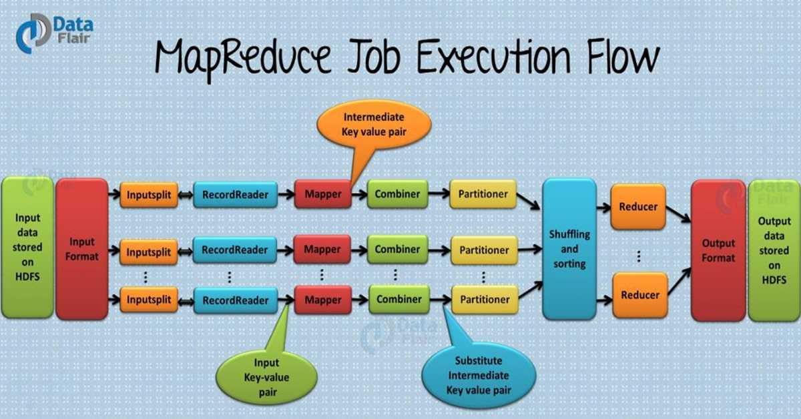
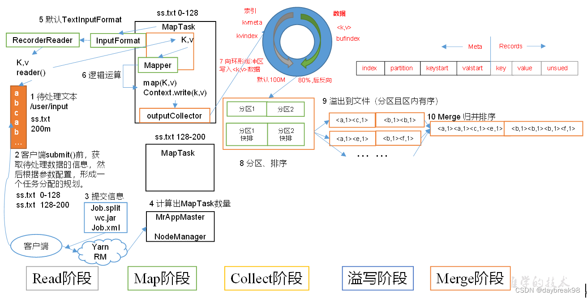
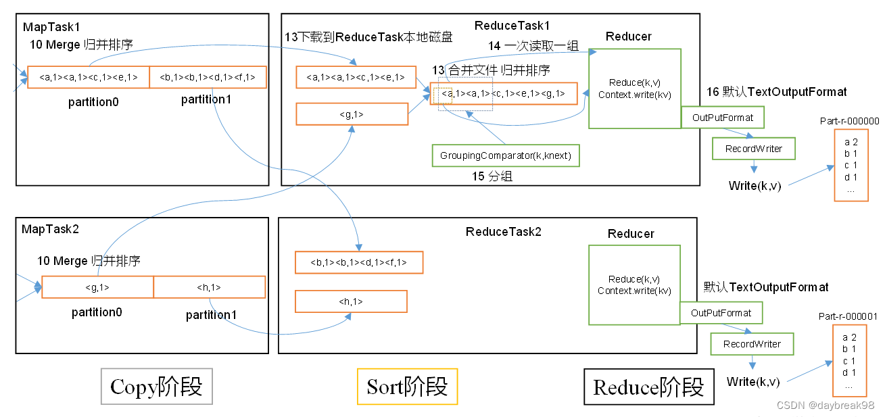
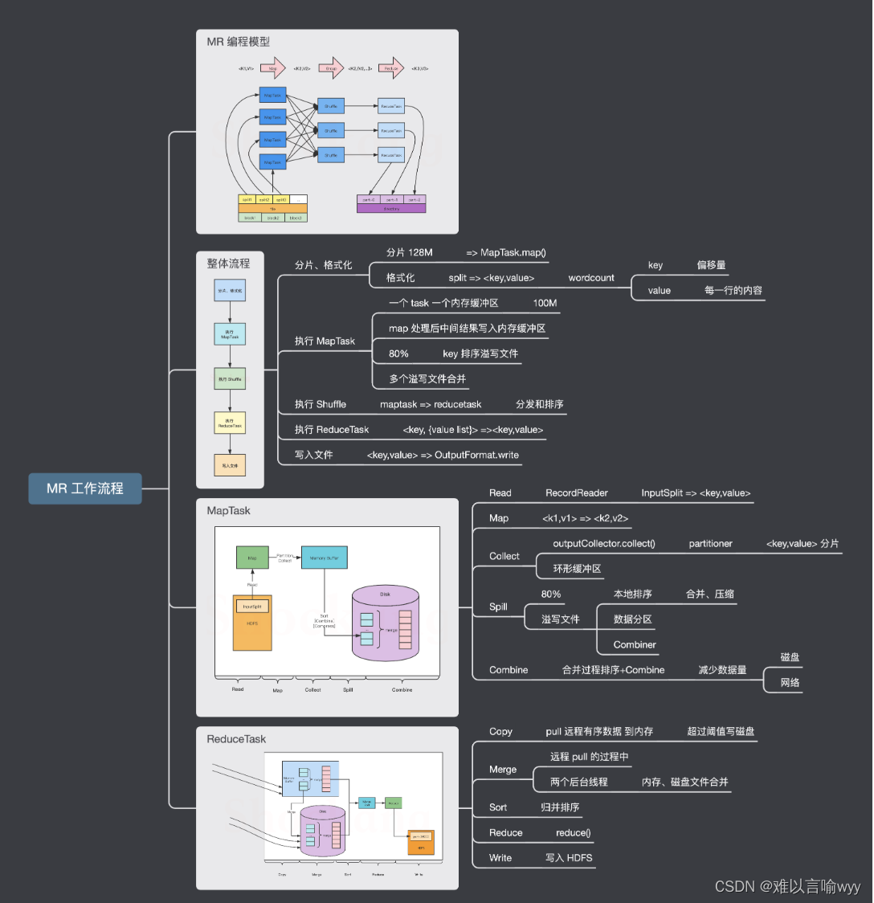

本节主要详细介绍 MapReduce 的工作原理。



上面这个流程图已经把 MapReduce 的工作过程说的很清楚了，下面我们来一个一个拆解一下。

## 输入文件
首先，MapReduce 任务的目的是处理数据，那数据从哪里来？
一般一个 MapReduce 任务的输入数据是来自于 HDFS 文件，这里的数据文件就叫做 MapReduce 任务的输入文件，
而 HDFS 上文件的格式多种多样，比如有文本文件，二进制文件等。

## InputFormat
InputFormat 是 MapReduce 框架的一个类，它对输入文件进行分割和读取，并创建数据分片 InputSplit。

## InputSplit
InputSplit 对象即数据分片对象，由 InputFormat 生成的，一个数据分片由一个 Mapper 来处理，数据分片是逻辑上的划分，
并非物理分割。每一个分片都会相应创建一个 map 任务，因此，map 任务的数量等于分片的数量，即有多少个分片就有多少个 map 任务。
分片会被划分成记录，并且每个记录都会被对应 mapper 处理。

## RecordReader
它会跟 InputSplit 交互，并把数据转换成适合 mapper 读取的键值对（key-value pair）记录。
默认情况下，它用的是 TextInputFormat 类来做转换。RecordReader 与 InputSplit 交互一直到文件读取完成。
它会给文件的每一行数据分配一个字节偏移量（byte offset）作为唯一编号。后续这些键值对将被发送给 mapper 做进一步处理。

## Mapper
它负责处理每一个来自 RecordReader 的记录，并生成新的键值对数据，这些 Mapper 新生成的键值对跟输入键值对是不一样的。
Mapper 的输出也就是我们前面说的中间结果将会被写到本地磁盘。
Mapper 的输出数据并不是存储在 HDFS 的，因为这是临时数据，如果把临时数据写到 HDFS ，将造成不必要的复制，
会导致 map 任务性能低下。Mapper 的输出数据被传输给 Combiner 做下一步处理。

## Combiner
combiner 其实是一种 reduce 操作。它会对 mapper 的输出数据做本地聚合，也就是说它是在输出数据的 mapper 所在的机器上执行的。
主要为了减少 mapper 和 reducer 之间的数据传输。combiner 执行完成之后，它的输出结果就会被传输到 partitioner 做下一步处理。

## Partitioner
如果一个 MapReduce 作业在 reduce 阶段有多个 reducer 任务参与，才会有 Partitioner 这一步，即数据分区。
如果只有一个 reducer 任务，Partitioner 是不会执行的，即不会对数据分区。

Partitioner 对来自 combiner 的输出数据分区并排序，其实就是对数据的 key 做哈希运算，具有相同 key 的记录会被分到相同的分区，
然后每个分区会被发送给 reducer。

## Shuffle 和排序
现在，Partitioner 的输出被 shuffle 到 reduce 节点（ 这里的 reduce 节点其实就是正常的 slave 节点，
由于在上面跑 reduce 任务所以才叫 reduce 节点）。shuffle 是对数据进行跨网络的物理移动，需要消耗网络带宽资源。
在所有 mapper 都完成之后，他们的输出数据才会被 shuffle 到 reduce 节点，并且这些 mapper 产生的数据会被合并和排序，
然后作为 reduce 阶段的输入数据。

## Reducer
在 reduce 阶段，它把 mapper 输出的键值对数据作为输入，然后对每个键值对数据记录应用 reducer 函数并输出结果。
reducer 的输出数据是 MapReduce 作业的最终计算结果，它会被存储到 HDFS。

## RecordWriter
它负责把来自 Reducer 输出的键值对数据写到输出文件。

## OutputFormat
RecordWriter 将 Reducer 输出的键值对写入输出文件的方式由 OutputFormat 决定。
OutputFormat 是由 Hadoop 提供的用于把数据写到 HDFS 或者本地磁盘的接口。
因此，reducer 的最终输出数据是由 Outputformat 实例负责写入到 HDFS 的。

以上就是 MapReduce 完整的工作流程了。后续的教程会对每个步骤进行详细分析。

## 以wordCount案例来阐述原理





```text
-->导入数据 
-->客户端获取待处理数据的信息，然后根据参数配置，对任务分配进行规划 
-->规划后进行切片，提交切片信息
-->计算MapTask数量
-->进行逻辑运算
-->向环形缓冲区写入数据
-->进行分区和排序
-->溢出到文件，进行分区且区内有序，merge归并排序，合并
-->所有mapTask任务完成后，启动相应数量的ReduceTask，并告知ReduceTask处理数据范围（数据分区）
-->下载到ReduceTask本地磁盘，再合并文件，归并排序
-->写出到目录中
```



### MapReduce工作原理：

#### 1、分片操作：
FileInputStream，首先要计算切片大小，FileInputStream是一个抽象类，继承InputFormat接口，
真正完成工作的是它的实现类，默认为是TextInputFormat。

TextInputFormat是读取文件的，默认为一行一行读取，将输入文件切分为逻辑上的多个input split，
input split是MapReduce对文件进行处理和运算的输入单位，只是一个逻辑概念。
在进行Map计算之前，MapReduce会根据输入文件计算的切片数开启map任务，一个输入切片对应一个mapTask。
输入分片存储的并非数据本身，而是一个分片长度和一个记录数据位置的集合，每个input split中存储着该分片的数据信息如：
文件块信息、起始位置、数据长度、所在节点列表等，并不是对文件实际分割成多个小文件，输入切片大小往往与hdfs的block关系密切，
默认一个切片对应一个block，大小为128M。

注意：尽管我们可以使用默认块大小或自定义的方式来定义分片的大小，但一个文件的大小，
如果是在切片大小的1.1倍以内，仍作为一个片存储，而不会将那多出来的0.1单独分片。

#### 2、数据格式化操作：
TextInputFormat 会创建RecordReader去读取数据，通过getCurrentkey，getCurrentvalue，nextkey，value等方法来读取，
读取结果会形成key，value形式返回给maptask，key为偏移量，value为每一行的内容，
此操作的作用为在分片中每读取一条记录就调用一次map方法，反复这一过程直到将整个分片读取完毕。

#### 3、map阶段操作：
此阶段就是程序员通过需求偏写了map函数，将数据格式化的＜K，V＞键值对通过Mapper的map（）方法逻辑处理，形成新的＜k，v＞键值对，
通过Context.write输出到OutPutCollector收集器。

map端的shuffle(数据混洗)过程：
```text
溢写（分区，排序，合并，归并）。

溢写：由map处理的结果并不会直接写入磁盘，而是会在内存中开启一个环形内存缓冲区，先将map结果写入缓冲区，这个缓冲区默认大小为100M，
并且在配置文件里为这个缓冲区设了一个阀值，默认为0.8，同时map还会为输出操作启动一个守护线程，如果缓冲区内存达到了阀值0.8，
这个线程会将内容写入到磁盘上，这个过程叫作spill（溢写）。
```

分区Partition：
```text
当数据写入内存时，决定数据由哪个Reduce处理，从而需要分区，默认分区方式采用hash函数对key进行哈布后再用Reduce任务数量进行取模，
表示为hash（key）modR，这样就可以把map输出结果均匀分配给Reduce任务处理，Partition与Reduce是一一对应关系，
类似于一个分片对应一个map task，最终形成的形式为（分区号，key，value）。
```

排序Sort：
```text
在溢出的数据写入磁盘前，会对数据按照key进行排序，默认采用快速排序，第一关键字为分区号，第二关键字为key。
```

合并combiner：
```text
程序员可选是否合并，数据合并，在Reduce计算前对相同的key数据、value值合并，减少输出量，
如（“a”，1）（“a”，1）合并之后（“a”，2）。
```

归并merge：
```text
每块溢写会成一个溢写文件，这些溢写文件最终需要被归并为一个大文件，生成key对应的value-list，
会进行归并排序<"a",1><"a"，1>归并后<"a",<1,1>>。
```

#### 4、reduce阶段操作
Reduce 端的shuffle：

数据copy：
```text
map端的shuffle结束后，所有map的输出结果都会保存在map节点的本地磁盘上，文件都经过分区，
不同的分区会被copy到不同的Reduce任务并进行并行处理，每个Reduce任务会不断通过RPC向JobTracker询问map任务是否完成，
JobTracker检测到map位务完成后，就会通过相关Reduce任务去aopy拉取数据，
Reduce收到通知就会从Map任务节点Copy自己分区的数据此过程一般是Reduce任务采用写个线程从不同map节点拉取。
```

归并数据：
```text
Map端接取的数据会被存放到 Reduce端的缓存中，如果缓存被占满，就会溢写到磁盘上，缓存数据来自不同的Map节点，会存在很多合并的键值对，
当溢写启动时，相同的keg会被归并，最终各个溢写文件会被归并为一个大类件归并时会进行排序，
磁盘中多个溢写文许归并为一个大文许可能需要多次归并，一次归并溢写文件默认为10个。
```

Reduce阶段：
```text
Reduce任务会执行Reduce函数中定义的各种映射，输出结果存在分布式文件系统中。
```