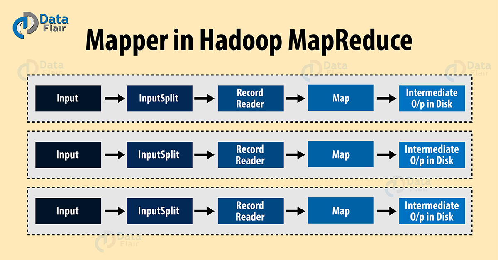
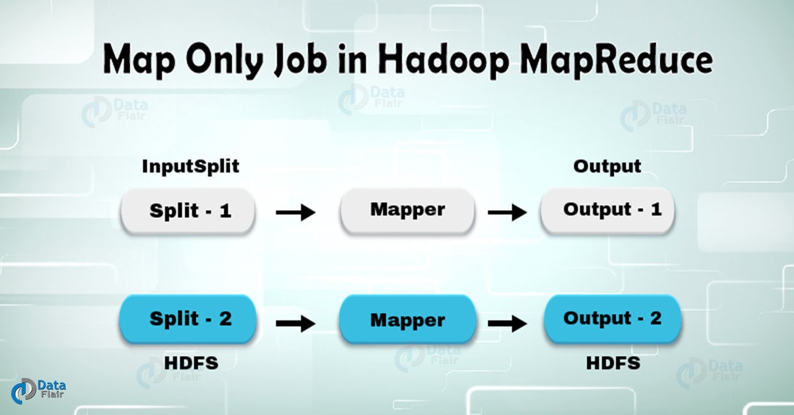

hadoop mapper 任务主要负责处理每个输入记录，并生成一个新 键值对，这个 键值对跟输入记录是完成不一样的。
mapper 任务的输出数据由这些 键值对组成的集合。在 mapper 任务把数据写到本地磁盘之前，数据会被按 key 进行分区并排序，
分区的目的是要把 key 相同的值聚集在一起。

MapReduce 框架为每个 InputSplit（数据分片）生成一个 map 任务，这里的 InputSplit 是由 InputFormat 生成的。

mapper 只会处理键值对形式的数据，所以把数据传给 mapper之前，需要把它转换成 这样的格式。



## 键值对是怎么生成的
让我们详细的来讨论一下键值对 是怎么生成的。

**InputSplit** ：它是数据的逻辑表示，即数据分片，每个 InputSplit 会被一个 map 任务处理。

**RecordReader** ：它会跟 InputSplit 交互，并把数据转换成适合 mapper 读取的键值对（key-value pair）记录。
默认情况下，它用的是 TextInputFormat 类来做转换。RecordReader 与 InputSplit 交互一直到文件读取完成。
它会给文件的每一行数据分配一个字节偏移量（byte offset）作为唯一编号。后续这些键值对将被发送给 mapper 做进一步处理。

## Hadoop Mapper 是如何工作的
下面让我们来看一下 hadoop 里面 mapper 的工作过程。

InputSplit 会为 mapper 将 HDFS 块转换成逻辑分片。
比如，要读取的文件是 200MB，那么就需要 2 个 InputSplit，因为这个有文件有 2 个block（默认块大小为 128MB），
MapReduce 会为每个块创建一个 InputSplit，然后为每个 InputSplit 创建一个 RecordReader 和一个 mapper。

InputSplit 的数量并非总是依赖于数据块的数量，我们可以通过设置下面的属性，来为文件指定分片的数量。
```text
mapred.max.split.size
```
RecordReader 主要负责读取数据，并把数据转换成 的形式。
它会为文件的每一行数据分配一个字节偏移量（唯一编号），这些键值对数据会被发送给 mapper，mapper 处理之后把数据落地到本地磁盘，
我们把 mapper 输出的数据叫做中间数据，其实就是临时数据。

## map 任务的数量
本小节我们来讨论一下在执行 MapReduce 作业的时候，对于给定的数据量，如何计算出 mapper 任务数量？
一般情况下，输入文件的数据块总量决定了 mapper 任务的数量。
对于 map 阶段，每个节点的最佳并行度在 10 到 100 个 mapper 之间，虽然对于非 CPU 密集型的 map 任务，
并行度已经被设置为 300 个 map。由于任务的启动需要消耗一些时间，所以如果 map 的执行超过一分钟的话，任务运行效率会更高。

举个例子，假如 HDFS 的块大小是 128MB，需要处理的数据的大小是 10TB，那么就需要 82000 个 map。
这个 map 的数量由 InputFormat 类决定，其计算公式如下：
```text
map 任务数量 = {( 数据总容量 ) / ( 分片大小 )}
```
如果数据是 1TB，数据分片大小是 100MB 的话，那么 map 任务数 = ( 1000 * 1000 ) / 100 = 10000。即 10000 个 map。

## MapReduce只有Map阶段的job

在 Hadoop，只有 Map 任务的作业就是 mapper 处理了所有的数据处理任务，
作业的整个过程没有 reducer 参与，而 mapper 的输出结果就是作业的最终输出结果。



现在让我们来考虑这样一个场景，如果我们只需要执行分发的操作，而不需要聚合的操作，
那么这种情况下，我们就会更倾向于使用只有 map 阶段的作业。 
在仅发生 Map 阶段的 Hadoop 作业中，map 阶段利用 InputSplit 就完成了所有的任务，并不需要 reducer 的参与。
这里 map 的输出数据就是作业的最终输出结果了。

### 如何避免 Reduce 阶段的产生
为了避免触发 Reduce 任务，你可以在驱动程序（driver program）通过调用下面的方法来把 reduce 任务数设置为 0。
```text
job.setNumreduceTasks(0)
```
设置完之后，Hadoop 作业在执行的时候就只有 map 阶段，而不会发生 reduce 了。

### 优点
在 map 和 reduce 两个阶段之间，包含排序和 shuffle 阶段。
排序和 shuffle 负责对 key 升序排序和基于相同 key 对 value 进行分组。
这个阶段的开销是非常大的。如果 reduce 阶段不是必要的，那么我们可以通过把 reduce 任务数设置为 0 来避免 reduce 阶段的发生，
而且排序和 shuffle 阶段也不会发生。同时还可以避免数据传输的网络开销。

在一般的 MapReduce 作业中，mapper 的输出在被发送给 reducer 之前会先把输出数据写到本地磁盘，
但在只有 map 的作业里，map 的输出会被直接写到 HDFS，这将节省了作业运行时间和 reduce 的开销。
另外 partitioner 和 combiner 这两步在只有 map 的作业里是不需要的，所以这也会让作业运行的更快。