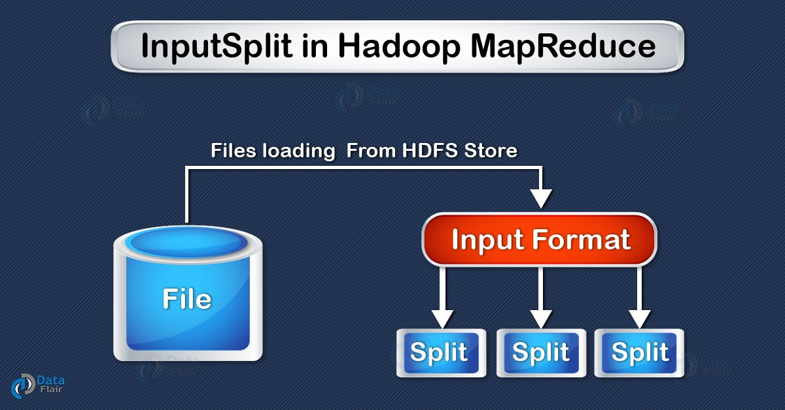
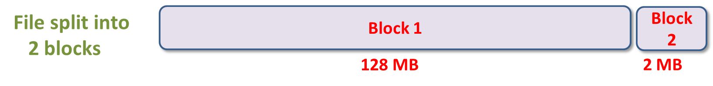
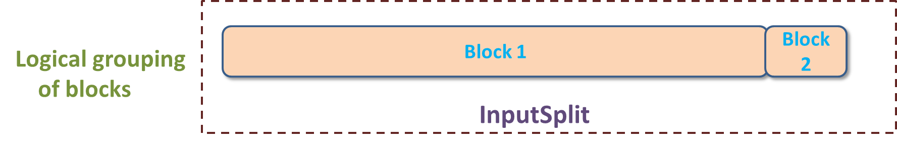

## Hadoop InputSplit
InputSplit 是数据的一种逻辑表示，即我们所说的文件的数据分片。
每个分片由一个mapper处理，当然，mapper并非直接对数据分片进行处理，在mapper处理数据分片之前，数据分片会被转换成记录，即键值对。
mapper直接操作键值对。

MapReduce InputSplit 的长度是以字节来度量的，每个 InputSplit 都有相应的存储位置（主机名称）。
MapReduce 利用分片存储位置，把 map 任务调度到距离数据尽可能近的地方执行。
Map 任务的执行优先级取决于分片的大小，分片大的最先执行，主要为了最小化作业的运行时间。
需要注意的是，InputSplit，即数据分片并不真正存储输入数据，它只是数据的一种引用，即一种数据的逻辑表示。

我们并不需要直接处理 InputSplit，因为他们是由 InputFormat 创建的（ InputFormat 创建 InputSplit 并把它转换成键值对）。
默认情况下，FileInputFormat 把文件分割成若干个块，每个块大小 128MB（和 HDFS 的块大小一样），
这个默认值可以在配置文件 mapred-site.xml 修改，参数为 mapred.min.split.size。也可以在提交作业的时候修改该值。
另外，可以定制化开发 InputFormat，来决定分割文件的方式。

## Hadoop 如何修改数据分片大小
我们可以在 MapReduce 程序根据数据的大小来调整分片大小。
修改 mapred.min.split.size 这个参数即可。

客户端（运行 Job 的节点）调用 getSplit() 方法为一个作业计算分片大小，然后发送到 application master，
它根据数据分片的存储位置对处理该数据分片的 map 任务进行调度。
接下来 map 任务把分片传递给 InputFormat 的 createRecordReader() 方法以便获取分片的 RecordReader 对象，
而 RecordReader 对象将生成记录，也就是键值对，然后传递给 map 函数。

## MapReduce InputSplit 与 HDFS 块
InputSplit 即数据分片，HDFS 块（block）即分布式存储系统的数据块概念。下面详细介绍这两个概念的区别和联系。

### HDFS 块与 InputSplit

#### HDFS 块
块是硬盘上存储数据的一个连续位置。通常，文件系统将数据存储成块的集合。同样的方式，HDFS 以块的方式存储文件。
Hadoop 应用程序负责在多个节点分配数据块。

#### InputSplit
InputSplit即我们所说的**数据分片**，一个单独的mapper处理的数据由InputSplit提供，
即一个数据分片对应被一个 mapper 处理，数据分片会转换成记录，每个记录（即键值对）会被 map 处理。
map 任务的个数等于数据分片的数量。

一开始 MapReduce 任务处理的数据是存储在输入文件的，而输入文件一般在 HDFS 。
输入文件如何被读取和切分由 InputFormat 类来决定，另外它还负责创建 InputSplit。

### InputSplit 和 块的比较
让我们来讨论 MapReduce InputSplit 和块之间的特性比较。

#### InputSplit 与块的大小比较
块：HDFS 块的默认大小是 128MB，我们可以按实际需求对该值进行配置。
除了最后一个数据块，文件的其他所有块大小都是一样的，最后一个数据块大小一般小于等于 128MB。
文件被切分成若干个大小为 128MB 的数据块，并存储到 Hadoop 文件系统。

InputSplit：默认情况下，InputSplit 的大小近似等于块大小。
InputSplit 是由用户自己定义的，并且基于数据的容量可以在 MapReduce 程序调整 InputSplit 的值。

#### InputSplit 和 块的数据表示
块：块是数据的物理表示，它包含可读或者可写的最小数据量。

InputSplit：它是块中数据的逻辑表示。它是在 MapReduce 程序处理数据的时候被使用的。
InputSplit 本身并不存储物理数据，它只是数据的一种引用。

### InputSplit 和 块示例

假如我们需要把文件存储到 HDFS。HDFS 以块的形式存储文件，块是数据读取和存储的最小单位，并且块的默认大小是 128MB 。
HDFS 把文件切分成块，并把块存储在集群的不同机器节点上，假如我们有一个 130MB 的文件，那么 HDFS 会把这个文件切割成 2 个块，
如上第一个图所示。

现在，如果我们想对这些块执行 MapReduce 程序，那么它是不会被处理的，因为第二个块并不是完整的块。
但是这个问题 InputSplit 可以解决。InputSplit 可以把一组block作为一个单独的块，
因为InputSplit里面包含**下一个块的位置**以及**完整的块所需的数据的字节偏移量**。