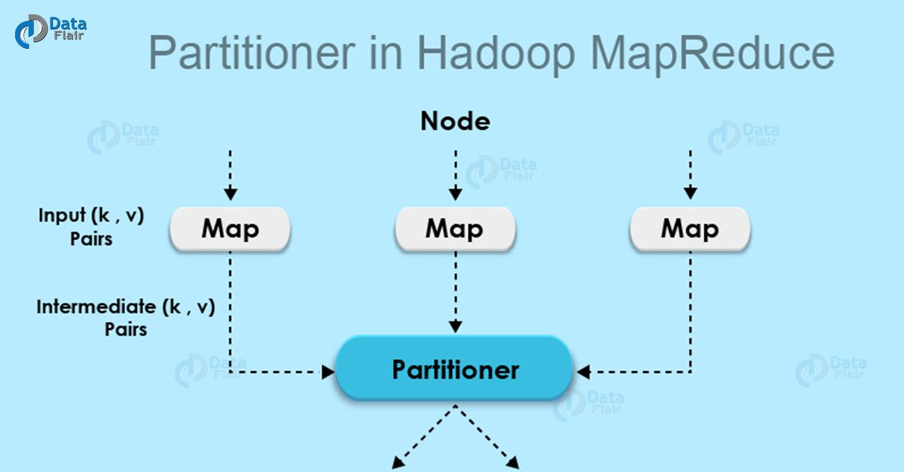

MapReduce Partitioner是用来对mapper输出的数据进行分区的。
partitioner通过哈希函数对Key或者Key的子集求哈希值，哈希值相同的键值对将在同一个分区里面。
**分区的数量取决于reduce任务的数量**。下面对 MapReduce Partitioner 详细介绍。



## MapReduce Partitioner
在开始学习 MapReduce Partitioner 之前，你需要先理解一下 mapper、reducer 以及 combiner 的概念。

**map输出的键值对的分区逻辑**由Partitioner决定的。
通过哈希函数，对key进行哈希并生成哈希值。每个mapper的输出都会被分区，key相同记录将被分在同一个分区里。
每个分区会被发送给一个reducer。
(key, value) 键值对将会被分到哪一个分区是由Partition类决定的。
分区阶段发生在map阶段之后reduce阶段之前。MapReduce为什么要设计分区这个阶段呢？下面会给出答案。

## Hadoop MapReduce Partitioner 的必要性
现在让我们来讨论一下 Hadoop MapReduce Partitioner 的必要性。

MapReduce作业接收一个输入数据集并生成键值对列表，这里的键值对列表是map阶段的输出结果数据，
在这个阶段里面，输入数据会被切分成分片，每个map任务处理一个数据分片，并生成键值对列表。
接着，map的输出数据被发送到reduce任务，它会执行用户自定义的reduce函数，该函数会对map的输出数据进行计算。
但在reduce阶段之前，map的输出数据会被基于Key分区并排序。

分区的目的是把具有相同key的值集合在一起，确保key相同的值都会在同一个reducer里面。
这样才能保证map的输出数据被均匀的分发到reducer。

## 默认的 MapReduce Partitioner
Hadoop MapReduce默认的 Hadoop Partitioner是**哈希 Partitioner**（Hash Partitioner），
它会对 key 计算哈希值，并基于该哈希值对键值对数据进行分区。

## 一个 MapReduce job 会有多少个 Partitioner
**Partitioner 的数量等于 reducer 的数量**，Partitioner 会根据 reducer 的数量来划分数据，
reducer 数量可以通过下面的方法进行设置：
```text
JobConf.setNumReduceTasks()
```
因此，来自同一个分区的数据会被一个 reducer 任务处理。
需要注意的是，只有作业具有多个reducer 任务时，分区才会被创建。
也就是说，如果作业只有 1 个 reducer 任务，分区阶段是不会发生的。

## 低效的分区
如果在输入数据集里面，有一个 key 的数量比其他 key 的数量要大得多，这种情况，有两种机制可以对数据进行分区。
* 数量比其他 key 大得多的数据分到一个分区
* 其他 key 根据他们的 hashCode() 的值进行分区

但如果 hashCode() 方法不能均匀的把其他 key 的数据分发到分区，那么数据将会被均匀的发送到 reducer 任务。
低效的分区意味着，某些 reducer 将比其他 reducer 任务处理更多的数据。
那么，整个作业的运行时间将取决于这些需要处理更多数据的 reducer，也就是说，作业的运行时间会更长。

## 如何克服低效分区
为了克服低效分区的问题，我们可以自定义分区器（partitioner），这样我们就可以根据具体业务修改分区逻辑，
把数据均分的分发到不同的 reducer 任务里。