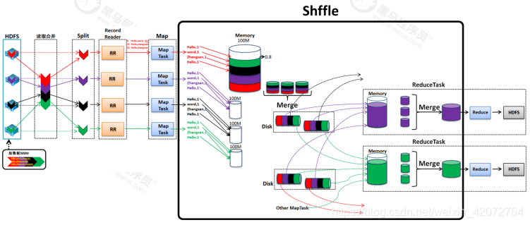

**mapper 的输出结果被传输到 reducer 的过程被称为 shuffle**，并且在传输到 reducer 之前，数据会被按 key 排序。
下面会详细介绍这两个过程。


## Hadoop MapReduce Shuffle和排序
在学习 shuffle 和排序之前，可以先复习一下 MapReduce 的其他阶段，
比如 Mapper，Reducer，Combiner，partitioner 以及 InputFormat。

MapReduce 框架的**Shuffle阶段**指的是**把 map的输出结果从Mapper传输到Reducer的过程**。
MapReduce 的**排序阶段**包括对**map输出的合并和排序**两个步骤。**mapper的输出数据会被按key分组和排序**。
每一个reducer获取所有具有相同key的值。**MapReduce框架的shuffle和排序阶段是同时发生的**。

### Shuffle
我们都知道，数据从 mapper 传输到 reducer 的过程被称为 shuffle。
所以，MapReduce Shuffle 阶段对于 reducer 来说是有必要的，否则，reducer 就没任务输入数据。
由于 shuffle 可以在 map 阶段完成之前就启动，所以这会节省一些运行时间，以更少的时间完成任务。

### 排序
由 mapper 生成的 key 会被 MapReduce 框架自动排序，
比如，在 reducer 启动之前，所有由 mapper 生成的中间结果键值对会按 key 进行排序而不是按 value 排序。
传输给 reducer 的 value 并没有排序，它们的顺序是任意的。

Hadoop 中的排序帮助 reducer 轻松区分何时应该启动新的 reduce 任务。这会为 reducer 节省一些时间。
在已排序的输入数据中，当下一个 key 和 前一个 key 不一样的时候，reducer 就会启动一个新的 reduce 任务。
每个 reduce 任务以键值对作为输入并输出键值对数据。

需要注意的是，如果你通过下面的代码把 reducer 任务的个数设置为0，那么作业就不会有 shuffle 和排序阶段了。
```text
setNumReduceTasks(0)
```

这时，MapReduce 作业在 map 阶段完成后就结束的，而且，map 阶段不包括任何类型的排序操作，所以这样的 map 阶段执行速度会更快。

## MapReduce 二次排序
如果你想对 reducer 的键值对的 value 进行排序，那么，就需要用到二次排序技术了，
二次排序技术可以让我们对传输到每个 reducer 的键值对的 value 以降序或者升序排序。

---

# MapReduce的Shuffle过程

## Shuffle(混洗)
Shuffle 输入是key value的 list（keys,values，每个key对应一个value）
Shuffle 输出是key value的 list(key,values，每个key对应一个values)

Shuffle分为以下几个步骤：

### 1、获取数据
Shuffle发生在map计算完成之后，这时候map输出的键值对列表（key,value 的list）就会交给Shuffle处理.
接收到的数据类似上面这幅图片一样，键值对列表。


### 2、分区
拿到数据之后，shuffle会把长得差不多的数据放到一起（有规律地把数据分成不同部分），便于接下来的数据处理。
这个过程叫做分区，分区的目的是为了把相同key的数据放到一起，方便后续的处理。


### 3、排序
分区完成之后，shuffle会对每个分区内的数据进行排序，这样相同key的数据就会放到一起了。


### 4、combine规约（可选）
Combiner只适用于部分场景，所以默认是没有这个过程的，相当于Map阶段的reduce操作。
但是这个过程是可以手动设置开启的，所以也要了解一下，
使用这个过程可以起到预处理优化作用，减少map阶段到reduce阶段数据传输。


### 5、分组
经过Combiner的预处理之后，就到了分组这个步骤了，这个步骤是为了把相同key的数据放到一起，方便后续的处理。


这里hello,<3,2,2,2>并不是表面看上去这样理解，而是指hello的value的list，有3+2+2+2个项。
也就是说，其实hello对应的value的list长度为9，这里是方便理解才这么表示。

前面说了，Combiner是可选项，那么没有Combiner会是怎样的情况？Combiner起到了优化的作用。

先看一下，如果没有Combiner，过程大体上是这样的


可以看到，Sort排序之后，直接分组了，这样分组这一个步骤所要合并同类项的步骤就很多，再看有了Combiner之后，如下：


所以，Combiner就是提前把分组要做的事情，做一下，这样分组要做的事就少了。
但是Combiner只能适用于部分场景，而且默认是关闭的。

## 总结
Shuffle大体上可分为5个步骤：
- 接收数据 (键值对列表)
- 分区
- 排序
- Combiner规约（可选）
- 分组(key,values)（每个key对应一个value的list）

Combiner只能适用于部分场景，而且默认关闭的。

Shuffle完毕之后的数据就交给Reduce处理了。

---

# MapReduce Shuffle过程（第二版）
map阶段处理的数据 如何传递 给reduce阶段，是MapReduce框架中最关键的一个流程，这个流程就叫shuffle。

shuffle: 洗牌、发牌——（核心机制：数据分区，排序，combine，分组，合并等过程）。


shuffle是MapReduce的核心，它分布在Mapreduce的map阶段和reduce阶段。

一般把从Map产生输出开始 到 Reduce取得数据作为输入之前 的过程称作 shuffle。

## 维度一：流程维度回顾

从Map输出到Reduce输入。


## 维度二：内存维度回顾

从Map输出到Reduce输入。




### Map阶段的shuffle过程
#### 1）Collect阶段：
将MapTask的结果输出到默认大小为100M的【环形缓冲区】，保存的是key/value，Partition分区信息等。
在这个阶段，MapTask会对数据进行分区操作。

#### 2）Spill阶段：
当内存中的数据量达到一定的阀值【环形缓冲区的80%】的时候，就会将数据写入本地磁盘到临时文件。

**溢写阶段详情：**

- （1）利用快速排序算法对缓存区内的数据进行排序，排序方式是，先按照分区编号partition进行排序，然后按照key进行排序。
  这样，经过排序后，数据以分区为单位聚集在一起，且同一分区内所有数据按照key有序。

- （2）按照分区编号由小到大，依次将每个分区中的数据写入任务工作目录下的临时文件中。
  (临时文件：output/spillN.out，N表示当前溢写次数)

  如果用户设置了Combiner，则写入文件之前，
  对每个分区中的数据(按照相同分区号和相同key)进行一次聚集（规约）操作（Map阶段的reduce操作）。

#### 3）Merge阶段：
把所有溢出的临时文件进行一次合并操作（归并排序），以确保一个MapTask最终只产生一个中间数据文件。

### Reduce阶段的shuffle过程

#### 4）Copy阶段：
ReduceTask启动【Fetcher线程】到已经完成MapTask的节点上复制一份属于自己的数据，数据默认会保存在内存的缓冲区。

#### 5）Spill阶段：
当内存的缓冲区达到一定的阀值【环形缓冲区的80%】的时候，就会将数据写到磁盘之上。

#### 6）Merge阶段：
在ReduceTask远程复制数据的同时，会在后台开启两个线程对内存到本地的数据文件进行合并操作。

#### 7）Sort阶段：
在对数据进行合并的同时，会进行排序（归并排序）操作。
由于MapTask阶段已经对数据进行了局部的排序，ReduceTask只需保证Copy的数据的最终整体有效性即可。

#### 8）Group阶段：
在对数据进行合并和排序（归并排序）之后，会进行分组操作。

Shuffle中的缓冲区大小会影响到MapReduce程序的执行效率，原则上说，缓冲区越大，磁盘io的次数越少，执行速度就越快。

缓冲区的大小可以通过参数调整，参数：mapreduce.task.io.sort.mb 默认100M。

---


