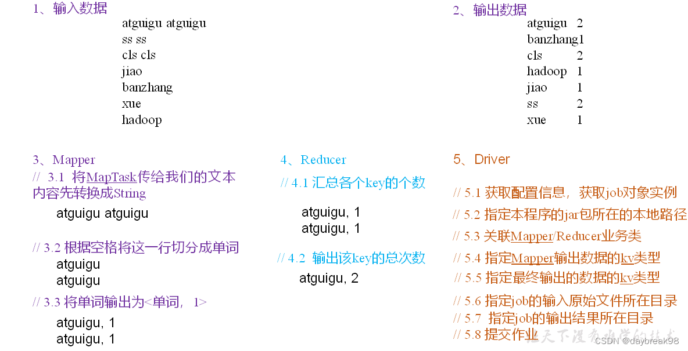

## 1、计算流程



## 2、环境准备
创建maven工程，添加如下依赖
```xml
<dependencies>
    <dependency>
        <groupId>org.apache.hadoop</groupId>
        <artifactId>hadoop-client</artifactId>
        <version>3.1.3</version>
    </dependency>
    <dependency>
        <groupId>junit</groupId>
        <artifactId>junit</artifactId>
        <version>4.12</version>
    </dependency>
    <dependency>
        <groupId>org.slf4j</groupId>
        <artifactId>slf4j-log4j12</artifactId>
        <version>1.7.30</version>
    </dependency>
</dependencies>
```
配置log4j.properties
```text
log4j.rootLogger=INFO, stdout  
log4j.appender.stdout=org.apache.log4j.ConsoleAppender  
log4j.appender.stdout.layout=org.apache.log4j.PatternLayout  
log4j.appender.stdout.layout.ConversionPattern=%d %p [%c] - %m%n  
log4j.appender.logfile=org.apache.log4j.FileAppender  
log4j.appender.logfile.File=target/spring.log  
log4j.appender.logfile.layout=org.apache.log4j.PatternLayout  
log4j.appender.logfile.layout.ConversionPattern=%d %p [%c] - %m%n
```
## 3、编写程序
mapreduce程序主要通过继承Mapper和Reducer类并重写对应方法构成，其中Mapper和Reducer端分别负责数据读取，加工和输出，
Driver端负责程序配置，如联系M端R端以及运行环境，输出类型和数据输入输出位置等。

### （1）Mapper类
```java
package com.atguigu.mapreduce.wordcount;
import java.io.IOException;
import org.apache.hadoop.io.IntWritable;
import org.apache.hadoop.io.LongWritable;
import org.apache.hadoop.io.Text;
import org.apache.hadoop.mapreduce.Mapper;

public class WordCountMapper extends Mapper<LongWritable, Text, Text, IntWritable>{

	Text k = new Text();
	IntWritable v = new IntWritable(1);
	
	@Override
	protected void map(LongWritable key, Text value, Context context) {
		// 1 获取一行
		String line = value.toString();
		// 2 切割
		String[] words = line.split(" ");
		// 3 输出
		for (String word : words) {
			k.set(word);
			context.write(k, v);
		}
	}
}
```
context实现了与Hadoop框架的交互，该类可用于读写数据，记录日志等操作。在这段代码中，传入Context对象可以将数据写入Hadoop集群中的分布式文件系统中，或者读取其他节点上的数据进行处理。

### （2）Reducer类
```java
package com.atguigu.mapreduce.wordcount;
import java.io.IOException;
import org.apache.hadoop.io.IntWritable;
import org.apache.hadoop.io.Text;
import org.apache.hadoop.mapreduce.Reducer;

public class WordCountReducer extends Reducer<Text, IntWritable, Text, IntWritable> {
    int sum;
    IntWritable v = new IntWritable();

	@Override
	protected void reduce(Text key, Iterable<IntWritable> values,Context context) {
		// 1 累加求和
		sum = 0;
		for (IntWritable count : values) {
			sum += count.get();
		}
		// 2 输出
        v.set(sum);
		context.write(key,v);
	}
}
```
### （3）Driver
* 1 获取配置信息和获取job对象
* 2 关联本Driver程序，Mapper和Reducer的jar
* 3 设置Mapper阶段和最终输出的kv类型
* 4 设置输入和输出路径并提交job

```java
package com.atguigu.mapreduce.wordcount;
import java.io.IOException;
import org.apache.hadoop.conf.Configuration;
import org.apache.hadoop.fs.Path;
import org.apache.hadoop.io.IntWritable;
import org.apache.hadoop.io.Text;
import org.apache.hadoop.mapreduce.Job;
import org.apache.hadoop.mapreduce.lib.input.FileInputFormat;
import org.apache.hadoop.mapreduce.lib.output.FileOutputFormat;

public class WordCountDriver {

	public static void main(String[] args) {
 
		// 1 获取配置信息以及获取job对象
		Configuration conf = new Configuration();
		Job job = Job.getInstance(conf);
 
		// 2 关联本Driver程序，Mapper和Reducer的jar
		job.setJarByClass(WordCountDriver.class);
		job.setMapperClass(WordCountMapper.class);
		job.setReducerClass(WordCountReducer.class);
 
		// 3 设置Mapper阶段和最终输出kv类型
		job.setMapOutputKeyClass(Text.class);
		job.setMapOutputValueClass(IntWritable.class);
		job.setOutputKeyClass(Text.class);
		job.setOutputValueClass(IntWritable.class);
		
		// 4 设置输入和输出路径并提交job(本地测试时输入和输出路径为磁盘中绝对路径)
		FileInputFormat.setInputPaths(job, new Path(args[0]));
		FileOutputFormat.setOutputPath(job, new Path(args[1]));
		boolean result = job.waitForCompletion(true);
		System.exit(result ? 0 : 1);
	}
}
```

## 4、测试

### 本地测试
配置HADOOP_HOME环境变量和Windows运行依赖。

### 集群测试
配置打包插件依赖
```xml
<build>
    <plugins>
        <plugin>
            <artifactId>maven-compiler-plugin</artifactId>
            <version>3.6.1</version>
            <configuration>
                <source>1.8</source>
                <target>1.8</target>
            </configuration>
        </plugin>
        <plugin>
            <artifactId>maven-assembly-plugin</artifactId>
            <configuration>
                <descriptorRefs>
                    <descriptorRef>jar-with-dependencies</descriptorRef>
                </descriptorRefs>
            </configuration>
            <executions>
                <execution>
                    <id>make-assembly</id>
                    <phase>package</phase>
                    <goals>
                        <goal>single</goal>
                    </goals>
                </execution>
            </executions>
        </plugin>
    </plugins>
</build>
```

上传到Hadoop集群的hadoop根路径，启动集群：
```text
[atguigu@hadoop102 hadoop-3.1.3]sbin/start-dfs.sh

[atguigu@hadoop102 hadoop-3.1.3]sbin/start-yarn.sh
```

执行程序：
```text
hadoop jar wc.jar com.atguigu.mapreduce.wordcount.WordCountDriver /user/atguigu/input /user/atguigu/output
```
