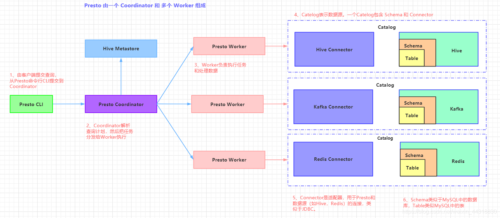
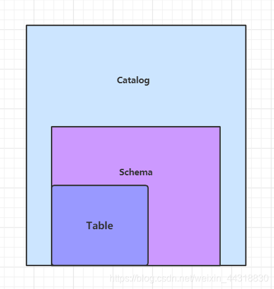
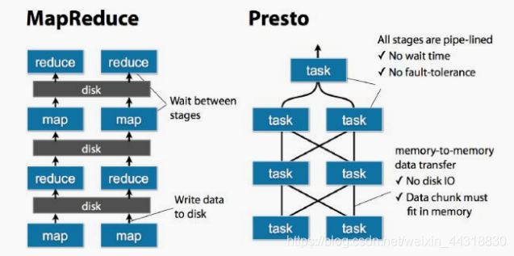
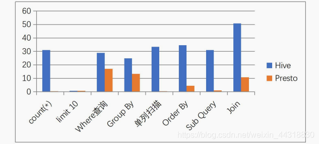
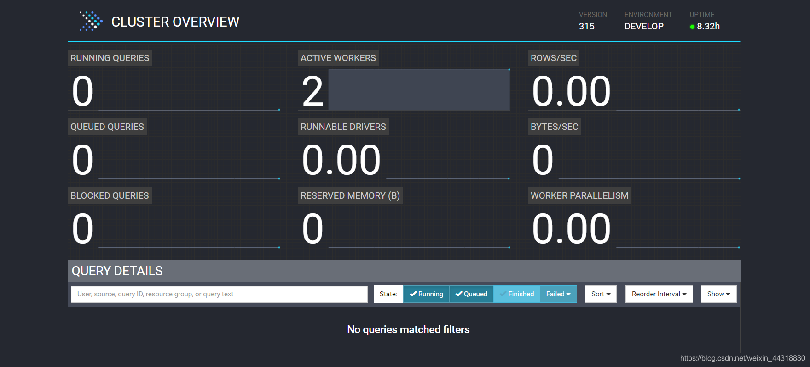
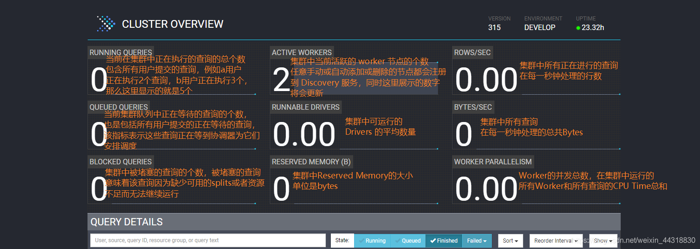
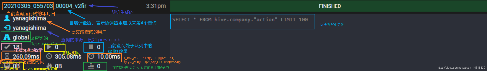
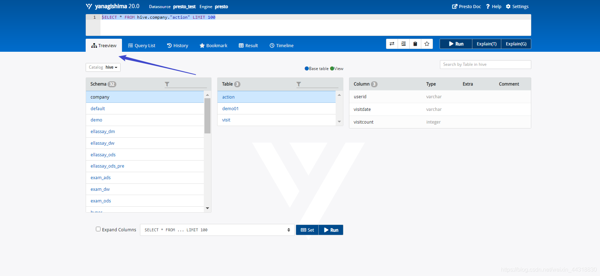
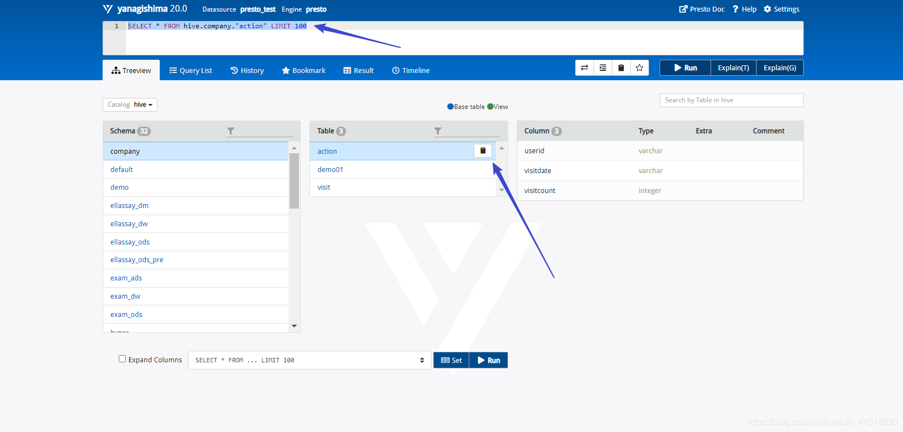
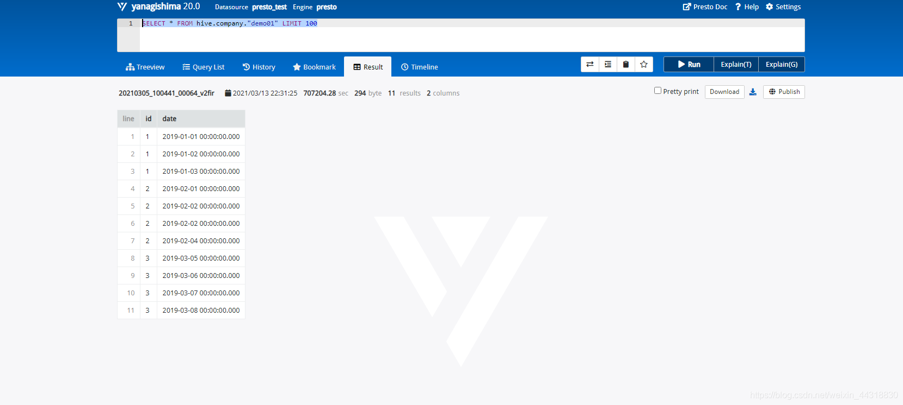

# 前言
Presto 作为现在在企业中流行使用的即席查询框架，已经在不同的领域得到了越来越多的应用。
本期内容，我会从一个初学者的角度，带着大家从 0 到 1 学习 Presto，希望大家能够有所收获！

# 1. Presto简介
## 1.1 Presto概念
Presto是 Facebook 推出的一个开源的**分布式SQL查询引擎**，数据规模可以支持GB到PB级，主要应用于处理秒级查询的场景。
Presto 的设计和编写完全是**为了解决像 Facebook 这样规模的商业数据仓库的交互式分析和处理速度的问题**。

注意： 虽然 Presto 可以解析 SQL，但它不是一个标准的数据库。不是 MySQL、Oracle 的代替品，也不能用来处理在线事务（OLTP）。

## 1.2 Presto 应用场景
Presto 支持在线数据查询，包括 Hive，关系数据库（MySQL、Oracle）以及专有数据存储。
一条 Presto 查询可以将多个数据源的数据进行合并，可以跨越整个组织进行分析。

```text
Presto 主要用来处理 响应时间小于 1 秒到几分钟的场景 。
```

## 1.3 Presto架构
Presto 是一个运行在多台服务器上的分布式系统。完整安装包括一个 Coordinator 和多 个 Worker。
由客户端提交查询，从 Presto 命令行 CLI 提交到 Coordinator。Coordinator 进行 解析，分析并执行查询计划，然后分发处理队列到 Worker 。



Presto 有两类服务器：Coordinator 和 Worker

- **1）Coordinator**

  Coordinator 服务器是用来**解析语句**，**执行计划分析**和 **管理 Presto 的 Worker 节点**。
  Presto 安装必须有一个 Coordinator 和多个 Worker。
  如果用于开发环境和测试，则一个 Presto 实例 可以同时担任这两个角色。

  Coordinator 跟踪每个 Work 的活动情况并协调查询语句的执行。
  Coordinator 为每个查询建立模型，模型包含多个Stage，每个Stage再转为Task 分发到不同的 Worker 上执行。

  Coordinator 与 Worker、Client 通信是通过 REST API。

- **2）Worker**

  Worker 是负责执行任务和处理数据。
  Worker 从 Connector 获取数据。Worker 之间会交换中间数据。
  Coordinator 是负责从 Worker 获取结果并返回最终结果给 Client。

  当 Worker 启动时，会广播自己去发现 Coordinator，并告知 Coordinator 它是可用，随时可以接受 Task。

  Worker 与 Coordinator、Worker 通信是通过 REST API。

- **3）数据源**

  贯穿下文，你会看到一些术语：Connector、Catelog、Schema 和 Table。这些是 Presto 特定的数据源

  - **Connector**
    
    Connector 是适配器，用于 Presto 和数据源（如 Hive、RDBMS）的连接。
    你可以认为 类似 JDBC 那样，但却是 Presto 的 SPI 的实现，使用标准的 API 来与不同的数据源交互。

    Presto 有几个内建 Connector：
      JMX 的 Connector、System Connector（用于访问内建的 System table）、Hive 的 Connector、TPCH（用于 TPC-H 基准数据）。
    还有很多第三方的 Connector，所以 Presto 可以访问不同数据源的数据。

    每个 Catalog 都有一个特定的 Connector。
    如果你使用 catalog 配置文件，你会发现每个 文件都必须包含 connector.name 属性，用于指定 catalog 管理器（创建特定的 Connector 使用）。
    一个或多个 catalog 用同样的 connector 是访问同样的数据库。
    例如，你有两个 Hive 集群。 你可以在一个 Presto 集群上配置两个 catalog，两个 catalog 都是用 Hive Connector，
    从而达 到可以查询两个 Hive 集群。

  - **Catalog**
    
    **一个 Catalog 包含 Schema 和 Connector** 。例如，你配置JMX 的 catalog，通过JXM Connector 访问 JXM 信息。
    当你执行一条 SQL 语句时，可以同时运行在多个 catalog。

    Presto 处理 table 时，是通过表的完全限定（fully-qualified）名来找到 catalog。
    例如， 一个表的权限定名是 hive.test_data.test，则 test 是表名，test_data 是 schema，hive 是 catalog。

    Catalog 的定义文件是在 Presto 的配置目录中。

  - **Schema**
    
    **Schema 是用于组织 table**。把 catalog 和 schema 结合在一起来包含一组的表。
    当通过Presto 访问 hive 或 Mysq 时，一个 schema 会同时转为 hive 和 mysql 的同等概念。

  - **Table**
    
    Table 跟关系型的表定义一样，但数据和表的映射是交给 Connector。

## 1.4 Presto 数据模型
1）Presto 采取三层表结构：
```text
Catalog：对应某一类数据源，例如 Hive 的数据，或 MySql 的数据

Schema：对应 MySql 中的数据库

Table：对应 MySql 中的表
```



2）Presto 的存储单元包括：
```text
Page：多行数据的集合，包含多个列的数据，内部仅提供逻辑行，实际以列式存储。

Block：一列数据，根据不同类型的数据，通常采取不同的编码方式，了解这些编码方式，有助于自己的存储系统对接 presto。
```


3）不同类型的 Block：
```text
（1）Array 类型 Block，应用于固定宽度的类型，例如 int，long，double。block 由两部分组成：
    boolean valueIsNull[] 表示每一行是否有值。
    T values[] 每一行的具体值。

（2）可变宽度的 Block，应用于 String 类数据，由三部分信息组成：
    Slice：所有行的数据拼接起来的字符串。
    int offsets[]：每一行数据的起始偏移位置。每一行的长度等于下一行的起始偏移减去当 前行的起始偏移。
    boolean valueIsNull[]: 表示某一行是否有值。如果有某一行无值，那么这一行的偏移量 等于上一行的偏移量。

（3）固定宽度的 String 类型的 block，所有行的数据拼接成一长串 Slice，每一行的长度固定。

（4）字典 block：对于某些列，distinct 值较少，适合使用字典保存。主要有两部分组成：
    字典，可以是任意一种类型的 block(甚至可以嵌套一个字典 block)，block 中的每一行按照顺序排序编号。
    int ids[]表示每一行数据对应的 value 在字典中的编号。在查找时，首先找到某一行的 id， 然后到字典中获取真实的值。
```

## 1.5 Presto 优缺点
学习一个新的框架，免不了来探讨一下它的优缺点：

通过下面一张图，我们来看看 Presto 中 SQL 运行过程：MapReduce vs Presto



我们可以很明显地感受到，Presto 使用内存计算，减少与硬盘交互

### 1.5.1 优点
1）Presto 与 Hive 对比，都能够处理 PB 级别的海量数据分析，但 Presto 是基于内存运算，减少没必要的硬盘 IO，所以更快。

2）能够连接多个数据源，跨数据源连表查，如从 Hive 查询大量网站访问记录，然后从 Mysql 中匹配出设备信息。

3）部署也比 Hive 简单，因为 Hive 是基于 HDFS 的，需要先部署 HDFS。

找了张对比图，大家感受下：



### 1.5.2 缺点
1）虽然能够处理 PB 级别的海量数据分析，但不是代表 Presto 把 PB 级别都放在内存中计算的。
而是根据场景，如 count，avg 等聚合运算，是边读数据边计算，再清内存，再读数据再计算，这种耗的内存并不高。
但是连表查，就可能产生大量的临时数据，因此速度会变慢，反而 Hive此时会更擅长。

2）为了达到实时查询，可能会想到用它直连 MySql 来操作查询，这效率并不会提升，瓶颈依然在 MySql，此时还引入网络瓶颈，所以会比原本直接操作数据库要慢。

## 1.6 Presto、Impala性能比较
Presto 和 Impala这两种典型的内存数据库之间具体的性能测试比较就不详细展开叙述，
感兴趣可以去看这篇链接：https://blog.csdn.net/u012551524/article/details/79124532

我就说下总结的结论：
```text
他们的共同点就是吃内存，当然在内存充足的情况下，并且有规模适当的集群，性能应该会更可观。
并且从几次性能的比较查询来看，Impala性能稍领先于presto，但是presto在数据源支持上非常丰富，包括hive、图数据库、传统关系型数据库、Redis等。
```

大家也可以根据上面的链接，自己也尝试去做下对比测试。

## 1.7 官网地址
就在 2020 年 12 月 27 日，prestosql 与 facebook 正式分裂,并改名为trino。
分裂之前和之后的官网分别是：https://prestosql.io/ 和 https://trino.io。


## 1.8 Prestodb VS Prestosql(trino)
根据目前社区活跃度和使用广泛度,更加推荐 prestosql。
具体的区别详见：http://armsword.com/2020/05/02/the-difference-between-prestodb-and-prestosql/

# 2. Presto安装部署
## 2.1 prestosql 版本的选择
在 presto330 版本里已经提到，jdk8 只支持到 2020-03 月发行的版本.详情参考:https://prestosql.io/docs/current/release/release-330.html。

在 2020 年 4 月 8 号 presto 社区发布的 332 版本开始，
需要 jdk11 的版本.由于现在基本都使 用的是 jdk8，所以我们选择 presto315 版本的，
此版本在 jdk8 的环境下是可用的。如果我们生产环境是 jdk8，但是又想使用新版的 presto，可以为 presto 单独指定 jdk11 也可使用。

## 2.2 集群安装规划
```text
host	coordinator	worker
node01	√	×
node02	×	√
node03	×	√
```
## 2.3 Presto Server 的安装
1、安装包下载地址：
```text
https://repo1.maven.org/maven2/io/prestosql/presto-server/315/presto-server-315.tar.gz
```

2、将 presto-server-315.tar.gz 上传到服务器上，
这里导入到 node01 服务器上的 /export/software/目录下，并解压至 /export/servers/目录下：
```text
[root@node01 software]# tar -zvxf presto-server-315.tar.gz -C /export/servers/
```

3、创建 presto 的数据目录(presto 集群的每台机器都要创建)，用来存储日志这些
```text
[root@node01 presto-server-315]# mkdir -p /file/data/presto
```

4、在安装目录 /export/servers/presto-server-315 下创建 etc 目录,用来存放各种配置文件
```text
[node01@node01 presto-server-315]# mkdir etc
```

## 2.4 Node Properties 配置
在 /export/servers/presto-server-315/etc 路径下，
配置 node 属性(注意：集群中每台 presto 的 node.id 必须不一样，后面需要修改集群中其它节点的 node.id 值)
```text
[root@node01 etc]# vim node.properties
#环境名称,自己任取.集群中的所有 Presto 节点必须具有相同的环境名称.
node.environment=develop
#支持字母,数字.对于每个节点,这必须是唯一的.这个标识符应该在重新启动或升级 Presto 时保持一致
node.id=1
#指定 presto 的日志和其它数据的存储目录,自己创建前面创建好的数据目录
node.data-dir=/file/data/presto
```

## 2.5 JVM Config 配置
在/exports/servers/presto-server-315/etc 目录下添加 jvm.config 配置文件,并填入如下内容：
```text
# 参考官方给的配置,根据自身机器实际内存进行配置
-server
# 最大 jvm 内存
-Xmx16G
# 指定 GC 的策略
-XX:+UseG1GC
-XX:G1HeapRegionSize=32M
-XX:+UseGCOverheadLimit
-XX:+ExplicitGCInvokesConcurrent
-XX:+HeapDumpOnOutOfMemoryError
-XX:+ExitOnOutOfMemoryError
-XX:ReservedCodeCacheSize=256M
```

## 2.6 Config Properties 配置
Presto 是由一个 coordinator 节点和多个 worker 节点组成。
由于在单独一台服务器上配置 coordinator ，有利于提高性能，所以在 node01 上配置成 coordinator，
在 node02、node03 上配 置为 worker(如果实际机器数量不多的话可以将在协调器上部署 worker.)。
在 /export/servers/presto-server-315/etc目录下添加 config.properties 配置文件：

```text
# 该节点是否作为 coordinator,如果是 true 就允许该 Presto 实例充当协调器
coordinator=true
# 允许在协调器上调度工作(即配置 worker 节点).为 false 就是不允许.
# 对于较大的集群,协调器上的处理工作可能会影响查询性能,因为机器的资源无法用于调度,管理和监视查询执行的关键任务
# 如果需要在协调器所在节点配置 worker 节点改为 true 即可
node-scheduler.include-coordinator=false
# 指定 HTTP 服务器的端口.Presto 使用 HTTP 进行所有内部和外部通信
http-server.http.port=8080
# 每个查询可以使用的最大分布式内存量
query.max-memory=50GB
#查询可在任何一台计算机上使用的最大用户内存量
query.max-memory-per-node=1GB
# 查询可在任何一台计算机上使用的最大用户和系统内存量，其中系统内存是读取器，写入器和网络缓冲区等在执行期间使用的内存
query.max-total-memory-per-node=2GB
# discover-server 是 coordinator 内置的服务,负责监听 worker
discovery-server.enabled=true
# 发现服务器的 URI.因为已经在 Presto 协调器中启用了 discovery,所以这应该是 Presto 协调器的 URI
discovery.uri=http://node01:8080
```

## 2.7 Log Properties 配置
日志配置文件：etc/log.properties。类似Java的日志级别，包括 INFO、DEBUG、ERROR。
```text
com.facebook.presto=INFO
```

## 2.8 Catalog Properties 配置
Presto 可以支持多个数据源，在 Presto 里面叫 catalog，这里以配置支持 Hive 的数据源为例，配置一个 Hive 的 catalog ：
```text
# 在 etc 目录下创建 catalog 目录
[root@node01 etc]# mkdir catalog
```

Hive 的 catalog:
```text
[root@node01 catalog]# vim hive.properties
# 代表 hadoop2 代版本,并不是单单指 hadoop2.x 的版本,而是 hadoop 第二代.固定写法
connector.name=node02
# 指定 hive 的 metastore 的地址(hive 必须启用 metastore)
hive.metastore.uri=thrift://node01:9083
# 如果 hdfs 是高可用必须增加这个配置.如果不是高可用,可省略.
# 如果 Presto 所在的节点没有安装 Hadoop,需要从其它 hadoop 节点复制这些文件到 Presto 的节点
hive.config.resources=/export/servers/hadoop-2.6.0-cdh5.14.0/etc/hadoop/core-site.xml, /export/servers/hadoop-2.6.0-cdh5.14.0/etc/hadoop/hdfs-site.xml
hive.allow-drop-table=true
hive.storage-format=ORC
hive.metastore-cache-ttl=1s
hive.metastore-refresh-interval=1s
hive.metastore-timeout=35m
hive.max-partitions-per-writers=1000
```

## 2.9 分发安装目录到集群中其它节点上
将 node01 上配置好的 presto 安装包分发到集群中的其它节点(这里使用的是自己写的分发脚本)
```text
[root@node01 servers]# xsync script /export/servers/presto-server-315/
```

## 2.10 修改 node.id
修改 node02 和 node03 机器上 node.properties 配置文件中的 node.id (因为每台机器 node.id 必须要不一样)

```text
[root@node02 etc]# vim node.properties
node.id=2

[root@node03 etc]# vim node.properties
node.id=3
```

## 2.11 修改 work 节点的配置信息
修改 worker 节点(即 linux122 和 linux123 机器)上的 config.properties 配置文件里面的配置内容与 coordinator 所在的节点是不一样的

```text
# 该节点是否作为 coordinator,因为是 worker 节点,这里是 false
coordinator=false
# 访问端口,可以自己指定
http-server.http.port=8080
# 每个查询可以使用的最大分布式内存量
query.max-memory=50GB
# 查询可在任何一台计算机上使用的最大用户内存量
query.max-memory-per-node=1GB
# 查询可在任何一台计算机上使用的最大用户和系统内存量，其中系统内存是读取器，写 入器和网络缓冲区等在执行期间使用的内存
query.max-total-memory-per-node=2GB
# 指定 discovery-server 的地址,这样 worker 才能找到它.与上面的端口须一致
discovery.uri=http://node01:8080
```

## 2.12 启动服务
启动脚本在安装目录的bin/launcher目录下，我们可以使用如下命令作为一个后台进程启动：
```text
bin/launcher start
```

另外，也可以用在前台启动的方式运行，日志和目录输出将会写入到 stdout/stderr（可以使用类似daemontools的工具捕捉这两个数据流）
```text
bin/launcher run
```

启动完之后，日志将会写在var/log目录下，该目录下有如下文件：

- launcher.log：
  这个日志文件由 launcher 创建，并且server的stdout和stderr都被重定向到了这个日志文件中。这份日志文件中只会有很少的信息，包括：
  在server日志系统初始化的时候产生的日志和JVM产生的诊断和测试信息。

- server.log：这个是 Presto 使用的主要日志文件。一般情况下，该文件中将会包括server初始化失败时产生的相关信息。

- http-request.log： 这是HTTP请求的日志文件，包括server收到的每个HTTP请求信息。

启动成功之后，我们可以通过jps查看到多了一个 PrestoServer 的进程。
```text
[root@node01 etc]# jps
6051 PrestoServer
```

此时我们就可以通过ip:端口的方式访问到 presto 的 webui 界面。



关于 webui 中各项指标的含义，我整理了2张图，大家可以借鉴一下





另外，关于 Stage，Task 阶段的各参数指标含义，就不细讲了，更多内容详情见官网…

# 3、Presto 命令行 Client 的安装
Presto 的 命令行 Client 下载步骤也很简单：

1）下载 Presto 的客户端（下载 presto 对应的版本）👉https://repo1.maven.org/maven2/io/prestosql/presto-cli/315/presto-cli-315-executable.jar

2）将 presto-cli-315-executable.jar 上传至服务器,放在 node01 的 /export/servers/presto-server- 315/bin 目录下

3）为方便使用，修改 jar 包名称为 presto
```text
[root@node01 bin]$ mv presto-cli-315-executable.jar presto
```

4）给文件增加执行权限
```text
[root@node01 bin]# chmod +x presto
```

# 4、Presto 的基本使用
1）启动 presto 客户端并选择连接的数据源(这里以 hive 为例)
```text
[root@node01 bin]$ ./presto \
--server node01:8080 \
--catalog hive \(可选)
--schema test \(可选)
--user xiaobai (可选)
```

说明:
```text
– server 指定的是 coordinator 的地址
– catalog 指定的是连接的数据源.(跟配置文件里面的名称一致)
– schema 指定的是连接哪个数据库,这里是 test 数据库
– user 指定的是连接使用哪个用户,这里是xiaobai
```

2）Presto 命令行操作
```text
# 查看所有的数据库
presto:test> show schemas;
# 查看某个库下的所有表
presto:test> show tables;
# 查看一条 sql 查询(6 亿多条数据比 hive 快很多)
presto:test> select count(1) from test.test_hive;
_col0
----------- 
620756992
```

# 5、Presto可视化客户端的安装
Presto 可视化客户端有多种，这里我们选择使用 yanagishima-20.0 版本

本篇文章中谈到的所有安装包资源，在公众号【大数据梦想家】后台回复 “presto”即可获得！

1）将 yanagishima-20.0.zip 安装包上传至 linux121 服务器上

2）解压 yanagishima-20.0.zip 安装包
```text
[root@node01 software]# unzip yanagishima-20.0.zip -d /export/servers/
```

3）进入到 /opt/servers/yanagishima-20.0/conf/目录下,修改 yanagishima.properties 配置文件
```text
# 指定 jetty 的端口,类似 tomcat 的 web 容器的一个组件
jetty.port=7788
# 指定数据源
presto.datasources=presto_test
presto.coordinator.server.presto_test=http://node01:8080
catalog.presto_test=hive
schema.presto_test=ods
sql.query.engines=presto
```

4）启动 yanagishima
```text
[root@node01 yanagishima-20.0]# nohup bin/yanagishima-start.sh 1>/dev/null 2>&1 &
```

5）webUI访问界面：通过http://node01:7788/，即可查询到相关信息

6）查看 Presto 表结构，如下图所示：



在“Treeview”页面下可以查看所有表的结构，包括Schema，Table，Column等。

比如，执行SELECT * FROM hive.company."action" LIMIT 100

每张表后面都有一个复制图标，单击此图标可以复制完整的表名，然后在上面的文本框中输入 SQL 语句 即可，如图所示：



还可以查询列表中其他的表格，比如，想要执行现在已经写好了的SQL语句，SELECT * FROM hive.company."demo01" LIMIT 100，
按Ctrl + Enter组合键显示查询结果，如图所示：



当然，我们也可以通过Query List模块查询我们执行过的SQL详细信息，包括State，query ID，Elapsed，Query，Source，User…

更多使用，就不一一剧透介绍，小伙伴们可以自行去研究~

# 6、Presto的优化
Presto 的优化是一个非常有水平的问题，大致总结下，分如下几个类别：

## 6.1 数据存储
想要使用 Presto 更高效地查询数据，需要在数据存储方面利用一些优化手段。

### 6.1.1 合理设置分区
与 Hive 类似，Presto 会根据元数据信息读取分区数据，合理地设置分区能减少 Presto 数据读取量，提升查询性能。

### 6.1.2 使用 ORC 格式存储
Presto 对 ORC文件 读取进行了特定优化，因此，在 Hive 中创建 Presto 使用的表时，建议采用 ORC 格式存储。
相对于 Parquet 格式，Presto 对 ORC 格式支持得更好。

### 6.1.3 使用压缩
数据压缩可以减少节点间数据传输对 IO 带宽的压力，对于即席查询需要快速解压，建议采用 Snappy压缩。

### 6.1.4 预先排序
对于已经排序的数据，在查询的数据过滤阶段，ORC格式支持跳过读取不必要的数据。比如对于经常需要过滤的字段可以预先排序。

```text
INSERT INTO table nation_orc partition(p) SELECT * FROM nation SORT BY n_name;
```

如果需要过滤 n_name 字段，则性能将提升。

```text
SELECT count(*) FROM nation_orc WHERE n_name=’AUSTRALIA’;
```

## 6.2 SQL查询
想要使用 Presto更高效地查询数据，需要在编写查询SQL语句方面利用一些优化手段。

### 6.2.1 只选择需要的字段
由于采用列式存储，所以只选择需要的字段可加快字段的读取速度，减少数据量。避免采用 * 读取所有字段。

```text
[GOOD]: SELECT time,user,host FROM tbl
[BAD]:  SELECT * FROM tbl
```

### 6.2.2 过滤条件必须加上分区字段
对于有分区的表，where语句中优先使用分区字段进行过滤。acct_day 是分区字段，visit_time 是具体访问时间。

```text
[GOOD]: SELECT time,user,host FROM tbl where acct_day=20171101
[BAD]:  SELECT * FROM tbl where visit_time=20171101
```

### 6.2.3 Group By语句优化
合理安排 Group by语句中字段顺序对性能有一定提升。将 Group By 语句中字段按照每个字段 distinct 数据多少进行降序排列。

```text
[GOOD]: SELECT GROUP BY uid, gender
[BAD]:  SELECT GROUP BY gender, uid
```

### 6.2.4 Order by时使用Limit
Order by 需要扫描数据到单个 worker 节点进行排序，导致单个worker需要大量内存。
如果是查询 Top N 或者 Bottom N，使用 limit 可减少排序计算和内存压力。

```text
[GOOD]: SELECT * FROM tbl ORDER BY time LIMIT 100
[BAD]:  SELECT * FROM tbl ORDER BY time
```

### 6.2.5 使用近似聚合函数
Presto有一些近似聚合函数，对于允许有少量误差的查询场景，使用这些函数对查询性能有大幅提升。
比如使用approx_distinct()函数比Count(distinct x)有大概2.3%的误差。

```text
SELECT approx_distinct(user_id) FROM access
```

### 6.2.6 用regexp_like代替多个like语句
Presto查询优化器没有对多个 like 语句进行优化，使用regexp_like对性能有较大提升。
```text
[GOOD]
SELECT
...
FROM
access
WHERE
regexp_like(method, 'GET|POST|PUT|DELETE')

[BAD]
SELECT
...
FROM
access
WHERE
method LIKE '%GET%' OR
method LIKE '%POST%' OR
method LIKE '%PUT%' OR
method LIKE '%DELETE%'
```

### 6.2.7 使用Join语句时将大表放在左边
Presto中 join 的默认算法是broadcast join，即将 join 左边的表分割到多个 worker ，然后将join 右边的表数据整个复制一份发送到每个worker进行计算。如果右边的表数据量太大，则可能会报内存溢出错误。

```text
[GOOD] SELECT ... FROM large_table l join small_table s on l.id = s.id
[BAD] SELECT ... FROM small_table s join large_table l on l.id = s.id
```

### 6.2.8 使用Rank函数代替row_number函数来获取Top N
在进行一些分组排序场景时，使用rank函数性能更好

```text
[GOOD]
SELECT checksum(rnk)
FROM (
SELECT rank() OVER (PARTITION BY l_orderkey, l_partkey ORDER BY l_shipdate DESC) AS rnk
FROM lineitem
) t
WHERE rnk = 1

[BAD]
SELECT checksum(rnk)
FROM (
SELECT row_number() OVER (PARTITION BY l_orderkey, l_partkey ORDER BY l_shipdate DESC) AS rnk
FROM lineitem
) t
WHERE rnk = 1
```

## 6.3 注意事项
ORC和Parquet 都支持列式存储，但是ORC对Presto支持更好（Parquet对Impala支持更好）。

对于列式存储而言，存储文件为二进制的，对于经常增删字段的表，建议不要使用列式存储（修改文件元数据代价大）。
对比数据仓库，dwd层建议不要使用ORC，而dm层则建议使用。

## 6.4 可能会踩的坑
使用 Presto 需要注意如下几点：

引用：https://segmentfault.com/a/1190000013120454?utm_source=tag-newest

### 6.4.1 如何加快在Presto上的数据统计
很多的时候，在Presto上对数据库跨库查询，例如Mysql数据库。
这个时候Presto的做法是从MySQL数据库端拉取最基本的数据，然后再去做进一步的处理，例如统计等聚合操作。

举个例子：
```text
SELECT count(id) FROM table_1 WHERE condition=1;
```

上面的SQL语句会分为3个步骤进行：

（1）Presto发起到Mysql数据库进行查询

```text
SELECT id FROM table_1 WHERE condition=1;
```

（2）对结果进行count计算

（3）返回结果

所以说，对于Presto来说，其跨库查询的瓶颈是在数据拉取这个步骤。
若要提高数据统计的速度，可考虑把 Mysql 中相关的数据表定期转移到HDFS中，并转存为高效的列式存储格式ORC。

所以定时归档是一个很好的选择，这里还要注意，在归档的时候我们要选择一个归档字段，
如果是按日归档，我们可以用日期作为这个字段的值，采用yyyyMMdd的形式，例如20180123。

一般创建归档数据库的SQL语句如下：
```text
CREATE TABLE IF NOT EXISTS table_1 (
id INTEGER,
........
partition_date INTEGER
)WITH ( format = 'ORC', partitioned_by = ARRAY['partition_date'] );
```

查看创建的库结构：
```text
SHOW CREATE TABLE table_1; /*Only Presto*/
```

带有分区的表创建完成之后，每天只要更新分区字段partition_date就可以了，聪明的Presto 就能将数据放置到规划好的分区了。

如果要查看一个数据表的分区字段是什么，可以下面的语句：
```text
SHOW PARTITIONS FROM table_1 /*Only Presto*/
```

### 6.4.2 查询条件中尽量带上分区字段进行过滤
如果数据被规当到 HDFS 中，并带有分区字段。
在每次查询归档表的时候，要带上分区字段作为过滤条件，这样可以加快查询速度。
因为有了分区字段作为查询条件，就能帮助Presto避免全区扫描，减少Presto需要扫描的HDFS的文件数。

### 6.4.3 多多使用 WITH 语句
使用 Presto 分析统计数据时，可考虑把多次查询合并为一次查询，用 Presto 提供的子查询完成。

这点和我们熟知的MySQL的使用不是很一样。

例如：
```text
WITH subquery_1 AS (
SELECT a1, a2, a3
FROM Table_1
WHERE a3 between 20180101 and 20180131
),               /*子查询subquery_1,注意：多个子查询需要用逗号分隔*/
subquery_2 AS (
SELECT b1, b2, b3
FROM Table_2
WHERE b3 between 20180101 and 20180131
)                /*最后一个子查询后不要带逗号，不然会报错。*/        
SELECT
subquery_1.a1, subquery_1.a2,
subquery_2.b1, subquery_2.b2
FROM subquery_1
JOIN subquery_2
ON subquery_1.a3 = subquery_2.b3;
```

### 6.4.4 利用子查询，减少读表的次数，尤其是大数据量的表
具体做法是，将使用频繁的表作为一个子查询抽离出来，避免多次 read。

### 6.4.5 只查询需要的字段
一定要避免在查询中使用 SELECT * 这样的语句，就像只有告诉我们需要查询数据越具体，工作效率越高。

对于我们的数据库而言也是这样，任务越明确，工作效率越高。

对于要查询全部字段的需求也是这样，没有偷懒的捷径，把它们都写出来。

### 6.4.6 Join查询优化
Join左边尽量放小数据量的表，而且最好是重复关联键少的表。

### 6.4.7 字段名引用
避免字段名与关键字冲突：MySQL对于关键字冲突的字段名加反引号，Presto 对与关键字冲突的字段名加双引号。
当然，如果字段名不与关键字冲突，则可以不加双引号。

### 6.4.8 时间函数
对于 timestamp，需要进行比较的时候，需要添加 timestamp 关键字，而 MySQL 中对 timestamp 可以直接进行比较。

```text
/*MySQL的写法*/
SELECT t FROM a WHERE t > '2017-01-01 00:00:00';

/*Presto中的写法*/
SELECT t FROM a WHERE t > timestamp '2017-01-01 00:00:00';
```

### 6.4.9 MD5 函数的使用
Presto 中 MD5 函数传入的 是 binary 类型，返回的也是binary类型，要对字符串进行 MD5操作时，需要转换：

```text
SELECT to_hex(md5(to_utf8('1212')));
```

### 6.4.10 不支持 INSERT OVERWRITE 语法
Presto中不支持 insert overwrite语法，只能先delete，然后insert into。

### 6.4.11 ORC 格式
Presto 中对 ORC 文件格式进行了针对性优化，但在 impala 中目前不支持ORC格式的表，hive中支持 ORC 格式的表，
所以想用列式存储的时候可以优先考虑ORC格式。

### 6.4.12 PARQUET 格式
Presto 目前支持 parquet 格式，支持查询，但不支持 insert。


# 巨人的肩膀
- 1、《大数据分析数据仓库项目实战》
- 2、《大数据技术实战》
- 3、《大数据私房菜_Presto的安装和使用》
- 4、 《impala与Presto的性能比较》https://blog.csdn.net/u012551524/article/details/79124532
- 5、《Presto踩坑指南》https://segmentfault.com/a/1190000013120454?utm_source=tag-newest

# 小结
本篇内容为大家介绍的是关于从 0 到 1 学习 Presto 的过程，内容算是比较的完整！
包括从Presto的简介，安装部署，命令行 Client 的安装，基本使用，可视化客户端的安装与基本使用，以及使用任何一个组件我们都很注重的优化 … 
希望大家看完之后能够有所收获！你知道的越多，你不知道的也越多，我是大数据梦想家，我们下一期见！
