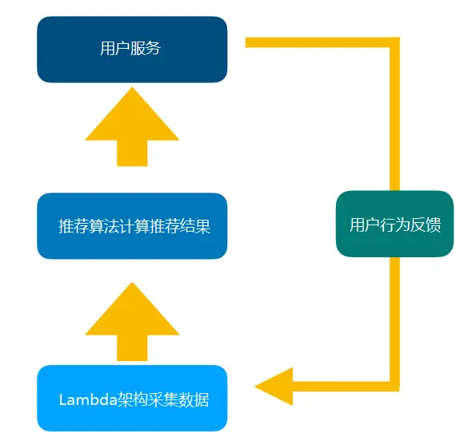
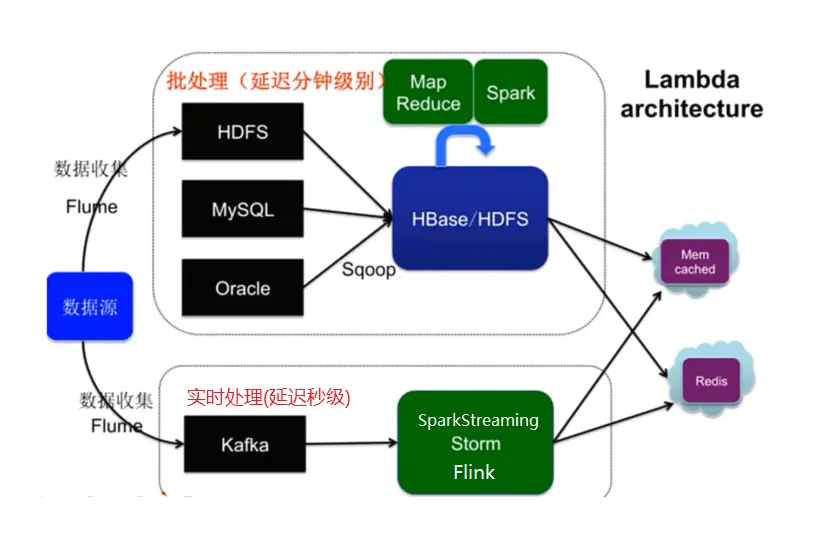
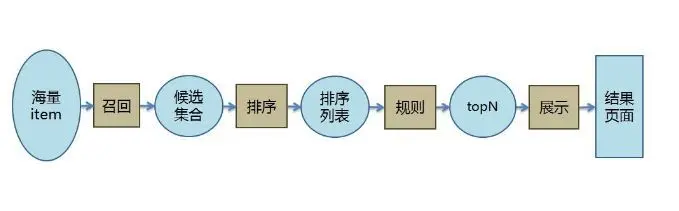
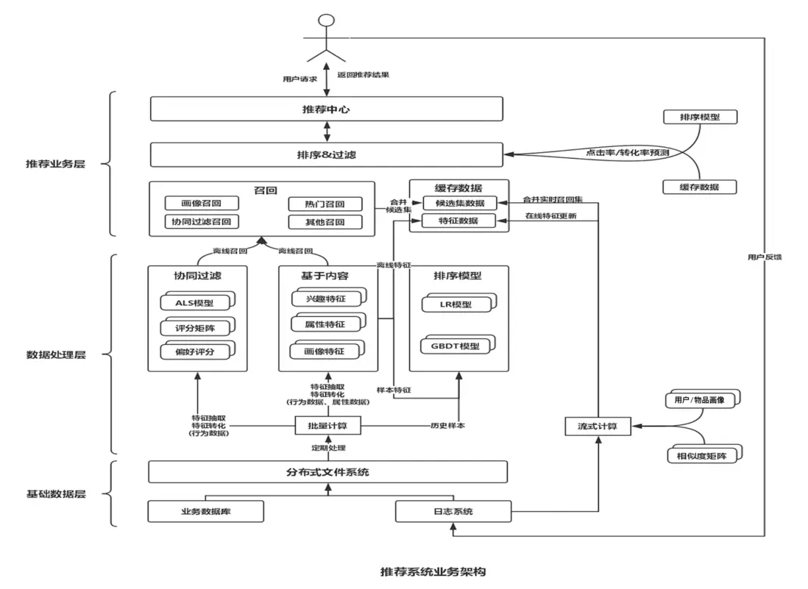
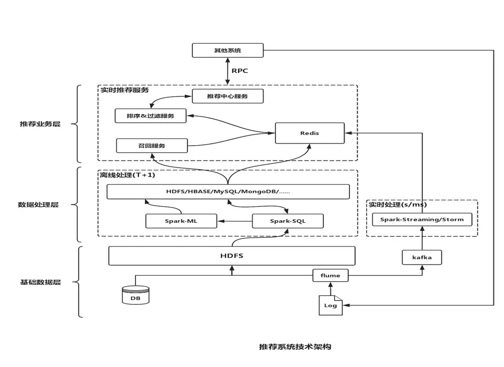

# 一.推荐系统简介
们逐渐从信息匮乏的时代走入了信息过载，推荐系统就是解决信息消费者，如何从大量信息中找到自己感兴趣的信息是一件非常困难的事情，
作为信息生产者，如何让自己生产的信息脱颖而出这一矛盾的重要工具，推荐系统的任务就是联系用户和信息，一方面帮助用户发现对自己有价值的信息。

## 1.1 解决信息过载的方案
### 分类目录
覆盖少量热门⽹站。Hao123 Yahoo

### 搜索引擎
需要用户主动提供准确的关键词,通过搜索词明确需求。Google Baidu

### 推荐系统
不需要用户提供明确的需求，而是通过分析用户的历史行为给用户的兴趣建模，给⽤户推荐能够满⾜他们兴趣和需求的信息。

### 推荐系统和搜索引擎对比

|       | 搜索	   | 推荐    |
|-------|-------|-------|
| 行为方式	 | 主动	   | 被动    |
| 意图	   | 明确	   | 模糊    |
| 个性化	  | 弱	    | 强     |
| 流量分布	 | 马太效应	 | 长尾效应  |
| 目标	   | 快速满足  | 	持续服务 |
| 评估指标	 | 简明	   | 复杂    |

**马太效应:** 即所谓强者更强，弱者更弱的效应。

**长尾效应:**
```text
从需求的角度来看，大多数的需求会集中在头部，而这部分我们可以称之为流行，而分布在尾部的需求是个性化的，零散的小量的需求。
而这部分差异化的、少量的需求会在需求曲线上面形成一条长长的“尾巴”，而所谓长尾效应就在于它的数量上，
将所有非流行的市场累加起来就会形成一个比流行市场还大的市场。
```

## 1.2 什么是推荐系统
没有明确需求的用户访问了我们的服务，且服务的物品对用户构成了信息过载，
系统通过分析用户历史行为对物品进行排序，并将排在前面的物品展示给用户，
这样的系统就是推荐系统。

## 1.3 推荐系统的作用
- 高效连接用户和物品, 发现长尾商品
- 留住用户和内容生产者, 实现商业目标

## 1.4 个性化推荐的两个条件
- 存在信息过载
- 用户大部分时候没有特别明确的需求

## 1.5 推荐系统分类
- 社会化推荐(即让好友给自己推荐物品)
- 基于内容的推荐(通过分析用户曾经看过的电影找到用户喜欢的演员和导演)
- 基于协同过滤(找到和自己历史兴趣相似的一群用户，看看他们最近在看什么电影)
- 基于流行度的推荐 查看票房排行榜

## 1.6 推荐系统和Web项目的区别
   web项目: 处理复杂逻辑 处理高并发 实现高可用 为用户提供稳定服务, 构建一个稳定的信息流通的服务,对结果有确定预期
   推荐系统: 追求指标增长, 留存率/阅读时间/GMV (Gross Merchandise Volume电商网站成交金额)/视频网站VV (Video View),结果是概率问题

## 1.7 推荐系统的应用领域
1）电子商务
```text
电子商务网站是个性化推荐系统的一大应用领域,。著名的电子商务网站亚马逊是个性化推荐系统的积极应用者和推广者
```

2）电影和视频网站
```text
该领域成功使用推荐系统的一家公司就是Netflix
```

3）个性化音乐电台
```text
Pandora(做音乐基因工程的项目,主要基于内容)
   主要基于内容,对歌曲的不同特性（比如旋律、节 12 第 1 章 好的推荐系统 奏、编曲和歌词等）进行标注，这些标注被称为音乐的基因,
   Pandora会根据专家标注的基因计算歌曲的相似度，并给用户推荐和他之前喜欢的音乐在基因上相似的其他音乐
Last.fm
   记录了所有用户的听歌记录以及用户对歌曲的反馈，在这一基础上计算出不同用户在歌曲上的喜好相似度，
   从而给用户推荐和他有相似听歌爱好的其他用户喜欢的歌曲。
   Last.fm没有使用专家标注，而是主要利用用户行为计算歌曲的相似度
豆瓣电台
```
4）社交网络
```text
互联网最激动人心的产品莫过于以Facebook和Twitter为代表的社交网络应用
```

5）个性化阅读
```text
Google Reader,鲜果网,Zite和 Flipboard(移动设备)
```

6）基于位置的服务
```text
   在中关村闲逛时，肚子饿了，打开手机，发现上面给你推荐了几家中关村不错的饭馆，价格、 环境、服务、口味都如你所愿,
基于位置给用户推荐离他近的且他感兴趣的服务，用户就更有可能去消费
```

7）个性化邮件
```text
   通过分析用户阅读邮件的历史行为和习惯对新邮件进行重新排序，从而提高用户的工作效率
```

8）个性化广告
```text
即如何将广告投放给它的潜在客户群,个性化广告投放和狭义个性化推荐的区别是，个性化推荐着重于帮助用户找到可能令他们感兴趣的物品，
而广告推荐着重于帮助广告找到可能对它们感兴趣的用户
```

---

# 二. 推荐系统的架构
## 2.1 推荐系统的要素
- UI 和 UE(前端界面)
- 数据 (Lambda架构)
- 业务知识
- 推荐算法

## 2.2 推荐系统架构

### 2.2.1 推荐系统整体架构



### 2.2.2 大数据Lambda架构
由Twitter工程师Nathan Marz(storm项目发起人)提出,
Lambda系统架构提供了一个结合实时数据和Hadoop预先计算的数据环境和混合平台, 
提供一个实时的数据视图

#### 2.2.2.1 分层架构



1）批处理层
```text
数据不可变, 可进行任何计算, 可水平扩展,高延迟(几分钟~几小时),
包括组件:日志收集 Flume,分布式存储 Hadoop hdfs,分布式计算 Hadoop MapReduce & spark,视图存储数据库
```
2）实时处理层
```text
流式处理, 持续计算,存储和分析某个窗口期内的数据,包括组件:实时数据收集 flume & kafka,实时数据分析 spark streaming/storm/flink
```
3）服务层
```text
主要任务是将已经计算好的数据传递给前端请求
```

### 2.2.3 推荐算法架构



1）召回阶段(海选)
```text
召回决定了最终推荐结果的天花板,
常用算法:
协同过滤(基于用户 基于物品的),
基于内容 (根据用户行为总结出自己的偏好,根据偏好通过文本挖掘技术找到内容上相似的商品),
基于隐语义
```
2）排序阶段
```text
召回决定了最终推荐结果的天花板, 排序逼近这个极限, 决定了最终的推荐效果,
CTR预估 (点击率预估 使用LR算法) 估计用户是否会点击某个商品需要用户的点击数据
```
3）规则
```text
根据既定规则挑选出最优的推荐结果
```

## 2.3 推荐系统的整体架构

### 2.3.1 业务架构



### 2.3.2 技术架构

