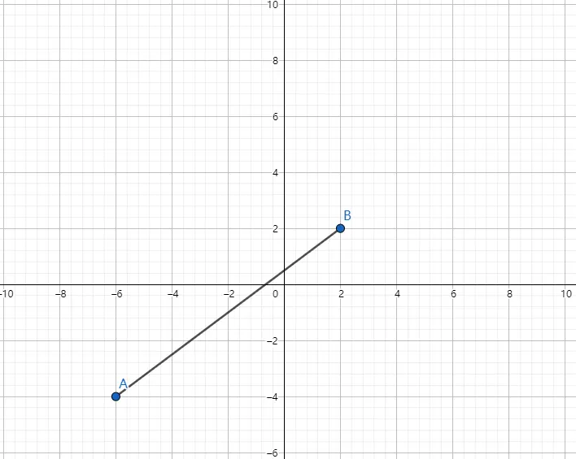
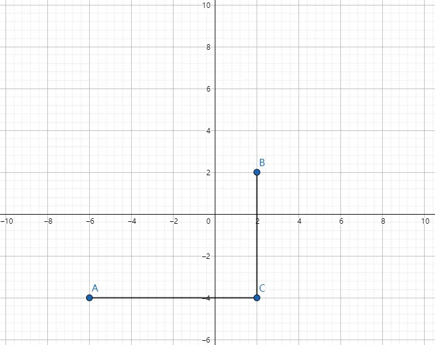
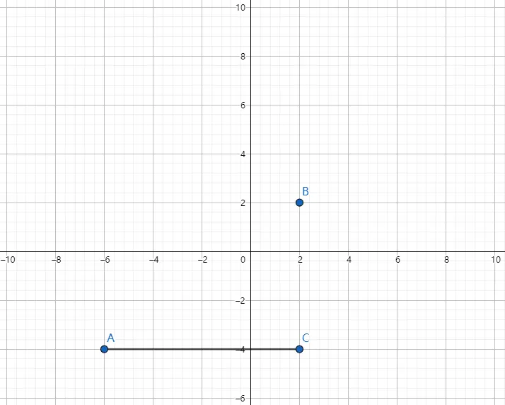
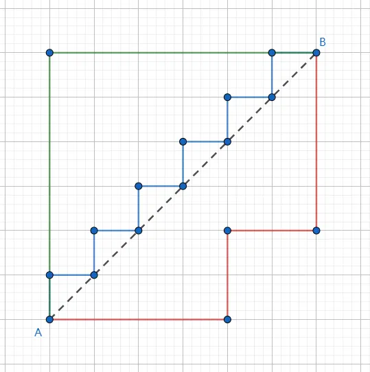
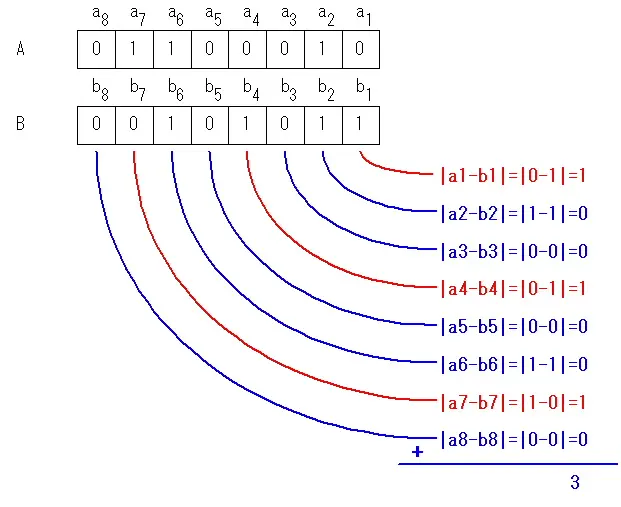
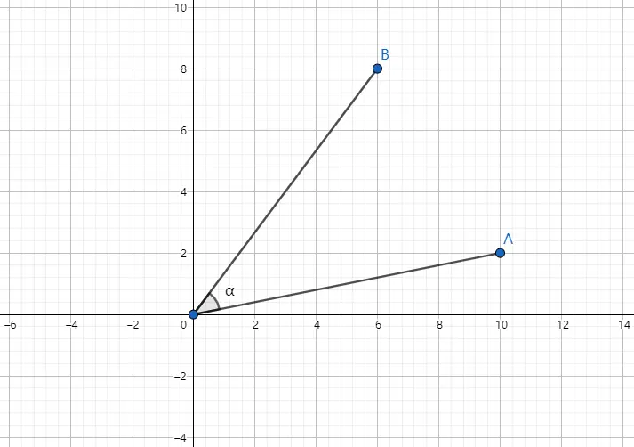
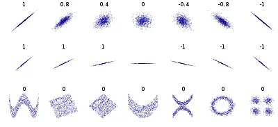
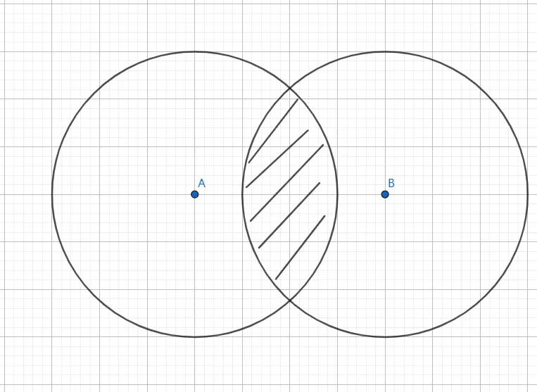

# 8种相似度度量方式的原理及实现

## 欧氏距离(Euclidean Distance)
欧氏距离（也称欧几里得度量）指在m维空间中两个点之间的真实距离，或者向量的自然长度（即该点到原点的距离）。



### 计算公式


### 试用场景
在数据完整(无维度数据缺失)的情况下, 维度间的衡量单位是一致的, 否则需要标准化处理

### python实现
```text
import numpy as np


vec1 = np.array([1, 3, 4])
vec2 = np.array([4, 2, 4])

d = np.linalg.norm(vec1-vec2, ord=2)
# 或者
d = np.sqrt(np.sum(np.square(vec1-vec2)))
```

## 曼哈顿距离(Manhattan Distance)
在欧几里得空间的固定直角坐标系上两点所形成的线段对轴产生的投影的距离总和。



### 计算公式


### 试用场景
在数据完整(无维度数据缺失)的情况下, 需要将空间划分成网格, 然后以网格为单位来进行度量, 允许4个方向。

### python实现
```text
import numpy as np

vec1 = np.array([1, 3, 4])
vec2 = np.array([4, 2, 4])

d = np.linalg.norm(vec1-vec2, ord=1)
# 或者
d = np.sum(np.abs(vec1-vec2))
```

## 切比雪夫距离(Chebyshev Distance)
切比雪夫距离(Chebyshev distance)是向量空间中的一种度量，二个点之间的距离定义为其各座标数值差的最大值



### 计算公式


or


### 试用场景
需要将空间划分成网格, 然后以网格为单位来进行度量, 允许8个方向

### python实现
```text
import numpy as np

vec1 = np.array([1, 3, 4])
vec2 = np.array([4, 2, 4])

d = np.linalg.norm(vec1-vec2, ord=np.inf)
# 或者
d = np.abs(vec1-vec2).max()
```

## 闵可夫斯基距离(Minkowski Distance)
欧氏空间中的一种测度，被看做是欧氏距离和曼哈顿距离的一种推广



### 计算公式


### 试用场景
- 当 p=1 时，就是曼哈顿距离
- 当 p=2 时，就是欧氏距离
- 当 p→∞ 时，就是切比雪夫距离

### python实现
```text
import numpy as np

vec1 = np.array([1, 3, 4])
vec2 = np.array([4, 2, 4])

"""
ord=1: 一范数
ord=2: 二范数
ord=np.inf: 无穷范数
"""
d = np.linalg.norm(vec1-vec2, ord=arg)
```

## 汉明距离(Hamming Distance)
在信息论中，两个等长字符串之间的汉明距离(Hamming distance)是两个字符串对应位置的不同字符的个数



### 计算公式


### 试用场景
信息编码(为了增强容错性，应使得编码间的最小汉明距离尽可能大)

### python实现
```text
import numpy as np

vec1 = np.array([1, 1, 0, 1, 0, 1, 0, 0, 1])
vec2 = np.array([0, 1, 1, 0, 0, 0, 1, 1, 1])

d = len(np.nonzero(vec1-vec2)[0])
# 或者
d = np.shape(np.nonzero(vec1-vec2)[0])[0]
```

## 余弦相似度(Cosine Similarity)
余弦相似度，又称为余弦相似性，是通过计算两个向量的夹角余弦值来评估他们的相似度



### 计算公式


or


### 试用场景
衡量两个向量方向的差异

### python实现
```text
import numpy as np

vec1 = np.array([1, 3, 4])
vec2 = np.array([4, 2, 4])

d = np.dot(vec1,vec2)/(np.linalg.norm(vec1)*(np.linalg.norm(vec2)))
```

## 皮尔森相关系数(Pearson Correlation Coefficient)
用于度量两个变量之间的相关程度



### 计算公式


### 试用场景
反映两个变量是正相关还是负相关

### python实现
```text
import numpy as np

vec1 = np.array([1, 3, 4])
vec2 = np.array([4, 2, 4])

p = np.corrcoef(vec1, vec2)
```

## 杰卡德相似系数(Jaccard Similarity Coefficient)及杰卡德距离(Jaccard Distance)
用于比较有限样本集之间的相似性与差异性



### 杰卡德相似系数计算公式


### 杰卡德距离计算公式


### 试用场景
- 比较文本相似度，用于文本查重与去重；
- 计算对象间距离，用于数据聚类或衡量两个集合的区分度等。

### python实现
```text
import numpy as np
import scipy.spatial.distance as dist

vec1 = np.array([1, 1, 0, 1, 0, 1, 0, 0, 1])
vec2 = np.array([0, 1, 1, 0, 0, 0, 1, 1, 1])

d = dist.pdist(np.array([vec1, vec2]), "jaccard")
```

## 参考

[8种相似度度量方式的原理和实现](https://www.jianshu.com/p/aed36799cbe0)


