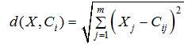
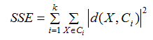
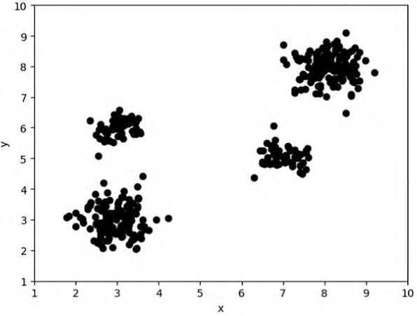
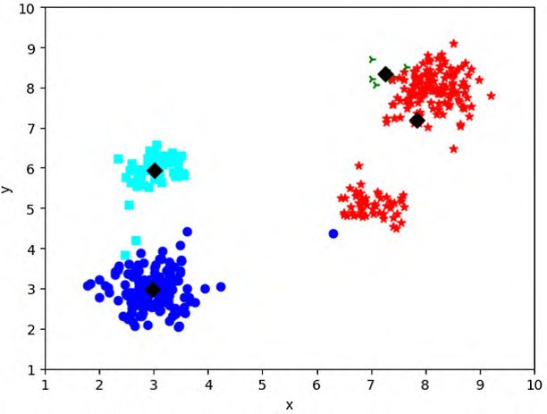
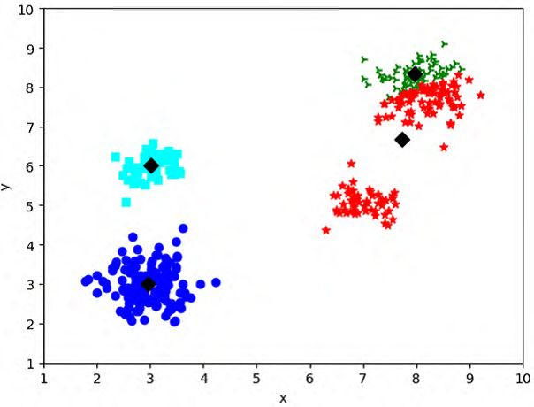
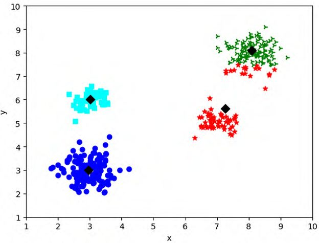
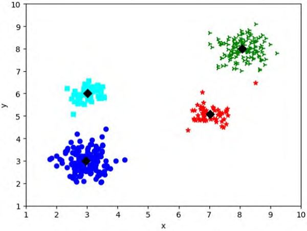
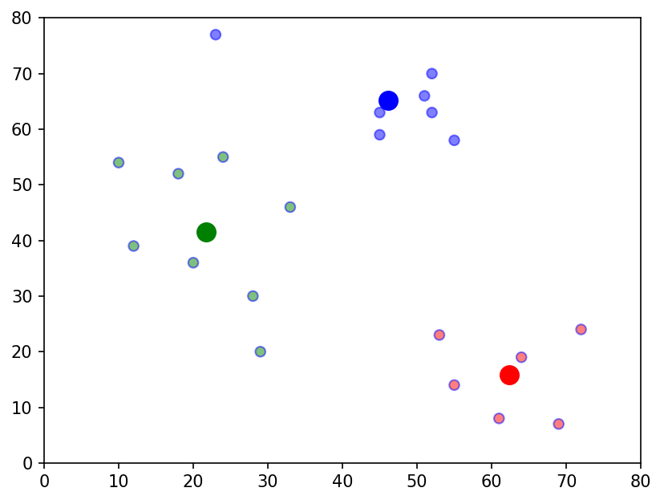
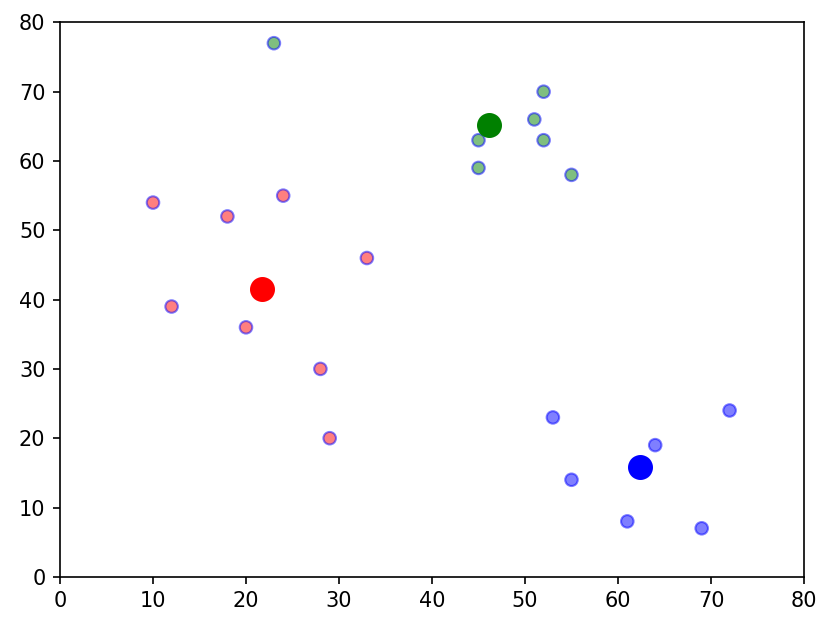

# 什么是聚类分析
聚类分析是数据挖掘中一个重要概念，其核心是寻找数据对象中隐藏的有价值的信息，
根据相似性原则，把具有较高相似度的数据对象划分到同一类簇，把具有较高相异度的数据对象划分到不同类簇，
从而使相同组中的数据点之间比其他组中的数据点更具有相似性。

## 聚类算法
典型的聚类算法分为三个阶段，主要包括：
- 特征选择和特征提取
- 数据对象间相似度计算
- 根据相似度将数据对象分组

聚类算法可以分为两大类：
- 层次聚类算法
- 划分聚类算法

**层次聚类算法**通过不同类别间的数据对象的相似度，试图构建一个高层次的嵌套聚类树结构，
**聚类树**的构建有两种类型：凝聚型层次聚类（自底向上的方式构建树结构）和分裂型层次聚类（自顶向下的方式构建树结构）。

**划分聚类算法**需要预先指定**聚类数目**和**聚类中心**，通过优化一些损失函数，将数据集分成若干互不相交的簇。

## 聚类算法的作用
聚类算法在数据分析中扮演着重要的角色，主要体现在以下几个方面：

- 数据探索与可视化：

  聚类算法可以帮助分析师发现数据集中隐藏的结构和模式。
  通过聚类，可以将复杂的数据集划分为几个有意义的组或类别，从而更容易地理解和解释数据。
  这在数据探索阶段非常有用，尤其是在处理大量多维数据时，可以帮助分析师快速识别出数据中的关键特征。

- 异常检测：

  聚类算法可以有效地用于异常检测。
  在数据集中，异常点可能不符合一般的模式或规律。
  通过聚类，可以识别出这些不符合常规模式的点，这些点可能是噪声、离群值或潜在的恶意攻击。
  这对于数据清洗和预处理阶段非常重要，可以提高数据质量和分析的准确性。

- 客户细分与市场定位：

  在商业应用中，聚类算法常用于客户细分和市场定位。
  通过聚类，可以将客户划分为不同的群体，每个群体具有相似的购买行为、兴趣或需求。
  这有助于企业更好地理解客户需求，制定更精准的营销策略，提高客户满意度和服务质量。

- 降维与特征提取：

  聚类算法可以用于降维和特征提取。
  在处理高维数据时，聚类算法可以帮助分析师找出数据中的关键特征，从而简化数据集并降低维度。
  这对于后续的数据分析和建模非常有帮助，可以提高模型的性能和可解释性。

- 预处理步骤：

  聚类分析还可以作为其他数据分析算法（如分类、回归等）的预处理步骤。
  通过聚类，可以将数据集划分为几个更小的、更易于处理的子集。
  这有助于减少计算复杂度，提高算法的效率和准确性。

总之，聚类算法在数据分析中发挥着重要作用，
可以帮助分析师更好地理解和解释数据，发现数据中的规律和模式，提高数据质量和分析的准确性。

# K-Means聚类算法
## 01 K-Means聚类算法原理
K-Means算法是一种典型的**基于划分的聚类算法**，也是一种无监督学习算法。

K-Means算法的思想很简单，对给定的样本集，用**欧氏距离**作为衡量数据对象间相似度的指标，
相似度与数据对象间的距离成反比，相似度越大，距离越小。

预先指定初始聚类数以及个初始聚类中心，
按照样本之间的距离大小，把样本集划分为个簇根据数据对象与聚类中心之间的相似度，
不断更新聚类中心的位置，不断降低类簇的**误差平方和（Sum of Squared Error，SSE）**，
当SSE不再变化或目标函数收敛时，聚类结束，得到最终结果。

**K-Means算法的核心思想**：
首先，从数据集中随机选取k个初始聚类中心Ci（i≤1≤k），
计算其余数据对象与与聚类中心Ci的欧氏距离，
找出离目标数据对象最近的聚类中心Ci，并将数据对象分配到聚类中心Ci所对应的簇中。
然后，计算每个簇中数据对象的平均值作为新的聚类中心，
进行下一次迭代，直到聚类中心不再变化或达到最大的迭代次数时停止。

空间中数据对象与聚类中心间的**欧氏距离计算公式**为：



其中，X为数据对象；Ci为第i个聚类中心；m为数据对象的维度；Xj，Cij为X和Ci的第j个属性值。

整个数据集的**误差平方和SSE计算公式**为：



其中，SSE的大小表示聚类结果的好坏；k为簇的个数。

## 02 K-Means聚类算法步骤
K-Means聚类算法步骤实质是EM算法（最大期望算法（Expectation-Maximization algorithm, EM）)的模型优化过程，
具体步骤如下：

- （1）随机选择k个样本作为初始簇类的均值向量；

- （2）将每个样本数据集划分离它距离最近的簇；

- （3）根据每个样本所属的簇，更新簇类的均值向量；

- （4）重复（2）（3）步，当达到设置的迭代次数或簇类的均值向量不再改变时，模型构建完成，输出聚类算法结果。

## 03 K-Means算法迭代过程
K-Means聚类算法是一个不断迭代的过程，如图所示，原始数据集有4个簇，图中和分别代表数据点的横纵坐标值，
使用K-Means算法对数据集进行聚类，在对数据集经过两次迭代后得到最终的聚类结果，迭代过程如下图所示。



（a）原始数据



（b）随机选择初始中心



（c）第一次迭代



（d）第二次迭代



（e）最终结果

## 04 K-Means聚类算法的优缺点

**优点**：
- 理解容易，聚类效果不错
- 处理大数据集的时候，该算法可以保证较好的伸缩性和高效率
- 当簇近似高斯分布的时候，效果非常不错

**缺点**：
- K值是用户给定的，在进行数据处理前，K值是未知的，给定合适的k值，需要先验知识，凭空估计很困难，或者可能导致效果很差
- 对初始簇中心点是敏感的
- 不适合发现非凸形状的簇或者大小差别较大的簇
- 特殊值(离群值或称为异常值)对模型的影响比较大

## 05 K-Means代码实现
```text
import matplotlib.pyplot as plt
import numpy as np
import pandas as pd
from pandas import DataFrame


def assignment(df: DataFrame, center: dict, color_map: dict) -> DataFrame:
    """
        计算所有样本分别对K个类别中心点的距离
        :param df: 基础数据
        :param center: 聚类中心点字典
        :param color_map: 颜色字典
        :return: 更新后的基础数据
    """
    # 计算所有样本分别对K个类别中心点的距离
    for i in center.keys():
        df["distance_from_{}".format(i)] = np.sqrt((df["x"] - center[i][0]) ** 2 + (df["y"] - center[i][1]) ** 2)

    distance_from_centroid_id = ['distance_from_{}'.format(i) for i in center.keys()]
    # "closest"列表示每个样本点离哪个类别的中心点距离最近
    df["closest"] = df.loc[:, distance_from_centroid_id].idxmin(axis=1)
    print(df["closest"])
    df["closest"] = df["closest"].map(lambda x: int(x.lstrip('distance_from_')))
    df["color"] = df['closest'].map(lambda x: color_map[x])
    return df


def update(df: DataFrame, centroids: dict) -> dict:
    """
    更新K个类别的中心点
        :param df: 基础数据
        :param centroids: 中心点字典
        :return: 更新后的中心点字典
    """
    # 更新K个类别的中心点
    for i in centroids.keys():
        # 每个类别的中心点为 属于该类别的点的x、y坐标的平均值
        centroids[i][0] = np.mean(df[df['closest'] == i]['x'])
        centroids[i][1] = np.mean(df[df['closest'] == i]['y'])
    return centroids


def main():
    df = pd.DataFrame({
        'x': [12, 20, 28, 18, 10, 29, 33, 24, 45, 45, 52, 51, 52, 55, 53, 55, 61, 64, 69, 72, 23],
        'y': [39, 36, 30, 52, 54, 20, 46, 55, 59, 63, 70, 66, 63, 58, 23, 14, 8, 19, 7, 24, 77]
    })
    k = 3

    # 一开始随机指定K个类的中心点
    center = {
        i: [np.random.randint(0, 80), np.random.randint(0, 80)] for i in range(k)
    }
    # 颜色字典
    col_map = {0: "r", 1: "g", 2: "b"}
    # 初次计算所有样本点到K个类别中心点的距离
    df = assignment(df, center, col_map)
    # 迭代10次，更新K个类别中心点
    for i in range(10):
        # 获取前一次迭代的K个类别中心点
        closest_center = df['closest'].copy(deep=True)
        # 更新K个类的中心点
        center = update(df, center)
        # 类别中心点更新后，重新计算所有样本点到K个类别中心点的距离
        df = assignment(df, center, col_map)
        # 若各个样本点对应的聚类类别不再变化，则结束聚类
        if closest_center.equals(df['closest']):
            break

    plt.scatter(df['x'], df['y'], color=df['color'], alpha=0.5, edgecolor='b')
    for j in center.keys():
        plt.scatter(*center[j], color=col_map[j], linewidths=6)
    plt.xlim(0, 80)
    plt.ylim(0, 80)
    plt.show()


if __name__ == '__main__':
    main()
```
打印聚类效果图：



# K-Means++聚类算法

## 01 K-Means++聚类算法原理
原始K-Means算法最开始**随机选取**数据集中k个点作为聚类中心，
k个初始化的质心的位置选择对最后的聚类结果和运行时间都有很大的影响，因此需要选择合适的k个质心。
如果仅仅是完全随机的选择，有可能导致**算法收敛很慢**。

K-Means++算法主要对K-Means初始值选取的方法的优化。
也就是说，K-Means++算法与K-Means算法最本质的区别是在k个聚类中心的初始化过程。

## 02 K-Means++聚类算法步骤
其实通过上面的介绍，我们知道了K-Means++算法和K-Means算法就是选择一开始的k个聚类中心点的方法有差别而已。

其初始点的选择过程如下：
- 1）从数据点中随机选择一个中心。
- 2）对于每个数据点x，计算D(x)，即x与已经选择的最接近中心之间的距离。
- 3）使用加权概率分布随机选择一个新的数据点作为新的中心，其中选择点x的概率与D(x)^2成正比。
- 4）重复步骤2）和3），直到选择了K个中心。

其余训练过程与KMeans一致。

## 03 K-Means++算法优缺点

**优点**：
- 避免了K-Means随机选取k个聚类中心导致可能聚类中心选择的不好，最终对结果会产生很大的影响的问题
- 在目标检测应用中，K-Means++通过改变初始聚类中心的生成方式，增大初始锚框之间差距，
  使锚框更适应整体据分布，得到了匹配度更好的多尺度锚框，进而提升了模型的检测性能。

**缺点**：
- 由于聚类中心点选择过程中的内在有序性，
  在扩展方面存在着性能方面的问题(第k个聚类中心点的选择依赖前k-1个聚类中心点的值)。


## 03 K-Means++算法代码实现
```text
import matplotlib.pyplot as plt
import numpy as np
import pandas as pd
import random

from pandas import DataFrame


def select_center(first_center, df, k, color_map):
    """
    选择初始类别中心
        :param first_center: 第一个初始类别中心
        :param df: 基础数据
        :param k:  聚类个数
        :param color_map: 颜色字典
        :return: 初始类别中心字典
    """
    center_dict = {0: first_center}

    for i in range(1, k):
        df = assignment(df, center_dict, color_map)
        # cd = 最近中心点的距离。把所有样本点对应最近中心点的距离都加在一起
        sum_closest_d = df.loc[:, 'cd'].sum()
        df["p"] = df.loc[:, 'cd'] / sum_closest_d
        sum_p = df["p"].cumsum()

        # 下面是轮盘法取新的聚类中心点
        next_center = random.random()
        idx = 0
        for index, j in enumerate(sum_p):
            if j > next_center:
                idx = index
                break
        center_dict[i] = list(df.iloc[idx].values)[0:2]

    return center_dict


def assignment(df: DataFrame, center: dict, color_map: dict) -> DataFrame:
    """
        计算所有样本分别对K个类别中心点的距离
        :param df: 基础数据
        :param center: 聚类中心点字典
        :param color_map: 颜色字典
        :return: 更新后的基础数据
    """
    # 计算所有样本分别对K个类别中心点的距离
    for i in center.keys():
        df["distance_from_{}".format(i)] = np.sqrt((df["x"] - center[i][0]) ** 2 + (df["y"] - center[i][1]) ** 2)

    distance_from_centroid_id = ['distance_from_{}'.format(i) for i in center.keys()]
    # "closest"列表示每个样本点离哪个类别的中心点距离最近
    df["closest"] = df.loc[:, distance_from_centroid_id].idxmin(axis=1)
    df["cd"] = df.loc[:, distance_from_centroid_id].min(axis=1)
    df["closest"] = df["closest"].map(lambda x: int(x.lstrip('distance_from_')))
    df["color"] = df['closest'].map(lambda x: color_map[x])
    return df


def update(df: DataFrame, centroids: dict) -> dict:
    """
    更新K个类别的中心点
        :param df: 基础数据
        :param centroids: 中心点字典
        :return: 更新后的中心点字典
    """
    # 更新K个类别的中心点
    for i in centroids.keys():
        # 每个类别的中心点为 属于该类别的点的x、y坐标的平均值
        centroids[i][0] = np.mean(df[df['closest'] == i]['x'])
        centroids[i][1] = np.mean(df[df['closest'] == i]['y'])
    return centroids


def main():
    df = pd.DataFrame({
        'x': [12, 20, 28, 18, 10, 29, 33, 24, 45, 45, 52, 51, 52, 55, 53, 55, 61, 64, 69, 72, 23],
        'y': [39, 36, 30, 52, 54, 20, 46, 55, 59, 63, 70, 66, 63, 58, 23, 14, 8, 19, 7, 24, 77]
    })
    # k值
    k = 3
    # 颜色字典
    col_map = {0: "r", 1: "g", 2: "b"}

    # 随机选择第一个类别初始中心点
    first_center_index = random.randint(0, len(df) - 1)
    first_center = [df['x'][first_center_index], df['y'][first_center_index]]
    # 基于第一个类别初始中心点，选择其他剩余的类别中心点
    center = select_center(first_center, df, k, col_map)

    # 初次计算所有样本点到K个类别中心点的距离
    df = assignment(df, center, col_map)

    # 迭代10次，计算所有样本点到K个类别中心点的距离
    for i in range(10):
        closest_center = df['closest'].copy(deep=True)
        # 更新K个类的中心点
        center = update(df, center)
        # 类别中心点更新后，重新计算所有样本点到K个类别中心点的距离
        df = assignment(df, center, col_map)
        # 若各个样本点对应的聚类类别不再变化，则结束聚类
        if closest_center.equals(df['closest']):
            break

    plt.scatter(df['x'], df['y'], color=df['color'], alpha=0.5, edgecolor='b')
    for j in center.keys():
        plt.scatter(*center[j], color=col_map[j], linewidths=6)
    plt.xlim(0, 80)
    plt.ylim(0, 80)
    plt.show()


if __name__ == '__main__':
    main()
```
打印聚类效果图：

