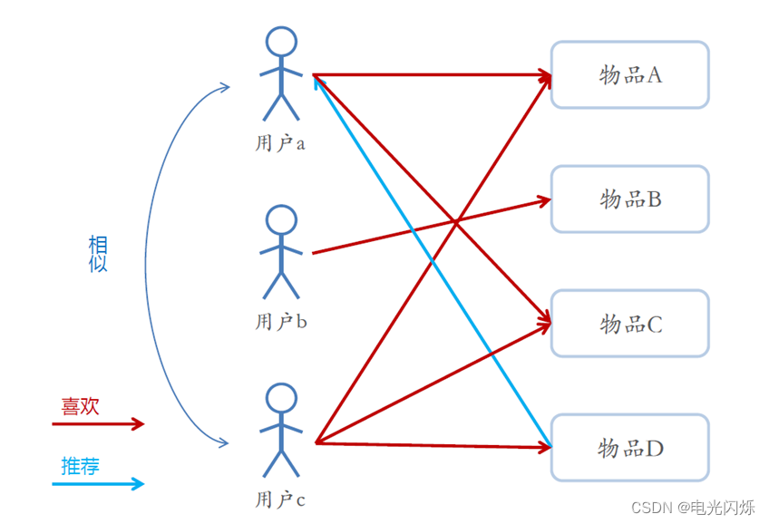

# 经典推荐算法之协同过滤
协同过滤算法是一个经典的推荐算法。
它的【基本思想】是通过对【用户历史行为】数据的挖掘来发现用户的喜好偏向，
基于不同的喜好偏向对用户进行划分并向用户推荐其可能喜好的产品。
举个简单的例子，当我们出去买饮品的时候，我们通常会询问身边的朋友有没有推荐的，
而我们一般更倾向于同我们口味类似的朋友那里得到推荐。
这就是协同过滤的核心思想。

## 基于协同过滤的推荐方法和基于内容的推荐方法的对比：
```text
1、基于内容（Content based，CB）主要利用的是用户评价过的物品的内容特征，
而基于协同过滤（Collaborative Filtering，CF）方法还可以利用其他用户评分过的物品内容。

2、CF可以解决CB的一些局限：
    1）物品内容不完全或者难以获得时，依然可以通过其他用户的反馈给出推荐
    2）CF基于用户之间对物品的评价质量，避免了CB仅依赖内容可能造成的对物品质量判断的干扰
    3）CF推荐不受内容限制，只要其他类似用户给出了对不同物品的兴趣，
       CF就可以给用户推荐出内容差异很大的物品（但有某种内在联系）
```

## 协同过滤的方法分类：

1）基于近邻的协同过滤：
- 基于用户（User-CF） 
- 基于物品（Item-CF）

2）基于模型的协同过滤：
- 奇异值分解（SVD）
- 潜在语义分析（LSA）
- 支持向量机（SVM）

## 什么是基于近邻的协同过滤
基于用户的协同过滤（UserCF）：给用户推荐和用户相似的其他用户喜欢的东西。

基于物品的协同过滤（ItemCF）：给用户推荐和用户喜欢的东西相似的其他东西。

基于近邻的推荐系统根据的是相同 “口碑” 准则，如下所示，是否应该给Cary推荐《泰坦尼克号》？答案是肯定的。

## 基于用户的CF
用户A喜欢的物品用户C都喜欢，我们认为用户A与用户C相似，

那么用户C喜欢的东西可能用户A也喜欢，因此将用户C喜欢的物品推荐给用户A。




### 基于用户的协同过滤推荐的基本原理
基于用户的协同过滤推荐的基本原理是，
根据所有用户对物品的偏好，发现与当前用户口味和偏好相似的“邻居”用户群，并推荐近邻所偏好的物品。
```text
在一般的应用中是采用计算“K-近邻”的算法；基于这K个邻居的历史偏好信息，为当前用户进行推荐。

【User-CF】和基于【人口统计学】的推荐机制：
    1）两者都是计算用户的相似度，并基于相似的“邻居”用户群计算推荐 。
    2）它们所不同的是如何计算用户的相似度：基于人口统计学的机制只考虑用户本身的特征，
    而基于用户的协同过滤机制可是在用户的历史偏好的数据上计算用户的相似度，
    它的基本假设是，喜欢类似物品的用户可能有相同或者相似的口味和偏好。
```

### 基于用户的协同过滤推荐的步骤
```text
1）获取用户-物品评分相关数据，生成用户-物品评分矩阵；
2）计算根据用户-用户相似度矩阵；
3）预测计算用户未评价的物品的评分，并根据预测出来的评分对物品排序，选择top-n个物品推荐给用户。
    （1）在用户相似度矩阵中找出与当前用户最相似的top-k个用户
    （2）根据top-k用户的评分和相似度预测出当前用户对物品的评分
    （3）基于预测出的评分，对当前用户未评分的物品进行由大到小排序
    （4）获取前n个物品给当前用户推荐
```

### 基于用户的协同过滤推荐的代码实现

数据文件见 [ua.base](img/03/ua.base)

第1步：获取用户-物品评分相关数据，生成用户-物品评分矩阵。
```text
def create_user_item_score(path: str) -> tuple[dict[str, dict], set[str]]:
    """
    加载 用户-物品评分数据，获取 用户-物品评分矩阵 和 物品集合
        :param path: 用户-物品评分数据文件路径
        :return: 用户-物品评分矩阵user_item 和 物品集合item_set
    """
    # 初始化用户-物品评分字典为空
    user_item = dict()
    # 为了保证物品测唯一，构建set集合
    item_set = set()

    with open(path, "r", encoding="utf-8") as f:
        while True:
            line = f.readline()
            # print(line)
            if line:
                lines = line.strip().split("\t")
                uid = lines[0]  # 用户id
                iid = lines[1]  # 商品id
                score = int(lines[2])  # 打分

                item_set.add(iid)
                # 初始化字典
                if user_item.get(uid, -1) == -1:
                    user_item[uid] = {iid: score}
                else:
                    user_item[uid].update({iid: score})

            else:
                print("读完")
                break

    return user_item, item_set
```
第2步：计算根据用户-用户相似度矩阵。（见cal_allSim方法）
```text
import numpy as np


# 1.计算两个用户的相似性
# 余弦相似度
def sim_cos(u1_id, u2_id, user_item) -> float:
    """
        余弦相似度 计算两个用户的相似性
        :param u1_id: 用户id 1
        :param u2_id: 用户id 2
        :param user_item: 用户-物品评分矩阵
        :return:相似度
    """
    u1 = user_item[u1_id]
    u2 = user_item[u2_id]
    cor_index = u1.keys() & u2.keys()
    cross = 0
    u1_score = 0
    u2_score = 0
    for iid in cor_index:
        cross += u1[iid] * u2[iid]
        u1_score += u1[iid] * u1[iid]
        u2_score += u2[iid] * u2[iid]
    m = cross
    s = (np.sqrt(u1_score) * np.sqrt(u2_score))
    if s == 0:
        return float(0)
    sim = m/s
    return sim

# jaccard相似度
def sim_jaccard(u1_id, u2_id, user_item: dict) -> float:
    """
        jaccard相似度 计算两个用户的相似性
        :param u1_id: 用户id 1
        :param u2_id: 用户id 2
        :param user_item: 用户-物品评分矩阵
        :return:相似度
    """
    # 拿出u1 u2的集合，做交集，做并集，用交集的长度除以并集的长度得到jaccard距离
    # 注意分母为0.
    u1_item = user_item[u1_id]
    u2_item = user_item[u2_id]
    m = len(u1_item & u2_item)
    n = len(u1_item | u2_item)
    if n == 0:
        return float(0)
    else:
        return np.around(m/n, 2)


# 2.计算用户两两相似字典
def cal_allSim(user_item_score: dict, method="cosin") -> dict:
    """
        计算用户两两相似度字典
        :param user_item_score: 用户-物品矩阵
        :param method: 求相似度方式：cosin、jaccard
        :return:
    """
    # 初始一个用户相似词典
    sim_dict = {}
    # 遍历用户去计算用户的两两相似
    for u1 in user_item_score.keys():
        for u2 in user_item_score.keys():
            # 如果用户id一样，意味着用户是同一个，因此，不用计算，直接跳过。
            if u1 == u2:
                continue
            # 如果两个用户id不一样，那么计算用户相似
            else:
                # 如果sim_dict字典中没有u1的key，那么基于get进行初始化，然后计算u1 和u2 的相似度
                if sim_dict.get(u1, -1) == -1:
                    # 用cos 夹角余玄方法
                    if method == "cosin":
                        # 此处自己实现了一个sim_cos的方法
                        sim_dict[u1] = {u2: sim_cos(u1, u2, user_item_score)}
                    # 用jaccard方法
                    elif method == "jaccard":
                        # 此处自己实现了一个sim_jaccard的方法
                        sim_dict[u1] = {u2: sim_jaccard(u1, u2, user_item_score)}
                    else:
                        raise "请输入正确相似度计算方法"
                # 如果sim_dict字典中有u1的key，那么直接计算相似度
                else:
                    if method == "cosin":
                        sim_dict[u1].update({u2: sim_cos(u1, u2, user_item_score)})
                    elif method == "jaccard":
                        sim_dict[u1].update({u2: sim_jaccard(u1, u2, user_item_score)})
                    else:
                        raise "请输入正确相似度计算方法"
    # 最终返回用户相似词典 {"u1":{"u2":0.5，"u3":0.04}}
    return sim_dict
```
第3步：预测计算用户未评价的物品的评分，并根据预测出来的评分对物品排序，选择top-n个物品推荐给用户。

第3.1步：在用户相似度矩阵中找出与当前用户最相似的top-k个用户。（见predict_score_baseUser方法）

第3.2步：根据top-k用户的评分和相似度预测出当前用户对物品的评分。（见predict_score_baseUser方法）

第3.3步：基于预测出的评分，对当前用户未评分的物品进行由大到小排序。（见predict_all_score_baseUser方法）

第3.4步：获取前n个物品给当前用户推荐。（见predict_all_score_baseUser方法）

```text
def predict_all_score_baseUser(uid: str,
                               user_item_score: dict, item_set: set,
                               sim_dict,
                               top_item=100) -> dict:
    """
        :param uid: 用户id
        :param user_item_score: 用户_物品评分词典
        :param item_set: 物品集合
        :param sim_dict: 用户相似词典
        :param top_item: 最相似的top k个物品推荐
        :return:
    """
    # 过滤，找到用户没有评分的电影
    un_score_item = item_set - set(user_item_score[uid].keys())
    # 推荐列表
    rec_item_dict = {}
    # 遍历用户没有看过的电影列表
    for iid in un_score_item:
        # 计算该用户对iid的评分预测为score
        score = predict_score_baseUser(uid, iid, user_item_score, sim_dict)
        # 补齐s
        rec_item_dict[iid] = score
        # print("用户:%s 对物品:%s 的预测评分为%f" % (uid, iid, rec_item_dict[iid]))

    # 补全之后 做排序后推荐
    res = dict(sorted(rec_item_dict.items(), key=lambda x: x[1], reverse=True)[:top_item])
    return res


def predict_score_baseUser(uid, iid, user_item_score: dict, sim_dict: dict) -> float:
    """
    给用户uid预测物品iid的评分值
        :param uid: 用户id
        :param iid: 物品id
        :param user_item_score: 用户-物品评分表
        :param sim_dict: 用户相似矩阵
        :return:
    """
    # 1.基于用户uid,最相似的100个用户[i1,i4,...,i10,i11]
    user_sim = dict(sorted(sim_dict[uid].items(), key=lambda x: x[1], reverse=True)[:100])
    # temp1 用来存储 用户相似系数 * score
    # temp2 用来存储 用户相似系数做归一化
    temp1 = 0
    temp2 = 0
    # 2.遍历与用uid相似的用户other_user_id和score
    for other_user_id, sim in user_sim.items():
        # 如果其他用户没有iid这个物品，那么继续，我只需要
        if user_item_score[other_user_id].get(iid, -1) == -1:
            continue
        else:
            # 拿到用户a的分数
            score = user_item_score[other_user_id][iid]
            # 计算用户a的分数和相似度乘积
            temp1 += score * user_sim[other_user_id]
            # 累加相似度，作为权重分布
            # （3*0.9+4*0.8+3*0.2）/（0.9+0.8+0.2）
            temp2 += user_sim[other_user_id]

    if temp2 == 0:
        return float(0)
    sims = np.around(temp1 / temp2, 2)
    # print("用户-%s对物品-%s的预测评分为%f" % (uid,iid,sims ))
    return sims
```

第4步：主流程。
```text
if __name__ == '__main__':
    path = "data/ua.base"
    # 获取用户-物品评分矩阵、物品id集合
    user_item_score_dict, items_set = create_user_item_score(path)
    # 获取用户相似性矩阵，根据用户-物品评分矩阵
    user_sim_dict = cal_allSim(user_item_score_dict)
    # 给用户推荐物品
    suggestion = predict_all_score_baseUser("1", user_item_score_dict, items_set, user_sim_dict, top_item=10)
    print(suggestion)
```

## 基于物品的CF

喜欢物品A的用户都喜欢物品C，那么我们认为物品A与物品C相似，

那么喜欢物品A的用户也可能会喜欢物品C，因此，将物品C推荐给喜欢物品A的用户。


### 基于物品的协同过滤推荐的基本原理
基于项目的协同过滤推荐的基本原理与基于用户的类似，
只是使用所有用户对物品的偏好，
发现物品和物品之间的相似度，然后根据用户的历史偏好信息，将类似的物品推荐给用户。

Item-CF和基于内容（CB）的推荐方式对比：
```text
其实都是基于物品相似度预测推荐，只是相似度计算的方法不一样，
前者是从用户历史的偏好推断，而后者是基于物品本身的属性特征信息。
```

同样是协同过滤，在基于用户和基于物品两个策略中应该如何选择呢？
```text
电商、电影、音乐网站，用户数远大于物品数量
新闻网站，物品（新闻文本）数员可能大于用户数量

1、在适合用途上的比较。
    Item CF是利用物品间的相似性来推荐的，所以假如用户的数量远远超过物品的数量，那么可以考虑使用Item CF，
    比如购物网站，因其物品的数据相对稳定，因此计算物品的相似度时不但计算量较小，而且不必频繁更新；
    User CF更适合做新闻、博客或者微内容的推荐系统，因为其内容更新频率非常高，
    特别是在社交网络中，User CF是一个更好的选择，可以增加用户对推荐解释的信服程度。

    而在一个非社交网络的网站中，比如给某个用户推荐一本书，系统给出的解释是某某和你有相似兴趣的人也看了这本书，
    这很难让用户信服，因为用户可能根本不认识那个人；
    但假如给出的理由是因为这本书和你以前看的某本书相似，这样解释相对合理，用户可能就会采纳你的推荐。

2、从推荐的多样性上比较。
    1）单个用户的多样性:
        Item CF的多样性显然不如User CF的好，因为Item CF的推荐就是和以前看的东西最相似的。
    2）系统的多样性(也被称为覆盖率，指一个推荐系统能否给用户提供多种选择):
        在这种指标下，Item CF的多样性要远远好于User CF，因为User CF会更倾向于推荐热门的物品。
        从另外一个角度看，也就是说，Item CF的推荐有很好的新颖性，容易发现并推荐长尾里的物品。
        所以大多数情况，Item CF的精度稍微小于User CF，但是如果考虑多样性，Item CF却比User CF好很多。

    由于User CF经常推荐热门的，所以它在推荐长尾里物品方面的能力不足；
    而Item CF只推荐A领域给用户，这样他有限的推荐列表中就可能包含了一定数量的不热门的长尾物品，
    同时Item CF的推荐对这个用户而言，显然多样性不足。
    但是对整个系统而言，因为不同的用户的主要兴趣点不同，所以系统的覆盖率会比较好。

3、用户特点对推荐算法影响的比较。
    对于User CF，推荐的原则是假设用户会喜欢那些和他有相同喜好的用户喜欢的东西，
    但是假如用户暂时找不到兴趣相投的邻居，那么基于用户的CF推荐效果就打了大大折扣了，
    因此用户是否适应User CF算法跟他有多少邻居是成正比关系的。
    基于物品的协同过滤算法也是有一定前提的，即用户喜欢和他以前购买过的相同类型的物品，
    那么我们可以计算一个用户喜欢的物品的【自相似度】。
    一个用户喜欢物品的自相似度大，就说明他喜欢的东西都是比较相似的，
    即这个用户比较符合Item CF方法的基本假设，那么他对Item CF的适应度自然比较好；
    反之，如果自相似度小，就说明这个用户的喜好习惯并不满足Item CF方法的基本假设，
    那么用Item CF方法所做出的推荐对于这种用户来说，其推荐效果可能不是很好。
```

### 基于物品的协同过滤推荐的步骤
```text
1）获取用户-物品评分相关数据，生成 用户-物品关系字典、物品-用户关系字典、物品集合；
2）计算 物品-物品相似度矩阵；
3）预测计算用户未评价的物品的评分，并根据预测出来的评分对物品排序，选择top-n个物品推荐给用户。
    （1）找出当前用户未评分的物品
    （2）根据物品-物品相似度矩阵预测出当前用户对物品的评分
    （3）基于预测出的评分，对当前用户未评分的物品进行由大到小排序
    （4）获取前n个物品给当前用户推荐
```

### 基于物品的协同过滤推荐的代码实现

数据文件见 [ua.base](img/03/ua.base)

第1步：获取用户-物品评分相关数据，生成 用户-物品关系字典、物品-用户关系字典、物品集合。
```text
def create_item_user_click(path: str):
    """
       主要是构建点击数据
       :param path: 数据路径
       :return: 物品-用户关系字典、用户-物品关系字典、物品集合
       """
    # 初始化用户物品字典为空
    item_user = dict()  # 物品-用户关系字典
    user_item = dict()  # 用户-物品关系字典
    all_item_set = set()  # 物品集合
    # 相当于打开文件操作，做一个buffer
    with open(path, "r", encoding="utf-8") as f:
        # 死循环，一行一行读取数据，知道读取完毕
        while True:
            # 一行一行读数据 1	1	5	874965758
            line = f.readline()
            # 如果line不为空，则对line基于\t进行切分，得到[1,1,5,874965758]
            if line:
                lines = line.strip().split("\t")
                uid = lines[0]
                iid = lines[1]
                all_item_set.add(iid)
                # 初始化字典,get到uid就更新 如果uid不在字典中，那么初始化uid为
                # key，value为set(iid)
                if item_user.get(iid, -1) == -1:
                    item_user[iid] = {uid}
                else:
                    item_user[iid].add(uid)

                if user_item.get(uid, -1) == -1:
                    user_item[uid] = {iid}
                else:
                    user_item[uid].add(iid)

            # 如果line为空，表示读取完毕，那么调出死循环。
            else:
                print("读完")
                break
    return item_user, user_item, all_item_set
```
第2步：计算物品-物品相似度矩阵。
```text
def get_item_sim_dict(item_user: dict) -> dict:
    """
    根据 物品-用户关系字典 生成 物品相似度矩阵
        :param item_user: 物品-用户关系字典
        :return: 物品相似度矩阵
    """
    sim_dict = {}
    for iid1, uid1_set in item_user.items():
        for iid2, uid2_set in item_user.items():
            if iid1 == iid2:
                continue
            else:
                if sim_dict.get(iid1, -1) == -1:
                    sim_dict[iid1] = {iid2: dis_jaccard(uid1_set, uid2_set)}
                else:
                    sim_dict[iid1].update({iid2: dis_jaccard(uid1_set, uid2_set)})
    return sim_dict
    

def dis_jaccard(uid_set1, uid_set2) -> float:
    """
    利用jaccard距离公式计算相似度
        :param uid_set1: set(用户)
        :param uid_set2: set(用户)
        :return: 相似度
    """
    m = len(uid_set1 & uid_set2)
    n = len(uid_set1 | uid_set2)
    if n == 0:
        return float(0)
    else:
        return np.around(m / n, 2)
```
第3步：预测计算用户未评价的物品的评分，并根据预测出来的评分对物品排序，选择top-n个物品推荐给用户。

第3.1步：找出当前用户未评分的物品

第3.2步：根据物品-物品相似度矩阵预测出当前用户对物品的评分

第3.3步：基于预测出的评分，对当前用户未评分的物品进行由大到小排序

第3.4步：获取前n个物品给当前用户推荐

```text
def recommend(uid: str,
              user_item: dict, sim_dict: dict,
              all_item_set: set,
              top_item: int = 20):
    """
    给用户推荐 topK 商品
        :param uid: 用户id
        :param user_item: 用户-商品关系字典
        :param sim_dict: 物品-物品相似度矩阵
        :param all_item_set: 所有商品集合
        :param top_item: topK
        :return: top_item个商品
    """
    uid_dict = {}
    # 拿出用户评价过的物品
    uid_click = user_item[uid]
    uid_unclick = all_item_set - uid_click
    for un_click_id in uid_unclick:
        uid_dict[un_click_id] = predict_iid_score(uid, un_click_id, user_item, sim_dict)

    rec = dict(sorted(uid_dict.items(), key=lambda x: x[1], reverse=True)[:top_item])
    return rec
    
    
def predict_iid_score(uid: str, uiid: str, user_item: dict, sim_dict: dict) -> float:
    """
        预测 特定用户 对于 特定商品 的商品得分

        :param uid: 用户id
        :param uiid: 未点击的商品id
        :param user_item: 用户-物品关系字典
        :param sim_dict: 物品相似度字典
        :return: 预测的评分值
    """
    # 1.用户已经点击的序列
    id_click = user_item[uid]

    # 2.遍历用户点击的序列并计算得分综合
    uiid_score = 0  # 未点击item的评分
    for iid in id_click:
        # uiid为未点击的item_id，iid为点击的item_id
        uiid_score += sim_dict[uiid].get(iid, 0)
    return uiid_score / len(id_click)
```

第4步：主程序
```text
if __name__ == '__main__':
    # 获取 物品-用户字典、用户-物品评分、物品集合
    item_user_dict, user_item_dict, item_set = create_item_user_click("data/ua.base")
    # 计算 物品相似度矩阵
    item_sim_dict = get_item_sim_dict(item_user_dict)
    # 获取 推荐物品列表
    re = recommend("2", user_item_dict, item_sim_dict, item_set, top_item=20)
    print(re)
```

# 协同过滤算法的问题分析
目前，协同过滤技术得到了广泛应用。
但是随着网站商品信息量和用户人数的不断攀升，网站的结构也越来越复杂。
通过对协同过滤技术以及推荐系统的研究，我们发现协同过滤技术的实现中存在的问题主要有以下几点。

1）稀疏性问题
```text
稀疏性问题是推荐系统面临的主要问题。
比如在一些大型电子商务购买系统，用户购买过的数量相对网站中商品数量可谓是冰山一角，
这就导致了用户评分矩阵的数据非常稀疏，进行相似性计算耗费会很大，也难以找到相邻用户数据集，
从而使得推荐系统的推荐质量急剧下降。
```

2）冷启动问题
```text
因为传统的协同过滤推荐是基于用户/物品的相似性计算来得到目标用户的推荐，
在一个新的项目首次出现的时候，因为没有用户对它作过评价，因此单纯的协同过滤无法对其进行预测评分和推荐。
而且，由于新项目出现早期，用户评价较少，推荐的准确性也比较差。
```

3）可扩展性问题
```text
面对日益增多的数据量，算法的扩展性问题成为制约推荐系统实施的重要因素。
识别“最近邻居”算法的计算量随着用户和项的增加而大大增加，对于上百万的数目，通常的算法会遇到严重的扩展性瓶颈问题。
```
