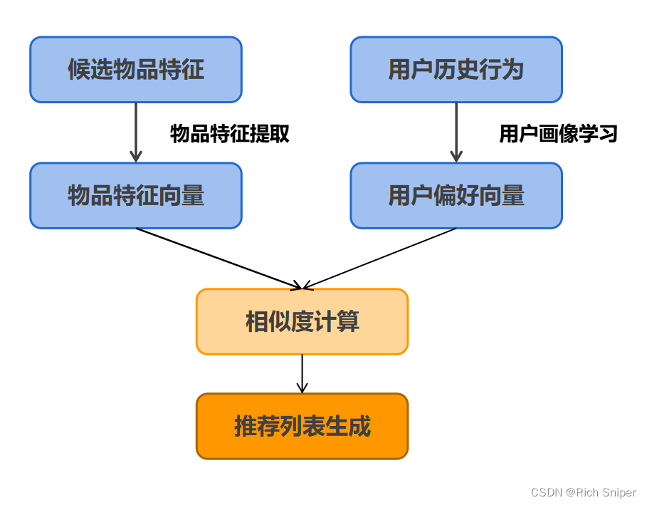
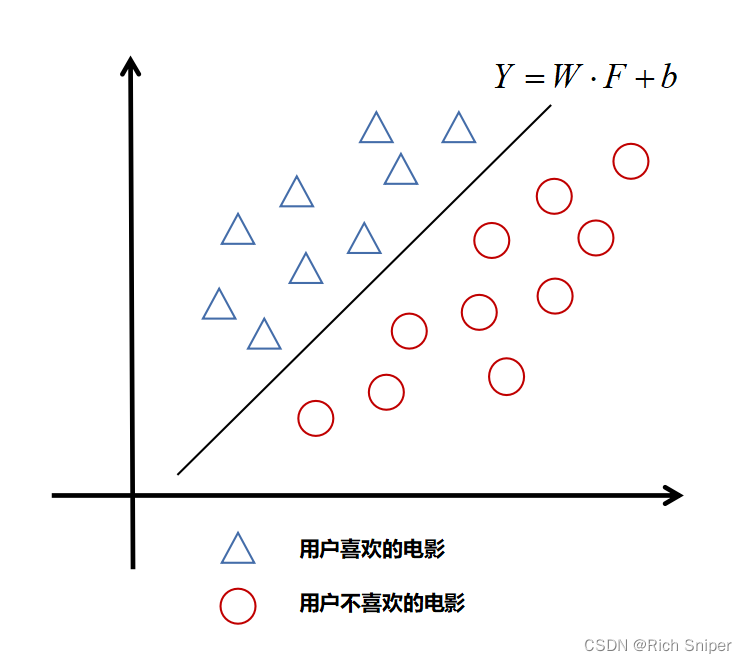
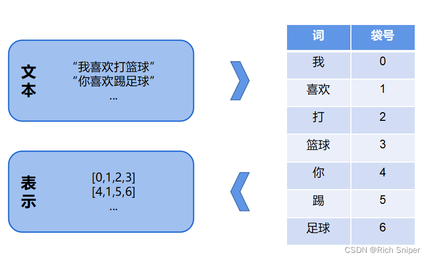

# 经典推荐算法--基于内容的推荐算法
```text
基于内容的推荐算法（Content-Based Recommendations，CB）是一种经典推荐算法，
一般只依赖于用户及物品自身的内容属性和行为属性，而不涉及其他用户的行为，
在【冷启动】的情况下（即新用户或者新物品）依然可以做出推荐。
```

由于不同的数据有不同的格式，所以推荐系统中的内容主要包括结构化数据、半结构化数据和非结构化数据。
针对不同的数据，有不同的推荐算法。

---

# 1.基于结构化内容的推荐
## 1.1 基本的基于内容的推荐算法
基本的基于内容的推荐算法只关注结构化数据。
在基于内容的推荐算法中，最重要的步骤就是抽取物品和用户的特征，通过计算物品特征向量和用户偏好向量之间的相似度进行推荐。
具体的计算过程如下图所示：



最常见的相似度计算公式就是余弦相似度。
若余弦相似度的值越接近于1，表示候选物品越接近用户偏好；若值越接近于-1，表示候选物品越不适合该用户。

在计算所有候选物品与用户的相似度之后，按照相似度从高到低进行排序，根据实际要求，保存TOP-K个候选物品并推荐给用户。

## 1.2 最近邻分类算法
K近邻（K-Nearest Neighbor，KNN）是一种非常有效且易于掌握的算法，目前广泛应用于推荐系统之中。

该算法的主要假设是：
在同一个特征空间中，如果与目标样本最相似的K个样本（近邻）大多属于同一种类别，则目标样本属于这个类别的可能性也会很高。

在推荐系统中，KNN的运用主要包括以下三步骤：

1）计算相似度。
```text
计算相似度是KNN算法中的关键步骤，其实就是找一个合适的方式来度量向量之间的距离（相似程度），
推荐系统中常用的计算方式有：皮尔逊相似度、余弦相似度、杰卡德相似度、欧氏距离等。
```

2）选择k个近邻。
```text
假设待推荐物品为m，在用户u评分过的所有物品中找出k个与物品m相似度最高的物品，并用N(u,m)表示这k个物品的集合。
```

3）计算预测评分。
```text
有了k个相似物品集合后，可以进行预测评分：最后，按照评分的高低进行排序，向用户推荐评分最高的N部电影。
```

## 1.3 基于相关性反馈的算法
Rocchio算法是信息检索领域的著名算法，主要用于解决相关性反馈（RF）问题。
用Rocchio算法构建用户画像向量时，通常假设该向量与用户喜欢的物品特征之间的相关性最大且与用户不喜欢的物品特征之间的相关性最小。

在基于内容的推荐中，可以类似地使用Rocchio算法对用户的原始特征向量进行不断的修改，实现对用户画像的实时更新，
用户u的特征向量定义如下：
```math
w_u = \frac{1}{I_r} \sum_{w_j ∈ I_r} w_j - \frac{1}{I_nr} \sum_{w_j ∈ I_nr} w_j
```
式中， $I_r$ $I_{nr}$分别表示用户喜欢与不喜欢的物品集合；$w_j$表示物品j的特征向量。
算法的目标是：新的用户特征向量与用户喜欢的物品的特征向量最相似，与用户不喜欢的物品的特征向量最不同。

在实际中，目标用户的特征向量可能已存在，此时只需要更新即可：
```math
w_u = 𝛼 U_0 + 𝛽 \frac{1}{I_r} \sum_{w_j ∈ I_r} w_j - 𝛾 \frac{1}{I_nr} \sum_{w_j ∈ I_nr} w_j
```
式中，$U_0$ 表示初始用户的特征向量；𝛼, 𝛽, 𝛾 分别表示初始向量特征、正反馈、负反馈的权重，
可以根据经验进行设置，例如在历史数据较多时可以适当增大𝛽和𝛾。
在实际应用中，一般可以将𝛼设置为1，将𝛽设置为0.8，将𝛾设置为0.2，因为正反馈的重要性一般要比负反馈大。

从上述式子中可以看出，Rocchio算法和平均分很类似，只是多了负反馈的部分，并设置了三个权重以实现灵活调节。
另外Rocchio算法可以根据用户反馈实时更新用户特征向量，因为更新代价很小，所以可以用于实时推荐场景。

## 1.4 基于决策树的推荐
当候选物品的内容属性具有较好的结构化特点时，决策树通常会比KNN等算法具有可解释性方面的优势。
决策树可以将决策过程展示给用户，告诉用户该物品会被推荐的原因，提升推荐的可解释性。
决策树学习的关键是【如何选择最优的划分属性】。
一般而言，希望决策树的分支节点所包含的样本类别尽量少，即节点的纯度越来越高。
信息熵是度量样本纯度最常用的指标之一。
假设当前样本集合中第k类特征的比例为$p_k$(k=1,2,…,n)，则样本集合的信息熵：
```math
Ent(D) = - \sum_{k=1}^n p_k log_2 p_k
```
熵能够衡量变量的不确定性，数值越小，表示样本集合越单一，即不确定性越小。
当$p_k$为0或者为1时，则没有不确定性。接下来引入条件熵，通过获得更多的信息来减小不确定性。
条件熵定义了𝑋的条件分布概率的信息熵对𝑌的数学期望，具体如下：
```math
H(Y|X) = \sum_{k=1}^n p_k H(Y|X=x_k). 
```
信息增益是衡量信息熵与条件熵之间的差值，在决策树算法的训练过程中，可以用来选择特征。
信息增益的公式计算如：
```math
g(D,X) = H(D) − H(D|X)
```
在选择特征时，通常会选择当前信息增益最大的特征作为分类特征，接着以此类推，直到子树只包含一类用例为止。

## 1.5 朴素贝叶斯分类
朴素贝叶斯在分类领域属于老生常谈了，本文就不在赘述。
在基于贝叶斯定理的情况下，对于给定的候选物品，具有特征向量F，计算后验概率P(ck|F)，将后验概率最大的类作为输出，
具体的计算公式如下：
```math
y = f(x) = argmax_{c_k ∈ C} \frac{P(c_k)\prod_{i=1}^{n}P(f_i|c_k)}{P(F)}
```
式中，分母为常数，对于所有类别都相同，因此上式等价于最大化分子。

## 1.6 基于线性分类的内容推荐算法
机器学习中经典的线性分类器可以很好的对推荐内容进行分类。如下图所示，假设输入的电影的特征为
$𝐹 =(𝑓₁,𝑓₂,…,𝑓ₙ)$，其中𝑓ᵢ表示电影的第i个特征分量，输出的结果𝑌表示用户是否喜欢该电影。
线性模型的目标就是尝试在特征空间𝐹中找到一个平面Y = W ⋅ F + b，希望该平面能够将用户喜欢和不喜欢的电影分开。



同样的，一般可以采用梯度下降法或最小二乘法来找到线性模型的最优参数。
对于候选电影，判断该电影的特征是否满足条件W⋅F+b>Y，然后基于分类的结果进行排序和推荐。

# 2.基于非结构化内容的推荐
非结构化数据是指数据结构不清晰甚至没有预先定义的数据，包括文本、图片、音频和视频等，这些数据难以用数据库中的表结构来表示。
相较于结构化数据，非结构化数据具有的不规则性和模糊性，令计算机难以理解。
虽然非结构化数据具有结构复杂、不标准和处理门槛高等缺点，
但较高的数据存量和丰富的内涵信息决定了非结构化数据是待被推荐系统发掘的宝藏。
各类非结构化数据都有其独特的表征方式，但处理思路是彼此相通的。

## 2.1 文本表示
常见的文本表示技术路线有两类，一种为经典机器学习中的离散式表示，另一种为深度学习中的分布式表示。

### （1）离散式表示（Discrete Representation）

#### 1）独热编码（One-Hot Encoding）。
独热编码是分类变量的一种二进制向量表示方法，采用N位状态寄存器对N个状态进行编码，
每个寄存器为独立编码的一种状态，且在任何时候有且仅有一个状态寄存器被激活。

例如，篮球、足球和橄榄球的序号分别为0、1、2，对应独热编码中第0、1、2位为1，即独热编码分别为 [1,0,0]、[0,1,0]、[0,0,1]。

在独热编码下，各状态表示之间的欧式距离均相同，对于相互独立的状态类别而言，这种编码方式更加合理。
但是如果状态之间存在某种连续型关系，那么使用分布式表示更为合适。
最后，利用独热编码得到的特征非常稀疏，从表征特征的结构上可以看出，如果状态空间过大，则会带来维度灾难。

#### 2）词袋模型（Bag Of Word）。
词袋模型是将文本转化为向量表示的一种比较简单的语言模型。
如下图所示，词袋模型将文本看作文本中所有词的集合，它不考虑词的顺序，只考虑单词表中单词在这个句子中的出现次数。



词袋模型十分简单且易实现，但其不能考虑文本的结构和顺序，表示能力有限。 

#### 3）N-gram模型。
N-gram模型是一种基于统计语言模型的算法，是对词袋模型的扩展。
此模型以相邻的N个词为单位，并假设第N个词的出现只与前面N-1个词相关（马尔科夫假设），而与其他更早出现的词都不相关。
在N-gram模型视角下，文本整体的出现概率=组成文本的各个词出现的条件概率之积。
N-gram词组的条件概率可以通过N-gram词组出现的频率近似获得。

常用的是二元的Bi-gram（N=2）和三元的Tri-gram（N=3），当N=1时，退化为词袋模型。

#### 4）TF-IDF模型（Term Frequency - Inverse Document Frequency）。
TF-IDF是一种评估单词对语料库中文本的重要程度的算法，其核心假设是文本中某单词的重要性正比于该单词在该文本中的出现频率，
同时反比于该单词在整个语料库中出现的概率。

单词i对文本j的词频（TF）定义如下：
```math
TF_{i,j} = \frac{n_{i,j}}{\sum_k n_{k,j}}
```
式中，$n_{i,j}$为单词i在文本j中的出现次数，分母为文本j中所有单词出现次数之和。

单词的逆向文本频率（IDF）定义如下：
```math
IDF_I = log \frac{|D|}{|{j:t_i ∈ d_j}|}
```
式中，分子为语料库中全部文本的数目，分母为语料库中包含单词i的文本数目。

单词i对文本j的TF-IDF重要度定义：
```math
TF-IDF_{i,j} = TF_{i,j} × IDF_i
```
从上述公式中不难看出，对某文本具有高重要度的单词需要同时满足该文本内高词频和语料库内低词频两个条件，
前者过滤了偶尔使用的单词，后者过滤了常见的高频词，最终筛选出该文本中反复提及的、具有话题性的单词。

### （2）分布式表示

分布式表示的思路是通过机器学习建立一个从单词到低维连续向量空间的映射，
使得语义相似的单词在向量空间中被映射到较为接近的区域，而语义无关的单词则被映射到较远的区域。

#### 1）基于共现矩阵（Co-occurrence Matrix）的模型。
通常来说，语义比较接近的词在上下文中经常共同出现，此现象为建模词与词之间的相似度提供了思路。
基于共现矩阵的模型就是将语料库里的所有句子扫描一遍，数出每个单词周围出现其他单词的次数，构造词邻接矩阵，
将单词对应列/行的值作为该单词的向量表示。

但是在实际应用中，往往需要对向量进行降维，利用特征值分解或者奇异值分解的方式，
通过保留特征最大的有限分量，构造起最大化保留高维稀疏共现矩阵信息的低维稠密嵌入矩阵。

#### 2）基于神经网络的模型。
在分布式表示方面，深度学习相比传统方法具有较大优势。
基于深度学习的文本表示方法的核心理念是用向量表示文本，如用向量表示单词的Word2Vec方法和用向量表示文本的Paragraph2Vec方法。
文本被向量化表示后，可以通过点乘或余弦相似度等方式高效计算其相似度，然后基于内容或协同过滤算法等进行推荐。

## 2.2 非文本表示

### （1）图像表示

在深度学习兴起之前，图像的特征提取通常依赖于手工的特征提取。
一类是通用特征，包括像素级别特征（像素的颜色和位置）、局部特征（图像上部分区域特征的汇总）和全局特征（图像全部特征的汇总）；
另一类是领域相关特征，这些特征与应用类型强相关，如人脸和指纹等。
可以将用户交互过的条目的图像特征看作是用户兴趣的表示，然后训练一个分类器来区分用户喜欢的条目或者不喜欢的条目。

基于深度学习的图像表征则尝试理解图片本身。
图像经特定任务预训练的表征模型编码，转化为分布式向量表示，然后通过基于K近邻的推荐算法进行推荐。
此外，也可以采用端到端的方式，同时训练图像表征和推荐模型。

### （2）视频表示

视频的表示往往通过表征与视频相关联的文本进行，例如视频的标题、描述等长文本和标签等稀疏文本属性。
而在深度学习兴起之前，标签是视频推荐任务的核心，YouTube的User-Video图游历算法是解决视频标签推荐一个优秀案例。

User-Video算法的核心为共同观看关系（有点协同过滤的雏形），
首先构建用户-视频二部图，然后基于同时观看过两个视频的用户数目等规则生成视频之间的连边，最后在生成的视频关系图上进行标签吸附。
在标签吸附过程中，各节点首先根据邻居传递的标签计算自己的新标签，
然后将新标签传播回邻域，在此过程中，标签逐渐扩散并最终收敛，在所有与任意原始节点有通路的节点上形成稳定平滑的分布。
视频的相似度计算如下：
```math
r(v_i, v_j) = \frac{c_{ij}}{f(v_i,v_j)}
```
式中，$c_{ij}$ 表示视频在所有会话中被共同观看的次数；
$f(v_i,v_j)$ 表示一个规整化函数，试图消视频的流行度，一种简单的方案是将两个视频被观看的次数相乘。

虽然深度学习技术已经取得长足的发展，但是在视频表示中，基于标签的方法计算简便，因此仍广泛应用于大型推荐系统的召回环节。

### （3）音频表示

音频的表示同样有两种：借助关联文本进行表示和针对音频本身进行表示。
以音乐表征为例，音乐的元数据可以分为三类：
Editorial metadata（由音乐发布者声称对该音乐的一些标签）、
Cultural metadata（歌曲的消费规律、共现关系等）
和acoustic metadata（对音频信号的分析，例如beat、tempo、pitch、mood等）。

前两种元数据分别以标签、长文本的形式呈现，可用前文中介绍的方法进行计算，
而音频信号则可以用哼唱检索进行处理，该技术从音频信号中提取信息，与数据库对比，然后按相似度进行排序和检索。

哼唱检索主要有三个关键部分：
起点检测（Onset Detection）、基频提取（Pitch Extraction）和旋律匹配（Melody Matching）。
起点检测通过建模捕捉音频信号中某种特征的变化，从而实现对一段声音起点的检测，
具体方法有Magnitude Method（以音量为特征）、Short-term Energy Method（以能量为特征）
和Surf Method（以坡度为特征）等。基频提取通过自相关函数（AF）、平均振幅差函数（AMDF）、
谐波积谱（HPS）等估计每个音的基本频率。
旋律匹配将提取的序列转为MIDI数字，并与数据库中的数字序列进行比较，
常用方法有隐马尔科夫模型（HMM）、动态规划（DP）和线性缩放（LS）等。

# 3.总结
## 3.1 基于内容推荐的优势
（1）用户之间不相互依赖

每个用户的特征只依赖其本身对物品的喜欢，与他人的行为无关。

（2）便于解释

在某些场景中，能够告诉用户被推荐物品具有某种属性，而这些属性经常在用户喜欢的物品中出现，从而对推荐结果进行解释。

（3）不受新用户或新物品的约束

当一个新用户进入推荐系统时，可以基于用户的个人属性信息，来进行内容的推荐，而不受冷启动的影响。

## 3.2 基于内容推荐的局限
（1）特征抽取比较困难

如果物品描述是非结构化的，难以准确且全面地抽取物品特征。

（2）难以挖掘出用户潜在的其他兴趣，缺乏多样性

基于内容推荐仅依赖于用户的个人属性及历史偏好，因此产生的推荐结果会与用户历史交互过的物品具有非常高的相似性，
从而使推荐缺乏多样性和新鲜感。

