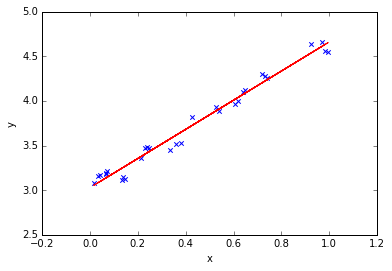

回归分析的主要算法包括：
```text
1）线性回归(Linear Regression)
2）逻辑回归（Logistic regressions）
3）多项式回归(Polynomial Regression)
4）逐步回归(Step Regression)
5）岭回归(Ridge Regression)
6）套索回归(Lasso Regression)
7）弹性网回归(ElasticNet)
```

---

# 线性与非线性
**线性**：两个变量之间的关系是**一次函数**关系的——图象是直线，叫做线性。

注意：线性是指广义的线性，也就是数据与数据之间的关系。

**非线性**：两个变量之间的关系**不是一次函数**关系的——图象不是直线，叫做非线性。

那到底什么时候可以使用线性回归呢？统计学家安斯库姆给出了四个数据集，被称为安斯库姆四重奏。


从这四个数据集的分布可以看出，并不是所有的数据集都可以用一元线性回归来建模。
现实世界中的问题往往更复杂，变量几乎不可能非常理想化地符合线性模型的要求。
因此使用线性回归，需要遵守下面几个假设：

- 线性回归是一个回归问题。
- 要预测的变量 y 与自变量 x 的关系是线性的（图2 是一个非线性）。
- 各项误差服从正太分布，均值为0，与 x 同方差（图4 误差不是正太分布）。
- 变量 x 的分布要有变异性。
- 多元线性回归中不同特征之间应该相互独立，避免线性相关。

### 回归问题与分类问题

与回归相对的是分类问题（classification），分类问题要预测的变量y输出集合是有限的，预测值只能是有限集合内的一个。
当要预测的变量y输出集合是无限且连续，我们称之为回归。
比如，天气预报预测明天是否下雨，是一个二分类问题；预测明天的降雨量多少，就是一个回归问题。

### 变量之间是线性关系

线性通常是指变量之间保持**等比例**的关系，从图形上来看，变量之间的形状为直线，斜率是常数。
这是一个非常强的假设，数据点的分布呈现复杂的曲线，则不能使用线性回归来建模。
可以看出，四重奏右上角的数据就不太适合用线性回归的方式进行建模。

### 误差服从均值为零的正态分布

前面最小二乘法求解过程已经提到了误差的概念，误差可以表示为误差 = 实际值 - 预测值。

可以这样理解这个假设：
线性回归允许预测值与真实值之间存在误差，随着数据量的增多，这些数据的误差平均值为0；
从图形上来看，各个真实值可能在直线上方，也可能在直线下方，当数据足够多时，各个数据上上下下相互抵消。
如果误差不服从均值为零的正态分布，那么很有可能是出现了一些异常值，数据的分布很可能是安斯库姆四重奏右下角的情况。

这也是一个非常强的假设，如果要使用线性回归模型，那么必须假设数据的误差均值为零的正态分布。

### 变量 x 的分布要有变异性

线性回归对变量x也有要求，要有一定变化，不能像安斯库姆四重奏右下角的数据那样，绝大多数数据都分布在一条竖线上。

### 多元线性回归不同特征之间相互独立

如果不同特征不是相互独立，那么可能导致特征间产生共线性，进而导致模型不准确。
举一个比较极端的例子，预测房价时使用多个特征：房间数量，房间数量*2，-房间数量等，特征之间是线性相关的，
如果模型只有这些特征，缺少其他有效特征，虽然可以训练出一个模型，但是模型不准确，预测性差。

---

# 线性回归
机器学习最常见的场景是监督学习：给定一些数据，使用计算机学习到一种模式，然后用它来预测新的数据。
一个简单的监督学习任务可以表示为，给定N个量量数据对$(x_i,y_i)_{i=1}^{N}$，使用某种机器学习模型
对其进行建模，得到一个模型（model），其中某个给定的数据对为样本（sample），x为特征（feature），y为真实值（label）。


例如，上图展示了收入数据集，展示了手教育程度与年度收入之间的数据。根据我们的社会经验和图中的数据分布，
我们能使用一个直线来描述“收入会随着受教育时间的增多而增多”的现象。
所以针对这个数据集，可以使用一个最简单的机器学习模型——一元线性回归。

## 一元线性回归
公式(0)
```text
y = m * x + b                                   
```
中学时，我们经常使用上面的方程来解一些数学问题，方程描述了变量y随着变量x而变化。
方程从图形上来看，是一条直线。如果建立好这样的数学模型，已知我们就可以得到预测的$\hat{y}$了。
统计学家给变量带上了一个小帽子，表示这是预测值，以区别于真实观测到的数据。
方程只有一个自变量 x，且不含平方立方等非一次项，因此被称为一元线性方程。


在对收入数据集进行建模时，我们可以对参数 m和b 取不同值来构建不同的直线，这样就形成了一个参数家族。
参数家族中有一个最佳组合，可以在统计上以最优的方式描述数据集。
那么监督学习的过程就可以被定义为: 给定N个数据对(x,y)，寻找最佳参数 $m^*$和 $b^*$，使模型可以更好地拟合这些数据。

上图给除了不同的参数，到底哪条直线是最佳的呢？如何衡量模型是否以最优的方式拟合数据呢？
机器学习用【损失函数(loss function)】的来衡量这个问题。
损失函数又被称为【代价函数(cost function)】，它计算了模型 预测值$\hat{y}$ 和 真实值y 之间的差异程度。
从名字也可以看出，这个函数计算的是模型犯错的损失或代价，损失函数越大，模型越差，越不能拟合数据。
统计学家通常使用L($\hat{y}$,y)来表示损失函数。


对于线性回归，一个简单实用的损失函数为 预测值 与 真实值 误差的平方。上图了展示了收入数据集上预测值与真实值之间的误差。

公式(1)：
```math
L(\hat{y_i},y_i) = (\hat{y_i} - y_i)^2                                      
```
公式(1)来表示单个样本点上预测值与真实值的误差。

公式(2)：
```math
L(\hat{y},y) = \frac{1}{N} \sum_{i=1}^{N}(\hat{y_i} - y_i)^2                
```
公式(3)：
```math
L(\hat{y},y) = \frac{1}{N} \sum_{i=1}^{N}[(mx_i + b) - y_i]^2               
```
公式(2)表示将数据集的所有误差求和取平均，再在其基础上代入公式$\hat{y}=mx+b$，得到公式(3)。

公式(4)：
```math
m^*,b^* 
= \underset{m,b}{arg min} L(m,b)
= \underset{m,b}{arg min} \frac{1}{N} \sum_{i=1}^{N}[(mx_i + b) - y_i]^2     
```
公式(4)中 arg min是一种常见的数学符号，表示寻找能让乚函数最小的参数vm^*$和$b^*$。


误差从图形上看是一条线段，平方后就形成了一个正方形，将正方形的面积求和再取平均，就是公式3的损失函数。
所有的正方形的平均面积越小，损失越小。
对于给定数据集，x和y的值是已知的，参数m和b是需要求解的，模型求解的过程就是解公式4的过程。
以上就是最小二乘法的数学表示，“二乘”表示取平方，“最小”表示损失函数最小。
至此我们发现，有了损失函数，机器学习的过程被化解成对损失函数求最优解过程，即求一个最优化问题。


那为什么只能用取平方，不能用别的办法，比如取绝对值呢？
中学的时候学过，平方函数有最小值，能保证后面求解参数的时候，用求导的方式快速找到最小值，而绝对值函数则不具有这个属性。

## 最小二乘法参数求解
对于公式(4)中的函数，可以对m和b分别求导，导数为0时，损失函数最小。

公式(5)：
```math
\frac{\eth}{\eth m} L(m,b)
= \frac{2}{N} \sum_{i=1}^{N} x_i (m x_i + b - y_i)
= 2m(\frac{1}{N} \sum_{i=1}^{N} x_i) + 2b(\frac{1}{N} \sum_{i=1}^{N} x_i) - 2 (\frac{1}{N} \sum_{i=1}^{N} x_i y_i)
```
公式(6)：
```math
\frac{\eth}{\eth m} L(m,b)
= \frac{2}{N} \sum_{i=1}^{N} x_i (m x_i + b - y_i)
= 2m(\frac{1}{N} \sum_{i=1}^{N} x_i) + 2b - 2 (\frac{1}{N} \sum_{i=1}^{N} y_i)
```
公式(5)和(6)是损失函数对m和b进行求偏导。

公式(7)：
```math
\bar{x}= \frac{1}{N} \sum_{i=1}^{N} x_i \quad\quad \bar{y}= \frac{1}{N} \sum_{i=1}^{N} y_i
```
公式(8)：
```math
s^2= \frac{1}{N} \sum_{i=1}^{N} {x_i}^2 \quad\quad \rho= \frac{1}{N} \sum_{i=1}^{N} {y_i}^2
```
结果中重复出现了一些关于x和y的求和项，给定数据集，这些求和项可以通过计算求出来，是常数，可以用公式(7)和(8)表示。

公式(9)：
```math
\frac{\eth}{\eth m} L(m,b) = 0 \rightarrow ms^2 + b \hat{x} - \rho = 0
```
公式(10)：
```math
\frac{\eth}{\eth b} L(m,b) = 0 \rightarrow m \bar{x} + b - \bar{y} = 0
```
当导数为0时，可以求得最小值，即由公式9和10可以得到最优解m和b。

公式(11)：
```math
m^* = \frac{\rho - \bar{x} \bar{y}}{s^2 - {\bar{x}}^2} 
\quad\quad
b^* = \bar{y} - \bar{x}m^*
```
以上就是一元线性回归的最小二乘法求解过程。

很多机器学习模型中都需要经历上述过程:确定损失函数，求使损失函数最小的参数。
求解过程会用到一些简单的微积分，因此复习一下微积分中偏导数部分，有助于理解机器学习的数学原理。

## 多元线性回归
现在我们把 x 扩展为多元的情况，即多种因素共同影响变量y。
现实问题也往往是这种情况，比如，要预测房价，需要考虑包括是否学区、房间数量、周边是否繁华、交通方便性等。
共有D种维度的影响因素，机器学习领域将这D种影响因素称为特征(feature)。
每个样本有一个需要预测的y和一组D维向量X。
原来的参数m变成了D维的向量w。
这样，某个 $y_i$ 可以表示成$b + \sum_{d=1}^{D} w_d x_{i,d}$，其中 $x_{i,d}$ 表示第i个样本向量$X_i$中第d维特征值。
公式(12)：
```math
y_i = b + \sum_{d=1}^{D} w_d x_{i,d} \quad\quad b = w_{D+1}
```
公式(13)：
```math
y_i = \sum_{d=1}^{D+1} w_d x_{i,d}
```
为了表示起来更方便，独立出来的偏置项可以使用下面的方法归纳到向量 w 中：
使用 $b= w{D+1}$ 来表示参数中的b，将b添加到特征向量的最后一位，将D维特征扩展成D+1维，
也就是在每个 x 最后添加一个值为1的项，这样就可以由公式(12)可以得到公式(13)。
```math
W = 
\begin{bmatrix}
w_1 \\ w_2 \\ \vdots \\ w_D \\ w_{D+1}
\end{bmatrix}

\quad\quad

X = 
\begin{bmatrix}
x_1 \\ x_2 \\ \vdots \\ x_N
\end{bmatrix}
  = 
\begin{pmatrix}
x_{1,1} & x_{1,2} & \cdots & x_{1,D} & 1 \\
x_{2,1} & x_{2,2} & \cdots & x_{2,D} & 1 \\
\vdots  & \vdots  & \ddots & \vdots  & \vdots \\
x_{N,1} & x_{N,2} & \cdots & x_{N,D} & 1 
\end{pmatrix}

\quad\quad

Y = 
\begin{bmatrix}
y_1 \\ y_2 \\ \vdots \\ y_N
\end{bmatrix}
```
各个向量形状如公式(14)所示。
其中，向量W表示模型中各个特征的权重；矩阵X的每一行是一条样本，每条样本中有D+1个特征值，分别为该样本在不同维度上的取值；
向量Y为真实值。
可以用内积的形式来表示求和项：$ \sum_{d=1}^{D+1} w_d x_{i,d} = W^T x_i $。
N条样本组成的数据可以表示为：$ Y = X W $

公式(15)：
```math
y_i = \sum_{d=1}^{D+1} w_d x_{i,d} = W_T x_i \Rightarrow Y = X W
```
尽管公式(13)可以描述变量之间的关系，但是一般机器学习领域更喜欢使用公式(15)这样的向量乘法的形式。
这不仅因为这样表示起来更简单，也是因为现代计算机对向量计算做了大量优化，
无论是CPU还是GPU都喜欢向量计算，并行地处理数据，可以得到成百上千倍的加速比，

需要注意的是，公式中不加粗的表示标量，加粗的表示向量或矩阵。


比一元线性回归更为复杂的是，多元线性回归组成的不是直线，是一个多维空间中的超平面，数据是散落在超平面的两侧。

公式(16)：
```math
L(w) = (X W - Y)^T (X W - Y) = ||X W - Y||_2^2
```
多元线性回归的损失函数仍然使用 预测值-真实值 的平方来计算，公式(16)为整个模型损失函数的向量表示。
这里出现了一个竖线组成的部分，它被称作L2范数的平方。
范数通常针对向量，也是一个机器学习领域经常用到的数学符号，公式(17)展示了一个向量X的L2范数的平方以及其导数。

公式(17)：
```math
||X||_2^2 = ((\sum_{i=1}^N x_i^2)^1 / 2)^2
\quad\quad
\nabla ||X||_2^2 = 2X
```
公式(18)：
```math
\frac{\eth}{\eth W} L(W) = 2 X^T (X W - Y) = 0
```
对公式(16)中的向量W求导，得到公式18。

公式(19)：
```math
X^T X W = X^T Y = (X^T X)^{-1} X^T X W = (X^T X)^{-1} X^T Y
```

公式(20)：
```math
W^* = = (X^T X)^{-1} X^T Y
```

公式(19)组成向量W的矩阵方程，根据线性代数的知识，最优解其实是在解这个矩阵方程，英文中称这个公式为 Normal Equation 。

线性规划可以得到一个确定的最优解，这些最优解组成了一个最优超平面。

读到这里，一些对机器学习略有了解的朋友可能会提问，为什么求解时没有提到梯度下降。
其实是可以使用梯度下降代替解矩阵方程。
公式(20)中矩阵求逆的计算量比较大，复杂度在O(n)级别。
当特征维度达到百万级以上或样本数量极大时，计算时间非常长，
单台计算机内存甚至存储不下这些参数，求解矩阵方程的办法就不现实了，必须使用梯度下降法。
梯度下降法以一定的精度逼近最优解，求解速度在数据量大时非常有优势，但不一定能得到绝对的最优解。
本专栏未来将详细介绍梯度下降法。

前面花了点时间描述线性规划的求解过程，出现了不少公式，跟很多朋友一样，
笔者以前非常讨厌看公式，看到一些公式就头大，因此觉得机器学习非常难。
不过，静下心来仔细读一遍，会发现其实这些公式用到的都是微积分、线性代数中比较基础的部分，
并不需要高大上的知识，理工科背景的朋友应该都能看得懂。

---

# 多重共线性
在多元线性回归模型经典假设中，其重要假定之一是回归模型的解释变量之间不存在线性关系，
也就是说，解释变量X1，X2，……，Xk 中的任何一个都不能是其他解释变量的线性组合。
如果违背这一假定，即线性回归模型中某一个解释变量与其他解释变量间存在线性关系，就称线性回归模型中存在多重共线性。
严重的多重共线性可能会产生问题，因为它可以增大回归系数的方差，使它们变得不稳定。
以下是不稳定系数导致的一些后果：

- 即使预测变量和响应之间存在显著关系，系数也可能看起来并不显著。
- 高度相关的预测变量的系数在样本之间差异很大。
- 从模型中去除任何高度相关的项都将大幅影响其他高度相关项的估计系数。高度相关项的系数甚至会包含错误的符号。

### 共线性出现的原因

多重共线性问题就是指一个解释变量的变化引起另一个解释变量地变化。

原本自变量应该是各自独立的，根据回归分析结果，能得知哪些因素对因变量Y有显著影响，哪些没有影响。
如果各个自变量x之间有很强的线性关系，就无法固定其他变量，也就找不到x和y之间真实的关系了。
除此以外，多重共线性的原因还可能包括：

- 数据不足。在某些情况下，收集更多数据可以解决共线性问题。
- 错误地使用虚拟变量。（比如，同时将男、女两个虚拟变量都放入模型，此时必定出现共线性，称为完全共线性）

### 共线性的判别指标

有多种方法可以检测多重共线性，较常使用的是回归分析中的VIF值，VIF值越大，多重共线性越严重。
一般认为VIF大于10时（严格是5），代表模型存在严重的共线性问题。
有时候也会以容差值作为标准，容差值=1/VIF，所以容差值大于0.1则说明没有共线性(严格是大于0.2)，
VIF和容差值有逻辑对应关系，两个指标任选其一即可。

除此之外，直接对自变量进行相关分析，查看相关系数和显著性也是一种判断方法。
如果一个自变量和其他自变量之间的相关系数显著，则代表可能存在多重共线性问题。

如存在严重的多重共线性问题，可以考虑使用以下几种方法处理：

（1）手动移除出共线性的变量

先做下相关分析，如果发现某两个自变量X（解释变量）的相关系数值大于0.7，则移除掉一个自变量（解释变量），然后再做回归分析。
此方法是最直接的方法，但有的时候我们不希望把某个自变量从模型中剔除，这样就要考虑使用其他方法。

（2）逐步回归法

让系统自动进行自变量的选择剔除，使用逐步回归将共线性的自变量自动剔除出去。
此种解决办法有个问题是，可能算法会剔除掉本不想剔除的自变量，如果有此类情况产生，此时最好是使用岭回归进行分析。

（3）增加样本容量

增加样本容量是解释共线性问题的一种办法，但在实际操作中可能并不太适合，原因是样本量的收集需要成本时间等。

（4）岭回归

上述第1和第2种解决办法在实际研究中使用较多，但问题在于，如果实际研究中并不想剔除掉某些自变量，某些自变量很重要，不能剔除。
此时可能只有岭回归最为适合了。岭回归是当前解决共线性问题最有效的解释办法。

---

# 常用的回归模型评估指标
- 解释方差（ Explained variance score）
- 绝对平均误差（Mean absolute error）
- 均方误差（Mean squared error）
- 决定系数（R² score）


# 算法优缺点
优点：
- （1）思想简单，实现容易。建模迅速，对于小数据量、简单的关系很有效；
- （2）是许多强大的非线性模型的基础。
- （3）线性回归模型十分容易理解，结果具有很好的可解释性，有利于决策分析。
- （4）蕴含机器学习中的很多重要思想。
- （5）能解决回归问题。

缺点：
- （1）对于非线性数据或者数据特征间具有相关性多项式回归难以建模.
- （2）难以很好地表达高度复杂的数据。

---

# 算法实现
简单的线性回归算法
```text
import numpy as np
import matplotlib.pyplot as plt

x = np.array([1, 2, 3, 4, 5])
y = np.array([1, 3.0, 2, 3, 5])
plt.scatter(x, y)

x_mean = np.mean(x)
y_mean = np.mean(y)
num = 0.0
d = 0.0
for x_i, y_i in zip(x, y):
    num += (x_i - x_mean) * (y_i - y_mean)
    d += (x_i - x_mean) ** 2
a = num / d
b = y_mean - a * x_mean
y_hat = a * x + b

plt.scatter(x, y)
plt.plot(x, y_hat, c='r')

x_predict = 4.8
y_predict = a * x_predict + b

plt.scatter(x_predict, y_predict, c='b', marker='+')
plt.show()
```


基于sklearn的简单线性回归
```text
import numpy as np
import matplotlib.pyplot as plt
from sklearn.linear_model import LinearRegression  # 线性回归

# 样本数据集，第一列为x，第二列为y，在x和y之间建立回归模型
data = [
    [0.067732, 3.176513], [0.427810, 3.816464], [0.995731, 4.550095], [0.738336, 4.256571], [0.981083, 4.560815],
    [0.526171, 3.929515], [0.378887, 3.526170], [0.033859, 3.156393], [0.132791, 3.110301], [0.138306, 3.149813],
    [0.247809, 3.476346], [0.648270, 4.119688], [0.731209, 4.282233], [0.236833, 3.486582], [0.969788, 4.655492],
    [0.607492, 3.965162], [0.358622, 3.514900], [0.147846, 3.125947], [0.637820, 4.094115], [0.230372, 3.476039],
    [0.070237, 3.210610], [0.067154, 3.190612], [0.925577, 4.631504], [0.717733, 4.295890], [0.015371, 3.085028],
    [0.335070, 3.448080], [0.040486, 3.167440], [0.212575, 3.364266], [0.617218, 3.993482], [0.541196, 3.891471]
]

# 生成X和y矩阵
dataMat = np.array(data)
X = dataMat[:, 0:1]  # 变量x
y = dataMat[:, 1]  # 变量y

# ========线性回归========
model = LinearRegression(copy_X=True, fit_intercept=True, n_jobs=1)
model.fit(X, y)  # 线性回归建模
print('系数矩阵:\n', model.coef_)
print('线性回归模型:\n', model)
# 使用模型预测
predicted = model.predict(X)

plt.scatter(X, y, marker='x')
plt.plot(X, predicted, c='r')

plt.xlabel("x")
plt.ylabel("y")
plt.show()
```
输出：
```text
系数矩阵:
 [1.6314263]
线性回归模型:
 LinearRegression(n_jobs=1)
```




