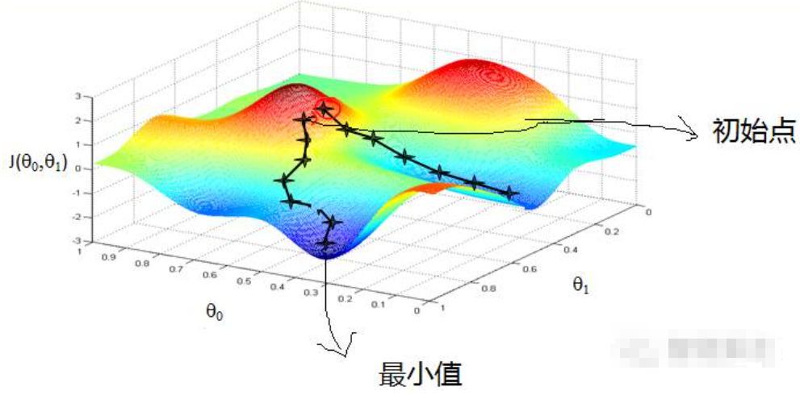

# 一、算法介绍
Logistic regression （逻辑回归）是一种非线性回归模型，
特征数据可以是连续的，也可以是分类变量和哑变量，
是当前业界比较常用的机器学习方法，用于估计某种事物的可能性，主要的用途：

- 分类问题：如，反垃圾系统判别，通过计算被标注为垃圾邮件的概率和非垃圾邮件的概率判定；
- 排序问题：如，推荐系统中的排序，根据转换预估值进行排序；
- 预测问题：如，广告系统中CTR预估，根据CTR预估值预测广告收益；

这个世界是随机的，所以万物的发生都可以用可能性或者几率（Odds）来表达。
“几率”指的是某事物发生的可能性与不发生的可能性的比值。

LR可以用来回归，也可以用来分类，主要是二分类。logistic回归模型在多分类问题上的推广是softmax regression。

# 二、算法原理

Regression问题的常规步骤为：
- 1）寻找h函数（即hypothesis）；
- 2）构造J函数（损失函数）；
- 3）想办法使得J函数最小并求得回归参数（θ）

LR在分类问题中，是经过学习得到一组权值，$θ_0,θ_1,...,θ_m$。
当加入测试样本集的数据时,权值与测试数据线性加和，即$z = θ_0 + θ_1 × x_1+...+ θ_m × x_m$，求出一个z值为样本的分类概率。
LR分类问题主要在于得到分类的权值，权值是通过h函数求得。

在实际应用中我们需要将Hypothesis的输出界定在0和1之间，既：
```math
0 < h_{\theta}(x) < 1
```
但是线性回归无法做到，可以引用LR的h函数是一个Sigmoid函数：
```math
h_{\theta}(x) = g(θ^T x) = \frac{1}{1 + e^{-θ^T x}}
\quad\quad
g(z) = \frac{1}{1 + e^{-z}}
```
g(z)是一个sigmoid函数，函数的定义域(-inf,+inf)，值域为（0，1），
因此基本的LR分类器只适合二分类问题，Sigmoid函数是一个“S”形，如下图：


对sigmoid函数求导数形式为：
```math
g'(z) = \frac{d}{dz} \frac{1}{1 + e^{-z}} \\
= \frac{1}{(1+e^{-z})^2} (e^{-z}) \\
= \frac{1}{1 + e^{-z}} (1 - \frac{1}{(1 + e^{-z})}) \\
= g(z)(1 - g(z))
```
对分类结果取1和0的概率假定为如下：
```text
P (y = 1 | x; θ)   =  hθ (x)
P (y = 0 | x; θ)   =  1 − hθ (x)
```
对于单个样本的后验概率可以合成表示成：
```math
p(y|x;θ) = (h_θ(x))^y (1 - h_θ(x))^{1-y}
```
logistic回归方法主要是用最大似然估计来学习的，所以m个样本的后验概率的似然函数为：
```math
L(θ) = p(\vec{y}|X;θ) \\
= \prod_{i=1}^{m} p(y_i|x_i;θ) \\
= \prod_{i=1}^{m} (h_θ(x_i))^{y_i} (1 - h_θ(x_i))^{1-y_i}
```
对数似然函数：
```math
ℓ(θ) = \log L(θ)
\\
= \sum_{i=1}^{m} y_i \log h(x_i) + (1 -y_i) \log (1 - h(x_i))
```
最大似然估计是求使ℓ(θ)取最大值的θ。
现在我们需要得到LR算法的cost functionJ(θ)，
根据李航博士《统计学习方法》中对cost function说明，统计学习中常用的损失函数有以下几种：

(1) 0-1损失函数(0-1 loss function):
```math
L(Y,f(x)) = 
\left\{
\begin{aligned}
1,Y ≠ f(x) 
\\
0,Y = f(x)
\end{aligned}
\right.
```
(2) 平方损失函数(quadratic loss function)
```math
L(Y,f(x)) = (Y - f(X))^2
```
(3) 绝对损失函数(absolute loss function)
```math
L(Y,f(x))=|Y-f(x)|
```

(4) 对数损失函数(logarithmic loss function) 或对数似然损失函数(log-likelihood loss function)
```math
L(Y,P(Y|X))=-logP(Y|X)
```

因此，根据对数损失函数，可以得到损失函数如下：
```math
Cost(h_θ(x),y) = 
\left\{
\begin{aligned}
-log(h_θ(x)), y = 1
\\
-log(1 - h_θ(x)), y = 0
\end{aligned}
\right.
```
```math
J(θ) = \frac{1}{m} \sum_{i=1}^{n} Cost(h_θ(x_i),y_i)
= - \frac{1}{m}
\left[ 
\begin{aligned}
\sum_{i=1}^{n} y_i log h_θ(x_i) + (1 - y_i)log(1 - h_θ(x_i))
\end{aligned}
\right] 
```

对损失函数求最小值，相当于对ℓ(θ)求最大值，式中m为了推导方便引入的，并无实际意义。
我们在这里用的是梯度上升算法求解，即θ := θ + α∇ℓ(θ)，
我们以一个训练实例（x,y）为例，利用偏导求每次一个梯度方向上损失函数最大值，通过梯度上升达到局部最优解。

下图为梯度下降方法示意图。



因此梯度上升方法如下：
```math
\begin{aligned}
\frac{ð}{ð θ_j} ℓ(θ) 
& = (y \frac{1}{g(θ^T x)} - (1-y) \frac{1}{1-g(θ^T x)}) \frac{ð}{ð θ_j} g(θ^T x)
\\
&= (y \frac{1}{g(θ^T x)} - (1-y) \frac{1}{1-g(θ^T x)}) g(θ^T x)(1 - g(θ^T x)) \frac{ð}{ð θ_j} θ^T x
\\
&= (y(1 - g(θ^T x))-(1-y)g(θ^T x))x_j
\\
&= (y-h_θ(x))x_j
\end{aligned}
```
```math
Θ_j := θ_j + α(y^{(i)} - h_θ(x^{(i)}))x_j^{(i)}
```
通过上式可以得到权值进行预测。

# 三、python实现过程

实现过程：


改进算法，随机梯度上升算法：


1）第一种改进算法，随机梯度算法，加大计算每组数据的梯度。

Logistic回归优点：
- 1、实现简单；
- 2、分类时计算量非常小，速度很快，存储资源低；

缺点：
- 1、容易欠拟合，一般准确度不太高
- 2、只能处理两分类问题（在此基础上衍生出来的softmax可以用于多分类），且必须线性可分；


https://cloud.tencent.com/developer/article/1080874