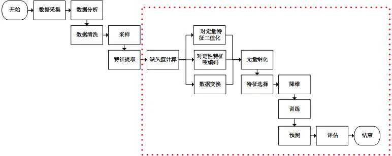
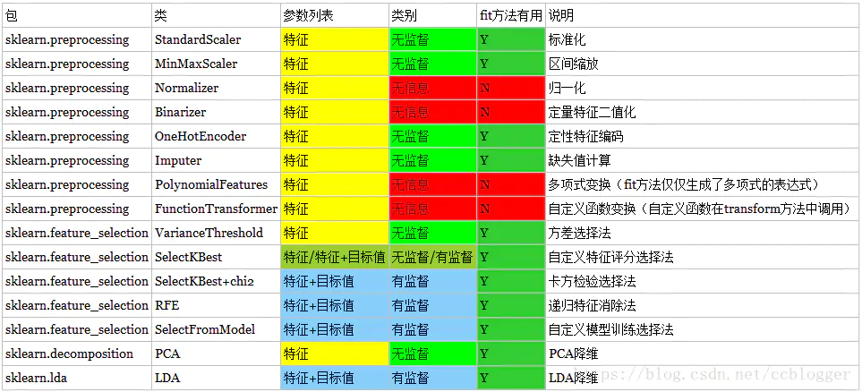

# 一、什么是独热编码？
在机器学习算法中，我们经常会遇到分类特征，例如：人的性别有男女，祖国有中国，美国，法国等。
这些特征值并不是连续的，而是离散的，无序的。通常我们需要对其进行特征数字化。

那什么是特征数字化呢？例子如下：
```text
性别特征：["男"，"女"]

祖国特征：["中国"，"美国，"法国"]

运动特征：["足球"，"篮球"，"羽毛球"，"乒乓球"]
```

假如某个样本（某个人），他的特征是这样的["男","中国","乒乓球"]，我们可以用 [0,0,3] 来表示，但是这样的特征处理并不能直接放入机器学习算法中。
因为类别之间是无序的（运动数据就是任意排序的）。

## 什么是独热编码（One-Hot）？

One-Hot编码，又称为一位有效编码，主要是采用N位状态寄存器来对N个状态进行编码，每个状态都由他独立的寄存器位，并且在任意时候只有一位有效。

One-Hot编码是分类变量作为二进制向量的表示。
首先，要求将分类值映射到整数值。
然后，每个整数值被表示为二进制向量，除了整数的索引之外，它都是零值，它被标记为1。

## One-Hot实际案例

就拿上面的例子来说吧，性别特征：["男","女"]，按照N位状态寄存器来对N个状态进行编码的原理，咱们处理后应该是这样的（这里只有两个特征，所以N=2）：
```text
男  =>  10
女  =>  01
```

祖国特征：["中国"，"美国，"法国"]（这里N=3）：
```text
中国  =>  100
美国  =>  010
法国  =>  001
```

运动特征：["足球"，"篮球"，"羽毛球"，"乒乓球"]（这里N=4）：
```text
足球    =>  1000
篮球    =>  0100
羽毛球  =>  0010
乒乓球  =>  0001
```

所以，当一个样本为["男","中国","乒乓球"]的时候，完整的特征数字化的结果为：
```text
[1，0]，[1，0，0]，[0，0，0，1]
合并
[1，0，1，0，0，0，0，0，1]
```

## One-Hot在python中的使用
```text
from sklearn import preprocessing

enc = preprocessing.OneHotEncoder()

enc.fit([[0, 0, 3], [1, 1, 0], [0, 2, 1], [1, 0, 2]])  # 这里一共有4个数据，3种特征

array = enc.transform([[0, 1, 3]]).toarray()  # 这里使用一个新的数据来测试

print(array)  # [[ 1  0  0  1  0  0  0  0  1]]
```

## 为什么使用one-hot编码来处理离散型特征?

在回归，分类，聚类等机器学习算法中，特征之间距离的计算或相似度的计算是非常重要的，
而我们常用的距离或相似度的计算都是在欧式空间的相似度计算，计算余弦相似性，基于的就是欧式空间。

而我们使用one-hot编码，将离散特征的取值扩展到了欧式空间，离散特征的某个取值就对应欧式空间的某个点。

将离散型特征使用one-hot编码，确实会让特征之间的距离计算更加合理。

比如，有一个离散型特征，代表工作类型，该离散型特征，共有三个取值，不使用one-hot编码，其表示分别是x_1 = (1), x_2 = (2), x_3 = (3)。
两个工作之间的距离是，(x_1, x_2) = 1, d(x_2, x_3) = 1, d(x_1, x_3) = 2。
那么x_1和x_3工作之间就越不相似吗？显然这样的表示，计算出来的特征的距离是不合理。
那如果使用one-hot编码，则得到x_1 = (1, 0, 0), x_2 = (0, 1, 0), x_3 = (0, 0, 1)，
那么两个工作之间的距离就都是sqrt(2)，即每两个工作之间的距离是一样的，显得更合理。

## 不需要使用one-hot编码来处理的情况

将离散型特征进行one-hot编码的作用，是为了让距离计算更合理，
但如果特征是离散的，并且不用one-hot编码就可以很合理的计算出距离，那么就没必要进行one-hot编码。

比如，该离散特征共有1000个取值，我们分成两组，分别是400和600，
两个小组之间的距离有合适的定义，组内的距离也有合适的定义，那就没必要用 one-hot 编码。

离散特征进行one-hot编码后，编码后的特征，其实每一维度的特征都可以看做是连续的特征。
就可以跟对连续型特征的归一化方法一样，对每一维特征进行归一化。
比如归一化到[-1,1]或归一化到均值为0,方差为1。

## 示例详解：
假如有三种颜色特征：红、黄、蓝。 
在利用机器学习的算法时一般需要进行向量化或者数字化。
那么你可能想令 红=1，黄=2，蓝=3. 那么这样其实实现了标签编码，即给不同类别以标签。
然而这意味着机器可能会学习到“红<黄<蓝”，但这并不是我们的让机器学习的本意，只是想让机器区分它们，并无大小比较之意。
所以这时标签编码是不够的，需要进一步转换。因为有三种颜色状态，所以就有3个比特。即红色：1 0 0 ，黄色: 0 1 0，蓝色：0 0 1 。
如此一来每两个向量之间的距离都是sqrt(2)，在向量空间距离都相等，所以这样不会出现偏序性，基本不会影响基于向量空间度量算法的效果。
```text
自然状态码为：
000,001,010,011,100,101
独热编码为：
000001,000010,000100,001000,010000,100000
```

来一个sklearn的例子：
```text
from sklearn import preprocessing

enc = preprocessing.OneHotEncoder()
enc.fit([[0, 0, 3], [1, 1, 0], [0, 2, 1], [1, 0, 2]])  # fit来学习编码
array = enc.transform([[0, 1, 3]]).toarray()  # 进行编码
print(array)
```
输出：
```text
[[ 1., 0., 0., 1., 0., 0., 0., 0., 1.]]
```
输出说明：
```text
数据矩阵是4*3，即4个数据，3个特征维度：
0 0 3 
1 1 0 
0 2 1 
1 0 2

观察数据矩阵，第一列为第一个特征维度，有两种取值0\1. 所以对应编码方式为10 、01；
同理，第二列为第二个特征维度，有三种取值0\1\2，所以对应编码方式为100、010、001；
同理，第三列为第三个特征维度，有四中取值0\1\2\3，所以对应编码方式为1000、0100、0010、0001；

再来看要进行编码的参数向量[0, 1, 3]， 
第一列值0作为第一个特征编码为10, 第二列值1作为第二个特征编码为010， 第三列值3作为第三个特征编码为0001. 
故此编码结果为[[1 0 0 1 0 0 0 0 1]]。
```

---

# 二、为什么要独热编码？
正如上文所言，独热编码（哑变量 dummy variable）是因为大部分算法是基于向量空间中的度量来进行计算的，
为了使非偏序关系的变量取值不具有偏序性，并且到圆点是等距的。

使用one-hot编码，将离散特征的取值扩展到了欧式空间，离散特征的某个取值就对应欧式空间的某个点。
将离散型特征使用one-hot编码，会让特征之间的距离计算更加合理。
离散特征进行one-hot编码后，编码后的特征，其实每一维度的特征都可以看做是连续的特征。
就可以跟对连续型特征的归一化方法一样，对每一维特征进行归一化。比如，归一化到[-1,1]或归一化到均值为0，方差为1。

**为什么特征向量要映射到欧式空间？**

将离散特征通过one-hot编码映射到欧式空间，是因为，
在回归，分类，聚类等机器学习算法中，特征之间距离的计算或相似度的计算是非常重要的，
而我们常用的距离或相似度的计算都是在欧式空间的相似度计算，计算余弦相似性，基于的就是欧式空间。

---

# 三、独热编码优缺点
**优点**：
独热编码解决了分类器不好处理【属性数据】的问题，在一定程度上也起到了【扩充特征】的作用。它的值只有0和1，不同的类型存储在垂直的空间。

**缺点**：
当类别的数量很多时，特征空间会变得非常大。
在这种情况下，一般可以用PCA来减少维度。
而且【one hot encoding + PCA】这种组合在实际中也非常有用。

---

# 四、什么情况下(不)用独热编码？
**用**：
独热编码用来解决【类别型数据】的离散值问题。

**不用**：
将离散型特征进行one-hot编码的作用，是为了让距离计算更合理，
但如果特征是离散的，并且不用one-hot编码就可以很合理的计算出距离，那么就没必要进行one-hot编码。 
有些基于树的算法在处理变量时，并不是基于向量空间度量，数值只是个类别符号，即没有偏序关系，所以不用进行独热编码。 
Tree Model不太需要one-hot编码：对于决策树来说，one-hot的本质是增加树的深度。

总的来说，要是one hot encoding的类别数目不太多，建议优先考虑。

---

# 五、什么情况下(不)需要归一化？
**需要**： 
基于参数的模型或基于距离的模型，都是要进行特征的归一化。

**不需要**：
基于树的方法是不需要进行特征的归一化，例如随机森林，bagging 和 boosting等。

---

# 六、标签编码LabelEncoder
**作用**： 利用LabelEncoder() 将转换成【连续的数值型变量】。即是对不连续的数字或者文本进行编号。
例如：
```text
from sklearn.preprocessing import LabelEncoder

encoder = LabelEncoder()
encoder.fit([1, 5, 67, 100])
array = encoder.transform([1, 1, 100, 67, 5])
print(array)
```
输出： 
```text
[0 0 3 2 1]
```

```text
>>> le = preprocessing.LabelEncoder()  
>>> le.fit(["paris", "paris", "tokyo", "amsterdam"])  
LabelEncoder()  
>>> list(le.classes_)  
['amsterdam', 'paris', 'tokyo']     # 三个类别分别为0 1 2  
>>> le.transform(["tokyo", "tokyo", "paris"])   
array([2, 2, 1]...)      
>>> list(le.inverse_transform([2, 2, 1]))   # 逆过程  
['tokyo', 'tokyo', 'paris']
```

**限制**：上文颜色的例子已经提到标签编码了。
Label encoding在某些情况下很有用，但是场景限制很多。

再举一例：比如有[dog,cat,dog,mouse,cat]，我们把其转换为[1,2,1,3,2]。
这里就产生了一个奇怪的现象：dog和mouse的平均值是cat。
所以目前还没有发现标签编码的广泛使用。

附：基本的机器学习过程



我们使用sklearn进行虚线框内的工作（sklearn也可以进行文本特征提取）。
通过分析sklearn源码，我们可以看到除训练，预测和评估以外，处理其他工作的类都实现了3个方法：fit、transform和fit_transform。
从命名中可以看到，fit_transform方法是先调用fit然后调用transform，我们只需要关注fit方法和transform方法即可。

**transform方法**主要用来【对特征进行转换】。
从可利用信息的角度来说，转换分为无信息转换和有信息转换。
**无信息转换**是指不利用任何其他信息进行转换，比如指数、对数函数转换等。
**有信息转换**从是否利用目标值向量又可分为无监督转换和有监督转换。
无监督转换指只利用特征的统计信息的转换，统计信息包括均值、标准差、边界等等，比如标准化、PCA法降维等。
有监督转换指既利用了特征信息又利用了目标值信息的转换，比如通过模型选择特征、LDA法降维等。

通过总结常用的转换类，我们得到下表：



不难看到，只有有信息的转换类的fit方法才实际有用，显然fit方法的主要工作是获取特征信息和目标值信息，
在这点上，fit方法和模型训练时的fit方法就能够联系在一起了：
都是通过分析特征和目标值，提取有价值的信息，对于转换类来说是某些统计量，对于模型来说可能是特征的权值系数等。

另外，只有有监督的转换类的fit和transform方法才需要特征和目标值两个参数。
fit方法无用不代表其没实现，而是除合法性校验以外，其并没有对特征和目标值进行任何处理，Normalizer的fit方法实现如下：
```text
def fit(self, X, y=None):  
        """Do nothing and return the estimator unchanged 
        This method is just there to implement the usual API and hence 
        work in pipelines. 
        """  
        X = check_array(X, accept_sparse='csr')  
        return self  
```

---

# 使用示例

**背景：**

在拿到的数据里，经常有分类型变量的存在，如下：
```text
球鞋品牌：Nike、adidas、Vans、PUMA、CONVERSE
性别：男、女
颜色：红、黄、蓝、绿
```
然而，sklearn大佬不能直接分析这类变量呀。
在回归，分类，聚类等机器学习算法中，特征之间距离的计算或相似度的计算是算法关键部分，
而常用的距离或相似度的计算都是在欧式空间的相似度计算，计算余弦相似性，基于的就是欧式空间。
于是，我们要对这些分类变量进行哑变量处理，又或者叫虚拟变量。

**缺点：**

当类别的数量很多时，特征空间会变得非常大。
在这种情况下，一般可以用PCA来减少维度。
而且【one hot encoding + PCA】这种组合在实际中也非常有用。
有些基于树的算法在处理变量时，并不是基于向量空间度量，数值只是个类别符号，即没有偏序关系，所以不用进行独热编码。
Tree Model不太需要one-hot编码： 对于决策树来说，one-hot的本质是增加树的深度。
总之，要是one hot encoding的类别数目不太多，可优先考虑。

## 一.pd.get_dummies()简单&粗暴
pandas.get_dummies(data, prefix=None, prefix_sep='_', dummy_na=False, columns=None, sparse=False, drop_first=False, dtype=None)

官网文档：http://pandas.pydata.org/pandas-docs/stable/reference/api/pandas.get_dummies.html

```text
输入：array-like, Series, or DataFrame

输出：DataFrame

主要参数说明：
    data : array-like, Series, or DataFrame
    prefix : 给输出的列添加前缀，如prefix="A",输出的列会显示类似
    prefix_sep : 设置前缀跟分类的分隔符separation，默认是下划线"_"
```

一般，我们输入data就够了。如果要专门关注Nan这类东东，可设置dummy_na=True，专门生成一列数据。

见下面的例子：（简直不要太容易）
```text
import pandas as pd

data = pd.DataFrame({"学号": [1001, 1002, 1003, 1004],
                     "性别": ["男", "女", "女", "男"],
                     "学历": ["本科", "硕士", "专科", "本科"]})
print(data)
```
输出：
```text
     学号 性别  学历
0  1001  男  本科
1  1002  女  硕士
2  1003  女  专科
3  1004  男  本科
```
调用方法：
```text
pd.get_dummies(data)
```
输出：
```text
    学号	学历_专科	学历_本科	学历_硕士	性别_女	性别_男
0	1001	0	    1	    0	   0	   1
1	1002	0	    0	    1	   1	   0
2	1003	1	    0	    0	   1	   0
3	1004	0	    1	    0	   0	   1
```
添加prefix参数：
```text
pd.get_dummies(data, prefix="A")
```
输出：
```text
    学号	  A_专科	A_本科 A_硕士	A_女 A_男
0	1001	0	  1	    0	 0	  1
1	1002	0	  0	    1	 1	  0
2	1003	1	  0	    0	 1	  0
3	1004	0	  1	    0	 0	  1
```
添加prefix和prefix_sep参数：
```text
pd.get_dummies(data, prefix=["A","B"], prefix_sep="+")
```
输出：
```text
     学号	A+专科	A+本科	A+硕士	B+女	B+男
0	1001	  0	      1	      0	      0	     1
1	1002	  0	      0	      1	      1	     0
2	1003	  1	      0	      0	      1	     0
3	1004	  0	      1	      0	      0	     1
```

## 二.sklearn的崽一：LabelEncoder 将不连续的数字or文本进行编号
sklearn.preprocessing.LabelEncoder()

官方文档：https://scikit-learn.org/stable/modules/generated/sklearn.preprocessing.LabelEncoder.html

```text
from sklearn.preprocessing import LabelEncoder

le = LabelEncoder()
le.fit([1, 5, 67, 100])
array = le.transform([1, 1, 100, 67, 5])
print(array) # 输出：[0, 0, 3, 2, 1]
```

```text
from sklearn import preprocessing

le = preprocessing.LabelEncoder()
le.fit([1, 3, 3, 7])

t_array = le.transform([1, 1, 3, 7])
print(t_array) # 输出：[0, 0, 1, 2]

cls = le.classes_  # 查看分类
print(cls) # 输出：[1, 3, 7]

i_array = le.inverse_transform([0, 0, 1, 2])  # transform的逆向
print(i_array) # 输出：[1, 1, 3, 7]
```

## 三.sklearn的崽二：OneHotEncoder对表示分类的数字进行编码，输出跟dummies一样
sklearn.preprocessing.OneHotEncoder(n_values=None, categorical_features=None, categories=None, sparse=True, dtype=<class ‘numpy.float64’>, handle_unknown=’error’)

官方文档：https://scikit-learn.org/stable/modules/generated/sklearn.preprocessing.OneHotEncoder.html

注意：输入的应该是表示类别的数字，如果输入文本，会报错的。

```text
import pandas as pd
from sklearn.preprocessing import OneHotEncoder

data = pd.DataFrame({"学号": [1001, 1002, 1003, 1004],
                     "性别": ["男", "女", "女", "男"],
                     "学历": ["本科", "硕士", "专科", "本科"]})

OHE = OneHotEncoder()
OHE.fit(data)
array = OHE.transform(data).toarray()
print(array)
```
输出：
```text
[[1. 0. 0. 0. 0. 1. 0. 1. 0.]
 [0. 1. 0. 0. 1. 0. 0. 0. 1.]
 [0. 0. 1. 0. 1. 0. 1. 0. 0.]
 [0. 0. 0. 1. 0. 1. 0. 1. 0.]]
```
