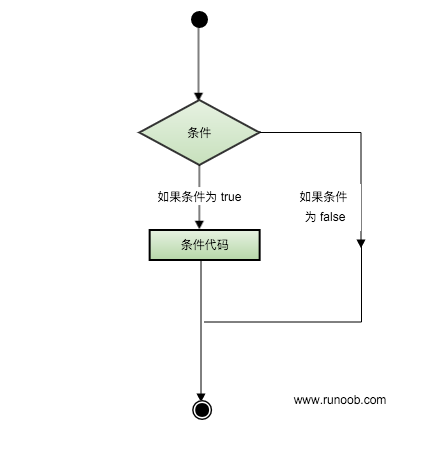

Scala IF...ELSE 语句是通过一条或多条语句的执行结果（True或者False）来决定执行的代码块。

可以通过下图来简单了解条件语句的执行过程:



## if 语句
if 语句有布尔表达式及之后的语句块组成。

### 语法
if 语句的语法格式如下：
```text
if (布尔表达式) {
    // 如果布尔表达式为 true 则执行该语句块
}
```
如果布尔表达式为 true 则执行大括号内的语句块，否则跳过大括号内的语句块，执行大括号之后的语句块。

实例
```text
object Test {
    def main(args: Array[String]) {
        var x = 10;
    
        if( x < 20 ){
         println("x < 20");
        }
    }
}
```

执行以上代码，输出结果为：
```text
$ scalac Test.scala
$ scala Test
x < 20
```

## if...else 语句
if 语句后可以紧跟 else 语句，else 内的语句块可以在布尔表达式为 false 的时候执行。

### 语法
if...else 的语法格式如下：
```text
if (布尔表达式) {
    // 如果布尔表达式为 true 则执行该语句块
} else {
    // 如果布尔表达式为 false 则执行该语句块
}
```

实例
```text
object Test {
    def main(args: Array[String]) {
        var x = 30;
        
        if ( x < 20 ) {
            println("x 小于 20");
        } else {
            println("x 大于等于 20");
        }
    }
}
```
执行以上代码，输出结果为：
```text
$ scalac Test.scala
$ scala Test
x 大于等于 20
```

## if...else if...else 语句
if 语句后可以紧跟 else if...else 语句，在多个条件判断语句的情况下很有用。

### 语法
if...else if...else 语法格式如下：
```text
if (布尔表达式 1) {
    // 如果布尔表达式 1 为 true 则执行该语句块
} else if (布尔表达式 2) {
    // 如果布尔表达式 2 为 true 则执行该语句块
} else if(布尔表达式 3) {
    // 如果布尔表达式 3 为 true 则执行该语句块
} else {
    // 如果以上条件都为 false 执行该语句块
}
```

实例
```text
object Test {
    def main(args: Array[String]) {
        var x = 30;
        
        if ( x == 10 ) {
            println("X 的值为 10");
        } else if ( x == 20 ) {
            println("X 的值为 20");
        } else if ( x == 30 ) {
            println("X 的值为 30");
        } else {
            println("无法判断 X 的值");
        }
    }
}
```
执行以上代码，输出结果为：
```text
$ scalac Test.scala
$ scala Test
X 的值为 30
```

## if...else 嵌套语句
if...else 嵌套语句可以实现在 if 语句内嵌入一个或多个 if 语句。

### 语法
if...else 嵌套语句语法格式如下：
```text
if (布尔表达式 1) {
    // 如果布尔表达式 1 为 true 则执行该语句块
    if (布尔表达式 2) {
        // 如果布尔表达式 2 为 true 则执行该语句块
    }
}
```
else if...else 的嵌套语句 类似 if...else 嵌套语句。

实例
```text
object Test {
    def main(args: Array[String]) {
        var x = 30;
        var y = 10;
        
        if( x == 30 ){
            if( y == 10 ){
                println("X = 30 , Y = 10");
            }
        }
    }
}
```
执行以上代码，输出结果为：
```text
$ scalac Test.scala
$ scala Test
X = 30 , Y = 10
```
