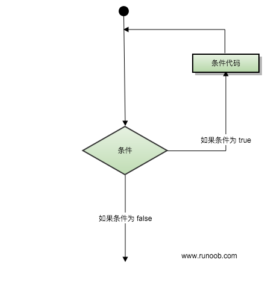

有的时候，我们可能需要多次执行同一块代码。一般情况下，语句是按顺序执行的：函数中的第一个语句先执行，接着是第二个语句，依此类推。

编程语言提供了更为复杂执行路径的多种控制结构。

循环语句允许我们多次执行一个语句或语句组，下面是大多数编程语言中循环语句的流程图：



## 循环类型
Scala 语言提供了以下几种循环类型。点击链接查看每个类型的细节。

| 循环类型	          | 描述                                            |
|----------------|-----------------------------------------------|
| while 循环	      | 运行一系列语句，如果条件为true，会重复运行，直到条件变为false。          |
| do...while 循环	 | 类似 while 语句区别在于判断循环条件之前，先执行一次循环的代码块。          |
| for 循环	        | 用来重复执行一系列语句直到达成特定条件达成，一般通过在每次循环完成后增加计数器的值来实现。 |

## 循环控制语句
循环控制语句改变你代码的执行顺序，通过它你可以实现代码的跳转。

Scala 以下几种循环控制语句：

Scala 不支持 break 或 continue 语句，但从 2.8 版本后提供了一种中断循环的方式，点击以下链接查看详情。

| 控制语句	     | 描述   |
|-----------|------|
| break 语句	 | 中断循环 |

## 无限循环
如果条件永远为 true，则循环将变成无限循环。我们可以使用 while 语句来实现无限循环：

实例
```text
object Test {
    def main(args: Array[String]) {
        var a = 10;
        // 无限循环
        while ( true ) {
            println( "a 的值为 : " + a );
        }
    }
}
```
以上代码执行后循环会永久执行下去，你可以使用 Ctrl + C 键来中断无限循环。