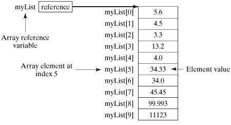

Scala 语言中提供的【数组】是用来存储【固定大小】的【同类型】元素，数组对于每一门编程语言来说都是重要的数据结构之一。

声明数组变量并不是声明 number0、number1、...、number99 一个个单独的变量，
而是声明一个就像 numbers 这样的变量，然后使用 numbers[0]、numbers[1]、...、numbers[99] 来表示一个个单独的变量。

数组中某个指定的元素是通过【索引】来访问的。

数组的第一个元素索引为0，最后一个元素的索引为元素总数减1。

## 声明数组
以下是 Scala 数组声明的语法格式：
```text
var z:Array[String] = new Array[String](3)
或
var z = new Array[String](3)
```

以上语法中，z 声明一个字符串类型的数组，数组长度为 3 ，可存储 3 个元素。
我们可以为每个元素设置值，并通过索引来访问每个元素，如下所示：
```text
z(0) = "Runoob"; z(1) = "Baidu"; z(4/2) = "Google"
```
最后一个元素的索引使用了表达式 4/2 作为索引，类似于 z(2) = "Google"。

我们也可以使用以下方式来定义一个数组：
```text
var z = Array("Runoob", "Baidu", "Google")
```

下图展示了一个长度为 10 的数组 myList，索引值为 0 到 9：



## 处理数组
数组的元素类型和数组的大小都是确定的，所以当处理数组元素时候，我们通常使用基本的 for 循环。

以下实例演示了数组的创建，初始化等处理过程：

实例
```text
object Test {
    def main(args: Array[String]) {
        var myList = Array(1.9, 2.9, 3.4, 3.5)
        // 输出所有数组元素
        for ( x <- myList ) {
            println( x )
        }
        // 计算数组所有元素的总和
        var total = 0.0;
        for ( i <- 0 to (myList.length - 1)) {
            total += myList(i);
        }
        println("总和为 " + total);
        // 查找数组中的最大元素
        var max = myList(0);
        for ( i <- 1 to (myList.length - 1) ) {
            if (myList(i) > max) max = myList(i);
        }
        println("最大值为 " + max);
    }
}
```
执行以上代码，输出结果为：
```text
$ scalac Test.scala
$ scala Test
1.9
2.9
3.4
3.5
总和为 11.7
最大值为 3.5
```

## 多维数组
多维数组一个数组中的值可以是另一个数组，另一个数组的值也可以是一个数组。矩阵与表格是我们常见的二维数组。

以上是一个定义了二维数组的实例：
```text
val myMatrix = Array.ofDim[Int](3, 3)
```

实例中数组中包含三个数组元素，每个数组元素又含有三个值。

接下来我们来看一个二维数组处理的完整实例：

实例
```text
import Array._

object Test {
    def main(args: Array[String]) {
        val myMatrix = Array.ofDim[Int](3, 3)
        // 创建矩阵
        for (i <- 0 to 2) {
            for ( j <- 0 to 2) {
                myMatrix(i)(j) = j;
            }
        }
        // 打印二维阵列
        for (i <- 0 to 2) {
            for ( j <- 0 to 2) {
                print(" " + myMatrix(i)(j));
            }
            println();
        }
    }
}
```
执行以上代码，输出结果为：
```text
$ scalac Test.scala
$ scala Test
0 1 2
0 1 2
0 1 2
```

## 合并数组
以下实例中，我们使用 concat() 方法来合并两个数组，concat() 方法中接受多个数组参数：

实例
```text
import Array._

object Test {
    def main(args: Array[String]) {
        var myList1 = Array(1.9, 2.9, 3.4, 3.5)
        var myList2 = Array(8.9, 7.9, 0.4, 1.5)
        var myList3 =  concat( myList1, myList2)
        // 输出所有数组元素
        for ( x <- myList3 ) {
            println( x )
        }
    }
}
```
执行以上代码，输出结果为：
```text
$ scalac Test.scala
$ scala Test
1.9
2.9
3.4
3.5
8.9
7.9
0.4
1.5
```

## 创建区间数组
以下实例中，我们使用了 range() 方法来生成一个区间范围内的数组。range() 方法最后一个参数为步长，默认为 1：

实例
```text
import Array._

object Test {
    def main(args: Array[String]) {
        var myList1 = range(10, 20, 2)
        var myList2 = range(10,20)
        // 输出所有数组元素
        for ( x <- myList1 ) {
            print( " " + x )
        }
        println()
        for ( x <- myList2 ) {
            print( " " + x )
        }
    }
}
```
执行以上代码，输出结果为：
```text
$ scalac Test.scala
$ scala Test
10 12 14 16 18
10 11 12 13 14 15 16 17 18 19
```

## Scala 数组方法
下表中为 Scala 语言中处理数组的重要方法，使用它前我们需要使用 import Array._ 引入包。

### def apply( x: T, xs: T* ): Array[T]
创建指定对象 T 的数组, T 的值可以是 Unit, Double, Float, Long, Int, Char, Short, Byte, Boolean。

### def concat[T]( xss: Array[T]* ): Array[T]
合并数组

### def copy( src: AnyRef, srcPos: Int, dest: AnyRef, destPos: Int, length: Int ): Unit
复制一个数组到另一个数组上。

相等于 Java's System.arraycopy(src, srcPos, dest, destPos, length)。

### def empty[T]: Array[T]
返回长度为 0 的数组

### def iterate[T]( start: T, len: Int )( f: (T) => T ): Array[T]
返回指定长度数组，每个数组元素为指定函数的返回值。

以上实例数组初始值为 0，长度为 3，计算函数为a=>a+1：
```text
scala> Array.iterate(0,3)(a=>a+1)
res1: Array[Int] = Array(0, 1, 2)
```
### def fill[T]( n: Int )(elem: => T): Array[T]
返回数组，长度为第一个参数指定，同时每个元素使用第二个参数进行填充。

### def fill[T]( n1: Int, n2: Int )( elem: => T ): Array[Array[T]]
返回二数组，长度为第一个参数指定，同时每个元素使用第二个参数进行填充。

### def ofDim[T]( n1: Int ): Array[T]
创建指定长度的数组

### def ofDim[T]( n1: Int, n2: Int ): Array[Array[T]]
创建二维数组

### def ofDim[T]( n1: Int, n2: Int, n3: Int ): Array[Array[Array[T]]]
创建三维数组

### def range( start: Int, end: Int, step: Int ): Array[Int]
创建指定区间内的数组，step 为每个元素间的步长

### def range( start: Int, end: Int ): Array[Int]
创建指定区间内的数组

### def tabulate[T]( n: Int )(f: (Int)=> T): Array[T]
返回指定长度数组，每个数组元素为指定函数的返回值，默认从 0 开始。

以上实例返回 3 个元素：
```text
scala> Array.tabulate(3)(a => a + 5)
res0: Array[Int] = Array(5, 6, 7)
```

### def tabulate[T]( n1: Int, n2: Int )( f: (Int, Int ) => T): Array[Array[T]]
返回指定长度的二维数组，每个数组元素为指定函数的返回值，默认从 0 开始。