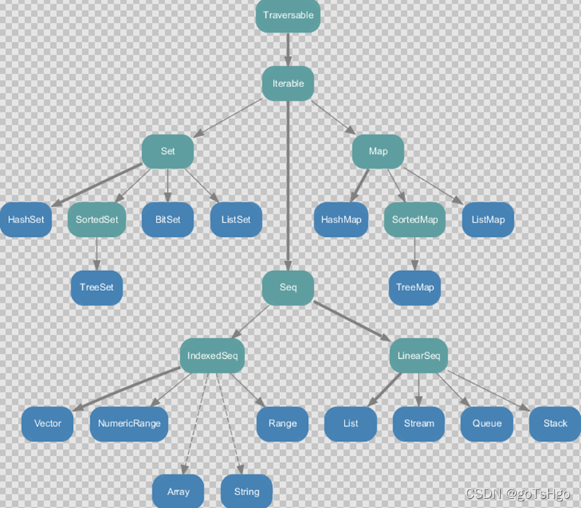
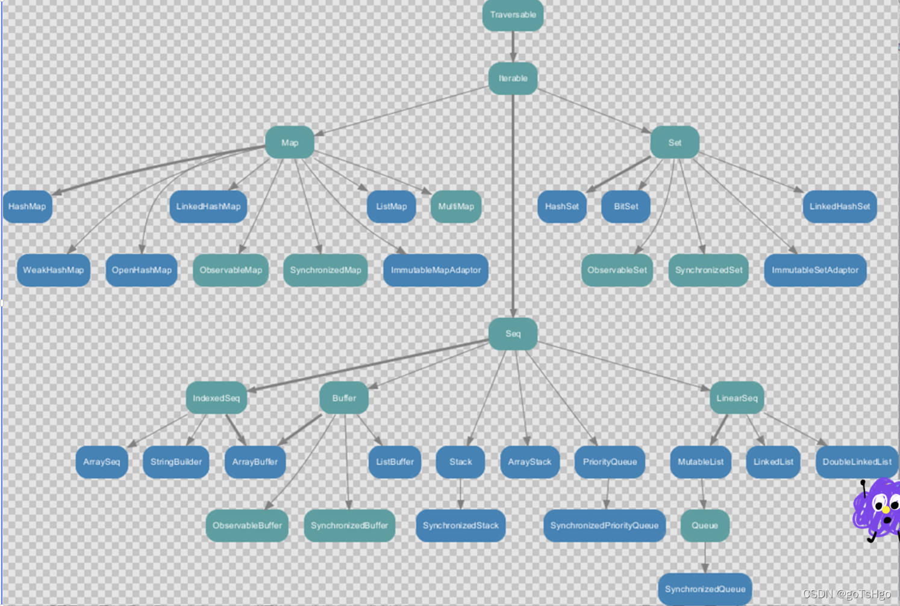
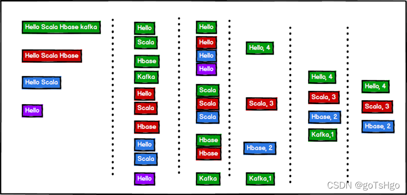

Scala提供了一套很好的集合实现，提供了一些集合类型的抽象。

Scala 集合分为【可变】的和【不可变】的集合。

【可变集合】可以在适当的地方被更新或扩展。这意味着你可以修改，添加，移除一个集合的元素。

而【不可变集合】类，相比之下，永远不会改变。
不过，你仍然可以模拟添加，移除或更新操作。
但是这些操作将在每一种情况下都【返回一个新的集合】，同时使原来的集合不发生改变。

## 常用集合类型
接下来我们将为大家介绍几种常用集合类型的应用：

### Scala List(列表)
List的特征是其元素以线性方式存储，集合中可以存放重复对象。

参考 API文档

### Scala Set(集合)
Set是最简单的一种集合。集合中的对象不按特定的方式排序，并且没有重复对象。

参考 API文档

### Scala Map(映射)
Map 是一种把键对象和值对象映射的集合，它的每一个元素都包含一对键对象和值对象。

参考 API文档

### Scala 元组
元组是不同类型的值的集合

### Scala Option
Option[T] 表示有可能包含值的容器，也可能不包含值。

### Scala Iterator（迭代器）
迭代器不是一个容器，更确切的说是逐一访问容器内元素的方法。

## 实例
以下代码判断，演示了所有以上集合类型的定义实例：
```text
// 定义整型 List
val x = List(1,2,3,4)

// 定义 Set
val x = Set(1,3,5,7)

// 定义 Map
val x = Map("one" -> 1, "two" -> 2, "three" -> 3)

// 创建两个不同类型元素的元组
val x = (10, "Runoob")

// 定义 Option
val x:Option[Int] = Some(5)
```

# 一、集合简介

## 1、不可变集合继承图



1）Set、Map是Java中也有的集合。

2）Seq是Java没有的，我们发现List归属到Seq了，因此这里的List就和Java不是同一个概念了。

3）我们前面的for循环有一个 1 to 3，就是IndexedSeq下的Vector。

4）String也是属于IndexedSeq。

5）我们发现经典的数据结构比如Queue和Stack被归属到LinerSeq。

6）大家注意Scala中的Map体系有一个SortedMap，说明Scala的Map可以支持排序。

7）IndexSeq和LinearSeq的区别：
* （1）IndexSeq是通过索引来查找和定位，因此速度快，比如String就是一个索引集合，通过索引即可定位
* （2）LineaSeq是线型的，即有头尾的概念，这种数据结构一般是通过遍历来查找

## 2、可变集合继承图



# 二、数组

## 1.不可变数组

### 1）第一种方式定义数组(定长数组)

定义：
```text
val arr1 = new Array[Int](10)
```
* （1）new是关键字
* （2）[Int]是指定可以存放的数据类型，如果希望存放任意数据类型，则指定Any
* （3）(10)，表示数组的大小，确定后就不可以变化

案例实操
```text
import scala.collection.mutable.ArrayBuffer

object TestArray {
    def main(args: Array[String]): Unit = {
        //（1）数组定义
        val arr01 = new Array[Int](4)
        println(arr01.length) // 4
        //（2）数组赋值
        //（2.1）修改某个元素的值
        arr01(3) = 10
        //（2.2）采用方法的形式给数组赋值
        arr01.update(0,1)
        //（3）遍历数组
        //（3.1）查看数组
        println(arr01.mkString(","))
        //（3.2）普通遍历
        for (i <- arr01) {
            println(i)
        }
        //（3.3）简化遍历
        def printx(elem:Int): Unit = {
            println(elem)
        }
        arr01.foreach(printx)
        // arr01.foreach((x)=>{println(x)})
        // arr01.foreach(println(_))
        arr01.foreach(println)
        //（4）增加元素（由于创建的是不可变数组，增加元素，其实是产生新的数组）
        println(arr01)
        val ints: Array[Int] = arr01 :+ 5
        println(ints)
    }
}
```

### 2）第二种方式定义数组

定义：
```text
val arr1 = Array(1, 2)
```
* （1）在定义数组时，直接赋值
* （2）使用apply方法创建数组对象

案例实操：
```text
object TestArray {
    def main(args: Array[String]): Unit = {
        var arr02 = Array(1, 3, "bobo")
        for (i <- arr02) {
            println(i)
        }
    }
}
```

## 2.可变数组

### 1）定义变长数组

```text
val arr01 = ArrayBuffer[Any](3, 2, 5)
```
* （1）[Any]存放任意数据类型
* （2）(3, 2, 5)初始化好的三个元素
* （3）ArrayBuffer需要引入scala.collection.mutable.ArrayBuffer

### 2）案例实操
（1）ArrayBuffer是有序的集合

（2）增加元素使用的是append方法()，支持可变参数

```text
import scala.collection.mutable.ArrayBuffer

object TestArrayBuffer {
    def main(args: Array[String]): Unit = {
        //（1）创建并赋值可变数组
        val arr01 = ArrayBuffer[Any](1, 2, 3)
        //（2）遍历数组
        for (i <- arr01) {
            println(i)
        }
        println(arr01.length) // 3
        println("arr01.hash=" + arr01.hashCode())
        //（3）增加元素
        //（3.1）追加数据
        arr01.+=(4)
        //（3.2）向数组最后追加数据
        arr01.append(5,6)
        //（3.3）向指定的位置插入数据
        arr01.insert(0,7,8)
        println("arr01.hash=" + arr01.hashCode())
        //（4）修改元素
        arr01(1) = 9 // 修改第2个元素的值
        println("--------------------------")
        for (i <- arr01) {
            println(i)
        }
        println(arr01.length) // 5
    }
}
```

## 3、不可变数组与可变数组的转换
### 1）说明

arr1.toBuffer  //不可长数组转可变数组

arr2.toArray  //可变数组转不可变数组

（1）arr2.toArray返回结果才是一个不可变数组，arr2本身没有变化

（2）arr1.toBuffer返回结果才是一个可变数组，arr1本身没有变化

### 2）案例实操
```text
object TestArrayBuffer {
    def main(args: Array[String]): Unit = {
        //（1）创建一个空的可变数组
        val arr2 = ArrayBuffer[Int]()
        //（2）追加值
        arr2.append(1, 2, 3)
        println(arr2) // 1,2,3
        //（3）ArrayBuffer ==> Array
        //（3.1）arr2.toArray 返回的结果是一个新的定长数组集合
        //（3.2）arr2它没有变化
        val newArr = arr2.toArray
        println(newArr)
        //（4）Array ===> ArrayBuffer
        //（4.1）newArr.toBuffer 返回一个变长数组 newArr2
        //（4.2）newArr 没有任何变化，依然是定长数组
        val newArr2 = newArr.toBuffer
        newArr2.append(123)
        println(newArr2)
    }
}
```

## 4、多维数组
### 1）多维数组定义
```text
val arr = Array.ofDim[Double](3,4)
```
说明：二维数组中有三个一维数组，每个一维数组中有四个元素

### 2）案例实操
```text
object DimArray {
    def main(args: Array[String]): Unit = {
        //（1）创建了一个二维数组, 有三个元素，每个元素是，含有4个元素一维数组()
        val arr = Array.ofDim[Int](3, 4)
        arr(1)(2) = 88
        //（2）遍历二维数组
        for (i <- arr) { //i 就是一维数组
            for (j <- i) {
                print(j + " ")
            }
            println()
        }
    }
}
```

# 三、Seq集合（List）

## 1、不可变List

### 1）说明
* （1）List默认为不可变集合
* （2）创建一个List（数据有顺序，可重复）
* （3）遍历List
* （4）List增加数据
* （5）集合间合并：将一个整体拆成一个一个的个体，称为扁平化
* （6）取指定数据
* （7）空集合Nil

### 2）案例实操
```text
object TestList {
    def main(args: Array[String]): Unit = {
        //（1）List默认为 不可变集合
        //（2）创建一个List（数据有顺序，可重复）
        val list: List[Int] = List(1,2,3,4,3)
       
        //（7）空集合Nil
        val list5 = 1::2::3::4::Nil
 
        //（4）List增加数据
        //（4.1）::的运算规则从右向左
        //val list1 = 5::list
        val list1 = 7::6::5::list
        //（4.2）添加到第一个元素位置
        val list2 = list.+:(5)
 
        //（5）集合间合并：将一个整体拆成一个一个的个体，称为扁平化
        val list3 = List(8,9)
        //val list4 = list3::list1
        val list4 = list3:::list1
 
        //（6）取指定数据
        println(list(0))
 
        //（3）遍历List
        //list.foreach(println)
        //list1.foreach(println)
        //list3.foreach(println)
        //list4.foreach(println)
        list5.foreach(println)
    }
}
```

## 2、可变ListBuffer

### 1）说明

（1）创建一个可变集合ListBuffer

（2）向集合中添加数据

（3）打印集合数据

### 2）案例实操
```text
import scala.collection.mutable.ListBuffer

object TestList {
    def main(args: Array[String]): Unit = {
        //（1）创建一个可变集合
        val buffer = ListBuffer(1,2,3,4)
 
        //（2）向集合中添加数据
        buffer.+=(5)
 
        //（3）打印集合数据
        buffer.foreach(println)
    }
}
```

# 四、set集合
默认情况下，Scala使用的是【不可变集合】，如果你想使用可变集合，需要引用 scala.collection.mutable.Set 包。

## 1、不可变set
### 1）说明
（1）Set默认是不可变集合，数据无序

（2）数据不可重复

（3）遍历集合

### 2）案例实操
```text
object TestSet {
    def main(args: Array[String]): Unit = {
        //（1）Set默认是不可变集合，数据无序
        val set = Set(1,2,3,4,5,6)
 
        //（2）数据不可重复
        val set1 = Set(1,2,3,4,5,6,3)
 
        //（3）遍历集合
        for(x <- set1) {
            println(x)
        }
    }
}
```

## 2、可变mutable.Set
### 1）说明
（1）创建可变集合mutable.Set

（2）打印集合

（3）集合添加元素

（4）向集合中添加元素，返回一个新的Set

（5）删除数据

### 2）案例实操
```text
object TestSet {
    def main(args: Array[String]): Unit = {
        //（1）创建可变集合
        val set = mutable.Set(1,2,3,4,5,6)
 
        //（3）集合添加元素
        set += 8
 
        //（4）向集合中添加元素，返回一个新的Set
        val ints = set.+(9)
        println(ints)
        println("set2=" + set)
 
        //（5）删除数据
        set-=(5)
 
        //（2）打印集合
        set.foreach(println)
        println(set.mkString(","))
    }
}
```

# 五、Map集合
Scala中的Map和Java类似，也是一个散列表，它存储的内容也是键值对（key-value）映射，
Scala中不可变的Map是有序的，可变的Map是无序的。

## 1、不可变Map
### 1）说明
（1）创建不可变集合Map

（2）循环打印

（3）访问数据

（4）如果key不存在，返回0

### 2）案例实操
```text
object TestMap {
    def main(args: Array[String]): Unit = {
        // Map
        //（1）创建不可变集合Map
        val map = Map( "a"->1, "b"->2, "c"->3 )
        //（3）访问数据
        for (elem <- map.keys) {
            // 使用get访问map集合的数据，会返回特殊类型Option(选项):有值（Some），无值(None)
            println(elem + "=" + map.get(elem).get)
        }
        //（4）如果key不存在，返回0
        println(map.get("d").getOrElse(0))
        println(map.getOrElse("d", 0))
        //（2）循环打印
        map.foreach((kv)=>{println(kv)})
    }
}
```

## 2、可变Map
### 1）说明
（1）创建可变集合

（2）打印集合

（3）向集合增加数据

（4）删除数据

（5）修改数据

### 2）案例实操
```text
object TestSet {
    def main(args: Array[String]): Unit = {
        //（1）创建可变集合
        val map = mutable.Map( "a"->1, "b"->2, "c"->3 )
 
        //（3）向集合增加数据
        map.+=("d"->4)
 
        // 将数值4添加到集合，并把集合中原值1返回
        val maybeInt: Option[Int] = map.put("a", 4)
        println(maybeInt.getOrElse(0))
 
        //（4）删除数据
        map.-=("b", "c")
 
        //（5）修改数据
        map.update("d",5)
 
        //（2）打印集合
        map.foreach((kv)=>{println(kv)})
    }
}
```

# 六、元组
## 1）说明

元组也是可以理解为一个容器，可以存放各种相同或不同类型的数据。

说的简单点，就是【将多个无关的数据封装为一个整体，称为元组】。

【注意：元组中最大只能有22个元素。】

## 2）案例实操

（1）声明元组的方式：(元素，元素2，元素3)

（2）访问元组

（3）Map中的键值对其实就是元组,只不过元组的元素个数为2，称之为对偶

```text
object TestTuple {
    def main(args: Array[String]): Unit = {
        //（1）声明元组的方式：(元素，元素2，元素3)
        val tuple: (Int, String, Boolean) = (40,"bobo",true)
 
        //（2）访问元组
        //（2.1）通过元素的顺序进行访问，调用方式：_顺序号
        println(tuple._1)
        println(tuple._2)
        println(tuple._3)
 
        //（2.2）通过索引访问数据
        println(tuple.productElement(0))
 
        //（2.3）通过迭代器访问数据
        for (elem <- tuple.productIterator) {
            println(elem)
        }
 
        //（3）Map中的键值对其实就是元组,只不过元组的元素个数为2，称之为对偶
        val map = Map("a"->1, "b"->2, "c"->3)
 
        map.foreach(tuple=>{println(tuple._1 + "=" + tuple._2)})
    }
}
```

# 七、集合常用函数
## 1、基本属性和常用操作
### 1）说明
（1）获取集合长度

（2）获取集合大小

（3）循环遍历

（4）迭代器

（5）生成字符串

（6）是否包含

### 2）案例实操
```text
object TestList {
    def main(args: Array[String]): Unit = {
        val list: List[Int] = List(1, 2, 3, 4, 5, 6, 7)
        //（1）获取集合长度
        println(list.length)
        //（2）获取集合大小
        println(list.size)
        //（3）循环遍历
        list.foreach(println)
        //（4）迭代器
        for (elem <- list.iterator) {
          println(elem)
        }
        //（5）生成字符串
        println(list.mkString(","))
        //（6）是否包含
        println(list.contains(3))
    }
}
```

## 2、衍生集合
### 1）说明
（1）获取集合的头head

（2）获取集合的尾（不是头就是尾）tail

（3）集合最后一个数据 last

（4）集合初始数据（不包含最后一个）

（5）反转

（6）取前（后）n个元素

（7）去掉前（后）n个元素

（8）并集

（9）交集

（10）差集

（11）拉链

（12）滑窗

### 2）案例实操
```text
object TestList {
    def main(args: Array[String]): Unit = {
        val list1: List[Int] = List(1, 2, 3, 4, 5, 6, 7)
        val list2: List[Int] = List(4, 5, 6, 7, 8, 9, 10)
        //（1）获取集合的头
        println(list1.head)
        //（2）获取集合的尾（不是头的就是尾）
        println(list1.tail)
        //（3）集合最后一个数据
        println(list1.last)
        //（4）集合初始数据（不包含最后一个）
        println(list1.init)
        //（5）反转
        println(list1.reverse)
        //（6）取前（后）n个元素
        println(list1.take(3))
        println(list1.takeRight(3))
        //（7）去掉前（后）n个元素
        println(list1.drop(3))
        println(list1.dropRight(3))
        //（8）并集
        println(list1.union(list2))
        //（9）交集
        println(list1.intersect(list2))
        //（10）差集
        println(list1.diff(list2))
        //（11）拉链 注:如果两个集合的元素个数不相等，那么会将同等数量的数据进行拉链，多余的数据省略不用
        println(list1.zip(list2))
        //（12）滑窗
        list1.sliding(2, 5).foreach(println)
    }
}
```

## 3、集合计算初级函数
### 1）说明
   （1）求和

   （2）求乘积

   （3）最大值

   （4）最小值

   （5）排序

### 2）实操
```text
object TestList {
    def main(args: Array[String]): Unit = {
        val list: List[Int] = List(1, 5, -3, 4, 2, -7, 6)
        //（1）求和
        println(list.sum)
        //（2）求乘积
        println(list.product)
        //（3）最大值
        println(list.max)
        //（4）最小值
        println(list.min)
        //（5）排序
        // （5.1）按照元素大小排序
        println(list.sortBy(x => x))
        // （5.2）按照元素的绝对值大小排序
        println(list.sortBy(x => x.abs))
        // （5.3）按元素大小升序排序
        println(list.sortWith((x, y) => x < y))
        // （5.4）按元素大小降序排序
        println(list.sortWith((x, y) => x > y))
    }
}
```

## 4、集合计算高级函数
### 1）说明
（1）过滤：fliter

（2）转化/映射：map

（3）扁平化: flatten

（4）扁平化+映射 注：flatMap相当于先进行map操作，在进行flatten操作

（5）分组：groupby

（6）简化（规约）：

（7）折叠：fold

### 2）实操
```text
object TestList {
    def main(args: Array[String]): Unit = {
        val list: List[Int] = List(1, 2, 3, 4, 5, 6, 7, 8, 9)
        val nestedList: List[List[Int]] = List(List(1, 2, 3), List(4, 5, 6), List(7, 8, 9))
        val wordList: List[String] = List("hello world", "hello atguigu", "hello scala")
        //（1）过滤
        println(list.filter(x => x % 2 == 0))
        //（2）转化/映射
        println(list.map(x => x + 1))
        //（3）扁平化
        println(nestedList.flatten)
        //（4）扁平化+映射 注：flatMap相当于先进行map操作，在进行flatten操作
        println(wordList.flatMap(x => x.split(" ")))
        //（5）分组
        println(list.groupBy(x => x % 2))
    }
}
```

### 3）Reduce方法
Reduce简化（规约）：通过指定的逻辑将集合中的数据进行聚合，从而减少数据，最终获取结果。

案例实操
```text
object TestReduce {
    def main(args: Array[String]): Unit = {
        val list = List(1,2,3,4)
        // 将数据两两结合，实现运算规则
        val i: Int = list.reduce( (x,y) => x-y )
        println("i = " + i)
        // 从源码的角度，reduce底层调用的其实就是reduceLeft
        //val i1 = list.reduceLeft((x,y) => x-y)
        // ((4-3)-2-1) = -2
        val i2 = list.reduceRight((x,y) => x-y)
        println(i2)
    }
}
```

### 4）Fold方法
Fold折叠：化简的一种特殊情况。

#### （1）案例实操：fold基本使用
```text
object TestFold {
    def main(args: Array[String]): Unit = {
        val list = List(1,2,3,4)
        // fold方法使用了函数柯里化，存在两个参数列表
        // 第一个参数列表为 ： 零值（初始值）
        // 第二个参数列表为：
        // fold底层其实为foldLeft
        val i = list.foldLeft(1)((x,y)=>x-y)
        val i1 = list.foldRight(10)((x,y)=>x-y)
        println(i)
        println(i1)
    }
}
```

#### （2）案例实操：两个集合合并
```text
object TestFold {
    def main(args: Array[String]): Unit = {
        // 两个Map的数据合并
        val map1 = mutable.Map("a"->1, "b"->2, "c"->3)
        val map2 = mutable.Map("a"->4, "b"->5, "d"->6)
        val map3: mutable.Map[String, Int] = map2.foldLeft(map1) {
            (map, kv) => {
                val k = kv._1
                val v = kv._2
                map(k) = map.getOrElse(k, 0) + v
                map
            }
        }
        println(map3)
    }
}
```

## 5、普通wordcount案例
### 1）需求
单词计数：将集合中出现的相同的单词，进行计数，取计数排名前三的结果

### 2）需求分析



### 3）案例实操
```text
object TestWordCount {
    def main(args: Array[String]): Unit = {
        // 单词计数：将集合中出现的相同的单词，进行计数，取计数排名前三的结果
        val stringList = List("Hello Scala Hbase kafka", "Hello Scala Hbase", "Hello Scala", "Hello")
        // 1) 将每一个字符串转换成一个一个单词
        val wordList: List[String] = stringList.flatMap(str=>str.split(" "))
        //println(wordList)
        // 2) 将相同的单词放置在一起
        val wordToWordsMap: Map[String, List[String]] = wordList.groupBy(word=>word)
        //println(wordToWordsMap)
        // 3) 对相同的单词进行计数
        // (word, list) => (word, count)
        val wordToCountMap: Map[String, Int] = wordToWordsMap.map(tuple=>(tuple._1, tuple._2.size))
        // 4) 对计数完成后的结果进行排序（降序）
        val sortList: List[(String, Int)] = wordToCountMap.toList.sortWith {
            (left, right) => {
                left._2 > right._2
            }
        }
        // 5) 对排序后的结果取前3名
        val resultList: List[(String, Int)] = sortList.take(3)
        println(resultList)
    }
}
```

## 6、复杂wordcount案例
1）方式一
```text
object TestWordCount {
    def main(args: Array[String]): Unit = {
        // 第一种方式（不通用）
        val tupleList = List(("Hello Scala Spark World", 4), ("Hello Scala Spark", 3), ("Hello Scala", 2), ("Hello", 1))
        val stringList: List[String] = tupleList.map(t=>(t._1 + " ") * t._2)
 
        //val words: List[String] = stringList.flatMap(s=>s.split(" "))
        val words: List[String] = stringList.flatMap(_.split(" "))
 
        //在map中，如果传进来什么就返回什么，不要用_省略
        val groupMap: Map[String, List[String]] = words.groupBy(word=>word)
        //val groupMap: Map[String, List[String]] = words.groupBy(_)
 
        // (word, list) => (word, count)
        val wordToCount: Map[String, Int] = groupMap.map(t=>(t._1, t._2.size))
 
        val wordCountList: List[(String, Int)] = wordToCount.toList.sortWith {
            (left, right) => {
                left._2 > right._2
            }
        }.take(3)
 
        //tupleList.map(t=>(t._1 + " ") * t._2).flatMap(_.split(" ")).groupBy(word=>word).map(t=>(t._1, t._2.size))
        println(wordCountList)
    }
}
```

2）方式二
```text
object TestWordCount {
    def main(args: Array[String]): Unit = {
        val tuples = List(("Hello Scala Spark World", 4), ("Hello Scala Spark", 3), ("Hello Scala", 2), ("Hello", 1))
        // (Hello,4),(Scala,4),(Spark,4),(World,4)
        // (Hello,3),(Scala,3),(Spark,3)
        // (Hello,2),(Scala,2)
        // (Hello,1)
        val wordToCountList: List[(String, Int)] = tuples.flatMap {
            t => {
                val strings: Array[String] = t._1.split(" ")
                strings.map(word => (word, t._2))
            }
        }
 
        // Hello, List((Hello,4), (Hello,3), (Hello,2), (Hello,1))
        // Scala, List((Scala,4), (Scala,3), (Scala,2)
        // Spark, List((Spark,4), (Spark,3)
        // Word, List((Word,4))
        val wordToTupleMap: Map[String, List[(String, Int)]] = wordToCountList.groupBy(t=>t._1)
 
        val stringToInts: Map[String, List[Int]] = wordToTupleMap.mapValues {
            datas => datas.map(t => t._2)
        }
        stringToInts
    }
}
```

# 八、队列
## 1）说明
scala也提供了队列（Queue）的数据结构，队列的特点就是先进先出。进队和出队的方法分别为enqueue和dequeue。

## 2）案例实操
```text
object TestQueue {
    def main(args: Array[String]): Unit = {
        val que = new mutable.Queue[String]()
        que.enqueue("a", "b", "c")
 
        println(que.dequeue())
        println(que.dequeue())
        println(que.dequeue())
    }
}
```

# 九、并行集合
## 1）说明
Scala为了充分使用多核CPU，提供了并行集合（有别于前面的串行集合），用于多核环境的并行计算。

## 2）案例实操
```text
object TestPar {
    def main(args: Array[String]): Unit = {
        val result1 = (0 to 100).map{case _ => Thread.currentThread.getName}
        val result2 = (0 to 100).par.map{case _ => Thread.currentThread.getName}
        println(result1)
        println(result2)
    }
}
```