# Spark基础入门
版本：Spark3.2.0

特性：完善了对Pandas API的支持

## spark基础概念

Apache Spark是用于大规模数据处理的统一分析引擎。
- Spark 的【核心数据结构】：【弹性分布式数据集（RDD）】，支持在大规模集群中的内存计算。
- Spark 借鉴了 MapReduce 思想发展而来，保留了其分布式并行计算的优点并改进了其明显的缺陷。
  让中间数据存储在内存中提高了运行速度、并提供丰富的操作数据的API提高了开发速度。


如何理解“统一分析引擎”？
- spark可以对【任意类型的数据】进行自定义计算，比如说结构化、半结构化、非结构化等各种类型的数据结构；
- spark支持使用【多种语言】，如Python、Java、Scala、R以及SQL语言去开发应用程序计算数据；

## spark和hadoop的对比

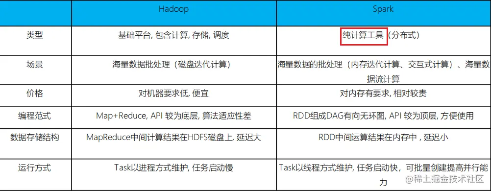

- 在计算层面，Spark相比较MR（MapReduce）有巨大的性能优势。
- Spark仅做计算，而Hadoop生态圈不仅有计算（MR）也有存储（HDFS）和资源管理调度（YARN），
  HDFS和YARN仍是许多大数据体系的核心架构。
- Spark处理数据与MapReduce处理数据的不同点：
  - Spark处理数据时，可以将【中间处理结果】数据存储到【内存】中。
  - Spark 提供了非常丰富的算子(API)，可以做到复杂任务在一个Spark 程序中完成。

## Hadoop的基于进程的计算和Spark基于线程方式优缺点
Hadoop中的MR中每个map/reduce task都是一个【java进程】方式运行，
好处在于【进程之间是互相独立的，每个task独享进程资源，没有互相干扰，监控方便】，
但是问题在于task之间不方便共享数据，执行效率比较低。
比如多个map task读取不同数据源文件需要将数据源加载到每个map task中，造成重复加载和浪费内存。

而基于线程的方式计算是为了数据共享和提高执行效率，Spark采用了线程的最小的执行单位，但缺点是线程之间会有资源竞争。

## spark的特点

- 速度快：Spark支持内存计算，并且通过DAG（有向无环图）执行引擎支持无环数据流。
- 通用性强：
  - 在 Spark 的基础上，Spark 还提供了包括Spark SQL、Spark Streaming、MLib 及GraphX在内的多个工具库，
    我们可以在一个应用中无缝地使用这些工具库。
  - Spark 支持多种运行方式，包括在 Hadoop 和 Mesos 上，也支持 Standalone的独立运行模式，
    同时也可以运行在云Kubernetes上（2.3之后）。
  - Spark 支持从HDFS、HBase、Cassandra 及 Kafka 等多种途径获取数据。


## spark框架模块
**Spark Core：**
Spark的核心，Spark核心功能均由Spark Core模块提供，是Spark运行的基础。
Spark Core以RDD为数据抽象，提供Python、Java、Scala、R语言的API，可以编程进行海量离线数据批处理计算。

**SparkSQL：**
基于SparkCore之上，提供结构化数据的处理模块。
SparkSQL支持以SQL语言对数据进行处理，SparkSQL本身针对离线计算场景。
同时基于SparkSQL，Spark提供了StructuredStreaming模块，可以以SparkSQL为基础，进行数据的流式计算。

**SparkStreaming：**
以SparkCore为基础，提供数据的流式计算功能。

**MLlib：**
以SparkCore为基础，进行机器学习计算，内置了大量的机器学习库和API算法等。
方便用户以分布式计算的模式进行机器学习计算。

**GraphX：**
以SparkCore为基础，进行图计算，提供了大量的图计算API，方便用于以分布式计算模式进行图计算。

## spark运行模式
- 本地模式（单机）：本地模式就是以一个独立的进程，通过其内部的多个线程来模拟整个Spark运行时环境。
- Standalone模式（集群）：Spark中的各个角色以独立进程的形式存在，并组成Spark集群环境。
- Hadoop YARN模式（集群）：Spark中的各个角色运行在YARN的容器内部，并组成Spark集群环境。
- Kubernetes模式（容器集群）：Spark中的各个角色运行在Kubernetes的容器内部，并组成Spark集群环境。

## spark架构
类比Yarn架构：

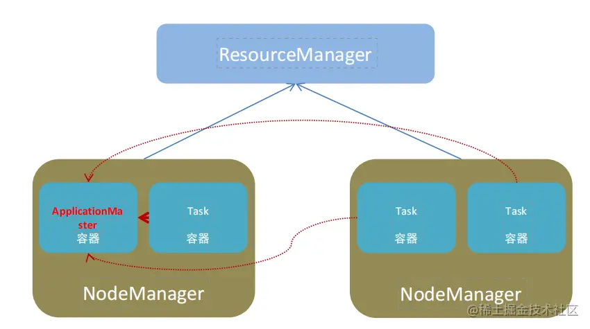

YARN主要有4类角色：
```text
资源管理层面：
集群资源管理者（Master）：ResourceManager
单机资源管理者（Worker）：NodeManager

任务计算层面：
单任务管理者（Master）：ApplicationMaster
单任务执行者（Worker）：Task（容器内计算框架的工作角色）
```

spark架构也由4类角色组成：
```text
资源管理：
Master：管理整个集群的资源
Worker：管理单个服务器的资源

任务计算：
Driver：管理单个Spark任务运行时的工作（单任务管理者）
Executor：单个任务运行时的工作者（单任务执行者）
```

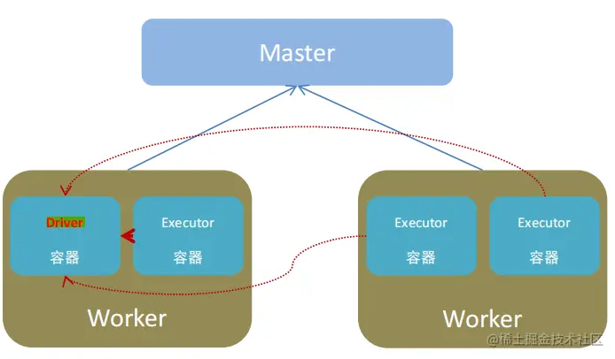

# Spark环境搭建
首先安装spark，在安装spark之前需要安装anaconda。
可以到[【清华大学镜像源】](https://mirrors.tuna.tsinghua.edu.cn/anaconda/archive/)下载，
也可以到[【Anaconda官网】](https://www.anaconda.com/download#downloads)下载。

以镜像源为例：
由于使用python3.8，anaconda下载的版本是：Anaconda3-2021.05-Linux-x86_64.sh。

下载完成后上传到linux服务器上。

然后通过sh 安装包路径/Anaconda3-2021.05-Linux-x86_64.sh来进行安装。

安装完成后创建pyspark环境：conda create -n pyspark python=3.8

然后可以通过conda activate pyspark激活当前环境

然后需要在虚拟环境中安装jieba包：
```text
pip install pyhive pyspark jieba -i https://pypi.tuna.tsinghua.edu.cn/simple
```
jieba包是Python中一个常用的中文分词库，它的作用是将中文文本进行分词处理。

---

常用的conda指令如下：
```text
禁止激活默认base环境：
    conda config --set auto_activate_base false
创建环境：
    conda create -n env_name
查看所有环境：
    conda info --envs
查看当前环境中安装的所有包：
    conda list
查看当前环境中安装的某一个包的信息：
    conda list --show <package_name>
删除一个环境：
    conda remove -n env_name --all
激活环境：
    conda activate airflow
退出当前环境：
    conda deactivate
```

---

安装完anaconda之后，进行spark的安装：

1）下载安装包（3.2版本）：dlcdn.apache.org/spark/

2）解压安装包到对应的路径：tar -zxvf spark-3.2.0-bin-hadoop3.2.tgz -C /opt/module/

3）安装路径名太长，可以通过mv来改名：mv spark-3.2.0-bin-hadoop3.2 spark

4）配置环境变量：还是在my_env.sh中：
```text
SPARK_HOME: 表示Spark安装路径在哪里PYSPARK PYTHON:表示Spark想运行Python程序,那么去哪里找python执行器。
JAVA HOME: 告知Spark Java在哪里。
HADOOP_CONF_DIR: 告知Spark Hadoop的配置文件在哪里。
HADOOP_HOME: 告知Spark Hadoop安装在哪里。
```
其中JAVA_HOME和HADOOP_HOME在安装Hadoop的时候就已经配置过了，
PYSPARK_PYTHON配置python的执行器，即我们安装的anaconda环境里面的python3.8。

这里需要注意HADOOP_CONF_DIR和HADOOP_HOME的区别：
```text
HADOOP_CONF_DIR环境变量是Hadoop的配置目录，它指向Hadoop的配置文件所在的目录。
在Hadoop中，有许多配置文件，例如core-site.xml、hdfs-site.xml、mapred-site.xml等。
这些配置文件中包含了Hadoop集群的各种配置信息，例如HDFS的副本数量、块大小、NameNode和DataNode的地址等。
当Hadoop启动时，它会读取这些配置文件并使用其中的配置信息。
如果想更改或使用这些配置信息，则可以使用HADOOP_CONF_DIR环境变量来指定这些文件所在的目录。
由于spark在运行时可以采用spark on yarn的模式，需要读取yarn-site.xml，所以这个路径需要配置。

而HADOOP_HOME是hadoop的安装路径；
```

## local模式
启动一个JVM Process进程(一个进程里面有多个线程)，执行任务Task。

Local模式可以限制模拟Spark集群环境的线程数量，即Local[N] 或 Local[*]。
其中N代表可以使用N个线程，每个线程拥有一个cpu core。
如果不指定N，则默认是1个线程（该线程有1个core）。 
通常Cpu有几个Core，就指定几个线程，最大化利用计算能力。
需要注意的是，Local模式只能运行一个Spark程序，如果执行多个Spark程序，那就是由多个相互独立的Local进程在执行。

### local模式运行
1）bin/pyspark：提供一个交互式的 Python解释器环境，在这里面可以写普通python代码，以及spark代码。

运行界面如下：

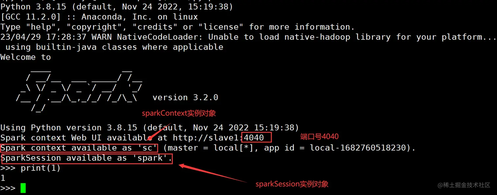

SparkContext是Spark的核心组件之一，它是与Spark集群通信的主要入口点。
SparkContext负责与集群管理器通信，以便在集群上启动应用程序。
它还负责将应用程序的代码分发到集群中的各个节点，并将数据分发到这些节点上。
在Spark 2.0之前，SparkContext是与RDD编程交互的主要入口点。

SparkSession是Spark 2.0中引入的新概念。它是一个新的切入点，用于访问所有Spark功能。
它提供了一种以较少数量的构造与各种spark功能交互的方法。
它还提供了许多新功能，例如DataFrame和Dataset API，这些API使得使用Spark更加容易和直观。

4040端口：每一个Spark程序在运行的时候，会绑定到Driver所在机器的4040端口上；
如果4040端口被占用，会顺延到4041 ... 4042...

打开ip:4040，可以看到监控页面： 由于是local模式，只有一个driver。

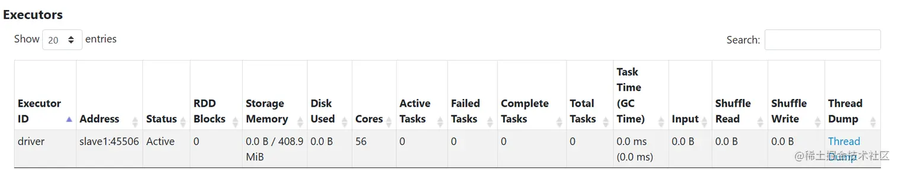

2）bin/spark-shell：使用scala语言，仅作了解。

3）bin/spark-submit：提交指定的Spark代码到Spark环境中运行。

使用示例代码：
```text
bin/spark-submit /home/wuhaoyi/module/spark/examples/src/main/python/pi.py 10 
#（10是参数值）
```
结果如下：

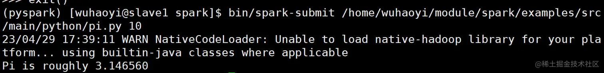

**pyspark/spark-shell/spark-submit 对比**

| 功能   | bin/spark-submit               | bin/pyspark                         | bin/spark-shell                   |
|------|--------------------------------|-------------------------------------|-----------------------------------|
| 功能   | 提交java\scala\python代码到spark中运行 | 提供一个python解释器环境用来以python代码执行spark程序 | 提供一个scala解释器环境用来以scala代码执行spark程序 |
| 特点   | 提交代码用                          | 解释器环境写一行执行一行                        | 解释器环境写一行执行                        |
| 使用场景 | 正式场合，正式提交spark程序运行             | 测试学习写一行执行一行用来验证代码等                  | 测试学习写一行执行一行用来验证                   |

client部署模式的运行流程：
```text
【黑马版本】
1、首先会在提交的节点上启动一个Driver程序。
2、Driver启动后，执行main函数，首先创建【SparkContext对象】(底层是基于py4j，识别python中如何构建5c对象将其映射转换为java代码来构建sc对象)。
3、连接spark集群的主节点，根据资源配置要求，向主节点申请资源，用于启动executor(提交任务的时候，有默认资源配置，也可以自定义资源)。
4、Master接收到资源申请后，根据申请要求进行分配资源，底层也会有资源调度器负责，通过FIFO调度方案，将分配好资源交由给对应Driver拉取即可。
    executor1: node1 2cpu 3gb
    executor2: node3 2cpu 3gb
5、Driver连接对应的节点，通知worker启动Executor，并占用对应资源，worker程序启动后，反向注册给Driver，告知已经启动完成了。
6、Driver开始处理代码:
    6.1、首先会加载所有的与RDD相关的API(算子)，基于算子之间的依赖关系，形成DAG(有向无环图)执行流程图划分stage阶段，
        并且确定每个阶段应该运行多少个线程以及每个线程应该由哪个executor来执行(任务分配)
    6.2、Driver程序通知对应的executor程序，来执行具体的任务
    6.3、Executor接收到任务信息后，启动线程,开始执行处理即可:
        Executor咋执行的时候，由于RDD代码中有大量的python的函数，而executor是一个JVM程序，无法解析Python函数，
        此时通过调用Python解析器，执行函数将函数的结果返回给Executor6.4 Executor在运行的过中，
        如果发现最终的结果需要返回给Driver，直接返回Driver即可，如果不需要返回，直接输出，结束即可
    6.5、Driver程序监听这个executor执行的状态信息，当各个Executor都执行完成后，Driver认为任务运行完成了
7、当任务执行完成后，Driver后续的相关代码，该打印的打印，该关闭的执行关闭操作一旦执行stop()通知Master任务执行完成，Master回收资源，Driver程序退出
```
cluster部署模式的运行流程：
```text
【黑马版本】
1、首先会将任务提交到5park集群的主节点(Master)。
2、Master接收到任务信息后，根据Driver的资源配置信息要求，选择一个worker节点(有资源的，如果都有随机)来启动Driver程序，并且占用相应资源。
3、Driver启动后,执行main函数，首先创建SparkContext对象(底层是基于py4j，识别python中如何构建sc对象将其映射转换为java代码来构建sc对象)，
    当Driver启动成功后，会向Master进行注册，告知已经启动成功了。
4、根据executor的资源配置要求，向主节点申请资源，用于启动executor(提交任努的时候，有默认资源配置,也可以自定义资源)。
5、Master接收到资源申请后，根据申请要求进行分配资源，底层也会有资源调度器负责，通过FIFO调度方案，将分配好资源交由给对应Driver拉取即可。
    executor1: node1 2cpu 3gb
    executor2: node3 2cpu 3gb
6、Driver连接对应的节点，通知worker启动Executor，并占用对应资源，worker程序启动后，反向注册给Driver，告知已经启动完成了。
7、Driver开始处理代码:
    7.1、首先会加载所有的与RDD相关的API(算子)，基于算子之间的依赖关系，形成DAG(有向无环图)执行流程图划分stage阶段，
        并且确定每个阶段应该运行多少个线程以及每个线程应该由哪个executor来执行(任务分配)
    7.2、Driver程序通知对应的executor程序，来执行具体的任务
    7.3、Executor接收到任务信息后，启动线程,开始执行处理即可:
        Executor咋执行的时候，由于RDD代码中有大量的python的函数，而executor是一个JVM程序，无法解析Python函数，
        此时通过调用Python解析器，执行函数将函数的结果返回给Executor6.4 Executor在运行的过中，
        如果发现最终的结果需要返回给Driver，直接返回Driver即可，如果不需要返回，直接输出，结束即可
    7.5、Driver程序监听这个executor执行的状态信息，当各个Executor都执行完成后，Driver认为任务运行完成了
8、当任务执行完成后，Driver后续的相关代码，该打印的打印，该关闭的执行关闭操作一旦执行stop()通知Master任务执行完成，Master回收资源，Driver程序退出
```

## Standalone 模式
StandAlone是完整的Spark运行环境：
```text
Master角色以Master进程存在；
Worker角色以Worker进程存在；
Driver和Executor运行于Worker进程内，由Worker提供资源供给它们运行；
```

StandAlone集群的三种进程：
```text
主节点Master进程：
    Master角色，管理整个集群资源，并托管运行各个任务的Driver；
从节点Workers： 
    Worker角色，管理每个机器的资源，分配对应的资源来运行Executor(Task)；
历史服务器HistoryServer(可选)：
    Spark Application运行完成以后，保存事件日志数据至HDFS，启动HistoryServer可以查看应用运行相关信息；
```

### StandAlone集群搭建
采用三台Linux虚拟机，都需要安装anaconda环境。

需要配置的文件如下（每台机器都需要配置）：

①workers：配置三个worker节点
```text
# A Spark Worker will be started on each of the machines listed below.
slave1
master
slave3
```

②spark-env.sh：
```text
# 设置JAVA安装目录
JAVA_HOME=/usr/java/default

# Hadoop相关
# HADOOP配置文件目录，读取HDFS上文件和运行YARN集群
HADOOP_CONF_DIR=/home/wuhaoyi/module/hadoop/etc/hadoop
YARN_CONF_DIR=/home/wuhaoyi/module/hadoop/etc/hadoop

# master相关
# 告知Spark的master运行在哪个机器上
export SPARK_MASTER_HOST=slave1
# 告知spark master的通讯端口
export SPARK_MASTER_PORT=7077
# 告知spark master的 webui端口
SPARK_MASTER_WEBUI_PORT=8080

# worker相关
# worker cpu可用核数
SPARK_WORKER_CORES=56
# worker可用内存
SPARK_WORKER_MEMORY=100g
# worker的工作通讯地址
SPARK_WORKER_PORT=7078
# worker的 webui地址
SPARK_WORKER_WEBUI_PORT=8081

# 设置历史服务器
# 将spark程序运行的历史日志 存到hdfs的/sparklog文件夹中
SPARK_HISTORY_OPTS="-Dspark.history.fs.logDirectory=hdfs://slave1:8020/sparklog/ \
-Dspark.history.fs.cleaner.enabled=true"
```
上面的sparklog文件夹需要自己创建。

③spark-default.conf：
```text
# 开启spark的日志记录功能
spark.eventLog.enabled  true
# # 设置spark日志记录的路径
spark.eventLog.dir       hdfs://slave1:8020/sparklog/
# # 设置spark日志是否启动压缩
spark.eventLog.compress         true
```

### 集群启动
启动历史服务器：sbin/start-history-server.sh

jps名称为HistoryServer

启动所有master和worker：sbin/start-all.sh

关闭所有master和worker：sbin/stop-all.sh

启动当前节点上的master/worker：sbin/start-master.sh sbin/start-worker.sh

关闭当前节点上的master/worker：sbin/stop-master.sh sbin/stop-worker.sh

启动集群后可以查看Master的WEB UI：http://10.245.150.47:8080/

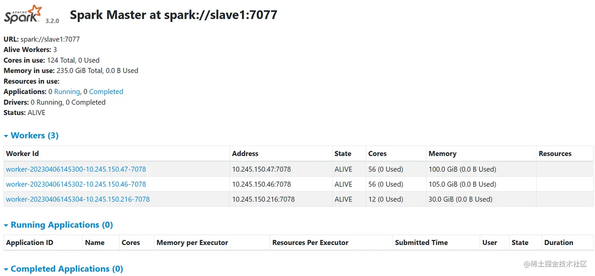

还可以查看历史服务器：http://10.245.150.47:18080/

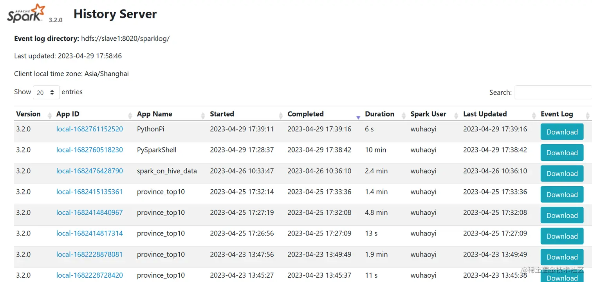

点击App ID可以查看spark程序运行的细记录

连接到StandAlone集群
```text
--master spark://ip地址:7077(7077就是配置的master的通讯地址)
```

示例：bin/pyspark --master spark://slave1:7077

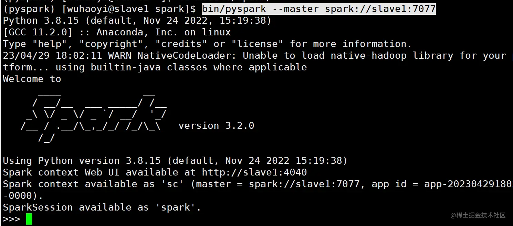

### Spark应用架构
向spark中提交程序：
```text
bin/spark-submit --master spark://slave1:7077 \
/home/wuhaoyi/module/spark/examples/src/main/python/pi.py 10
```

查看程序运行情况：

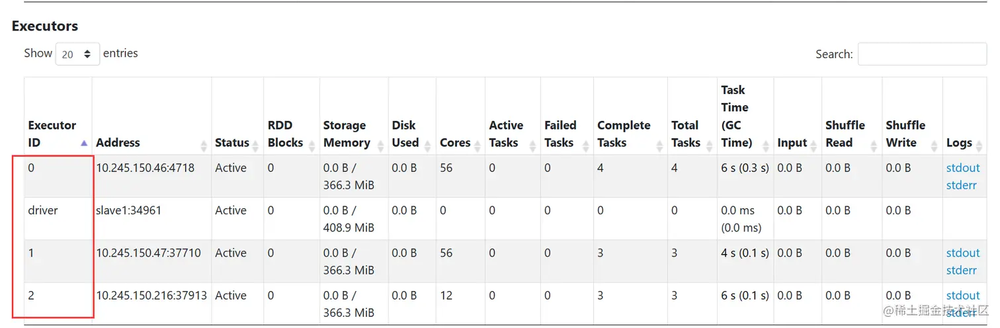

可以看到Spark Application运行到集群上时，由两部分组成：Driver Program和Executors。

1）Driver Program
- 相当于AppMaster，整个应用管理者，负责应用中所有Job的调度执行；
- 运行JVM Process，运行程序的MAIN函数，必须创建SparkContext上下文对象；
- 一个SparkApplication仅有一个；

2）Executors
- 相当于一个线程池，运行JVM Process，其中有很多线程，每个线程运行一个Task任务，
  一个Task任务运行需要1 Core CPU，所以可以认为Executor中线程数就等于CPU Core核数；
- 一个Spark Application可以有多个，可以设置个数和资源信息；

**程序提交运行的全过程：**

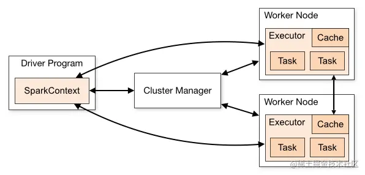

- 用户程序创建SparkContext时，新创建的SparkContext实例会连接到ClusterManager。 
  Cluster Manager会根据用户提交时设置的CPU和内存等信息为本次提交分配计算资源，启动Executor。
- Driver会将用户程序划分为不同的执行阶段Stage，每个执行阶段Stage由一组完全相同Task组成，
  这些Task分别作用于待处理数据的不同分区。在阶段划分完成和Task创建后，Driver会向Executor发送Task；
- Executor在接收到Task后，会下载Task的运行时依赖，在准备好Task的执行环境后，会开始执行Task，
  并且将Task的运行状态汇报给Driver；
- Driver会根据收到的Task的运行状态来处理不同的状态更新。
  Task分为两种：一种是Shuffle Map Task，它实现数据的重新洗牌，洗牌的结果保存到Executor 所在节点的文件系统中；
  另外一种是Result Task，它负责生成结果数据；
- Driver会不断地调用Task，将Task发送到Executor执行，在所有的Task都正确执行或者超过执行次数的限制仍然没有执行成功时停止；

### Spark程序运行层次结构

1）在一个Spark Application中，包含多个Job；

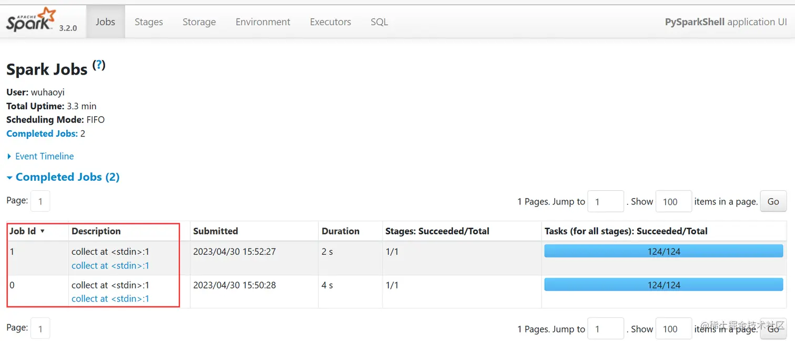

2）每个Job由多个Stage组成，每个Job按照DAG图来执行

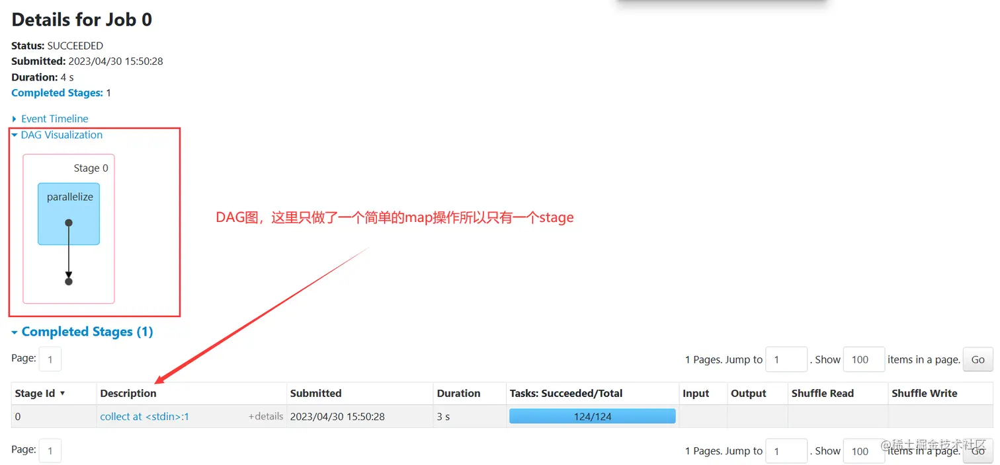

3）每个Stage中包含多个Task任务，每个Task以线程Thread方式执行，需要1Core CPU

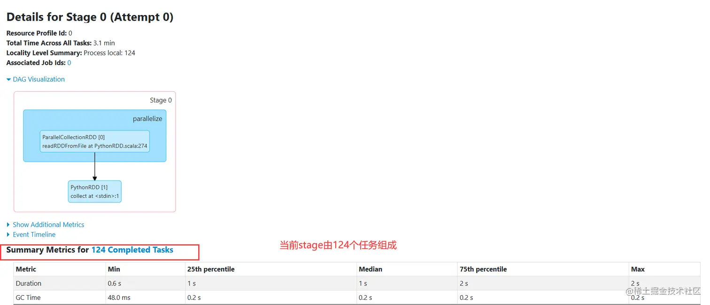

**下面对Spark Application程序运行时三个核心概念进行说明：**

- **Job：** 
  由多个Task的并行计算部分组成，一般Spark中的action操作（如save、collect），会生成一个Job。
- **Stage：** Job的组成单位，一个Job会切分成多个Stage，Stage彼此之间相互依赖顺序执行，
  而每个Stage是多个Task 的集合，类似 map和reduce stage
- **Task：** 被分配到各个Executor的单位工作内容，它是Spark中的最小执行单位，
  一般来说有多少个Partition（物理层面的概念，即分支可以理解为将数据划分成不同部分并行处理），就会有多少个Task，
  每个Task只会处理单一分支上的数据。

## Spark On YARN模式
本质：
- Master角色由YARN的ResourceManager担任
- Worker角色由YARN的NodeManager担任

配置过程：
- 配置好Hadoop集群
- 配置环境变量：HADOOP_CONF_DIR；以便spark运行时读取配置文件相关信息：

连接到YARN中
```text
bin/pyspark --master yarn --deploy-mode client|cluster
# --deploy-mode 选项是指定部署模式, 默认是 客户端模式
# client就是客户端模式
# cluster就是集群模式
# --deploy-mode 仅可以用在YARN模式下
```

注意：pyspark和spark-shell无法运行cluster模式；spark-submit可以运行cluster模式。

### 两种DeployMode的区别
Driver运行的位置不同：
- Cluster模式: Driver运行在YARN容器内部，和ApplicationMaster在同一个容器内；
- Client模式: Driver运行在客户端进程中，比如Driver运行在spark-submit程序的进程中；

|            | Cluster模式     | client模式             |
|------------|---------------|----------------------|
| Driver运行位置 | YARN容器内       | 客户端进程内               |
| 通讯效率       | 高             | 低于Cluster模式          |
| 日志查看       | 日志输出在容器内查看不方便 | 日志输出在客户端的标准输出流中，方便查看 |
| 生产可用       | 推荐            | 不推荐                  |
| 稳定性        | 稳定            | 基于客户端进程，受到客户端进程影响    |


### Cluster模式：

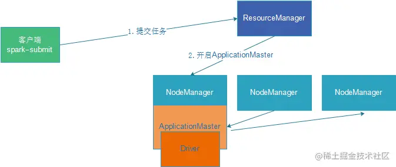

### Client模式：

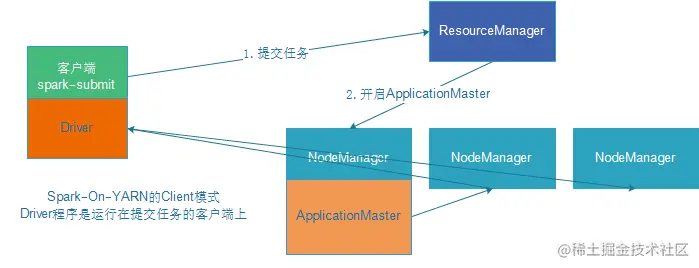

### 两种DeployMode的使用场景
Client模式：学习测试时使用，生产不推荐(要用也可以，性能略低，稳定性略低)
- 1）Driver运行在Client上，和集群的通信成本高
- 2）Driver输出结果会在客户端显示

Cluster模式：生产环境中使用该模式
- 1）Driver程序在YARN集群中，和集群的通信成本低
- 2）Driver输出结果不能在客户端显示
- 3）该模式下Driver运行ApplicationMaster这个节点上，由Yarn管理，如果出现问题，yarn会重启ApplicationMaster(Driver)

### 两种DeployMode的详细运行流程
**Client：**

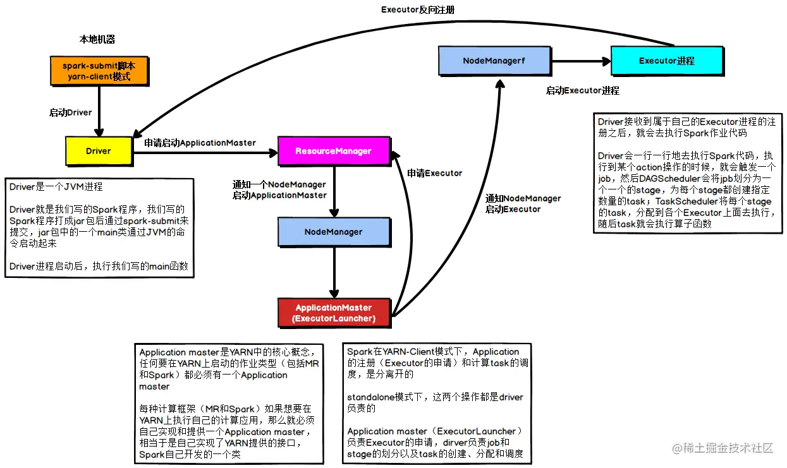

```text
1）Driver在任务提交的本地机器上运行，Driver启动后会和ResourceManager通讯申请启动ApplicationMaster；
2）随后ResourceManager分配Container，在合适的NodeManager上启动ApplicationMaster，
此时的ApplicationMaster的功能相当于一个ExecutorLauncher，只负责向ResourceManager申请Executor内存；
ApplicationMaster负责Executor的启动；
3）ResourceManager接到ApplicationMaster的资源申请后会分配Container，
然后ApplicationMaster在资源分配指定的NodeManager上启动Executor进程；
4）Executor进程启动后会向Driver反向注册，Executor全部注册完成后Driver开始执行main函数；
5）之后执行到Action算子时，触发一个Job，并根据【宽依赖】开始划分Stage，每个Stage生成对应的TaskSet，
之后将Task分发到各个Executor上执行。
```
在Client模式下，由于Driver运行在本地机器上，所以spark任务的调度是由本地机器完成的，所以通讯效率会比较低。

**Cluster：**

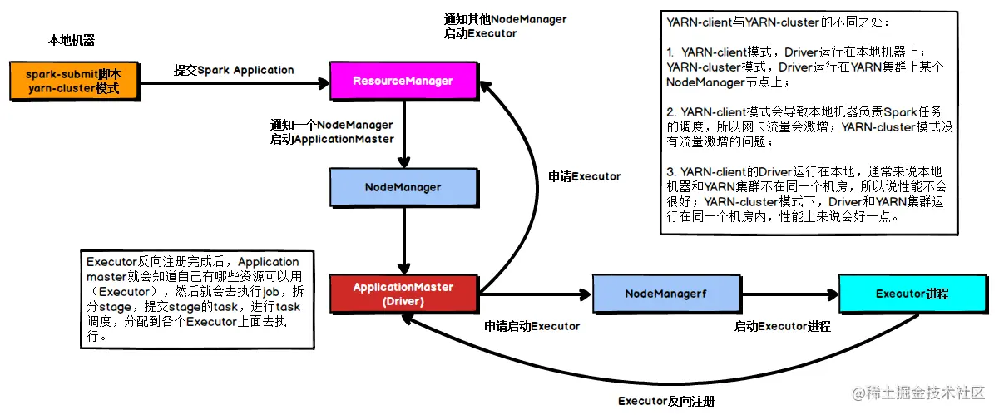

```text
1）任务提交后会和ResourceManager通讯申请启动ApplicationMaster；
2）随后ResourceManager分配Container，在合适的NodeManager上启动ApplicationMaster，
此时的ApplicationMaster就是Driver；
3）Driver启动后向ResourceManager申请Executor内存，
ResourceManager接到ApplicationMaster的资源申请后会分配Container，然后在合适的NodeManager上启动Executor进程；
4）Executor进程启动后会向Driver反向注册；
5）Executor全部注册完成后Driver开始执行main函数，
之后执行到Action算子时，触发一个job，并根据宽依赖开始划分stage，每个stage生成对应的taskSet，
之后将task分发到各个Executor上执行；
```

# PySpark开发环境搭建
PySpark：
是Spark官方提供的一个Python类库，内置了完全的Spark API，
可以通过PySpark类库来编写Spark应用程序，并将其提交到Spark集群中运行。

## 环境搭建步骤：
### 1、安装Windows anaconda环境：
下载地址：https://mirrors.tuna.tsinghua.edu.cn/anaconda/archive/

下载时候直接安装即可，安装过程中可以自行指定路径，其余没有需要勾选的内容。

安装完成后打开 Anaconda Prompt 程序


出现base说明安装成功：

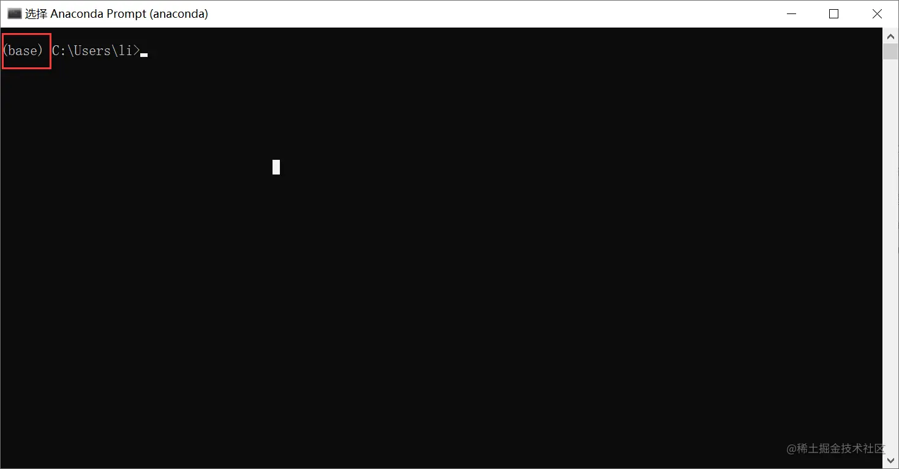

### 2、配置国内镜像源：
打开Anaconda Prompt

输入：conda config --set show_channel_urls yes

这个设置的作用是在安装包时显示包的安装来源

然后找到C:\Users\用户名.condarc文件，用以下内容替换文件中原有的内容：
```text
channels:
  - defaults
show_channel_urls: true
default_channels:
  - https://mirrors.tuna.tsinghua.edu.cn/anaconda/pkgs/main
  - https://mirrors.tuna.tsinghua.edu.cn/anaconda/pkgs/r
  - https://mirrors.tuna.tsinghua.edu.cn/anaconda/pkgs/msys2
custom_channels:
  conda-forge: https://mirrors.tuna.tsinghua.edu.cn/anaconda/cloud
  msys2: https://mirrors.tuna.tsinghua.edu.cn/anaconda/cloud
  bioconda: https://mirrors.tuna.tsinghua.edu.cn/anaconda/cloud
  menpo: https://mirrors.tuna.tsinghua.edu.cn/anaconda/cloud
  pytorch: https://mirrors.tuna.tsinghua.edu.cn/anaconda/cloud
  simpleitk: https://mirrors.tuna.tsinghua.edu.cn/anaconda/cloud
```

### 3、创建虚拟环境：
```text
# 创建虚拟环境 pyspark, 基于Python 3.8
conda create -n pyspark python=3.8

# 切换到虚拟环境内
conda activate pyspark

# 在虚拟环境内安装包
pip install pyhive pyspark jieba -i https://pypi.tuna.tsinghua.edu.cn/simple
```

### 4、安装pyspark：
```text
pip install pyspark -i https://pypi.tuna.tsinghua.edu.cn/simple
```

### 5、在Windows中配置Hadoop补丁文件:

- 将文件夹内bin内的hadoop.dll复制到: C:\Windows\System32里面去
- 配置HADOOP_HOME环境变量指向 hadoop补丁文件夹的路径

下载地址：https://github.com/steveloughran/winutils

所需文件内容如下：

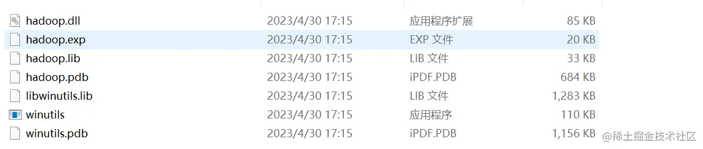

### 6、在pycharm中配置本地解释器
在pycharm工具中进入 File->Settings->Python Interpreter

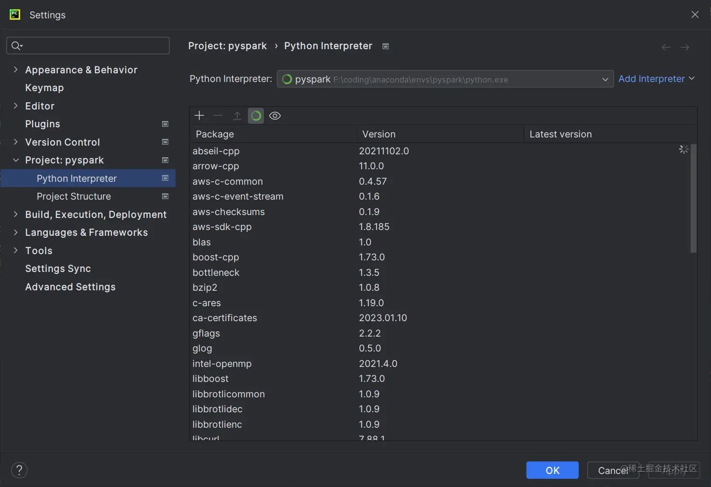

点击Add Interpreter，选择Conda Interpreter：

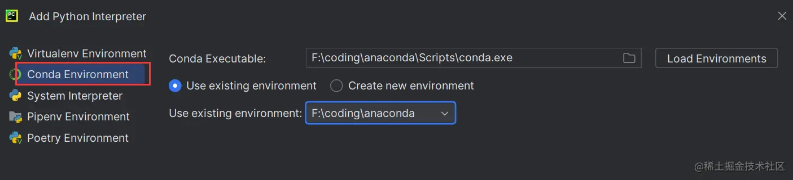

然后会自动加载conda中已经创建好的环境，如果没有的话可以选择右上角的Load Environments手动加载；

之后选择pyspark：

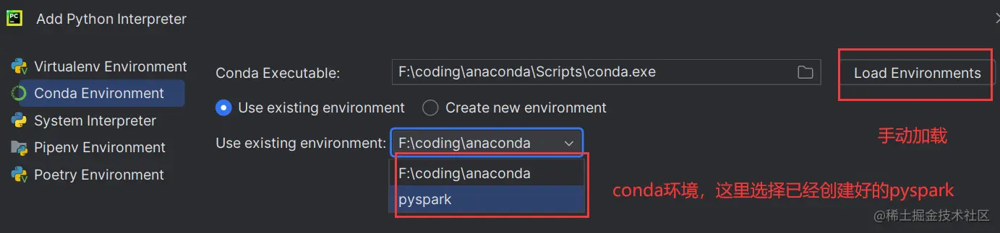

点击OK即可；

### 7、通过SSH配置Linux解释器
本地解释器在性能上会慢一些，而且一些比较耗内存地操作无法完成，所以配置linux解释器：

# Python On Spark执行原理

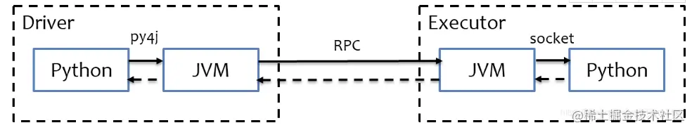

PySpark宗旨是在不破坏Spark已有的运行时架构，在Spark架构外层包装一层Python API，借助Py4j实现Python和Java的交互，
进而实现通过Python编写Spark应用程序。

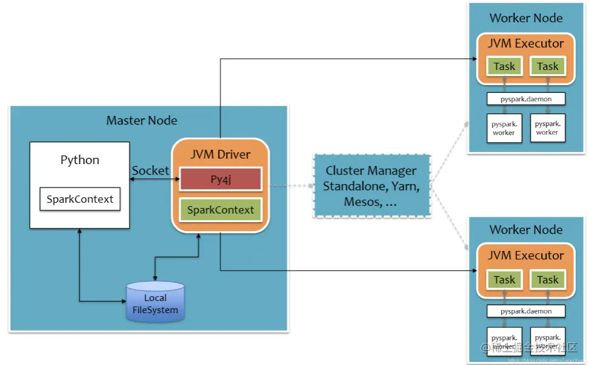
