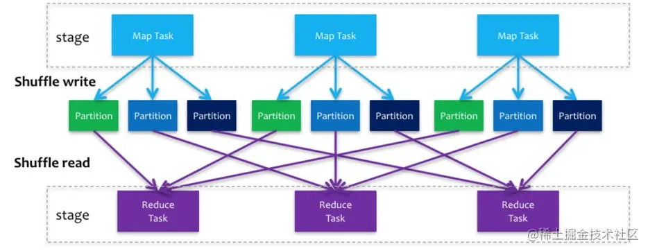
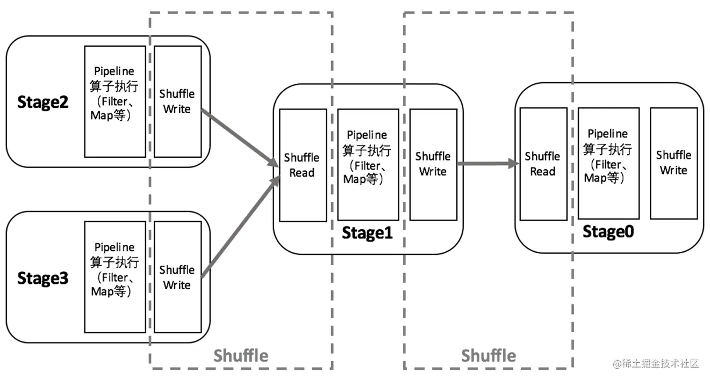
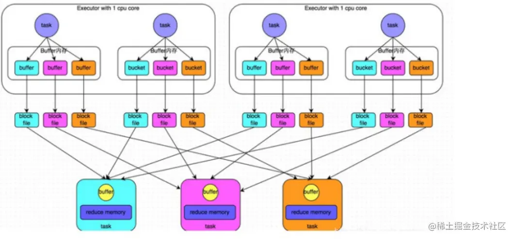
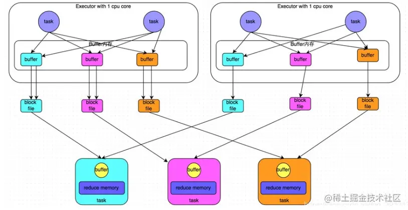
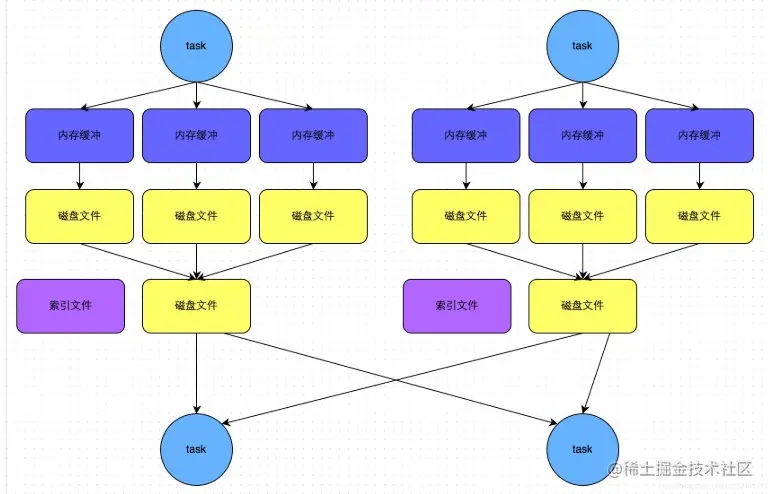

Spark在DAG调度阶段会将一个Job划分为多个Stage，
上游Stage做map工作，下游Stage做reduce工作，其本质上还是MapReduce计算框架。
**Shuffle是连接map和reduce之间的桥梁**，它将map的输出对应到reduce输入中，
涉及到序列化反序列化、跨节点网络IO以及磁盘读写IO等。

Spark的Shuffle分为Write和Read两个阶段，分属于两个不同的Stage，
前者是Parent Stage的最后一步，后者是Child Stage的第一步。



# shuffle的执行
执行Shuffle的主体是Stage中的并发任务，
这些任务分ShuffleMapTask和ResultTask两种，
ShuffleMapTask要进行Shuffle，ResultTask负责返回计算结果，
一个Job中只有最后的Stage采用ResultTask，其他的均为ShuffleMapTask。



# ShuffleManager
ShuffleManager是负责shuffle过程的执行、计算和处理的组件，也叫shuffle管理器；
有HashShuffleManager和SortShuffleManager两种实现方式；
相应地也有Hash Shuffle和Sort Shuffle两种Shuffle方式。

两种manager对比：
```text
在Spark 1.2以前，默认的shuffle计算引擎是HashShuffleManager。
而HashShuffleManager有着一个非常严重的弊端，就是会产生【大量的中间磁盘文件】，进而由大量的磁盘IO操作影响了性能。

在Spark 1.2以后的版本中，默认的ShuffleManager改成了SortShuffleManager。
SortShuffleManager虽然也会产生【较多的临时磁盘文件】，但是最后【会将所有的临时文件合并(merge)成一个磁盘文件】，
因此每个Task就只有一个磁盘文件。
在下一个stage的shuffle read task拉取自己的数据时，只要根据索引读取每个磁盘文件中的部分数据即可。
```

# Hash Shuffle
## 阶段划分：
- shuffle write：mapper阶段，上一个stage得到最后的结果写出。
- shuffle read ：reduce阶段，下一个stage拉取上一个stage进行合并。

## 未经优化的hashShuffleManager
根据task的计算结果的key值的 hashcode%ReduceTask 来决定放入哪一个区分分区，这样保证相同的数据一定放入一个分区。



**根据下游的task决定生成几个文件，先生成缓冲区文件在写入磁盘文件，再将block文件进行合并。**

## 经过优化的hashShuffleManager
使用shuffleFileGroup：
不再根据下游task的数量决定生成文件的数量；
每个shuffleFileGroup会对应一批磁盘文件，每一个Group磁盘文件的数量与下游stage的task数量是相同的； 
而一个executor对应一个shuffleFileGroup。



这样可以减少shuffle write阶段产生的磁盘文件的数量。

## 比较两种方式
```text
1、未经优化：
    上游的task数量：m
    下游的task数量：n
    上游的executor数量：k (m>=k)
    总共的磁盘文件：m*n

2、优化之后的：
    上游的task数量：m
    下游的task数量：n
    上游的executor数量：k (m>=k)
    总共的磁盘文件：k*n
```

# Sort Shuffle Manager
SortShuffleManager的运行机制主要分成两种，一种是【普通运行机制】，另一种是【bypass运行机制】。
当shuffle write task的数量小于等于spark.shuffle.sort.bypassMergeThreshold参数的值时(默认为200)，
就会启用bypass机制。

**普通运行机制流程**：
```text
（1）写入内存：
    数据会先写入一个内存数据结构中(默认5M)，此时根据不同的shuffle算子，可能选用不同的数据结构。
    如果是reduceByKey这种聚合类的shuffle算子，那么会选用Map数据结构，一边通过Map进行聚合，一边写入内存；
    如果是join这种普通的shuffle算子，那么会选用Array数据结构，直接写入内存。

（2）内存->磁盘：
    每写一条数据进入内存数据结构之后，就会判断一下，是否达到了某个临界阈值。
    如果达到临界阈值的话，那么就会尝试将内存数据结构中的数据溢写到磁盘，然后清空内存数据结构。

（3）排序：
    在溢写到磁盘文件之前，会先根据key对内存数据结构中已有的数据进行排序。
    
（4）溢写：
    排序过后，会分批将数据写入磁盘文件。
    默认的batch数量是10000条，也就是说，排序好的数据，会以每批1万条数据的形式分批写入磁盘文件。

（5）merge：
    一个task将所有数据写入内存数据结构的过程中，会发生多次磁盘溢写操作，也就会产生多个临时文件。
    最后会将之前所有的临时磁盘文件都进行合并成1个磁盘文件，这就是merge过程。
    由于一个task就只对应一个磁盘文件，也就意味着该task为Reduce端的stage的task准备的数据都在这一个文件中，
    因此还会单独写一份索引文件，其中标识了下游各个task的数据在文件中的start offset与end offset。
```



**bypass运行机制的触发条件：**
- shuffle map task数量小于spark.shuffle.sort.bypassMergeThreshold=200参数的值
- 不是map combine聚合的shuffle算子(比如reduceByKey有map combine）

**bypass运行机制流程：**
```text
1）Spark首先会对数据进行 Shuffle 操作，将数据按照 key 进行分区，并将每个分区的数据写入多个文件中。
这个过程类似于普通的 Sort Shuffle。

2）在写入文件之前，Spark 会检查每个分区中的数据是否已经在同一个文件中。
如果是，那么就不需要再进行排序和写入文件的操作了。
这个检查的过程可以通过一些统计信息来进行，例如每个分区中数据的分布情况、key 的分布情况等。

3）如果可以确定某些 key 的数据已经在同一个文件中，那么就会使用一个叫做 "bypass" 的技术来避免排序和写入文件的操作。
具体来说，Spark 会将这些 key 的数据捆绑在一起，然后直接写入一个单独的文件中。
这样可以减少数据的移动和排序次数，提高性能。

4）如果无法确定某些 key 的数据是否已经在同一个文件中，那么就需要进行普通的 Sort Shuffle 操作，
将数据按照 key 进行排序，并将排序后的数据写入多个文件中。
```
