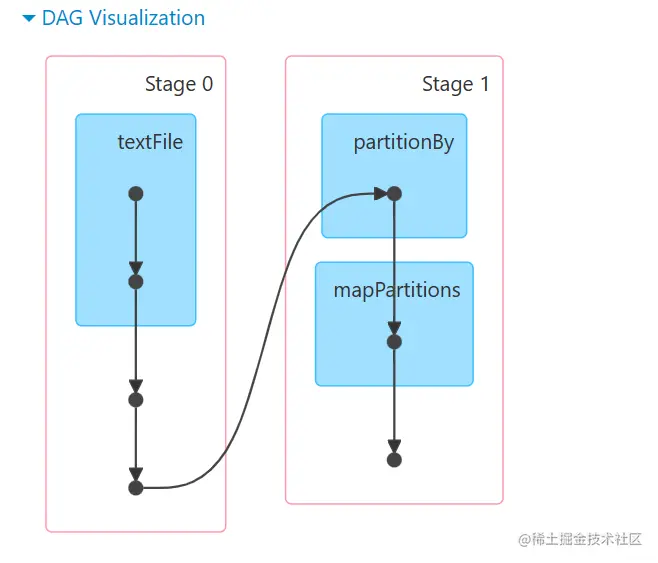
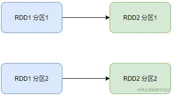
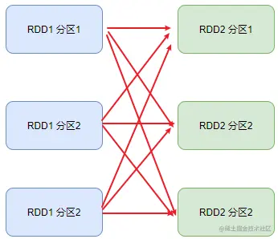
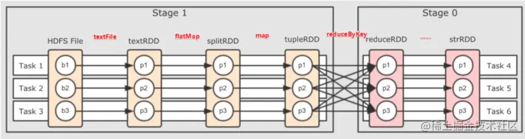
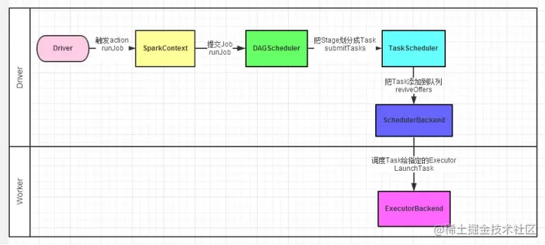

# Spark 内核调度
## Spark任务调度：
如何组织任务去处理RDD中每个分区的数据，
根据RDD的依赖关系构建DAG，基于DAG划分Stage，将每个Stage中的任务发到指定节点运行。
基于Spark的任务调度原理，可以合理规划资源利用，做到尽可能用最少的资源高效地完成任务计算。

## DAG
有向无环图，代表的是【spark任务的执行流程图】；

示例：



DAG图的**作用**：标识代码的逻辑运行流程；

DAG图的**产生**：一个action算子会将其前面一串的RDD依赖关系执行，也就是说一个action会产生一个DAG图；

### Job和Action的关系
1个action会产生一个DAG，而一个DAG会在程序运行中产生一个Job；所以,1 action = 1 DAG = 1 Job。

在一个Application中，可以有多个Job，每一个Job内含一个DAG，同时每一个Job都是由一个Action产生的。

### DAG和分区之间的关联
DAG是Spark代码的逻辑执行图，其最终作用是为了构建物理上的Spark详细执行计划。

由于Spark是分布式执行的，所以DAG与分区也有关联；带有分区交互的DAG是在程序运行之后由spark决定的。

### DAG的宽窄依赖和阶段划分
**窄依赖**：父RDD的一个分区，全部将数据发给子RDD的一个分区。



**宽依赖（shuffle）**：父RDD的一个分区，将数据发给子RDD的多个分区（需要依赖网络IO）。



**区分宽窄依赖**：看RDD之间有无分叉。

**阶段划分**：按照宽依赖划分不同的Stage。

**划分依据**：从后向前，遇到宽依赖就划分出一个阶段，成为Stage，如图：



由此可以看出，每一个阶段的内部一定是窄依赖；

## 内存迭代计算


如图，在每一个阶段的内部，有多个Task并行计算，每一个Task是一个线程，线程的相关运算均在内存中完成；
这样的多个Task，就形成了【并行的内存计算管道】。

Task的数量受到全局并行度的限制，大部分的算子都会依循全局并行度的要求，规划自己的分区；
如上图所示，设置了全局并行度为3，rdd算子的并行度也是3（有3个Task）。

一般来说，只设置全局并行度，不为计算算子单独设置并行度（否则内存迭代管道会减少，内存迭代管道的长度也会缩短）
（有的排序算子需要设置并行度，比如说进行全局排序）。

## Spark并行度
所谓的并行，指的是在同一时间内，有多少个task在运行。

### 并行度的设置
#### 并行度优先级
并行度设置的优先级从高到低:
```text
1）代码中
2）客户端提交参数中
3）配置文件中
4）默认(1，但是不会全部以1来跑，多数时候基于读取文件的分片数量来作为默认并行度)
```

#### 全局并行度的设置
配置文件中:conf/spark-defaults.conf中设置
```text
spark.default.parallelism 100
```
在客户端提交参数中:
```text
bin/spark-submit --conf "spark.default.parallelism=100"
```
在代码中设置:
```text
conf = sparkConf()
conf.set("spark.default.parallelism","100")
```

### 集群中如何规划并行度
设置为CPU总核心数的2-10倍。

原因：
```text
CPU的一个核心同一时间只能干一件事情。
所以，在100个核心的情况下，设置100个并行，就能让CPU 100%出力。
这种设置下，如果task的压力不均衡，某个task先执行完了，就导致某个CPU空闲。
所以，我们将Task(并行)分配的数量变多，比如800个并行，同一时间只有100个在运行，700个在等待。
但是可以确保，某个task运行完了，后续有task补上，不让cpu闲下来，最大程度利用集群的资源。
```
注意：并行度的设置只与CPU的总核心数有关。

## Spark任务调度流程
spark的任务调度由Driver来完成，包括以下内容：
```text
逻辑DAG产生
分区DAG产生
Task划分
将Task分配给Executor并监控其工作
```
Driver内的两个组件：
- ①DAG调度器：将逻辑的DAG图进行处理，最终得到逻辑上的Task划分。
- ②Task调度器：基于DAG的产出，来规划这些逻辑的task应该在哪些物理的executor上运行，并监控管理其运行。

spark的程序调度流程：
```text
Driver被构建出来
构建SparkContext(执行环境入口对象)
基于DAG Scheduler(DAG调度器) 构建逻辑Task分配
基于TaskScheduler (Task调度器) 将逻辑Task分配到各个Executor上干活，并监控它们
Worker(Executor)，被TaskScheduler管理监控，听从它们的指令干活，并定期汇报健康
```
如下图所示：


