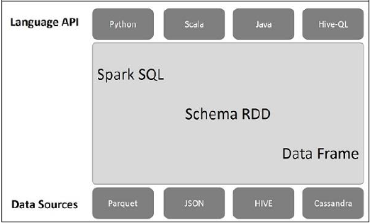

# Spark SQL 教程
Spark为【结构化数据处理】引入了一个称为Spark SQL的编程模块。
它提供了一个称为【DataFrame】的编程抽象，并且可以充当【分布式SQL查询引擎】。

## Spark SQL的特性
以下是Spark SQL的功能：

### 集成
无缝地将SQL查询与Spark程序混合。 
Spark SQL允许您将【结构化数据】作为Spark中的【分布式数据集(RDD)】进行查询，在Python，Scala和Java中集成了API。
这种紧密的集成使得可以轻松地运行SQL查询以及复杂的分析算法。

### 统一数据访问
加载和查询来自各种来源的数据。 
Schema-RDDs提供了一个有效处理结构化数据的单一接口，包括Apache Hive表，镶木地板文件和JSON文件。

### Hive兼容性
在现有仓库上运行未修改的Hive查询。 
Spark SQL重用了Hive前端和MetaStore，为您提供与现有Hive数据，查询和UDF的完全兼容性。
只需将其与Hive一起安装即可。

### 标准连接
通过JDBC或ODBC连接。 
Spark SQL包括具有行业标准JDBC和ODBC连接的服务器模式。

### 可扩展性
对于交互式查询和长查询使用相同的引擎。 
Spark SQL利用RDD模型来支持中查询容错，使其能够扩展到大型作业。
不要担心为历史数据使用不同的引擎。

### Spark SQL架构
下图说明了Spark SQL的体系结构

此架构包含三个层，即 Language API，Schema RDD和数据源。

#### 语言API
Spark与不同的语言和Spark SQL兼容。 它也是由这些语言支持的API（python，scala，java，HiveQL）。

#### 模式RDD
Spark Core是使用称为RDD的特殊数据结构设计的。 
通常，Spark SQL适用于模式，表和记录。 
因此，我们可以使用Schema RDD作为临时表。 我们可以将此Schema RDD称为数据帧。

#### 数据源
通常spark-core的数据源是文本文件，Avro文件等。但是，Spark SQL的数据源不同。 
这些是Parquet文件，JSON文档，HIVE表和Cassandra数据库。

# Spark SQL 数据类型
spark sql 主要包括以下数据类型：

## 数字类型
* ByteType：代表一个字节的整数。范围是-128到127。
* ShortType：代表两个字节的整数。范围是-32768到32767。
* IntegerType：代表4个字节的整数。范围是-2147483648到2147483647。
* LongType：代表8个字节的整数。范围是-9223372036854775808到9223372036854775807。
* FloatType：代表4字节的单精度浮点数。
* DoubleType：代表8字节的双精度浮点数。
* DecimalType：代表任意精度的10进制数据。通过内部的java.math.BigDecimal支持。
  BigDecimal由一个任意精度的整型非标度值和一个32位整数组成。
* StringType：代表一个字符串值。
* BinaryType：代表一个byte序列值。
* BooleanType：代表boolean值。

## Datetime类型
* TimestampType：代表包含字段年，月，日，时，分，秒的值。
* DateType：代表包含字段年，月，日的值。

## 复合类型
* ArrayType(elementType, containsNull)：
  代表由elementType类型元素组成的序列值。containsNull用来指明ArrayType中的值是否有null值。
* MapType(keyType, valueType, valueContainsNull)：
  表示包括一组键 - 值对的值。通过keyType表示key数据的类型，通过valueType表示value数据的类型。
  valueContainsNull用来指明MapType中的值是否有null值。
* StructType(fields):
  表示一个拥有StructFields (fields)序列结构的值。
* StructField(name, dataType, nullable):
  代表StructType中的一个字段，字段的名字通过name指定，dataType指定field的数据类型，nullable表示字段的值是否有null值。

## 数据类型汇总
Spark SQL的所有数据类型都定义在包org.apache.spark.sql中，你可以通过import org.apache.spark.sql._访问它们。

| 数据类型	          | Scala中的值类型	                                                                                                                 | 访问或者创建数据类型的API                                                              |
|----------------|-----------------------------------------------------------------------------------------------------------------------------|-----------------------------------------------------------------------------|
| ByteType	      | Byte	                                                                                                                       | ByteType                                                                    |
| ShortType	     | Short	                                                                                                                      | ShortType                                                                   |
| IntegerType	   | Int	                                                                                                                        | IntegerType                                                                 |
| LongType	      | Long	                                                                                                                       | LongType                                                                    |
| FloatType	     | Float	                                                                                                                      | FloatType                                                                   |
| DoubleType	    | Double	                                                                                                                     | DoubleType                                                                  |
| DecimalType	   | scala.math.BigDecimal	                                                                                                      | DecimalType                                                                 |
| StringType	    | String	                                                                                                                     | StringType                                                                  |
| BinaryType	    | Array[Byte]	                                                                                                                | BinaryType                                                                  |
| BooleanType	   | Boolean	BooleanType                                                                                                         |                                                                             |
| TimestampType	 | java.sql.Timestamp	                                                                                                         | TimestampType                                                               |
| DateType	      | java.sql.Date	                                                                                                              | DateType                                                                    |
| ArrayType	     | scala.collection.Seq	                                                                                                       | ArrayType(elementType, [containsNull]) 注意containsNull默认为true                |
| MapType	       | scala.collection.Map	                                                                                                       | MapType(keyType, valueType, [valueContainsNull]) 注意valueContainsNull默认为true |
| StructType	    | org.apache.spark.sql.Row	                                                                                                   | StructType(fields) ，注意fields是一个StructField序列，相同名字的两个StructField不被允许         |
| StructField	   | The value type in Scala of the data type of this field (For example, Int for a StructField with the data type IntegerType)	 | StructField(name, dataType, nullable)                                       |

