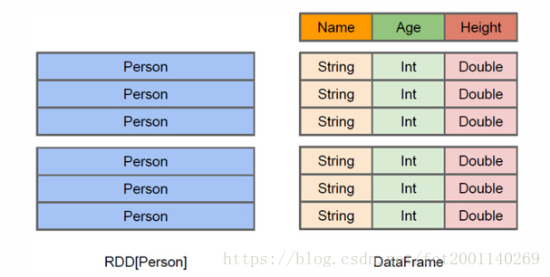

# Spark SQL DataSet
Dataset是从Spark 1.6开始引入的一个新的抽象，当时还是处于alpha版本；然而在Spark 2.0，它已经变成了稳定版了。
Dataset是特定域对象中的强类型集合，它可以使用函数或者相关操作并行地进行转换等操作。
每个Dataset都有一个称为DataFrame的非类型化的视图，这个视图是行的数据集。

DataSet和RDD主要的区别是：
* DataSet是特定域的对象集合；然而RDD是任何对象的集合。
* DataSet的API总是强类型的；而且可以利用这些模式进行优化，然而RDD却不行。

DataFrame和Dataset是有什么关系呢？其实DataFrame是特殊的Dataset，它在编译时不会对模式进行检测。在未来版本的Spark，Dataset将会替代RDD成为我们开发编程使用的API（注意，RDD并不是会被取消，而是会作为底层的API提供给用户使用）。

## 如何创建DataSet
那么如何创建DataSet呢？下面给出具体代码示例。
```text
scala> case class Person(name:String, age:Long)
defined class Person

scala> val caseClassDS = Seq(Person("Andy",32)).toDS()
caseClassDS: org.apache.spark.sql.Dataset[Person] = [name: string, age: bigint]
scala> caseClassDS.show()
+----+---+
|name|age|
+----+---+
|Andy| 32|
+----+---+

scala> val primitiveDS = Seq(1,2,3).toDS()
primitiveDS: org.apache.spark.sql.Dataset[Int] = [value: int]
scala> primitiveDS.map(_ + 1).collect()
res1: Array[Int] = Array(2, 3, 4)
scala> val path="hdfs:/tmp/people.json"
path: String = hdfs:/tmp/people.json
```

DataFrame转换成DataSet
```text
scala> val peopleDS=spark.read.json(path).as[Person]
peopleDS: org.apache.spark.sql.Dataset[Person] = [age: bigint, name: string]
scala> peopleDS.show()
+---+-------+
|age|   name|
+---+-------+
| 20|Michael|
| 30|   Andy|
| 19| Justin|
+---+-------+
```

# RDD、DataFrame和DataSet的区别
在比较这三者的区别之前，先看看他们各自的定义是什么。

Spark RDD
```text
RDD是一种【弹性分布式数据集】，是一种【只读】【分区数据】。
它是【spark的基础数据结构】，具有【内存计算能力】、【数据容错性】以及【数据不可修改】特性。
```

Spark Dataframe
```text
Dataframe也是一种不可修改的分布式数据集合，它可以按列查询数据，类似于关系数据库里面的表结构。
可以对数据指定数据模式（schema）。
```

Spark Dataset
```text
Dataset是DataFrame的扩展，它提供了类型安全，面向对象的编程接口。也就是说DataFrame是Dataset的一种特殊形式。
```

## 共同点
1、RDD、DataFrame、Dataset全都是spark平台下的分布式弹性数据集，为处理超大型数据提供便利。

2、三者都有惰性机制，在进行创建、转换，如map方法时，不会立即执行，只有在遇到Action如foreach时，三者才会开始遍历运算，
极端情况下，如果代码里面有创建、转换，但是后面没有在Action中使用对应的结果，在执行时会被直接跳过，如：
```text
val sparkconf = new SparkConf().setMaster("local").setAppName("test").set("spark.port.maxRetries","1000")
val spark = SparkSession.builder().config(sparkconf).getOrCreate()
val rdd = spark.sparkContext.parallelize(Seq(("a", 1), ("b", 1), ("a", 1)))

rdd.map{line=>
    println("运行")
    line._1
}
```
map中的println(“运行”)并不会运行

3、三者都会根据spark的内存情况自动缓存运算，这样即使数据量很大，也不用担心会内存溢出

4、三者都有partition的概念，如：
```text
var predata=data.repartition(24).mapPartitions{
    PartLine => {
        PartLine.map{
            line =>
                println(“转换操作”)
        }
    }
}
```

这样对每一个分区进行操作时，就跟在操作数组一样，不但数据量比较小，而且可以方便的将map中的运算结果拿出来，
如果直接用map，map中对外面的操作是无效的，如：
```text
val rdd=spark.sparkContext.parallelize(Seq(("a", 1), ("b", 1), ("a", 1)))
    var flag=0
    val test=rdd.map{line=>
      println("运行")
      flag+=1
      println(flag)
      line._1
    }
println(test.count)
println(flag)
/**
   运行
   1
   运行
   2
   运行
   3
   3
   0
  * */
```
不使用partition时，对map之外的操作无法对map之外的变量造成影响。

5、三者有许多共同的函数，如filter，排序等。

6、在对DataFrame和Dataset进行操作许多操作都需要这个包进行支持。
```text
import spark.implicits._   //这里的spark是SparkSession的变量名
```

7、DataFrame和Dataset均可使用模式匹配获取各个字段的值和类型
DataFrame：
```text
testDF.map{
      case Row(col1:String,col2:Int)=>
        println(col1);println(col2)
        col1
      case _=>
        ""
    }
```

为了提高稳健性，最好后面有一个 “_” 通配操作，这里提供了DataFrame一个解析字段的方法。
Dataset：
```text
case class Coltest(col1:String,col2:Int)extends Serializable //定义字段名和类型
    testDS.map{
      case Coltest(col1:String,col2:Int)=>
        println(col1);println(col2)
        col1
      case _=>
        ""
    }
```

## 区别

### RDD
1、RDD一般和spark mlib同时使用
2、RDD不支持sparksql操作



上图直观地体现了DataFrame和RDD的区别。
左侧的RDD[Person]虽然以Person为类型参数，但Spark框架本身不了解 Person类的内部结构。
而右侧的DataFrame却提供了详细的结构信息，使得Spark SQL可以清楚地知道该数据集中包含哪些列，每列的名称和类型各是什么。
DataFrame多了数据的结构信息，即schema。RDD是分布式的 Java对象的集合。DataFrame是分布式的Row对象的集合。
Dataset可以认为是DataFrame的一个特例，主要区别是Dataset每一个record存储的是一个强类型值而不是一个Row。

### DataFrame
1、与RDD和Dataset不同，DataFrame每一行的类型固定为Row，只有通过解析才能获取各个字段的值，如：
```text
testDF.foreach{
    line =>
        val col1=line.getAs[String]("col1")
        val col2=line.getAs[String]("col2")
}
```

每一列的值没法直接访问。

2、DataFrame与Dataset一般与spark ml同时使用。
```text
dataDF.createOrReplaceTempView("tmp")
spark.sql("select  ROW,DATE from tmp where DATE is not null order by DATE").show(100,false)
```

3、DataFrame与Dataset支持一些特别方便的保存方式，比如保存成csv，可以带上表头，这样每一列的字段名一目了然。
```text
//保存
val saveoptions = Map("header" -> "true", "delimiter" -> "\t", "path" -> "hdfs://172.xx.xx.xx:9000/test")
datawDF.write.format("com.databricks.spark.csv").mode(SaveMode.Overwrite).options(saveoptions).save()
//读取
val options = Map("header" -> "true", "delimiter" -> "\t", "path" -> "hdfs://172.xx.xx.xx:9000/test")
val datarDF= spark.read.options(options).format("com.databricks.spark.csv").load()
```

利用这样的保存方式，可以方便的获得字段名和列的对应，而且分隔符（delimiter）可以自由指定。

### Dataset
这里主要对比Dataset和DataFrame，因为Dataset和DataFrame拥有完全相同的成员函数，区别只是每一行的数据类型不同。

DataFrame也可以叫Dataset[Row],每一行的类型是Row，不解析，每一行究竟有哪些字段，各个字段又是什么类型都无从得知，
只能用上面提到的getAS方法或者共性中的第七条提到的模式匹配拿出特定字段。

而Dataset中，每一行是什么类型是不一定的，在自定义了case class之后可以很自由的获得每一行的信息。
```text
case class Coltest(col1:String,col2:Int)extends Serializable //定义字段名和类型
/**
  rdd
  ("a", 1)
  ("b", 1)
  ("a", 1)
  * */
val test: Dataset[Coltest]=rdd.map{line=>
      Coltest(line._1,line._2)
    }.toDS
    
test.map{
      line=>
        println(line.col1)
        println(line.col2)
    }
```
可以看出，Dataset在需要访问列中的某个字段时是非常方便的，然而，如果要写一些适配性很强的函数时，如果使用Dataset，
行的类型又不确定，可能是各种case class，无法实现适配，这时候用DataFrame即Dataset[Row]就能比较好的解决问题。

## 转化
RDD、DataFrame、Dataset三者有许多共性，有各自适用的场景常常需要在三者之间转换。

### DataFrame/Dataset转RDD
```text
val rdd1=testDF.rdd
val rdd2=testDS.rdd
```

### RDD转DataFrame
```text
import spark.implicits._
val testDF = rdd.map {line=>
      (line._1,line._2)
    }.toDF("col1","col2")
```
一般用元组把一行的数据写在一起，然后在toDF中指定字段名。

### RDD转Dataset
```text
import spark.implicits._
case class Coltest(col1:String,col2:Int)extends Serializable //定义字段名和类型
val testDS = rdd.map {line=>
      Coltest(line._1,line._2)
    }.toDS
```

可以注意到，定义每一行的类型（case class）时，已经给出了字段名和类型，后面只要往case class里面添加值即可。

### Dataset转DataFrame
只要把case class封装成Row即可。
```text
import spark.implicits._
val testDF = testDS.toDF
```

### DataFrame转Dataset
```text
import spark.implicits._
case class Coltest(col1:String,col2:Int)extends Serializable //定义字段名和类型
val testDS = testDF.as[Coltest]
```

这种方法就是在给出每一列的类型后，使用as方法，转成Dataset，这在数据类型是DataFrame又需要针对各个字段处理时极为方便。

**注意：**
在使用一些特殊的操作时，一定要加上 import spark.implicits._ 不然toDF、toDS无法使用。
