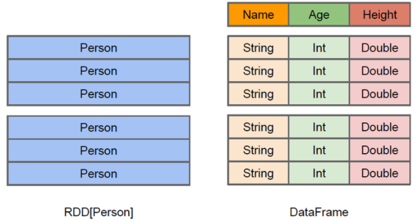
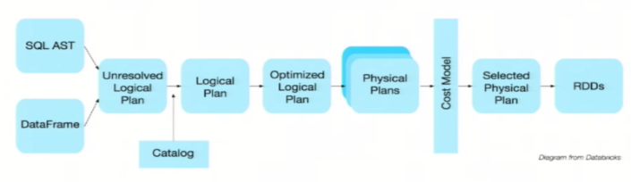
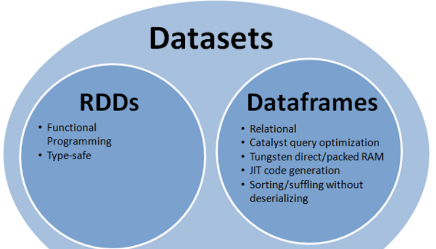
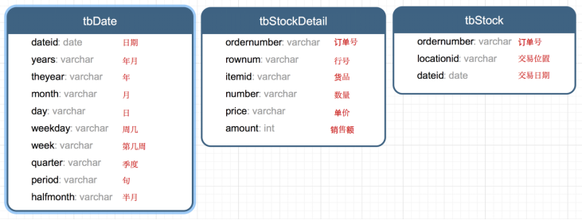

# 第1章 Spark SQL概述
## 1.1 什么是Spark SQL
Spark SQL是Spark用来处理【结构化数据】的一个模块，
它提供了2个【编程抽象】：【DataFrame】和【DataSet】，并且作为【分布式SQL查询引擎】的作用。

它是将Hive SQL转换成MapReduce然后提交到集群上执行，大大简化了编写MapReduce的程序的复杂性，由于MapReduce这种计算模型执行效率比较慢。
所以，Spark SQL的应运而生，它是将Spark SQL转换成【RDD】，然后提交到集群执行，执行效率非常快！

## 1.2 Spark SQL的特点
* 1）易整合
* 2）统一的数据访问方式
* 3）兼容Hive
* 4）标准的数据连接

## 1.3 什么是DataFrame
与RDD类似，DataFrame也是一个分布式数据容器。

然而，DataFrame更像传统数据库的【二维表格】，除了数据以外，还记录【数据的结构信息】，即schema。

同时，与Hive类似，DataFrame也支持【嵌套数据类型（struct、array和map）】。

从API易用性的角度上看，DataFrame API提供的是一套高层的关系操作，比函数式的RDD API要更加友好，门槛更低。



上图直观地体现了DataFrame和RDD的区别。
左侧的RDD[Person]虽然以Person为类型参数，但Spark框架本身不了解Person类的内部结构。
而右侧的DataFrame却提供了详细的结构信息，使得Spark SQL可以清楚地知道该数据集中包含哪些列，每列的名称和类型各是什么。
DataFrame是为数据提供了Schema的视图。可以把它当做数据库中的一张表来对待，DataFrame也是懒执行的。

性能上比RDD要高，主要原因：
* 优化的执行计划：查询计划通过Spark catalyst optimiser进行优化。



比如下面一个例子：
```text
users.join(events, users("id") === events("uid"))
     .filter(events("date") > "2015-01-01")
```


为了说明查询优化，我们来看上图展示的人口数据分析的示例。
图中构造了两个DataFrame，将它们join之后又做了一次filter操作。
如果原封不动地执行这个执行计划，最终的执行效率是不高的。因为join是一个代价较大的操作，也可能会产生一个较大的数据集。
如果我们能将filter下推到join下方，先对DataFrame进行过滤，再join过滤后的较小的结果集，便可以有效缩短执行时间。
而Spark SQL的查询优化器正是这样做的。
简而言之，【逻辑查询计划优化】就是一个利用基于关系代数的等价变换，将【高成本操作】替换为【低成本操作】的过程。

## 1.4 什么是DataSet
1）是【Dataframe API的一个扩展】，是【Spark最新的数据抽象】。

2）用户友好的API风格，既具有类型安全检查也具有Dataframe的查询优化特性。

3）Dataset支持编解码器，当需要访问非堆上的数据时可以避免反序列化整个对象，提高了效率。

4）样例类被用来在Dataset中定义数据的结构信息，样例类中每个属性的名称直接映射到DataSet中的字段名称。

5）Dataframe是Dataset的特列，DataFrame=Dataset[Row]，所以可以通过as方法将Dataframe转换为Dataset。
Row是一个类型，跟Car、Person这些的类型一样，所有的表结构信息我都用Row来表示。

6）DataSet是强类型的。比如可以有Dataset[Car]，Dataset[Person]。

7）DataFrame只是知道字段，但是不知道字段的类型，所以在执行这些操作的时候是没办法在编译的时候检查是否类型失败的，
比如你可以对一个String进行减法操作，在执行的时候才报错，而DataSet不仅仅知道字段，而且知道字段类型，所以有更严格的错误检查。
就跟JSON对象和类对象之间的类比。

# 第2章 SparkSQL编程

## 2.1 SparkSession新的起始点
在老的版本中，SparkSQL提供两种SQL查询起始点：
* 一个叫SQLContext，用于Spark自己提供的SQL查询；
* 一个叫HiveContext，用于连接Hive的查询。

**SparkSession**是**Spark最新的SQL查询起始点**，实质上是SQLContext和HiveContext的组合，
所以在SQLContext和HiveContext上可用的API在SparkSession上同样是可以使用的。
SparkSession内部封装了sparkContext，所以计算实际上是由sparkContext完成的。

## 2.2 DataFrame
### 2.2.1 创建
在Spark SQL中SparkSession是创建DataFrame和执行SQL的入口，创建DataFrame有三种方式：
* 通过Spark的数据源进行创建；
* 从一个存在的RDD进行转换；
* 还可以从Hive Table进行查询返回；

#### 1）从Spark数据源进行创建
（1）查看Spark数据源进行创建的文件格式
```text
scala> spark.read.
csv   format   jdbc   json   load   option   options   orc   parquet   schema   table   text   textFile
```
（2）读取json文件创建DataFrame
```text
scala> val df = spark.read.json("/opt/module/spark/examples/src/main/resources/people.json")
df: org.apache.spark.sql.DataFrame = [age: bigint, name: string]
```
（3）展示结果
```text
scala> df.show
+----+-------+
| age|   name|
+----+-------+
|null|Michael|
|  30|   Andy|
|  19| Justin|
+----+-------+
```

### 2.2.2 SQL风格语法(主要)
1）创建一个DataFrame
```text
scala> val df = spark.read.json("/opt/module/spark/examples/src/main/resources/people.json")
df: org.apache.spark.sql.DataFrame = [age: bigint, name: string]
```

2）对DataFrame创建一个临时表
```text
scala> df.createOrReplaceTempView("people")
```

3）通过SQL语句实现查询全表
```text
scala> val sqlDF = spark.sql("SELECT * FROM people")
sqlDF: org.apache.spark.sql.DataFrame = [age: bigint, name: string]
```

4）结果展示
```text
scala> sqlDF.show()
+----+-------+
| age|   name|
+----+-------+
|null|Michael|
|  30|   Andy|
|  19| Justin|
+----+-------+
```
注意：临时表是Session范围内的，Session退出后，表就失效了。
如果想应用范围内有效，可以使用全局表。
注意使用全局表时需要全路径访问，如：global_temp.people。

5）对于DataFrame创建一个全局表
```text
scala> df.createGlobalTempView("people")
```

6）通过SQL语句实现查询全表
```text
scala> spark.sql("SELECT * FROM global_temp.people").show()
+----+-------+
| age|   name|
+----+-------+
|null|Michael|
|  30|   Andy|
|  19| Justin|
+----+-------+
scala> spark.newSession().sql("SELECT * FROM global_temp.people").show()
+----+-------+
| age|   name|
+----+-------+
|null|Michael|
|  30|   Andy|
|  19| Justin|
+----+-------+
```

### 2.2.3 DSL风格语法(次要)
1）创建一个DateFrame
```text
scala> spark.read.
csv   format   jdbc   json   load   option   options   orc   parquet   schema   table   text   textFile
```

2）查看DataFrame的Schema信息
```text
scala> df.printSchema
root
|-- age: long (nullable = true)
|-- name: string (nullable = true)
```

3）只查看”name”列数据
```text
scala> df.select("name").show()
+-------+
|   name|
+-------+
|Michael|
|   Andy|
| Justin|
+-------+
```

4）查看”name”列数据以及”age+1”数据
```text
scala> df.select($"name", $"age" + 1).show()
+-------+---------+
|   name|(age + 1)|
+-------+---------+
|Michael|     null|
|   Andy|       31|
| Justin|       20|
+-------+---------+
```

5）查看”age”大于”21”的数据
```text
scala> df.filter($"age" > 21).show()
+---+----+
|age|name|
+---+----+
| 30|Andy|
+---+----+
```

6）按照”age”分组，查看数据条数
```text
scala> df.groupBy("age").count().show()
+----+-----+
| age|count|
+----+-----+
|  19|    1|
|null|    1|
|  30|    1|
+----+-----+
```

### 2.2.4 RDD转换为DateFrame
注意：如果需要RDD与DF或者DS之间操作，那么都需要引入 import spark.implicits._ 
【spark不是包名，而是sparkSession对象的名称】

前置条件：导入隐式转换并创建一个RDD
```text
scala> import spark.implicits._
import spark.implicits._
```
```text
scala> val peopleRDD = sc.textFile("examples/src/main/resources/people.txt")
peopleRDD: org.apache.spark.rdd.RDD[String] = examples/src/main/resources/people.txt MapPartitionsRDD[3] at textFile at <console>:27
```

#### 1）通过手动确定转换
```text
scala> peopleRDD.map{x=>val para = x.split(",");(para(0),para(1).trim.toInt)}.toDF("name","age")
res1: org.apache.spark.sql.DataFrame = [name: string, age: int]
```

#### 2）通过反射确定（需要用到样例类）
（1）创建一个样例类
```text
scala> case class People(name:String, age:Int)
```

（2）根据样例类将RDD转换为DataFrame
```text
scala> peopleRDD.map{ x => val para = x.split(",");People(para(0),para(1).trim.toInt)}.toDF
res2: org.apache.spark.sql.DataFrame = [name: string, age: int]
```

#### 3）通过编程的方式（了解）
（1）导入所需的类型
```text
scala> import org.apache.spark.sql.types._
import org.apache.spark.sql.types._
```

（2）创建Schema
```text
scala> val structType: StructType = StructType(StructField("name", StringType) :: StructField("age", IntegerType) :: Nil)
structType: org.apache.spark.sql.types.StructType = StructType(StructField(name,StringType,true), StructField(age,IntegerType,true))
```

（3）导入所需的类型
```text
scala> import org.apache.spark.sql.Row
import org.apache.spark.sql.Row
```

（4）根据给定的类型创建二元组RDD
```text
scala> val data = peopleRDD.map{ x => val para = x.split(",");Row(para(0),para(1).trim.toInt)}
data: org.apache.spark.rdd.RDD[org.apache.spark.sql.Row] = MapPartitionsRDD[6] at map at <console>:33
```

（5）根据数据及给定的schema创建DataFrame
```text
scala> val dataFrame = spark.createDataFrame(data, structType)
dataFrame: org.apache.spark.sql.DataFrame = [name: string, age: int]
```

### 2.2.5 DateFrame转换为RDD
直接调用rdd即可

1）创建一个DataFrame
```text
scala> val df = spark.read.json("/opt/module/spark/examples/src/main/resources/people.json")
df: org.apache.spark.sql.DataFrame = [age: bigint, name: string]
```

2）将DataFrame转换为RDD
```text
scala> val dfToRDD = df.rdd
dfToRDD: org.apache.spark.rdd.RDD[org.apache.spark.sql.Row] = MapPartitionsRDD[19] at rdd at <console>:29
```

3）打印RDD
```text
scala> dfToRDD.collect
res13: Array[org.apache.spark.sql.Row] = Array([Michael, 29], [Andy, 30], [Justin, 19])
```

## 2.3 DataSet
Dataset是具有【强类型的数据集合】，需要提供对应的类型信息。

### 2.3.1 创建
1）创建一个样例类
```text
scala> case class Person(name: String, age: Long)
defined class Person
```

2）创建DataSet
```text
scala> val caseClassDS = Seq(Person("Andy", 32)).toDS()
caseClassDS: org.apache.spark.sql.Dataset[Person] = [name: string, age: bigint]
```

### 2.3.2 RDD转换为DataSet
SparkSQL能够自动将包含有case类的RDD转换成DataFrame，case类定义了table的结构，case类属性通过反射变成了表的列名。

1）创建一个RDD
```text
scala> val peopleRDD = sc.textFile("examples/src/main/resources/people.txt")
peopleRDD: org.apache.spark.rdd.RDD[String] = examples/src/main/resources/people.txt MapPartitionsRDD[3] at textFile at <console>:27
```

2）创建一个样例类
```text
scala> case class Person(name: String, age: Long)
defined class Person
```

3）将RDD转化为DataSet
```text
scala> peopleRDD.map(line => {val para = line.split(",");Person(para(0),para(1).trim.toInt)}).toDS()
```

### 2.3.3 DataSet转换为RDD
调用rdd方法即可。

1）创建一个DataSet
```text
scala> val DS = Seq(Person("Andy", 32)).toDS()
DS: org.apache.spark.sql.Dataset[Person] = [name: string, age: bigint]
```

2）将DataSet转换为RDD
```text
scala> DS.rdd
res11: org.apache.spark.rdd.RDD[Person] = MapPartitionsRDD[15] at rdd at <console>:28
```

## 2.4 DataFrame与DataSet的互操作

### DataFrame转换为DataSet

1）创建一个DateFrame
```text
scala> val df = spark.read.json("examples/src/main/resources/people.json")
df: org.apache.spark.sql.DataFrame = [age: bigint, name: string]
```

2）创建一个样例类
```text
scala> case class Person(name: String, age: Long)
defined class Person
```

3）将DateFrame转化为DataSet
```text
scala> df.as[Person]
res14: org.apache.spark.sql.Dataset[Person] = [age: bigint, name: string]
```

### DataSet转换为DataFrame
1）创建一个样例类
```text
scala> case class Person(name: String, age: Long)
defined class Person
```

2）创建DataSet
```text
scala> val ds = Seq(Person("Andy", 32)).toDS()
ds: org.apache.spark.sql.Dataset[Person] = [name: string, age: bigint]
```

3）将DataSet转化为DataFrame
```text
scala> val df = ds.toDF
df: org.apache.spark.sql.DataFrame = [name: string, age: bigint]
```

4）展示
```text
scala> df.show
+----+---+
|name|age|
+----+---+
|Andy| 32|
+----+---+
```

### 2.4.1 DataSet转DataFrame
这个很简单，因为只是把case class封装成Row

（1）导入隐式转换
```text
import spark.implicits._
```

（2）转换
```text
val testDF = testDS.toDF
```

### 2.4.2 DataFrame转DataSet
（1）导入隐式转换
```text
import spark.implicits._
```

（2）创建样例类
```text
case class Coltest(col1:String,col2:Int)extends Serializable //定义字段名和类型
```

（3）转换
```text
val testDS = testDF.as[Coltest]
```

这种方法就是在给出每一列的类型后，使用as方法，转成Dataset，这在数据类型是DataFrame又需要针对各个字段处理时极为方便。
在使用一些特殊的操作时，一定要加上 import spark.implicits._ 不然toDF、toDS无法使用。

## 2.5 RDD、DataFrame、DataSet



在SparkSQL中Spark为我们提供了两个新的抽象，分别是DataFrame和DataSet。他们和RDD有什么区别呢？

首先从版本的产生上来看：
RDD (Spark1.0) —> Dataframe(Spark1.3) —> Dataset(Spark1.6)

如果同样的数据都给到这三个数据结构，他们分别计算之后，都会给出相同的结果。不同是的他们的执行效率和执行方式。

在后期的Spark版本中，DataSet会逐步取代RDD和DataFrame成为唯一的API接口。

### 2.5.1 三者的共性
1、RDD、DataFrame、Dataset全都是spark平台下的分布式弹性数据集，为处理超大型数据提供便利。

2、三者都有惰性机制，在进行创建、转换，如map方法时，不会立即执行，只有在遇到Action如foreach时，三者才会开始遍历运算。

3、三者都会根据spark的内存情况自动缓存运算，这样即使数据量很大，也不用担心会内存溢出。

4、三者都有partition的概念。

5、三者有许多共同的函数，如filter，排序等。

6、在对DataFrame和Dataset进行操作许多操作都需要这个包进行支持。
```text
import spark.implicits._
```

7、DataFrame和Dataset均可使用模式匹配获取各个字段的值和类型。
```text
DataFrame:
    testDF.map{
      case Row(col1:String,col2:Int)=>
        println(col1);println(col2)
        col1
      case _=>
        ""
    }
    
Dataset:
    case class Coltest(col1:String,col2:Int) extends Serializable //定义字段名和类型
    testDS.map{
      case Coltest(col1:String,col2:Int)=>
        println(col1);println(col2)
        col1
      case _=>
        ""
    }
```

### 2.5.2 三者的区别

#### RDD:
1）RDD一般和spark MLlib同时使用
2）RDD不支持sparkSql操作

#### DataFrame:
1）与RDD和Dataset不同，DataFrame每一行的类型固定为Row，每一列的值没法直接访问，只有通过解析才能获取各个字段的值，如：
```text
testDF.foreach{
   line =>
      val col1=line.getAs[String]("col1")
      val col2=line.getAs[String]("col2")
}
```
2）DataFrame与Dataset一般不与spark MLlib同时使用。

3）DataFrame与Dataset均支持sparkSql的操作，比如select，groupBy之类，还能注册临时表/视窗，进行sql语句操作，如：
```text
dataDF.createOrReplaceTempView("tmp")
spark.sql("select  ROW,DATE from tmp where DATE is not null order by DATE").show(100,false)
```

4）DataFrame与Dataset支持一些特别方便的保存方式，比如保存成csv，可以带上表头，这样每一列的字段名一目了然。
```text
//保存
val saveoptions = Map("header" -> "true", "delimiter" -> "\t", "path" -> "hdfs://hadoop102:9000/test")
datawDF.write.format("com.atguigu.spark.csv").mode(SaveMode.Overwrite).options(saveoptions).save()
//读取
val options = Map("header" -> "true", "delimiter" -> "\t", "path" -> "hdfs://hadoop102:9000/test")
val datarDF= spark.read.options(options).format("com.atguigu.spark.csv").load()
```

利用这样的保存方式，可以方便的获得字段名和列的对应，而且分隔符（delimiter）可以自由指定。

#### Dataset:
1）Dataset和DataFrame拥有完全相同的成员函数，区别只是每一行的数据类型不同。

2）DataFrame也可以叫Dataset[Row],每一行的类型是Row，不解析，每一行究竟有哪些字段，各个字段又是什么类型都无从得知，
只能用上面提到的getAS方法或者共性中的第七条提到的模式匹配拿出特定字段。
而Dataset中，每一行是什么类型是不一定的，在自定义了case class之后可以很自由的获得每一行的信息。
```text
case class Coltest(col1:String,col2:Int) extends Serializable //定义字段名和类型
/**
 rdd
 ("a", 1)
 ("b", 1)
 ("a", 1)
**/
val test: Dataset[Coltest]=rdd.map{line=>
      Coltest(line._1,line._2)
    }.toDS
    
test.map{
      line=>
        println(line.col1)
        println(line.col2)
    }
```
可以看出，Dataset在需要访问列中的某个字段时是非常方便的，然而，如果要写一些适配性很强的函数时，
如果使用Dataset，行的类型又不确定，可能是各种case class，无法实现适配，
这时候用DataFrame即Dataset[Row]就能比较好的解决问题。

## 2.6 IDEA创建SparkSQL程序
IDEA中程序的打包和运行方式都和SparkCore类似，Maven依赖中需要添加新的依赖项：
```text
<dependency>
    <groupId>org.apache.spark</groupId>
    <artifactId>spark-sql_2.11</artifactId>
    <version>2.1.1</version>
</dependency>
```
程序如下：
```text
package com.atguigu.sparksql

import org.apache.spark.sql.SparkSession
import org.apache.spark.{SparkConf, SparkContext}
import org.slf4j.LoggerFactory

object HelloWorld {

  def main(args: Array[String]) {
    //创建SparkConf()并设置App名称
    val spark = SparkSession
      .builder()
      .appName("Spark SQL basic example")
      .config("spark.some.config.option", "some-value")
      .getOrCreate()

    // For implicit conversions like converting RDDs to DataFrames
    import spark.implicits._

    val df = spark.read.json("data/people.json")

    // Displays the content of the DataFrame to stdout
    df.show()

    df.filter($"age" > 21).show()

    df.createOrReplaceTempView("persons")

    spark.sql("SELECT * FROM persons where age > 21").show()

    spark.stop()
  }

}
```

## 2.7 用户自定义函数
在Shell窗口中可以通过spark.udf功能用户可以自定义函数。

### 2.7.1 用户自定义UDF函数
```text
scala> val df = spark.read.json("examples/src/main/resources/people.json")
df: org.apache.spark.sql.DataFrame = [age: bigint, name: string]

scala> df.show()
+----+-------+
| age|   name|
+----+-------+
|null|Michael|
|  30|   Andy|
|  19| Justin|
+----+-------+

scala> spark.udf.register("addName", (x:String)=> "Name:"+x)
res5: org.apache.spark.sql.expressions.UserDefinedFunction = UserDefinedFunction(<function1>,StringType,Some(List(StringType)))

scala> df.createOrReplaceTempView("people")

scala> spark.sql("Select addName(name), age from people").show()
+-----------------+----+
|UDF:addName(name)| age|
+-----------------+----+
|     Name:Michael|null|
|        Name:Andy|  30|
|      Name:Justin|  19|
+-----------------+----+
```

### 2.7.2 用户自定义聚合函数
强类型的Dataset和弱类型的DataFrame都提供了相关的聚合函数， 
如 count()，countDistinct()，avg()，max()，min()。

除此之外，用户可以设定自己的自定义聚合函数。

#### 弱类型用户自定义聚合函数：

通过继承UserDefinedAggregateFunction来实现用户自定义聚合函数。

下面展示一个求平均工资的自定义聚合函数。
```text
import org.apache.spark.sql.expressions.MutableAggregationBuffer
import org.apache.spark.sql.expressions.UserDefinedAggregateFunction
import org.apache.spark.sql.types._
import org.apache.spark.sql.Row
import org.apache.spark.sql.SparkSession

object MyAverage extends UserDefinedAggregateFunction {
   // 聚合函数输入参数的数据类型 
   def inputSchema: StructType = StructType(StructField("inputColumn", LongType) :: Nil)
   
   // 聚合缓冲区中值得数据类型
   def bufferSchema: StructType = {
       StructType(StructField("sum", LongType) :: StructField("count", LongType) :: Nil)
   }
   
   // 返回值的数据类型 
   def dataType: DataType = DoubleType
   
   // 对于相同的输入是否一直返回相同的输出。
   def deterministic: Boolean = true
   
   // 初始化
   def initialize(buffer: MutableAggregationBuffer): Unit = {
      // 存工资的总额
      buffer(0) = 0L
      // 存工资的个数
      buffer(1) = 0L
   }
   
   // 相同Execute间的数据合并。 
   def update(buffer: MutableAggregationBuffer, input: Row): Unit = {
      if (!input.isNullAt(0)) {
         buffer(0) = buffer.getLong(0) + input.getLong(0)
         buffer(1) = buffer.getLong(1) + 1
      }
   }
   
   // 不同Execute间的数据合并 
   def merge(buffer1: MutableAggregationBuffer, buffer2: Row): Unit = {
      buffer1(0) = buffer1.getLong(0) + buffer2.getLong(0)
      buffer1(1) = buffer1.getLong(1) + buffer2.getLong(1)
   }
   // 计算最终结果
   def evaluate(buffer: Row): Double = buffer.getLong(0).toDouble / buffer.getLong(1)
}
```

```text
// 注册函数
spark.udf.register("myAverage", MyAverage)

val df = spark.read.json("examples/src/main/resources/employees.json")
df.createOrReplaceTempView("employees")
df.show()
// +-------+------+
// |   name|salary|
// +-------+------+
// |Michael|  3000|
// |   Andy|  4500|
// | Justin|  3500|
// |  Berta|  4000|
// +-------+------+

val result = spark.sql("SELECT myAverage(salary) as average_salary FROM employees")
result.show()
// +--------------+
// |average_salary|
// +--------------+
// |        3750.0|
// +--------------+
```

#### 强类型用户自定义聚合函数：
通过继承Aggregator来实现强类型自定义聚合函数，同样是求平均工资。
```text
import org.apache.spark.sql.expressions.Aggregator
import org.apache.spark.sql.Encoder
import org.apache.spark.sql.Encoders
import org.apache.spark.sql.SparkSession
// 既然是强类型，可能有case类
case class Employee(name: String, salary: Long)
case class Average(var sum: Long, var count: Long)

object MyAverage extends Aggregator[Employee, Average, Double] {
   // 定义一个数据结构，保存工资总数和工资总个数，初始都为0
   def zero: Average = Average(0L, 0L)
   
   // Combine two values to produce a new value. For performance, the function may modify `buffer`
   // and return it instead of constructing a new object
   def reduce(buffer: Average, employee: Employee): Average = {
      buffer.sum += employee.salary
      buffer.count += 1
      buffer
   }
   
   // 聚合不同execute的结果
   def merge(b1: Average, b2: Average): Average = {
      b1.sum += b2.sum
      b1.count += b2.count
      b1
   }
   
   // 计算输出
   def finish(reduction: Average): Double = reduction.sum.toDouble / reduction.count
   
   // 设定之间值类型的编码器，要转换成case类
   // Encoders.product是进行scala元组和case类转换的编码器
   def bufferEncoder: Encoder[Average] = Encoders.product
   
   // 设定最终输出值的编码器
   def outputEncoder: Encoder[Double] = Encoders.scalaDouble
}

import spark.implicits._

val ds = spark.read.json("examples/src/main/resources/employees.json").as[Employee]
ds.show()
// +-------+------+
// |   name|salary|
// +-------+------+
// |Michael|  3000|
// |   Andy|  4500|
// | Justin|  3500|
// |  Berta|  4000|
// +-------+------+

// Convert the function to a `TypedColumn` and give it a name
val averageSalary = MyAverage.toColumn.name("average_salary")
val result = ds.select(averageSalary)
result.show()
// +--------------+
// |average_salary|
// +--------------+
// |        3750.0|
// +--------------+
```

# 第3章 SparkSQL数据源

## 3.1 通用加载/保存方法

### 3.1.1 手动指定选项
Spark SQL的DataFrame接口支持【多种数据源】的操作。
一个DataFrame可以进行RDDs方式的操作，也可以被注册为临时表。
把【DataFrame】注册为【临时表】之后，就可以对该DataFrame执行SQL查询。

Spark SQL的默认数据源为Parquet格式。

数据源为Parquet文件时，Spark SQL可以方便的执行所有的操作。
修改配置项spark.sql.sources.default，可修改默认数据源格式。
```text
val df = spark.read.load(“examples/src/main/resources/users.parquet”) 
df.select(“name”, “favorite_color”).write.save(“namesAndFavColors.parquet”)
```

当数据源格式不是parquet格式文件时，需要手动指定数据源的格式。

数据源格式需要指定全名（例如：org.apache.spark.sql.parquet），
如果数据源格式为内置格式，则只需要指定简称定json, parquet, jdbc, orc, libsvm, csv, text来指定数据的格式。
可以通过SparkSession提供的read.load方法用于通用加载数据，使用write和save保存数据。
```text
val peopleDF = spark.read.format("json").load("examples/src/main/resources/people.json")
peopleDF.write.format("parquet").save("hdfs://hadoop102:9000/namesAndAges.parquet")
```

除此之外，可以直接运行SQL在文件上：
```text
val sqlDF = spark.sql("SELECT * FROM parquet.`hdfs://hadoop102:9000/namesAndAges.parquet`")
sqlDF.show()
```
```text
scala> val peopleDF = spark.read.format("json").load("examples/src/main/resources/people.json")
peopleDF: org.apache.spark.sql.DataFrame = [age: bigint, name: string]

scala> peopleDF.write.format("parquet").save("hdfs://hadoop102:9000/namesAndAges.parquet")

scala> peopleDF.show()
+----+-------+
| age|   name|
+----+-------+
|null|Michael|
|  30|   Andy|
|  19| Justin|
+----+-------+
```

```text
scala> val sqlDF = spark.sql("SELECT * FROM parquet.`hdfs:// hadoop102:9000/namesAndAges.parquet`")
17/09/05 04:21:11 WARN ObjectStore: Failed to get database parquet, returning NoSuchObjectException
sqlDF: org.apache.spark.sql.DataFrame = [age: bigint, name: string]

scala> sqlDF.show()
+----+-------+
| age|   name|
+----+-------+
|null|Michael|
|  30|   Andy|
|  19| Justin|
+----+-------+
```

### 3.1.2 文件保存选项
可以采用SaveMode执行存储操作，SaveMode定义了对数据的处理模式。

需要注意的是，这些保存模式不使用任何锁定，不是原子操作。

此外，当使用Overwrite方式执行时，在输出新数据之前原数据就已经被删除。

SaveMode详细介绍如下表：

| Scala/Java Any                  | Language         | Meaning    |
|---------------------------------|------------------|------------|
| SaveMode.ErrorIfExists(default) | “error”(default) | 如果文件存在，则报错 |
| SaveMode.Append                 | “append”         | 追加         |
| SaveMode.Overwrite              | “overwrite”      | 覆写         |
| SaveMode.Ignore                 | “ignore”         | 数据存在，则忽略   |

## 3.2 JSON文件
Spark SQL能够自动推测JSON数据集的结构，并将它加载为一个Dataset[Row]. 
可以通过SparkSession.read.json()去加载一个 一个JSON 文件。

注意：这个JSON文件不是一个传统的JSON文件，每一行都得是一个JSON串。
```text
{“name”:“Michael”}
{“name”:“Andy”, “age”:30}
{“name”:“Justin”, “age”:19}
```
```text
// Primitive types (Int, String, etc) and Product types (case classes) encoders are
// supported by importing this when creating a Dataset.
import spark.implicits._

// A JSON dataset is pointed to by path.
// The path can be either a single text file or a directory storing text files
val path = "examples/src/main/resources/people.json"
val peopleDF = spark.read.json(path)

// The inferred schema can be visualized using the printSchema() method
peopleDF.printSchema()
// root
//  |-- age: long (nullable = true)
//  |-- name: string (nullable = true)

// Creates a temporary view using the DataFrame
peopleDF.createOrReplaceTempView("people")

// SQL statements can be run by using the sql methods provided by spark
val teenagerNamesDF = spark.sql("SELECT name FROM people WHERE age BETWEEN 13 AND 19")

teenagerNamesDF.show()
// +------+
// |  name|
// +------+
// |Justin|
// +------+

// Alternatively, a DataFrame can be created for a JSON dataset represented by
// a Dataset[String] storing one JSON object per string
val otherPeopleDataset = spark.createDataset(
"""{"name":"Yin","address":{"city":"Columbus","state":"Ohio"}}""" :: Nil)
val otherPeople = spark.read.json(otherPeopleDataset)
otherPeople.show()
// +---------------+----+
// |        address|name|
// +---------------+----+
// |[Columbus,Ohio]| Yin|
// +---------------+----+
```

## 3.3 Parquet文件
Parquet是一种流行的列式存储格式，可以高效地存储具有嵌套字段的记录。
Parquet格式经常在Hadoop生态圈中被使用，它也支持Spark SQL的全部数据类型。
Spark SQL提供了直接读取和存储Parquet格式文件的方法。
```text
importing spark.implicits._
import spark.implicits._

val peopleDF = spark.read.json("examples/src/main/resources/people.json")

peopleDF.write.parquet("hdfs://hadoop102:9000/people.parquet")

val parquetFileDF = spark.read.parquet("hdfs:// hadoop102:9000/people.parquet")

parquetFileDF.createOrReplaceTempView("parquetFile")

val namesDF = spark.sql("SELECT name FROM parquetFile WHERE age BETWEEN 13 AND 19")

namesDF.map(attributes => "Name: " + attributes(0)).show()
// +------------+
// |       value|
// +------------+
// |Name: Justin|
// +------------+
```

## 3.4 JDBC
Spark SQL可以通过JDBC从关系型数据库中读取数据的方式创建DataFrame，
通过对DataFrame一系列的计算后，还可以将数据再写回关系型数据库中。

注意:需要将相关的数据库驱动放到spark的类路径下。

（1）启动spark-shell
```text
$ bin/spark-shell
```

（2）从Mysql数据库加载数据方式一
```text
val jdbcDF = spark.read
   .format("jdbc")
   .option("url", "jdbc:mysql://hadoop102:3306/rdd")
   .option("dbtable", "rddtable")
   .option("user", "root")
   .option("password", "000000")
   .load()
```

（3）从Mysql数据库加载数据方式二
```text
val connectionProperties = new Properties()
connectionProperties.put("user", "root")
connectionProperties.put("password", "000000")

val jdbcDF2 = spark.read.jdbc("jdbc:mysql://hadoop102:3306/rdd", "rddtable", connectionProperties)
```

（4）将数据写入Mysql方式一
```text
jdbcDF.write
.format("jdbc")
.option("url", "jdbc:mysql://hadoop102:3306/rdd")
.option("dbtable", "dftable")
.option("user", "root")
.option("password", "000000")
.save()
```

（5）将数据写入Mysql方式二
```text
jdbcDF2.write.jdbc("jdbc:mysql://hadoop102:3306/rdd", "db", connectionProperties)
```

## 3.5 Hive数据库
Apache Hive是Hadoop上的SQL引擎，Spark SQL编译时可以包含Hive支持，也可以不包含。
包含Hive支持的Spark SQL可以支持Hive表访问、UDF(用户自定义函数)以及 Hive 查询语言(HiveQL/HQL)等。

需要强调的一点是，如果要在Spark SQL中包含Hive的库，并不需要事先安装Hive。

一般来说，最好还是在编译Spark SQL时引入Hive支持，这样就可以使用这些特性了。

如果你下载的是二进制版本的 Spark，它应该已经在编译时添加了 Hive 支持。

若要把Spark SQL连接到一个部署好的Hive上，你必须把hive-site.xml复制到Spark的配置文件目录中($SPARK_HOME/conf)。
即使没有部署好Hive，Spark SQL也可以运行。 

需要注意的是，如果你没有部署好Hive，Spark SQL会在当前的工作目录中创建出自己的Hive 元数据仓库，叫作 metastore_db。

此外，如果你尝试使用HiveQL中的CREATE TABLE(并非 CREATE EXTERNAL TABLE)语句来创建表，
这些表会被放在你默认的文件系统中的 /user/hive/warehouse 目录中(如果你的 classpath 中有配好的 hdfs-site.xml，
默认的文件系统就是 HDFS，否则就是本地文件系统)。

### 3.5.1 内嵌Hive应用
如果要使用内嵌的Hive，什么都不用做，直接用就可以了。

可以通过添加参数初次指定数据仓库地址：–conf spark.sql.warehouse.dir=hdfs://hadoop102/spark-wearhouse

注意：如果你使用的是内部的Hive，在Spark2.0之后，spark.sql.warehouse.dir用于指定数据仓库的地址，
如果你需要是用HDFS作为路径，那么需要将core-site.xml和hdfs-site.xml 加入到Spark conf目录，
否则只会创建master节点上的warehouse目录，查询时会出现文件找不到的问题，这是需要使用HDFS，则需要将metastore删除，重启集群。

### 3.5.2 外部Hive应用
如果想连接外部已经部署好的Hive，需要通过以下几个步骤。

1)将Hive中的hive-site.xml拷贝或者软连接到Spark安装目录下的conf目录下。

2)打开spark shell，注意带上访问Hive元数据库的JDBC客户端
```text
$ bin/spark-shell --jars mysql-connector-java-5.1.27-bin.jar
```

### 3.5.3 运行Spark SQL CLI
Spark SQL CLI可以很方便的在本地运行Hive元数据服务以及从命令行执行查询任务。

在Spark目录下执行如下命令启动Spark SQL CLI：
```text
./bin/spark-sql
```

### 3.5.4 代码中使用Hive
（1）添加依赖：
```text
<!-- https://mvnrepository.com/artifact/org.apache.spark/spark-hive -->
<dependency>
    <groupId>org.apache.spark</groupId>
    <artifactId>spark-hive_2.11</artifactId>
    <version>2.1.1</version>
</dependency>
<!-- https://mvnrepository.com/artifact/org.apache.hive/hive-exec -->
<dependency>
    <groupId>org.apache.hive</groupId>
    <artifactId>hive-exec</artifactId>
    <version>1.2.1</version>
</dependency>
```

（2）创建SparkSession时需要添加hive支持（红色部分）
```text
val warehouseLocation: String = new File("spark-warehouse").getAbsolutePath

val spark = SparkSession
.builder()
.appName("Spark Hive Example")
.config("spark.sql.warehouse.dir", warehouseLocation)
.enableHiveSupport()
.getOrCreate()
```

注意：蓝色部分为使用内置Hive需要指定一个Hive仓库地址。若使用的是外部Hive，则需要将hive-site.xml添加到ClassPath下。

# 第4章 Spark SQL实战

## 4.1 数据说明
数据集是货品交易数据集。



每个订单可能包含多个货品，每个订单可以产生多次交易，不同的货品有不同的单价。

## 4.2 加载数据
tbStock：
```text
scala> case class tbStock(ordernumber:String,locationid:String,dateid:String) extends Serializable
defined class tbStock

scala> val tbStockRdd = spark.sparkContext.textFile("tbStock.txt")
tbStockRdd: org.apache.spark.rdd.RDD[String] = tbStock.txt MapPartitionsRDD[1] at textFile at <console>:23

scala> val tbStockDS = tbStockRdd.map(_.split(",")).map(attr=>tbStock(attr(0),attr(1),attr(2))).toDS
tbStockDS: org.apache.spark.sql.Dataset[tbStock] = [ordernumber: string, locationid: string ... 1 more field]

scala> tbStockDS.show()
+------------+----------+---------+
| ordernumber|locationid|   dataid|
+------------+----------+---------+
|BYSL00000893|      ZHAO|2007-8-23|
|BYSL00000897|      ZHAO|2007-8-24|
|BYSL00000898|      ZHAO|2007-8-25|
|BYSL00000899|      ZHAO|2007-8-26|
|BYSL00000900|      ZHAO|2007-8-26|
|BYSL00000901|      ZHAO|2007-8-27|
|BYSL00000902|      ZHAO|2007-8-27|
|BYSL00000904|      ZHAO|2007-8-28|
|BYSL00000905|      ZHAO|2007-8-28|
|BYSL00000906|      ZHAO|2007-8-28|
|BYSL00000907|      ZHAO|2007-8-29|
|BYSL00000908|      ZHAO|2007-8-30|
|BYSL00000909|      ZHAO| 2007-9-1|
|BYSL00000910|      ZHAO| 2007-9-1|
|BYSL00000911|      ZHAO|2007-8-31|
|BYSL00000912|      ZHAO| 2007-9-2|
|BYSL00000913|      ZHAO| 2007-9-3|
|BYSL00000914|      ZHAO| 2007-9-3|
|BYSL00000915|      ZHAO| 2007-9-4|
|BYSL00000916|      ZHAO| 2007-9-4|
+------------+----------+---------+
only showing top 20 rows
```

tbStockDetail:
```text
scala> case class tbStockDetail(ordernumber:String, rownum:Int, itemid:String, number:Int, price:Double, amount:Double) extends Serializable
defined class tbStockDetail

scala> val tbStockDetailRdd = spark.sparkContext.textFile("tbStockDetail.txt")
tbStockDetailRdd: org.apache.spark.rdd.RDD[String] = tbStockDetail.txt MapPartitionsRDD[13] at textFile at <console>:23

scala> val tbStockDetailDS = tbStockDetailRdd.map(_.split(",")).map(attr=> tbStockDetail(attr(0),attr(1).trim().toInt,attr(2),attr(3).trim().toInt,attr(4).trim().toDouble, attr(5).trim().toDouble)).toDS
tbStockDetailDS: org.apache.spark.sql.Dataset[tbStockDetail] = [ordernumber: string, rownum: int ... 4 more fields]

scala> tbStockDetailDS.show()
+------------+------+--------------+------+-----+------+
| ordernumber|rownum|        itemid|number|price|amount|
+------------+------+--------------+------+-----+------+
|BYSL00000893|     0|FS527258160501|    -1|268.0|-268.0|
|BYSL00000893|     1|FS527258169701|     1|268.0| 268.0|
|BYSL00000893|     2|FS527230163001|     1|198.0| 198.0|
|BYSL00000893|     3|24627209125406|     1|298.0| 298.0|
|BYSL00000893|     4|K9527220210202|     1|120.0| 120.0|
|BYSL00000893|     5|01527291670102|     1|268.0| 268.0|
|BYSL00000893|     6|QY527271800242|     1|158.0| 158.0|
|BYSL00000893|     7|ST040000010000|     8|  0.0|   0.0|
|BYSL00000897|     0|04527200711305|     1|198.0| 198.0|
|BYSL00000897|     1|MY627234650201|     1|120.0| 120.0|
|BYSL00000897|     2|01227111791001|     1|249.0| 249.0|
|BYSL00000897|     3|MY627234610402|     1|120.0| 120.0|
|BYSL00000897|     4|01527282681202|     1|268.0| 268.0|
|BYSL00000897|     5|84126182820102|     1|158.0| 158.0|
|BYSL00000897|     6|K9127105010402|     1|239.0| 239.0|
|BYSL00000897|     7|QY127175210405|     1|199.0| 199.0|
|BYSL00000897|     8|24127151630206|     1|299.0| 299.0|
|BYSL00000897|     9|G1126101350002|     1|158.0| 158.0|
|BYSL00000897|    10|FS527258160501|     1|198.0| 198.0|
|BYSL00000897|    11|ST040000010000|    13|  0.0|   0.0|
+------------+------+--------------+------+-----+------+
only showing top 20 rows
```

tbDate:
```text
scala> case class tbDate(dateid:String, years:Int, theyear:Int, month:Int, day:Int, weekday:Int, week:Int, quarter:Int, period:Int, halfmonth:Int) extends Serializable
defined class tbDate

scala> val tbDateRdd = spark.sparkContext.textFile("tbDate.txt")
tbDateRdd: org.apache.spark.rdd.RDD[String] = tbDate.txt MapPartitionsRDD[20] at textFile at <console>:23

scala> val tbDateDS = tbDateRdd.map(_.split(",")).map(attr=> tbDate(attr(0),attr(1).trim().toInt, attr(2).trim().toInt,attr(3).trim().toInt, attr(4).trim().toInt, attr(5).trim().toInt, attr(6).trim().toInt, attr(7).trim().toInt, attr(8).trim().toInt, attr(9).trim().toInt)).toDS
tbDateDS: org.apache.spark.sql.Dataset[tbDate] = [dateid: string, years: int ... 8 more fields]

scala> tbDateDS.show()
+---------+------+-------+-----+---+-------+----+-------+------+---------+
|   dateid| years|theyear|month|day|weekday|week|quarter|period|halfmonth|
+---------+------+-------+-----+---+-------+----+-------+------+---------+
| 2003-1-1|200301|   2003|    1|  1|      3|   1|      1|     1|        1|
| 2003-1-2|200301|   2003|    1|  2|      4|   1|      1|     1|        1|
| 2003-1-3|200301|   2003|    1|  3|      5|   1|      1|     1|        1|
| 2003-1-4|200301|   2003|    1|  4|      6|   1|      1|     1|        1|
| 2003-1-5|200301|   2003|    1|  5|      7|   1|      1|     1|        1|
| 2003-1-6|200301|   2003|    1|  6|      1|   2|      1|     1|        1|
| 2003-1-7|200301|   2003|    1|  7|      2|   2|      1|     1|        1|
| 2003-1-8|200301|   2003|    1|  8|      3|   2|      1|     1|        1|
| 2003-1-9|200301|   2003|    1|  9|      4|   2|      1|     1|        1|
|2003-1-10|200301|   2003|    1| 10|      5|   2|      1|     1|        1|
|2003-1-11|200301|   2003|    1| 11|      6|   2|      1|     2|        1|
|2003-1-12|200301|   2003|    1| 12|      7|   2|      1|     2|        1|
|2003-1-13|200301|   2003|    1| 13|      1|   3|      1|     2|        1|
|2003-1-14|200301|   2003|    1| 14|      2|   3|      1|     2|        1|
|2003-1-15|200301|   2003|    1| 15|      3|   3|      1|     2|        1|
|2003-1-16|200301|   2003|    1| 16|      4|   3|      1|     2|        2|
|2003-1-17|200301|   2003|    1| 17|      5|   3|      1|     2|        2|
|2003-1-18|200301|   2003|    1| 18|      6|   3|      1|     2|        2|
|2003-1-19|200301|   2003|    1| 19|      7|   3|      1|     2|        2|
|2003-1-20|200301|   2003|    1| 20|      1|   4|      1|     2|        2|
+---------+------+-------+-----+---+-------+----+-------+------+---------+
only showing top 20 rows
```

注册表：
```text
scala> tbStockDS.createOrReplaceTempView("tbStock")

scala> tbDateDS.createOrReplaceTempView("tbDate")

scala> tbStockDetailDS.createOrReplaceTempView(“tbStockDetail”)
```

## 4.3 计算所有订单中每年的销售单数、销售总额
统计所有订单中每年的销售单数、销售总额。

三个表连接后以count(distinct a.ordernumber)计销售单数，sum(b.amount)计销售总额。

```text
SELECT c.theyear, COUNT(DISTINCT a.ordernumber), SUM(b.amount)
FROM tbStock a
JOIN tbStockDetail b ON a.ordernumber = b.ordernumber
JOIN tbDate c ON a.dateid = c.dateid
GROUP BY c.theyear
ORDER BY c.theyear
```
```text
spark.sql("SELECT c.theyear, COUNT(DISTINCT a.ordernumber), SUM(b.amount) FROM tbStock a JOIN tbStockDetail b ON a.ordernumber = b.ordernumber JOIN tbDate c ON a.dateid = c.dateid GROUP BY c.theyear ORDER BY c.theyear").show
```

结果如下：
```text
+-------+---------------------------+--------------------+                      
|theyear|count(DISTINCT ordernumber)|         sum(amount)|
+-------+---------------------------+--------------------+
|   2004|                       	  1094|   3268115.499199999|
|   2005|                       	  3828|1.3257564149999991E7|
|   2006|                      	  3772|1.3680982900000006E7|
|   2007|                   	      4885|1.6719354559999993E7|
|   2008|                    	      4861| 1.467429530000001E7|
|   2009|                            2619|   6323697.189999999|
|   2010|                              94|  210949.65999999997|
+-------+---------------------------+--------------------+
```

## 4.4 计算所有订单每年最大金额订单的销售额
**目标：统计每年最大金额订单的销售额:**

1）统计每年，每个订单一共有多少销售额。
```text
SELECT a.dateid, a.ordernumber, SUM(b.amount) AS SumOfAmount
FROM tbStock a
JOIN tbStockDetail b ON a.ordernumber = b.ordernumber
GROUP BY a.dateid, a.ordernumber
```

```text
spark.sql("SELECT a.dateid, a.ordernumber, SUM(b.amount) AS SumOfAmount FROM tbStock a JOIN tbStockDetail b ON a.ordernumber = b.ordernumber GROUP BY a.dateid, a.ordernumber").show
```
结果如下：
```text
+----------+------------+------------------+
|    dateid| ordernumber|       SumOfAmount|
+----------+------------+------------------+
|  2008-4-9|BYSL00001175|             350.0|
| 2008-5-12|BYSL00001214|             592.0|
| 2008-7-29|BYSL00011545|            2064.0|
|  2008-9-5|DGSL00012056|            1782.0|
| 2008-12-1|DGSL00013189|             318.0|
|2008-12-18|DGSL00013374|             963.0|
|  2009-8-9|DGSL00015223|            4655.0|
| 2009-10-5|DGSL00015585|            3445.0|
| 2010-1-14|DGSL00016374|            2934.0|
| 2006-9-24|GCSL00000673|3556.1000000000004|
| 2007-1-26|GCSL00000826| 9375.199999999999|
| 2007-5-24|GCSL00001020| 6171.300000000002|
|  2008-1-8|GCSL00001217|            7601.6|
| 2008-9-16|GCSL00012204|            2018.0|
| 2006-7-27|GHSL00000603|            2835.6|
|2006-11-15|GHSL00000741|           3951.94|
|  2007-6-6|GHSL00001149|               0.0|
| 2008-4-18|GHSL00001631|              12.0|
| 2008-7-15|GHSL00011367|             578.0|
|  2009-5-8|GHSL00014637|            1797.6|
+----------+------------+------------------+
```

2）以上一步查询结果为基础表，和表tbDate使用dateid join，求出每年最大金额订单的销售额。
```text
SELECT theyear, MAX(c.SumOfAmount) AS SumOfAmount
FROM (
   SELECT a.dateid, a.ordernumber, SUM(b.amount) AS SumOfAmount
   FROM tbStock a
   JOIN tbStockDetail b ON a.ordernumber = b.ordernumber
   GROUP BY a.dateid, a.ordernumber
) c
JOIN tbDate d ON c.dateid = d.dateid
GROUP BY theyear
ORDER BY theyear DESC
```
```text
spark.sql("SELECT theyear, MAX(c.SumOfAmount) AS SumOfAmount FROM (SELECT a.dateid, a.ordernumber, SUM(b.amount) AS SumOfAmount FROM tbStock a JOIN tbStockDetail b ON a.ordernumber = b.ordernumber GROUP BY a.dateid, a.ordernumber ) c JOIN tbDate d ON c.dateid = d.dateid GROUP BY theyear ORDER BY theyear DESC").show
```

结果如下：
```text
+-------+------------------+                                                    
|theyear|       SumOfAmount|
+-------+------------------+
|   2010|13065.280000000002|
|   2009|25813.200000000008|
|   2008|           55828.0|
|   2007|          159126.0|
|   2006|           36124.0|
|   2005|38186.399999999994|
|   2004| 23656.79999999997|
+-------+------------------+
```

## 4.5 计算所有订单中每年最畅销货品
目标：统计每年最畅销货品（哪个货品销售额amount在当年最高，哪个就是最畅销货品）


第一步、求出每年每个货品的销售额
```text
SELECT c.theyear, b.itemid, SUM(b.amount) AS SumOfAmount
FROM tbStock a
JOIN tbStockDetail b ON a.ordernumber = b.ordernumber
JOIN tbDate c ON a.dateid = c.dateid
GROUP BY c.theyear, b.itemid
```
```text
spark.sql("SELECT c.theyear, b.itemid, SUM(b.amount) AS SumOfAmount FROM tbStock a JOIN tbStockDetail b ON a.ordernumber = b.ordernumber JOIN tbDate c ON a.dateid = c.dateid GROUP BY c.theyear, b.itemid").show
```

结果如下：
```text
+-------+--------------+------------------+                                     
|theyear|        itemid|       SumOfAmount|
+-------+--------------+------------------+
|   2004|43824480810202|           4474.72|
|   2006|YA214325360101|             556.0|
|   2006|BT624202120102|             360.0|
|   2007|AK215371910101|24603.639999999992|
|   2008|AK216169120201|29144.199999999997|
|   2008|YL526228310106|16073.099999999999|
|   2009|KM529221590106| 5124.800000000001|
|   2004|HT224181030201|2898.6000000000004|
|   2004|SG224308320206|           7307.06|
|   2007|04426485470201|14468.800000000001|
|   2007|84326389100102|           9134.11|
|   2007|B4426438020201|           19884.2|
|   2008|YL427437320101|12331.799999999997|
|   2008|MH215303070101|            8827.0|
|   2009|YL629228280106|           12698.4|
|   2009|BL529298020602|            2415.8|
|   2009|F5127363019006|             614.0|
|   2005|24425428180101|          34890.74|
|   2007|YA214127270101|             240.0|
|   2007|MY127134830105|          11099.92|
+-------+--------------+------------------+
```

第二步、在第一步的基础上，统计每年单个货品中的最大金额
```text
SELECT d.theyear, MAX(d.SumOfAmount) AS MaxOfAmount
FROM (
    SELECT c.theyear, b.itemid, SUM(b.amount) AS SumOfAmount
    FROM tbStock a
    JOIN tbStockDetail b ON a.ordernumber = b.ordernumber
    JOIN tbDate c ON a.dateid = c.dateid
    GROUP BY c.theyear, b.itemid
) d
GROUP BY d.theyear
```
```text
spark.sql("SELECT d.theyear, MAX(d.SumOfAmount) AS MaxOfAmount FROM (SELECT c.theyear, b.itemid, SUM(b.amount) AS SumOfAmount FROM tbStock a JOIN tbStockDetail b ON a.ordernumber = b.ordernumber JOIN tbDate c ON a.dateid = c.dateid GROUP BY c.theyear, b.itemid ) d GROUP BY d.theyear").show
```

结果如下：
```text
+-------+------------------+                                                    
|theyear|       MaxOfAmount|
+-------+------------------+
|   2007|           70225.1|
|   2006|          113720.6|
|   2004|53401.759999999995|
|   2009|           30029.2|
|   2005|56627.329999999994|
|   2010|            4494.0|
|   2008| 98003.60000000003|
+-------+------------------+
```

第三步、用最大销售额和统计好的每个货品的销售额join，以及用年join，集合得到最畅销货品那一行信息
```text
SELECT DISTINCT e.theyear, e.itemid, f.MaxOfAmount
FROM (
   SELECT c.theyear, b.itemid, SUM(b.amount) AS SumOfAmount
   FROM tbStock a
   JOIN tbStockDetail b ON a.ordernumber = b.ordernumber
   JOIN tbDate c ON a.dateid = c.dateid
   GROUP BY c.theyear, b.itemid
) e
JOIN (
   SELECT d.theyear, MAX(d.SumOfAmount) AS MaxOfAmount
   FROM (
      SELECT c.theyear, b.itemid, SUM(b.amount) AS SumOfAmount
      FROM tbStock a
      JOIN tbStockDetail b ON a.ordernumber = b.ordernumber
      JOIN tbDate c ON a.dateid = c.dateid
      GROUP BY c.theyear, b.itemid
   ) d
   GROUP BY d.theyear
) f ON e.theyear = f.theyear
AND e.SumOfAmount = f.MaxOfAmount
ORDER BY e.theyear
```
```text
spark.sql("SELECT DISTINCT e.theyear, e.itemid, f.maxofamount FROM (SELECT c.theyear, b.itemid, SUM(b.amount) AS sumofamount FROM tbStock a JOIN tbStockDetail b ON a.ordernumber = b.ordernumber JOIN tbDate c ON a.dateid = c.dateid GROUP BY c.theyear, b.itemid ) e JOIN (SELECT d.theyear, MAX(d.sumofamount) AS maxofamount FROM (SELECT c.theyear, b.itemid, SUM(b.amount) AS sumofamount FROM tbStock a JOIN tbStockDetail b ON a.ordernumber = b.ordernumber JOIN tbDate c ON a.dateid = c.dateid GROUP BY c.theyear, b.itemid ) d GROUP BY d.theyear ) f ON e.theyear = f.theyear AND e.sumofamount = f.maxofamount ORDER BY e.theyear").show
```

结果如下：
```text
+-------+--------------+------------------+                                     
|theyear|        itemid|       maxofamount|
+-------+--------------+------------------+
|   2004|JY424420810101|53401.759999999995|
|   2005|24124118880102|56627.329999999994|
|   2006|JY425468460101|          113720.6|
|   2007|JY425468460101|           70225.1|
|   2008|E2628204040101| 98003.60000000003|
|   2009|YL327439080102|           30029.2|
|   2010|SQ429425090101|            4494.0|
+-------+--------------+------------------+
```

