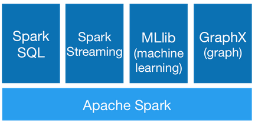

## Spark是什么
Spark 是一种高效且多用途的集群计算平台。换句话说，Spark 是一种开源的，大规模数据（large-scale data）处理引擎。
它提供了一整套开发 API，包括流计算、机器学习或者SQL。

Spark 支持批处理和流处理。
【批处理】指的是对大规模数据一批一批的计算，计算时间较长，而【流处理】则是一条数据一条数据的处理，处理速度可达到秒级。

Spark 集成了许多大数据工具，例如 Spark 可以处理任何 Hadoop 数据源，也能在 Hadoop 集群上执行。
大数据业内有个共识认为，Spark 只是Hadoop MapReduce的扩展（事实并非如此），如Hadoop MapReduce中没有的迭代查询和流处理。
然而Spark并不需要依赖于 Hadoop，它有自己的集群管理系统。
更重要的是，同样数据量，同样集群配置，Spark 的数据处理速度要比 Hadoop MapReduce 快10倍左右。

简而言之，Spark借鉴了MapReduce思想发展而来，保留了其分布式并行计算的优点并改进了其明细的缺点。
让中间数据存储在内存中提高了运行速度、并提供丰富的操作数据的API提高了开发效率。

Spark 的一个关键的特性是数据可以在【内存】中【迭代计算】，提高数据处理的速度。
虽然Spark是用【Scala】开发的，但是它对 Java、Scala、Python 和 R 等高级编程语言提供了开发接口。

什么是迭代计算？
```text
在计算过程中，需要将计算划分为N个阶段，每个阶段之间相互依赖，后一个阶段必须等待前一个阶段执行完成，然后才能执行后一个阶段。
```

为什么Spark运行效率由于MapReduce？
```text
1：Spark提供了全新的数据结构，RDD，支持在内存中进行计算，部分迭代操作支持内存迭代。
2：Spark程序是基于线程来运行的，而MapReduce是基于进程来运行的，线程的启动和销毁是优于进程的。
```

## Apache Spark演变
2009年，Spark 诞生于伯克利大学的AMPLab实验室。最初 Spark 只是一个实验性的项目，代码量非常少，属于轻量级的框架。

2010年，伯克利大学正式开源了 Spark 项目。（论文：弹性分布式数据集）

2013年，Spark 成为了 Apache 基金会下的项目，进入高速发展期。第三方开发者贡献了大量的代码，活跃度非常高。

2014年，Spark 以飞快的速度称为了 Apache 的顶级项目。

2015年至今，Spark在国内IT行业变得愈发火爆，大量的公司开始重点部署或者使用Spark来替代MapReduce、Hive、Storm等传统的大数据计算框架。

其中，论文：弹性分布式数据集，RDD，是一种分布式内存抽象，其使得程序员能够在大规模集群中做内存运算，并且有一定的容错方式。
而这也是Spark的核心数据结构，Spark整个平台都围绕着RDD进行。

## 为什么使用Spark
Spark 诞生之前，在大数据处理领域，并没有一个通用的计算引擎。

* 离线批处理使用 Hadoop MapReduce
* 流处理需要使用 Apache Storm
* 即时查询使用 Impala 或者 Tez
* 执行图计算使用 Neo4j 或者 Apache Giraph

而Spark囊括了离线批处理、流处理、即时查询和图计算4大功能。

## Spark组件
Spark提供了6大组件：
* Spark Core
* Spark SQL
* Spark Streaming
* Spark MLlib
* Spark GraphX
* SparkR

这些组件解决了使用Hadoop时碰到的特定问题。



### Spark Core
将分布式数据抽象为【弹性分布式数据集（RDD）】，实现了应用任务调度、RPC、序列化和压缩，并为运行在其上的上层组件提供API。
所有Spark的上层组件（如：Spark SQL、Spark Streaming、MLlib、GraphX）都建立在Spark Core的基础之上，
它提供了内存计算的能力，因此，Spark Core是分布式处理大数据集的基础。

### Spark SQL
Spark Sql 是Spark来操作结构化数据的程序包，可以让我使用SQL语句的方式来查询数据，Spark支持多种数据源，
包含 Hive 表，parquest以及JSON等内容。

### Spark Streaming
除了处理动态数据流，Spark Streaming还能开发出强大的交互和数据查询程序。
事实上，在处理动态数据流时，流数据会被分割成微小的批处理，这些微小批处理将会在Spark Core上按时间一个一个执行，且速度非常快。

### Spark MLlib
Spark MLlib封装了很多高效的机器学习算法。
它是数据科学最热门的选择，因为它是在内存处理数据的，非常有效的提高数据迭代算法的性能。

### Spark GraphX
Spark GraphX一个建立在Spark之上大规模处理图数据的计算引擎。

### SparkR
SparkR 是一个 R 语言包，它提供了轻量级的方式使得可以在 R语言中使用Apache Spark。
在Spark 1.4中，SparkR 实现了分布式的 data frame，支持类似查询、过滤以及聚合的操作（类似于R中的data frames：dplyr)，
但是这个可以操作大规模的数据集。

## Spark的特点
1：运行速度快
```text
原因一：提供了一个全新的数据结构 RDD（弹性的分布式数据集）
    整个计算操作，基于内存计算，当内存不足的时候，可以防治到磁盘上。
    
原因二：整个Spark是基于线程来运行的，线程的启动和销毁是优于进程的。
```
2：易用性
```text
原因一：Spark提供了多种操作语言的API，Python、SQL、Scala、Java、R。

原因二：Spark提供非常多的高阶API，而且这些API在不同的语言中操作基本都是类似的，大大降低了程序员的学习成本。
```
3：通用性
```text
Spark是又多个组件组成，主要有 Spark Core、Spark SQL、Spark Streaming、Spark MLib，Spark GraphX。
```
4：随处运行
```text
原因一：编写好的Spark程序，可以被提交到多个不同的资源平台上运行：Local Spark集群（standalone），Yarn平台，以及其他支持Spark运行的平台。

原因二：Spark框架可以和多种软件进行集成，集成后，可以非常方便的对接不同软件进行数据处理。
```

Spark的底层网络通信框架是基于Netty，早期是基于Akka（Spark 2.0以前）。