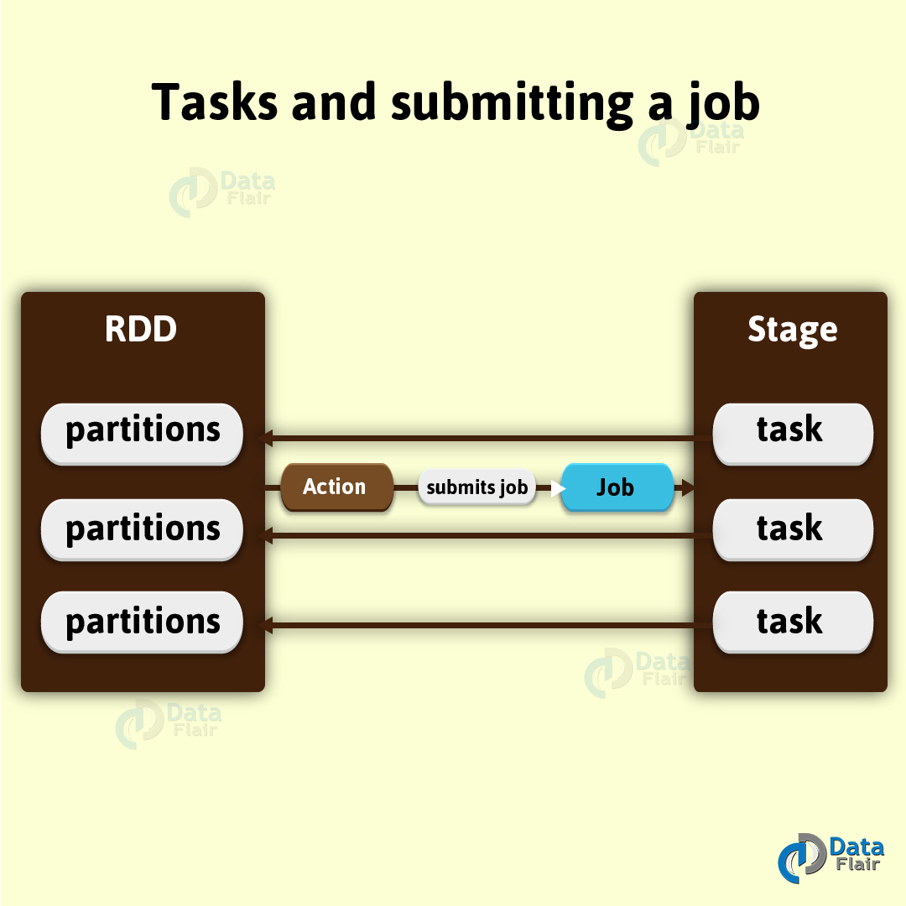
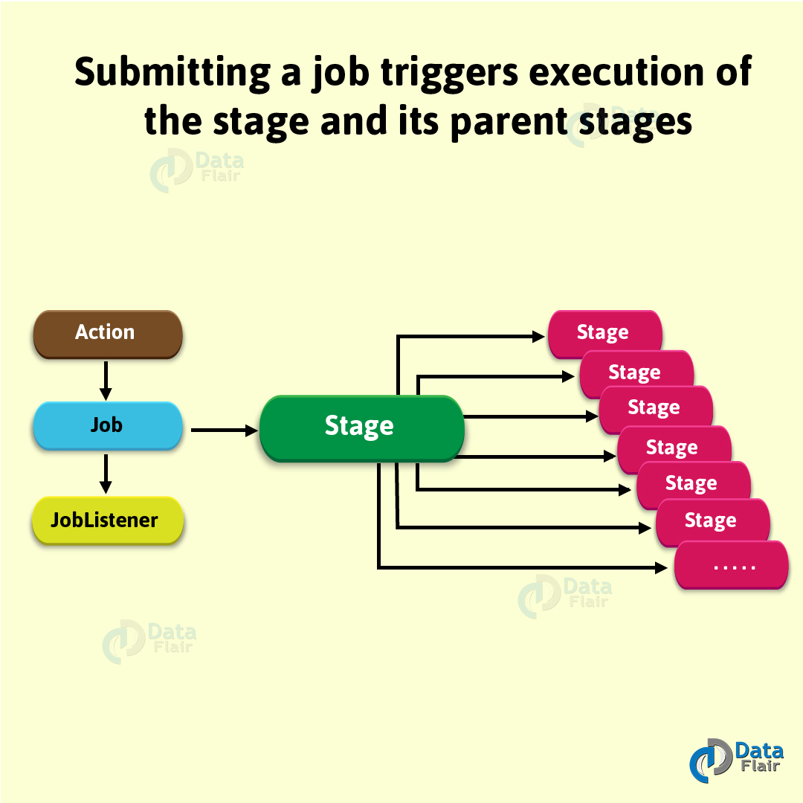
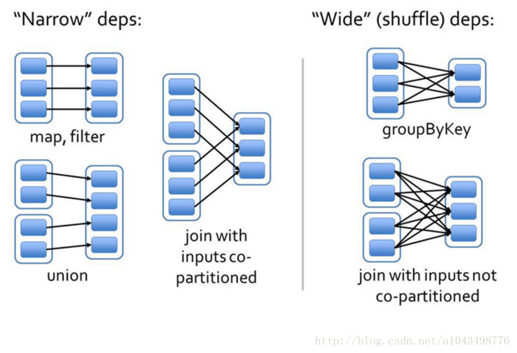

## 什么是Stage
Spark中的一个Stage只不过是物理执行计划其中的一个步骤，它是物理执行计划的一个执行单元。
【一个Job】会被拆分为【多组Task】，【每组任务】被称为【一个Stage】，
可以简单理解为MapReduce里面的Map Stage， Reduce Stage。



Spark的Job中【Stage】之间会有【依赖关系】。
可以利用这些依赖关系把Job所有stage串连起来形成一个**有向无环图**。
在单个job内是根据shuffle算子来拆分stage的，shuffle之前是一个stage，shuffle之后是另一个stage，
如果一个job中有多个shuffle，那么每个shuffle之前都是一个stage。
一个job被提交运行之后，将会触发stage及其父stage的执行。



### 窄依赖：
指父RDD的每一个分区最多被一个子RDD的分区所用，
表现为一个父RDD的分区对应于一个子RDD的分区，和两个父RDD的分区对应于一个子RDD的分区。
图中，map/filter和union属于第一类，对输入进行协同划分（co-partitioned）的join属于第二类。

### 宽依赖：
指子RDD的分区依赖于父RDD的所有分区，这是因为shuffle类操作，如图中的groupByKey和未经协同划分的join。



从上图可以看到：
```text
窄依赖：父 RDD 的一个分区只会被子 RDD 的一个分区依赖；
宽依赖：父 RDD 的一个分区会被子 RDD 的多个分区依赖(涉及到 shuffle)。
```

对于窄依赖：
```text
窄依赖的多个分区可以并行计算；
窄依赖的一个分区的数据如果丢失只需要重新计算对应的分区的数据就可以了。
```
对于宽依赖：
```text
划分Stage(阶段)的依据: 对于宽依赖,必须等到上一阶段计算完成才能计算下一阶段。
```

### Stage:
**一个Job会被拆分为多组Task，每组任务被称为一个Stage**，就像Map Stage，Reduce Stage。
Stage的划分，简单的说是以ShuffleMapStage和ResultStage这两种类型来划分。

在Spark中有两类task，一类是shuffleMapTask，一类是resultTask。
第一类task的输出是shuffle所需数据，第二类task的输出是result。
stage的划分也以此为依据，shuffle之前的所有变换是一个stage，shuffle之后的操作是另一个stage。

比如 `rdd.parallelize(1 to 10).foreach(println)` 这个操作没有shuffle，直接就输出了，
那么只有它的task是resultTask，stage也只有一个；

如果是`rdd.map(x => (x, 1)).reduceByKey(_ + _).foreach(println)`这个job因为有reduce，
所以有一个shuffle过程，那么reduceByKey之前的是一个stage，执行shuffleMapTask，输出shuffle所需的数据，
reduceByKey到最后是一个stage，直接就输出结果了。

如果job中有**多次shuffle**，那么**每个shuffle**之前都是一个stage。

Spark会根据RDD之间的依赖关系将DAG图划分为不同的阶段。
对于窄依赖，由于partition依赖关系的确定性，partition的转换处理就可以在同一个线程里完成，窄依赖就被spark划分到同一个stage中。
而对于宽依赖，只能等父RDD shuffle处理完成后，下一个stage才能开始接下来的计算，
之所以称之为ShuffleMapTask是因为它需要将自己的计算结果通过shuffle到下一个stage中。

## Spark Stage的分类
在Spark中，Stage可以分成两种类型。分别是：

### ShuffleMapStage
* 这种Stage是以Shuffle为输出边界
* 其输入边界可以是从外部获取数据，也可以是另一个ShuffleMapStage的输出
* 其输出可以是另一个Stage的开始
* ShuffleMapStage的【最后Task】就是【ShuffleMapTask】
* 在一个Job里**可能有**该类型的Stage，**也可能没有**该类型Stage

### ResultStage
* 这种Stage是直接输出结果
* 其输入边界可以是从外部获取数据，也可以是另一个ShuffleMapStage的输出
* ResultStage的【最后Task】就是【ResultTask】
* 在一个Job里**必定**有该类型Stage

## Stage类的定义
Stage类是一个抽象类，类的定义如下：

```text
abstract class Stage {
    def findMissingPartitions(): Seq[Int]
}
```