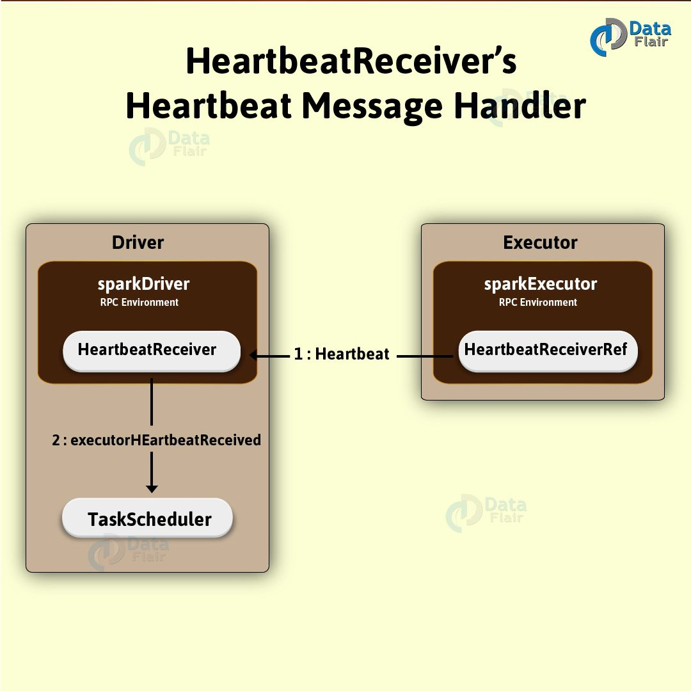
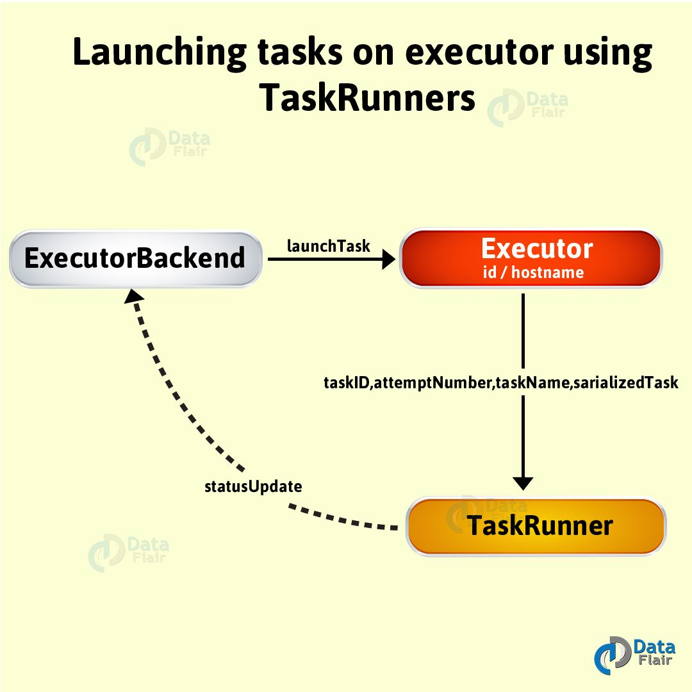

## 什么是Executor
Executor是spark任务（task）的执行单元，运行在worker上，
但是不等同于worker，实际上它是一组计算资源(cpu核心、memory)的集合。
**一个worker上的memory、cpu由多个executor共同分摊**。

* 负责执行分配给它的Task。
* executor会存在于整个application生命周期。
* task执行完之后executor就会把结果发送给驱动程序。
* 如果application代码里调用RDD的缓存函数，如cache()或者persist()，executor将会通过BlockManager给SparkRDD提供缓存机制。



## 什么情况下Spark会创建Executor
Spark会在下面3种场景下创建Executor：
* 当资源管理器用Standalone或者Yarn，在CoarseGrainedExecutorBackend进程接收到RegisteredExecutor消息时；
* 当资源管理器使用Mesos，MesosExecutorBackend进程被注册的时；
* 在本地模式（local mode）下，当LocalEndpoint被创建的时候；

executor创建成功后，在日志文件会显示如下信息：
```text
INFO Executor: Starting executor ID [executorId] on host [executorHostname]
```

## 心跳发送线程
心跳线程是一种**常驻内存的线程**，说白了就是ScheduledThreadPoolExecutor类的一个实例。
可以把这个线程池称为**驱动心跳线程池**。

## 运行Task
用下面的方法，可并行执行已序列化的任务serializedTask。
```text
launchTask(
    context: ExecutorBackend,
    taskId: Long,
    attemptNumber: Int,
    taskName: String,
    serializedTask: ByteBuffer
): Unit
```



执行launchTask时，通常在其内部会创建一个TaskRunner线程。
通过taskId，任务在runningTask里面进行注册。
然后在“Executor Task Launch Worker”**线程池**执行该任务。

## “Executor Task Launch Worker”线程池
在Spark Executor启动的时候，“Executor Task Launch Worker”**线程池**也会随之启动，Executor关闭的这个线程数也会随之关闭。
```text
private val threadPool = ThreadUtils.newDaemonCachedThreadPool("Executor task launch worker")
```