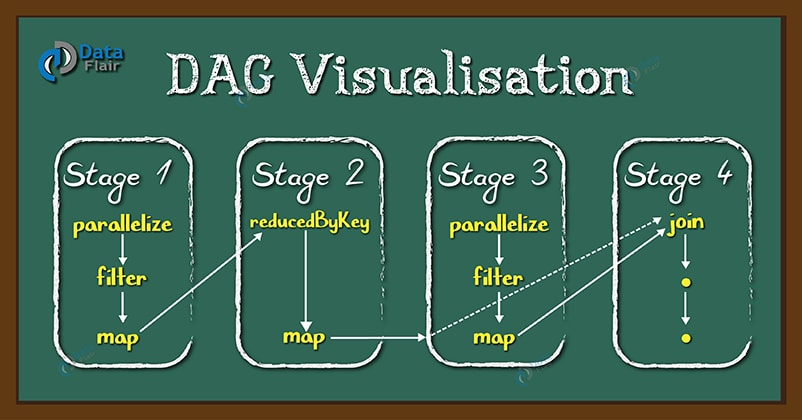

## 什么是DAG
DAG 是一组顶点和边的组合。顶点代表了RDD， 边代表了对RDD的一系列操作。

DAG Scheduler会根据RDD的transformation动作，将DAG分为不同的stage，每个stage中分为多个task，这些task可以并行运行。

## DAG 解决了什么问题
DAG 的出现主要是为了解决 Hadoop MapReduce 框架的局限性。那么 MapReduce 有什么局限性呢？

主要有两个：
* 每个MapReduce操作都是相互独立的，HADOOP不知道接下来会有哪些Map Reduce。
* 每一步的输出结果，都会持久化到硬盘或者HDFS上。

当以上两个特点结合之后，我们就可以想象，如果在某些迭代的场景下，MapReduce框架会对硬盘和HDFS的读写造成大量浪费。

而且每一步都是堵塞在上一步中，所以当我们处理复杂计算时，会需要很长时间，但是数据量却不大。

所以Spark中引入了DAG，它可以优化计算计划，比如减少shuffle数据。

## DAG 是怎么工作的
DAG的工作流程：
1. 解释器是第一层。Spark 通过使用Scala解释器，来解释代码，并会对代码做一些修改。
2. 在Spark控制台中输入代码时，Spark会创建一个 operator graph， 来记录各个操作。
3. 当一个 RDD 的 Action 动作被调用时， Spark 就会把这个 operator graph 提交到 DAG scheduler 上。
4. DAG Scheduler 会把 operator graph 分为各个 stage。 一个 stage 包含基于输入数据分区的task。
   DAG scheduler 会把各个操作连接在一起。
5. 这些 Stage 将传递给 Task Scheduler。Task Scheduler 通过 cluster manager 启动任务。
   Stage 任务的依赖关系， task scheduler 是不知道的。
6. 在 slave 机器上的 Worker 们执行 task。

### 注意：
RDD 的 transformation 分为两种：窄依赖（如map、filter），宽依赖（如reduceByKey）。
窄依赖不需要对分区数据进行shuffle，而宽依赖需要。所以窄依赖都会在一个stage中， 而宽依赖会作为stage的交界处。

每个RDD都维护一个metadata来指向一个或多个父节点的指针以及记录有关它与父节点的关系类型。