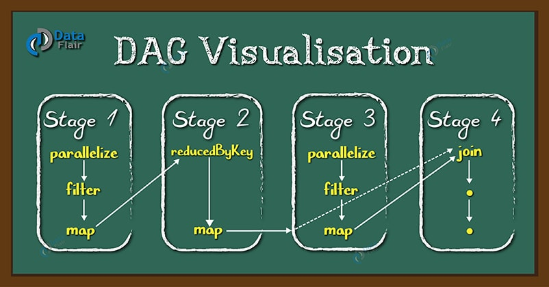
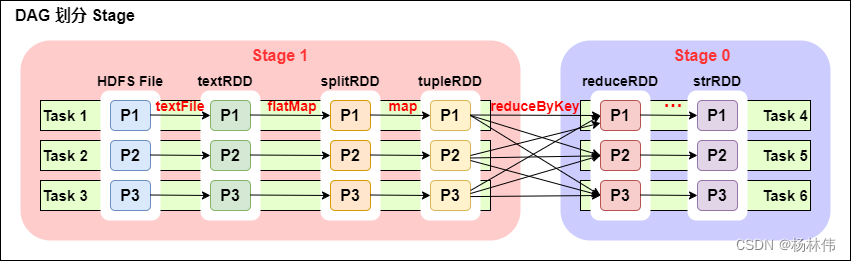

## 什么是DAG
DAG 是一组顶点和边的组合。顶点代表了RDD， 边代表了对RDD的一系列操作。

DAG Scheduler会根据RDD的transformation动作，将DAG分为不同的stage，每个stage中分为多个task，这些task可以并行运行。



## DAG 解决了什么问题
DAG 的出现主要是为了解决 Hadoop MapReduce 框架的局限性。那么 MapReduce 有什么局限性呢？

主要有两个：
* 每个MapReduce操作都是相互独立的，HADOOP不知道接下来会有哪些Map Reduce。
* 每一步的输出结果，都会持久化到硬盘或者HDFS上。

当以上两个特点结合之后，我们就可以想象，如果在某些迭代的场景下，MapReduce框架会对硬盘和HDFS的读写造成大量浪费。

而且每一步都是堵塞在上一步中，所以当我们处理复杂计算时，会需要很长时间，但是数据量却不大。

所以Spark中引入了DAG，它可以优化计算计划，比如减少shuffle数据。

## DAG 是怎么工作的
DAG的工作流程：
1. 解释器是第一层。Spark 通过使用Scala解释器，来解释代码，并会对代码做一些修改。
2. 在Spark控制台中输入代码时，Spark会创建一个 operator graph， 来记录各个操作。
3. 当一个 RDD 的 Action 动作被调用时， Spark 就会把这个 operator graph 提交到 DAG scheduler 上。
4. DAG Scheduler 会把 operator graph 分为各个 stage。 一个 stage 包含基于输入数据分区的task。
   DAG scheduler 会把各个操作连接在一起。
5. 这些 Stage 将传递给 Task Scheduler。Task Scheduler 通过 cluster manager 启动任务。
   Stage 任务的依赖关系， task scheduler 是不知道的。
6. 在 slave 机器上的 Worker 们执行 task。

### 注意：
RDD 的 transformation 分为两种：窄依赖（如map、filter），宽依赖（如reduceByKey）。
窄依赖不需要对分区数据进行shuffle，而宽依赖需要。所以窄依赖都会在一个stage中， 而宽依赖会作为stage的交界处。

每个RDD都维护一个metadata来指向一个或多个父节点的指针以及记录有关它与父节点的关系类型。

## DAG
DAG(Directed Acyclic Graph有向无环图)：指的是数据转换执行的过程，有方向，无闭环(其实就是 RDD 执行的流程)。

原始的RDD通过一系列的转换操作就形成了DAG有向无环图，任务执行时，可以按照DAG的描述，执行真正的计算(数据被操作的一个过程)。

DAG的边界:
```text
开始：通过 SparkContext 创建的 RDD；
结束：触发 Action，一旦触发 Action 就形成了一个完整的 DAG。
```

### DAG划分Stage



从上图可以看出：
* 一个Spark程序可以有多个DAG(有几个Action，就有几个DAG，上图最后只有一个Action（图中未表现）,那么就是一个 DAG);
* 一个DAG可以有多个Stage(根据 宽依赖/shuffle 进行划分)；
* 同一个Stage可以有多个Task并行执行(task数=分区数，如上图，Stage1 中有三个分区 P1、P2、P3，对应的也有三个Task)；
* 可以看到这个DAG中只 reduceByKey操作 是一个宽依赖，Spark内核会以此为边界将其前后划分成不同的Stage；
* 在图中Stage1中，从textFile到flatMap到map都是窄依赖，这几步操作可以形成一个流水线操作，
  通过flatMap操作生成的partition可以不用等待整个RDD计算结束，而是继续进行map操作，这样大大提高了计算的效率。

### 为什么要划分 Stage? --并行计算

一个复杂的业务逻辑如果有shuffle，那么就意味着前面阶段产生结果后，才能执行下一个阶段，即下一个阶段的计算要依赖上一个阶段的数据。
那么我们按照shuffle进行划分(也就是按照宽依赖就行划分)，就可以将一个DAG划分成多个Stage/阶段，
在同一个Stage中，会有多个算子操作，可以形成一个pipeline流水线，流水线内的多个平行的分区可以并行执行。

### 如何划分 DAG 的 stage？

对于窄依赖，partition 的转换处理在 stage 中完成计算，不划分(将窄依赖尽量放在在同一个 stage 中，可以实现流水线计算)。
对于宽依赖，由于有 shuffle 的存在，只能在父 RDD 处理完成后，才能开始接下来的计算，也就是说需要要划分 stage。

### 总结：
Spark会根据 shuffle/宽依赖 使用【回溯算法】来对 DAG 进行 Stage 划分，
从后往前，遇到宽依赖就断开，遇到窄依赖就把当前的 RDD 加入到当前的 stage/阶段中。

具体的划分算法请参见 AMP 实验室发表的论文：
《Resilient Distributed Datasets: A Fault-Tolerant Abstraction for In-Memory Cluster Computing》
