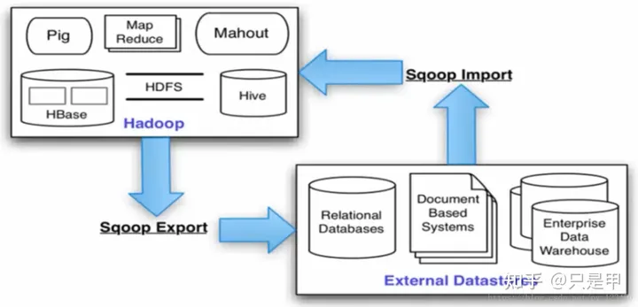
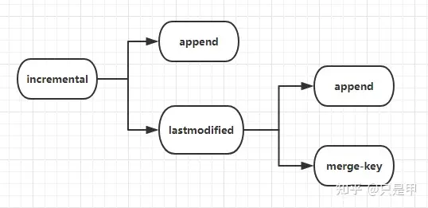

```text
备注: 测试环境 CDH 6.3.1 Sqoop 1.4.7
```
---

# 一、Sqoop概述
Apache Sqoop（SQL-to-Hadoop）项目旨在协助RDBMS与Hadoop之间进行高效的大数据交流。
用户可以在 Sqoop 的帮助下，轻松地把关系型数据库的数据导入到 Hadoop 与其相关的系统 (如HBase和Hive)中；
同时也可以把数据从 Hadoop 系统里抽取并导出到关系型数据库里。

Sqoop是一个在结构化数据和Hadoop之间进行批量数据迁移的工具，结构化数据可以是MySQL、Oracle等RDBMS。
Sqoop底层用MapReduce程序实现抽取、转换、加载，MapReduce天生的特性保证了并行化和高容错率，
而且相比Kettle等传统ETL工具，任务跑在Hadoop集群上，减少了ETL服务器资源的使用情况。在特定场景下，抽取过程会有很大的性能提升。

如果要用Sqoop，必须正确安装并配置Hadoop，因依赖于本地的Hadoop环境启动MR程序；MySQL、Oracle等数据库的JDBC驱动也要放到Sqoop的lib目录下。

Sqoop架构图:



---

# 二、Sqoop工具概述
通过Sqoop的help命令可以看到sqoop有哪些工具
```text
[root@hp2 ~]# sqoop help
Warning: /opt/cloudera/parcels/CDH-6.3.1-1.cdh6.3.1.p0.1470567/bin/../lib/sqoop/../accumulo does not exist! Accumulo imports will fail.
Please set $ACCUMULO_HOME to the root of your Accumulo installation.
SLF4J: Class path contains multiple SLF4J bindings.
SLF4J: Found binding in [jar:file:/opt/cloudera/parcels/CDH-6.3.1-1.cdh6.3.1.p0.1470567/jars/slf4j-log4j12-1.7.25.jar!/org/slf4j/impl/StaticLoggerBinder.class]
SLF4J: Found binding in [jar:file:/opt/cloudera/parcels/CDH-6.3.1-1.cdh6.3.1.p0.1470567/jars/log4j-slf4j-impl-2.8.2.jar!/org/slf4j/impl/StaticLoggerBinder.class]
SLF4J: See http://www.slf4j.org/codes.html#multiple_bindings for an explanation.
SLF4J: Actual binding is of type [org.slf4j.impl.Log4jLoggerFactory]
20/11/20 17:00:56 INFO sqoop.Sqoop: Running Sqoop version: 1.4.7-cdh6.3.1
usage: sqoop COMMAND [ARGS]

Available commands:
codegen            Generate code to interact with database records
create-hive-table  Import a table definition into Hive
eval               Evaluate a SQL statement and display the results
export             Export an HDFS directory to a database table
help               List available commands
import             Import a table from a database to HDFS
import-all-tables  Import tables from a database to HDFS
import-mainframe   Import datasets from a mainframe server to HDFS
job                Work with saved jobs
list-databases     List available databases on a server
list-tables        List available tables in a database
merge              Merge results of incremental imports
metastore          Run a standalone Sqoop metastore
version            Display version information

See 'sqoop help COMMAND' for information on a specific command.
```

| 工具名               | 描述                | 
|-------------------|-------------------| 
| codegen           | 生成与数据库记录交互的代码     | 
| create-hive-table | 复制表结果到hive表       | 
| eval              | 评估sql并给出结果        | 
| export            | 导出一个HDFS目录到一个数据库表 | 
| help              | 列出可用的命令           | 
| import            | 将一个表从数据库导入到HDFS   | 
| import-all-tables | 将所有表从数据库导入到HDFS   | 
| import-mainframe  | 将大型机数据集导入到HDFS    | 
| list-databases    | 列出服务器上可用数据库       | 
| list-tables       | 列出数据库上可用表         | 
| version           | 展示版本信息            |

例如我想看 sqoop的import工具有哪些参数:
```text
[root@hp2 ~]# sqoop help import
Warning: /opt/cloudera/parcels/CDH-6.3.1-1.cdh6.3.1.p0.1470567/bin/../lib/sqoop/../accumulo does not exist! Accumulo imports will fail.
Please set $ACCUMULO_HOME to the root of your Accumulo installation.
SLF4J: Class path contains multiple SLF4J bindings.
SLF4J: Found binding in [jar:file:/opt/cloudera/parcels/CDH-6.3.1-1.cdh6.3.1.p0.1470567/jars/slf4j-log4j12-1.7.25.jar!/org/slf4j/impl/StaticLoggerBinder.class]
SLF4J: Found binding in [jar:file:/opt/cloudera/parcels/CDH-6.3.1-1.cdh6.3.1.p0.1470567/jars/log4j-slf4j-impl-2.8.2.jar!/org/slf4j/impl/StaticLoggerBinder.class]
SLF4J: See http://www.slf4j.org/codes.html#multiple_bindings for an explanation.
SLF4J: Actual binding is of type [org.slf4j.impl.Log4jLoggerFactory]
20/11/20 17:11:43 INFO sqoop.Sqoop: Running Sqoop version: 1.4.7-cdh6.3.1
usage: sqoop import [GENERIC-ARGS] [TOOL-ARGS]

Common arguments:
--connect <jdbc-uri>                                       Specify JDBC
connect
string
--connection-manager <class-name>                          Specify
connection
manager
class name
--connection-param-file <properties-file>                  Specify
connection
parameters
file
--driver <class-name>                                      Manually
specify JDBC
driver class
to use

**限于篇幅，中间省略N多行**

At minimum, you must specify --connect and --table
Arguments to mysqldump and other subprograms may be supplied
after a '--' on the command line.
```
---

# 三、Sqoop工具详解
## 3.1 codegen
codegen工具生成封装和解释导入记录的Java类。记录的Java定义作为导入过程的一部分实例化，但是也可以单独执行。
例如，如果Java源代码丢失了，可以重新创建它。可以创建在字段之间使用不同分隔符的类的新版本，等等。

由于我是从传统数据仓库转的大数据，目前对java不熟悉，此处就不展开了。

## 3.2 create-hive-table
create-hive-table 工具用来将表同步到hive。

### 3.2.1 create-hive-table工具命令介绍
**通用命令：**

| 参数                      | 描述                     | 
|-------------------------|------------------------|
| --connect               | 指定jdbc连接信息             | 
| --connection-manager    | 指定要使用的连接管理器类           | 
| --driver                | 手工指定jdbc驱动             | 
| --hadoop-mapred-home    | 覆盖 $HADOOP_MAPRED_HOME | 
| --help                  | 打印帮助信息                 | 
| --password-file         | 设置包含身份验证密码的文件的路径       | 
| -P                      | 从控制台读取密码               | 
| --password              | 设置身份认证密码               | 
| --username              | 设置身份验证用户名              | 
| --verbose               | 工作时打印更多信息              | 
| --connection-param-file | 提供连接参数的可选属性文件          | 
| --relaxed-isolation     | 设置连接的隔离级别以读取未提交的数据     |


**Hive命令：**

| 参数                  | 描述                                   | 
|---------------------|--------------------------------------| 
| --hive-home         | 覆盖 $HIVE_HOME                        | 
| --hive-overwrite    | 覆盖hive表已存在的数据                        | 
| --create-hive-table | 如果设置此参数，该表存在的情况下mr job会失败，默认参数为false | 
| --hive-table        | 导入数据的时候指定hive数据库的表名                  | 
| --table             | 读取hive表的数据定义文件                       |


**输出格式命令：**

| 参数                       | 描述              | 
|--------------------------|-----------------| 
| --enclosed-by            | 设置必需的字段封闭字符     | 
| --escaped-by             | 设置分隔字符          | 
| --fields-terminated-by   | 设置结束字符          | 
| --mysql-delimiters       | 使用mysql 默认的分隔字符 |
| --optionally-enclosed-by | 设置包含字符的字段       |

### 3.2.2 create-hive-table 测试案例
需求，将mysql test库下的emp表的表结构 同步到hive的test库下ods_emp表
```text
sqoop create-hive-table \
--connect jdbc:mysql://10.31.1.122:3306/test \
--username root \
--password abc123 \
--hive-database test \
--table emp --hive-table ods_emp
```

测试记录:
```text
[root@hp1 ~]# sqoop create-hive-table \
> --connect jdbc:mysql://10.31.1.122:3306/test \
> --table emp \
> --username root \
> --password abc123 \
> --hive-database test \
> --hive-table ods_emp
Warning: /opt/cloudera/parcels/CDH-6.3.1-1.cdh6.3.1.p0.1470567/bin/../lib/sqoop/../accumulo does not exist! Accumulo imports will fail.
Please set $ACCUMULO_HOME to the root of your Accumulo installation.
SLF4J: Class path contains multiple SLF4J bindings.
SLF4J: Found binding in [jar:file:/opt/cloudera/parcels/CDH-6.3.1-1.cdh6.3.1.p0.1470567/jars/slf4j-log4j12-1.7.25.jar!/org/slf4j/impl/StaticLoggerBinder.class]
SLF4J: Found binding in [jar:file:/opt/cloudera/parcels/CDH-6.3.1-1.cdh6.3.1.p0.1470567/jars/log4j-slf4j-impl-2.8.2.jar!/org/slf4j/impl/StaticLoggerBinder.class]
SLF4J: See http://www.slf4j.org/codes.html#multiple_bindings for an explanation.
SLF4J: Actual binding is of type [org.slf4j.impl.Log4jLoggerFactory]
20/11/23 18:12:28 INFO sqoop.Sqoop: Running Sqoop version: 1.4.7-cdh6.3.1
20/11/23 18:12:28 WARN tool.BaseSqoopTool: Setting your password on the command-line is insecure. Consider using -P instead.
20/11/23 18:12:28 INFO tool.BaseSqoopTool: Using Hive-specific delimiters for output. You can override
20/11/23 18:12:28 INFO tool.BaseSqoopTool: delimiters with --fields-terminated-by, etc.
20/11/23 18:12:28 INFO manager.MySQLManager: Preparing to use a MySQL streaming resultset.
20/11/23 18:12:29 INFO manager.SqlManager: Executing SQL statement: SELECT t.* FROM `emp` AS t LIMIT 1
20/11/23 18:12:29 INFO manager.SqlManager: Executing SQL statement: SELECT t.* FROM `emp` AS t LIMIT 1
20/11/23 18:12:29 WARN hive.TableDefWriter: Column hiredate had to be cast to a less precise type in Hive
20/11/23 18:12:29 WARN hive.TableDefWriter: Column sal had to be cast to a less precise type in Hive
20/11/23 18:12:29 WARN hive.TableDefWriter: Column comm had to be cast to a less precise type in Hive
20/11/23 18:12:30 INFO hive.HiveImport: Loading uploaded data into Hive
20/11/23 18:12:30 INFO conf.HiveConf: Found configuration file file:/etc/hive/conf.cloudera.hive/hive-site.xml
**********中间省略N多输出*******
20/11/23 18:12:33 INFO zookeeper.ZooKeeper: Initiating client connection, connectString=hp1:2181,hp3:2181,hp2:2181 sessionTimeout=1200000 watcher=org.apache.curator.ConnectionState@176555c
20/11/23 18:12:33 INFO zookeeper.ClientCnxn: Opening socket connection to server hp1/10.31.1.123:2181. Will not attempt to authenticate using SASL (unknown error)
20/11/23 18:12:33 INFO zookeeper.ClientCnxn: Socket connection established, initiating session, client: /10.31.1.123:54526, server: hp1/10.31.1.123:2181
20/11/23 18:12:33 INFO zookeeper.ClientCnxn: Session establishment complete on server hp1/10.31.1.123:2181, sessionid = 0x175e00052b51d5e, negotiated timeout = 40000
20/11/23 18:12:33 INFO state.ConnectionStateManager: State change: CONNECTED
20/11/23 18:12:33 INFO ql.Driver: Executing command(queryId=root_20201123181231_97629f38-ba50-4864-9d21-6aa2239f11a9): CREATE TABLE IF NOT EXISTS `test`.`ods_emp` ( `empno` INT, `ename` STRING, `job` STRING, `mgr` INT, `hiredate` STRING, `sal` DOUBLE, `comm` DOUBLE, `deptno` INT) COMMENT 'Imported by sqoop on 2020/11/23 18:12:29' ROW FORMAT DELIMITED FIELDS TERMINATED BY '\001' LINES TERMINATED BY '\012' STORED AS TEXTFILE
20/11/23 18:12:33 INFO ql.Driver: Starting task [Stage-0:DDL] in serial mode
20/11/23 18:12:33 INFO hive.metastore: Mestastore configuration hive.metastore.filter.hook changed from org.apache.hadoop.hive.ql.security.authorization.plugin.AuthorizationMetaStoreFilterHook to org.apache.hadoop.hive.metastore.DefaultMetaStoreFilterHookImpl
20/11/23 18:12:33 INFO hive.metastore: Closed a connection to metastore, current connections: 0
20/11/23 18:12:33 INFO exec.DDLTask: creating table test.ods_emp on null
20/11/23 18:12:34 INFO hive.metastore: HMS client filtering is enabled.
20/11/23 18:12:34 INFO hive.metastore: Trying to connect to metastore with URI thrift://hp1:9083
20/11/23 18:12:34 INFO hive.metastore: Opened a connection to metastore, current connections: 1
20/11/23 18:12:34 INFO hive.metastore: Connected to metastore.
20/11/23 18:12:34 INFO ql.Driver: Completed executing command(queryId=root_20201123181231_97629f38-ba50-4864-9d21-6aa2239f11a9); Time taken: 0.515 seconds
OK
20/11/23 18:12:34 INFO ql.Driver: OK
Time taken: 2.633 seconds
20/11/23 18:12:34 INFO CliDriver: Time taken: 2.633 seconds
20/11/23 18:12:34 INFO conf.HiveConf: Using the default value passed in for log id: 2fec9e5a-4d5e-4786-9e5b-5e5303b8cca1
20/11/23 18:12:34 INFO session.SessionState: Resetting thread name to  main
20/11/23 18:12:34 INFO conf.HiveConf: Using the default value passed in for log id: 2fec9e5a-4d5e-4786-9e5b-5e5303b8cca1
20/11/23 18:12:34 INFO session.SessionState: Deleted directory: /tmp/hive/root/2fec9e5a-4d5e-4786-9e5b-5e5303b8cca1 on fs with scheme hdfs
20/11/23 18:12:34 INFO session.SessionState: Deleted directory: /tmp/root/2fec9e5a-4d5e-4786-9e5b-5e5303b8cca1 on fs with scheme file
20/11/23 18:12:34 INFO hive.metastore: Closed a connection to metastore, current connections: 0
20/11/23 18:12:34 INFO hive.HiveImport: Hive import complete.
20/11/23 18:12:34 INFO imps.CuratorFrameworkImpl: backgroundOperationsLoop exiting
20/11/23 18:12:34 INFO zookeeper.ZooKeeper: Session: 0x175e00052b51d5e closed
20/11/23 18:12:34 INFO CuratorFrameworkSingleton: Closing ZooKeeper client.
20/11/23 18:12:34 INFO zookeeper.ClientCnxn: EventThread shut down
```

**查看hive这边的表** 可以看到整数转换为int，小数的自动转为double，varchar转为string没什么问题，可是date类型的也变为string了，不知道为什么会这个样子。
另外，主外键直接忽略了。
```text
hive> desc ods_emp;
OK
empno                   int                                         
ename                   string                                      
job                     string                                      
mgr                     int                                         
hiredate                string                                      
sal                     double                                      
comm                    double                                      
deptno                  int                                         
Time taken: 0.078 seconds, Fetched: 8 row(s)
hive> show create table ods_emp;
OK
CREATE TABLE `ods_emp`(
`empno` int,
`ename` string,
`job` string,
`mgr` int,
`hiredate` string,
`sal` double,
`comm` double,
`deptno` int)
COMMENT 'Imported by sqoop on 2020/11/23 18:12:29'
ROW FORMAT SERDE
'org.apache.hadoop.hive.serde2.lazy.LazySimpleSerDe'
WITH SERDEPROPERTIES (
'field.delim'='',
'line.delim'='\n',
'serialization.format'='')
STORED AS INPUTFORMAT
'org.apache.hadoop.mapred.TextInputFormat'
OUTPUTFORMAT
'org.apache.hadoop.hive.ql.io.HiveIgnoreKeyTextOutputFormat'
LOCATION
'hdfs://nameservice1/user/hive/warehouse/test.db/ods_emp'
TBLPROPERTIES (
'transient_lastDdlTime'='1606126354')
Time taken: 0.107 seconds, Fetched: 24 row(s)
```

## 3.3 eval
执行前，先评估命令的准确性。

### 3.3.1 eval工具命令介绍
**通用命令：** 

| 参数                      | 描述                     | 
|-------------------------|------------------------| 
| --connect               | 指定jdbc连接信息             | 
| --connection-manager    | 指定要使用的连接管理器类           | 
| --driver                | 手工指定jdbc驱动             | 
| --hadoop-mapred-home    | 覆盖 $HADOOP_MAPRED_HOME | 
| --help                  | 打印帮助信息                 |
| --password-file         | 设置包含身份验证密码的文件的路径       | 
| -P                      | 从控制台读取密码               | 
| --password              | 设置身份认证密码               | 
| --username              | 设置身份验证用户名              | 
| --verbose               | 工作时打印更多信息              | 
| --connection-param-file | 提供连接参数的可选属性文件          | 
| --relaxed-isolation     | 设置连接的隔离级别以读取未提交的数据     |


**SQL 评估命令** 

| 参数                     | 描述      | 
|------------------------|---------| 
| -e,--query <statement> | 执行sql命令 |

### 3.3.2 eval命令测试
**测试 --query：**
```text
sqoop eval \
--connect jdbc:mysql://10.31.1.122:3306/test \
--username root \
--password abc123 \
--query "select * from emp"
```

测试记录:
```text
[root@hp1 ~]# sqoop eval \
> --connect jdbc:mysql://10.31.1.122:3306/test \
> --username root \
> --password abc123 \
> --query "select * from emp"
Warning: /opt/cloudera/parcels/CDH-6.3.1-1.cdh6.3.1.p0.1470567/bin/../lib/sqoop/../accumulo does not exist! Accumulo imports will fail.
Please set $ACCUMULO_HOME to the root of your Accumulo installation.
SLF4J: Class path contains multiple SLF4J bindings.
SLF4J: Found binding in [jar:file:/opt/cloudera/parcels/CDH-6.3.1-1.cdh6.3.1.p0.1470567/jars/slf4j-log4j12-1.7.25.jar!/org/slf4j/impl/StaticLoggerBinder.class]
SLF4J: Found binding in [jar:file:/opt/cloudera/parcels/CDH-6.3.1-1.cdh6.3.1.p0.1470567/jars/log4j-slf4j-impl-2.8.2.jar!/org/slf4j/impl/StaticLoggerBinder.class]
SLF4J: See http://www.slf4j.org/codes.html#multiple_bindings for an explanation.
SLF4J: Actual binding is of type [org.slf4j.impl.Log4jLoggerFactory]
20/11/23 18:28:05 INFO sqoop.Sqoop: Running Sqoop version: 1.4.7-cdh6.3.1
20/11/23 18:28:05 WARN tool.BaseSqoopTool: Setting your password on the command-line is insecure. Consider using -P instead.
20/11/23 18:28:05 INFO manager.MySQLManager: Preparing to use a MySQL streaming resultset.
----------------------------------------------------------------------------------
| empno | ename      | job       | mgr  | hiredate   | sal       | comm      | deptno |
----------------------------------------------------------------------------------
| 7369 | SMITH      | CLERK     | 7902 | 1980-12-17 | 800.00    | (null)    | 20 |
| 7499 | ALLEN      | SALESMAN  | 7698 | 1981-02-20 | 1600.00   | 300.00    | 30 |
| 7521 | WARD       | SALESMAN  | 7698 | 1981-02-22 | 1250.00   | 500.00    | 30 |
| 7566 | JONES      | MANAGER   | 7839 | 1981-04-02 | 2975.00   | (null)    | 20 |
| 7654 | MARTIN     | SALESMAN  | 7698 | 1981-09-28 | 1250.00   | 1400.00   | 30 |
| 7698 | BLAKE      | MANAGER   | 7839 | 1981-05-01 | 2850.00   | (null)    | 30 |
| 7782 | CLARK      | MANAGER   | 7839 | 1981-06-09 | 2450.00   | (null)    | 10 |
| 7788 | SCOTT      | ANALYST   | 7566 | 1987-06-13 | 3000.00   | (null)    | 20 |
| 7839 | KING       | PRESIDENT | (null) | 1981-11-17 | 5000.00   | (null)    | 10 |
| 7844 | TURNER     | SALESMAN  | 7698 | 1981-09-08 | 1500.00   | 0.00      | 30 |
| 7876 | ADAMS      | CLERK     | 7788 | 1987-06-13 | 1100.00   | (null)    | 20 |
| 7900 | JAMES      | CLERK     | 7698 | 1981-12-03 | 950.00    | (null)    | 30 |
| 7902 | FORD       | ANALYST   | 7566 | 1981-12-03 | 3000.00   | (null)    | 20 |
| 7934 | MILLER     | CLERK     | 7782 | 1982-01-23 | 1300.00   | (null)    | 10 |
----------------------------------------------------------------------------------
```

**测试 -e：**
```text
sqoop eval \
--connect jdbc:mysql://10.31.1.122:3306/test \
--username root \
--password abc123 \
-e "insert into emp(empno) values (1)"
```

测试记录:
```text
[root@hp1 ~]# sqoop eval \
> --connect jdbc:mysql://10.31.1.122:3306/test \
> --username root \
> --password abc123 \
> -e "insert into emp(empno) values (1)"
Warning: /opt/cloudera/parcels/CDH-6.3.1-1.cdh6.3.1.p0.1470567/bin/../lib/sqoop/../accumulo does not exist! Accumulo imports will fail.
Please set $ACCUMULO_HOME to the root of your Accumulo installation.
SLF4J: Class path contains multiple SLF4J bindings.
SLF4J: Found binding in [jar:file:/opt/cloudera/parcels/CDH-6.3.1-1.cdh6.3.1.p0.1470567/jars/slf4j-log4j12-1.7.25.jar!/org/slf4j/impl/StaticLoggerBinder.class]
SLF4J: Found binding in [jar:file:/opt/cloudera/parcels/CDH-6.3.1-1.cdh6.3.1.p0.1470567/jars/log4j-slf4j-impl-2.8.2.jar!/org/slf4j/impl/StaticLoggerBinder.class]
SLF4J: See http://www.slf4j.org/codes.html#multiple_bindings for an explanation.
SLF4J: Actual binding is of type [org.slf4j.impl.Log4jLoggerFactory]
20/11/23 18:32:26 INFO sqoop.Sqoop: Running Sqoop version: 1.4.7-cdh6.3.1
20/11/23 18:32:26 WARN tool.BaseSqoopTool: Setting your password on the command-line is insecure. Consider using -P instead.
20/11/23 18:32:26 INFO manager.MySQLManager: Preparing to use a MySQL streaming resultset.
20/11/23 18:32:26 INFO tool.EvalSqlTool: 1 row(s) updated.
```

## 3.4 export
将hdfs里的数据同步到关系型数据库,目标表必须在数据库中存在，将根据用户指定的分隔符将输入文件读取并解析为一组记录。

### 3.4.1 export命令概述
通用命令： 

| 参数                      | 描述                     | 
|-------------------------|------------------------| 
| --connect               | 指定jdbc连接信息             | 
| --connection-manager    | 指定要使用的连接管理器类           | 
| --driver                | 手工指定jdbc驱动             | 
| --hadoop-mapred-home    | 覆盖 $HADOOP_MAPRED_HOME | 
| --help                  | 打印帮助信息                 | 
| --password-file         | 设置包含身份验证密码的文件的路径       | 
| -P                      | 从控制台读取密码               | 
| --password              | 设置身份认证密码               | 
| --username              | 设置身份验证用户名              | 
| --verbose               | 工作时打印更多信息              | 
| --connection-param-file | 提供连接参数的可选属性文件          | 
| --relaxed-isolation     | 设置连接的隔离级别以读取未提交的数据     |


验证参数细节：

| 参数                          | 描述                    | 
|-----------------------------|-----------------------| 
| --validate                  | 允许对复制的数据进行验证，只支持单表复制。 | 
| --validator                 | 指定使用的验证类              | 
| --validation-threshold      | 指定要使用的验证阈值类           | 
| --validation-failurehandler | 指定要使用的验证失败处理程序类       |

导出控制命令：

| 参数                      | 描述                        | 
|-------------------------|---------------------------| 
| --columns               | 表需要导出的列                   | 
| --direct                | 使用直接出口快速路径                | 
| --export-dir            | HDFS导出的源路径                | 
| -m,--num-mappers        | 指定使用n个map并行导出             | 
| --table                 | 需要填充的表                    | 
| --call                  | 要调用的存储过程                  | 
| --update-key            | 用于更新的锚定列。如果有多个列，请使用逗号分隔列。 | 
| --update-mode           | 更新方式                      | 
| --input-null-string     | 对于字符串列，要解释为null的字符串       | 
| --input-null-non-string | 对于非字符串列，将解释为null的字符串      | 
| --staging-table         | 在将数据插入目标表之前，数据将在其中暂存的表。   | 
| --clear-staging-table   | 表示可以删除staging表中存在的任何数据。   | 
| --batch                 | 使用批处理模式执行底层语句             |


输入解析参数：

| 参数                             | 描述         | 
|--------------------------------|------------| 
| --input-enclosed-by            | 设置所需的字段附件  | 
| --input-escaped-by             | 设置输入转义字符   | 
| --input-fields-terminated-by   | 设置输入字段分隔符  | 
| --input-lines-terminated-by    | 设置输入的行结束字符 | 
| --input-optionally-enclosed-by | 设置包含字符的字段  |

输出行格式化参数：

| 参数                       | 描述            | 
|--------------------------|---------------| 
| --enclosed-by            | 设置所需的字段附件     | 
| --escaped-by             | 设置输入转义字符      | 
| --fields-terminated-by   | 设置输入字段分隔符     | 
| --lines-terminated-by    | 设置输入的行结束字符    | 
| --mysql-delimiters       | 使用MySQL默认的分隔符 | 
| --optionally-enclosed-by | 设置包含字符的字段     |

代码生成的参数： 

| 参数                | 描述                           | 
|-------------------|------------------------------| 
| --bindir          | 编译对象的输出目录                    |
| --class-name      | 设置类的名称                       | 
| --jar-file        | 禁用code generation; 使用指定的jar包 | 
| --outdir          | generated code的输出目录          | 
| --package-name    | auto-generated classes的包     | 
| --map-column-java | 为配置的列覆盖从SQL类型到Java类型的默认映射    |

### 3.4.2 export命令测试案例
sqoop的export命令支持 insert、update到关系型数据库，但是不支持merge，亲自测试过，--merge-key id 这样会报错。 
但是sqoop的export命令支持调用存储过程，这样同步了数据之后，可以通过mysql的存储过程进行数据处理。

#### 3.4.2.1 hive表导入mysql数据库insert案例
**数据准备**:
```text
-- hive表数据
hive> select * from t1;
OK
1       abc
2       def

-- MySQL 数据
mysql> select * from t1;
Empty set (0.00 sec)
```

**代码**: --fields-terminated-by '\0001' 必须是这个格式，其它格式试了报错，待研究
```text
sqoop export \
--connect jdbc:mysql://10.31.1.122:3306/test \
--username root \
--password abc123 \
--table t1 \
--export-dir /user/hive/warehouse/test.db/t1 \
--num-mappers 1 \
--fields-terminated-by '\0001'
```

**测试记录**:
```text
[root@hp1 ~]# sqoop export \
> --connect jdbc:mysql://10.31.1.122:3306/test \
> --username root \
> --password abc123 \
> --table t1 \
> --export-dir /user/hive/warehouse/test.db/t1 \
> --num-mappers 1 \
> --fields-terminated-by '\0001'
Warning: /opt/cloudera/parcels/CDH-6.3.1-1.cdh6.3.1.p0.1470567/bin/../lib/sqoop/../accumulo does not exist! Accumulo imports will fail.
Please set $ACCUMULO_HOME to the root of your Accumulo installation.
SLF4J: Class path contains multiple SLF4J bindings.
SLF4J: Found binding in [jar:file:/opt/cloudera/parcels/CDH-6.3.1-1.cdh6.3.1.p0.1470567/jars/slf4j-log4j12-1.7.25.jar!/org/slf4j/impl/StaticLoggerBinder.class]
SLF4J: Found binding in [jar:file:/opt/cloudera/parcels/CDH-6.3.1-1.cdh6.3.1.p0.1470567/jars/log4j-slf4j-impl-2.8.2.jar!/org/slf4j/impl/StaticLoggerBinder.class]
SLF4J: See http://www.slf4j.org/codes.html#multiple_bindings for an explanation.
SLF4J: Actual binding is of type [org.slf4j.impl.Log4jLoggerFactory]
20/11/23 19:22:04 INFO sqoop.Sqoop: Running Sqoop version: 1.4.7-cdh6.3.1
20/11/23 19:22:04 WARN tool.BaseSqoopTool: Setting your password on the command-line is insecure. Consider using -P instead.
20/11/23 19:22:04 INFO manager.MySQLManager: Preparing to use a MySQL streaming resultset.
20/11/23 19:22:04 INFO tool.CodeGenTool: Beginning code generation
20/11/23 19:22:05 INFO manager.SqlManager: Executing SQL statement: SELECT t.* FROM `t1` AS t LIMIT 1
20/11/23 19:22:05 INFO manager.SqlManager: Executing SQL statement: SELECT t.* FROM `t1` AS t LIMIT 1
20/11/23 19:22:05 INFO orm.CompilationManager: HADOOP_MAPRED_HOME is /opt/cloudera/parcels/CDH/lib/hadoop-mapreduce
20/11/23 19:22:06 ERROR orm.CompilationManager: Could not rename /tmp/sqoop-root/compile/fab279df6cf018b9c6c4a9b4d9508e39/t1.java to /root/./t1.java. Error: Destination '/root/./t1.java' already exists
20/11/23 19:22:06 INFO orm.CompilationManager: Writing jar file: /tmp/sqoop-root/compile/fab279df6cf018b9c6c4a9b4d9508e39/t1.jar
20/11/23 19:22:06 INFO mapreduce.ExportJobBase: Beginning export of t1
20/11/23 19:22:06 INFO Configuration.deprecation: mapred.jar is deprecated. Instead, use mapreduce.job.jar
20/11/23 19:22:07 INFO Configuration.deprecation: mapred.reduce.tasks.speculative.execution is deprecated. Instead, use mapreduce.reduce.speculative
20/11/23 19:22:07 INFO Configuration.deprecation: mapred.map.tasks.speculative.execution is deprecated. Instead, use mapreduce.map.speculative
20/11/23 19:22:07 INFO Configuration.deprecation: mapred.map.tasks is deprecated. Instead, use mapreduce.job.maps
20/11/23 19:22:07 INFO client.ConfiguredRMFailoverProxyProvider: Failing over to rm69
20/11/23 19:22:07 INFO mapreduce.JobResourceUploader: Disabling Erasure Coding for path: /user/root/.staging/job_1605780958086_0024
20/11/23 19:22:09 INFO input.FileInputFormat: Total input files to process : 2
20/11/23 19:22:09 INFO input.FileInputFormat: Total input files to process : 2
20/11/23 19:22:09 INFO mapreduce.JobSubmitter: number of splits:1
20/11/23 19:22:09 INFO Configuration.deprecation: yarn.resourcemanager.zk-address is deprecated. Instead, use hadoop.zk.address
20/11/23 19:22:09 INFO Configuration.deprecation: mapred.map.tasks.speculative.execution is deprecated. Instead, use mapreduce.map.speculative
20/11/23 19:22:09 INFO Configuration.deprecation: yarn.resourcemanager.system-metrics-publisher.enabled is deprecated. Instead, use yarn.system-metrics-publisher.enabled
20/11/23 19:22:09 INFO mapreduce.JobSubmitter: Submitting tokens for job: job_1605780958086_0024
20/11/23 19:22:09 INFO mapreduce.JobSubmitter: Executing with tokens: []
20/11/23 19:22:10 INFO conf.Configuration: resource-types.xml not found
20/11/23 19:22:10 INFO resource.ResourceUtils: Unable to find 'resource-types.xml'.
20/11/23 19:22:10 INFO impl.YarnClientImpl: Submitted application application_1605780958086_0024
20/11/23 19:22:10 INFO mapreduce.Job: The url to track the job: http://hp3:8088/proxy/application_1605780958086_0024/
20/11/23 19:22:10 INFO mapreduce.Job: Running job: job_1605780958086_0024
20/11/23 19:22:16 INFO mapreduce.Job: Job job_1605780958086_0024 running in uber mode : false
20/11/23 19:22:16 INFO mapreduce.Job:  map 0% reduce 0%
20/11/23 19:22:21 INFO mapreduce.Job:  map 100% reduce 0%
20/11/23 19:22:21 INFO mapreduce.Job: Job job_1605780958086_0024 completed successfully
20/11/23 19:22:21 INFO mapreduce.Job: Counters: 33
File System Counters
FILE: Number of bytes read=0
FILE: Number of bytes written=247166
FILE: Number of read operations=0
FILE: Number of large read operations=0
FILE: Number of write operations=0
HDFS: Number of bytes read=241
HDFS: Number of bytes written=0
HDFS: Number of read operations=7
HDFS: Number of large read operations=0
HDFS: Number of write operations=0
HDFS: Number of bytes read erasure-coded=0
Job Counters
Launched map tasks=1
Data-local map tasks=1
Total time spent by all maps in occupied slots (ms)=2732
Total time spent by all reduces in occupied slots (ms)=0
Total time spent by all map tasks (ms)=2732
Total vcore-milliseconds taken by all map tasks=2732
Total megabyte-milliseconds taken by all map tasks=2797568
Map-Reduce Framework
Map input records=2
Map output records=2
Input split bytes=223
Spilled Records=0
Failed Shuffles=0
Merged Map outputs=0
GC time elapsed (ms)=65
CPU time spent (ms)=930
Physical memory (bytes) snapshot=235925504
Virtual memory (bytes) snapshot=2592751616
Total committed heap usage (bytes)=193462272
Peak Map Physical memory (bytes)=235925504
Peak Map Virtual memory (bytes)=2592751616
File Input Format Counters
Bytes Read=0
File Output Format Counters
Bytes Written=0
20/11/23 19:22:21 INFO mapreduce.ExportJobBase: Transferred 241 bytes in 13.9456 seconds (17.2815 bytes/sec)
20/11/23 19:22:21 INFO mapreduce.ExportJobBase: Exported 2 records.
```

**数据验证**：可以看到数据导入成功
```text
mysql> select * from t1;
Empty set (0.00 sec)

mysql> select * from t1;
+------+------+
| id   | name |
+------+------+
|    1 | abc  |
|    2 | def  |
+------+------+
2 rows in set (0.00 sec)
```

#### 3.4.2.2 hive表导入mysql数据库update案例
**数据准备**:
```text
-- hive 数据
hive> select * from t1;
OK
1       abc
2       def

-- Mysql 数据
mysql> select * from t1;
+------+------+
| id   | name |
+------+------+
|    1 | a    |
|    3 | b    |
+------+------+
2 rows in set (0.00 sec)
```

**代码**:
```text
sqoop export \
--connect jdbc:mysql://10.31.1.122:3306/test \
--username root \
--password abc123 \
--table t1 \
--export-dir /user/hive/warehouse/test.db/t1 \
--update-key id \
--num-mappers 1 \
--fields-terminated-by '\0001'
```

**测试记录**:
```text
[root@hp1 ~]# sqoop export \
> --connect jdbc:mysql://10.31.1.122:3306/test \
> --username root \
> --password abc123 \
> --table t1 \
> --export-dir /user/hive/warehouse/test.db/t1 \
> --update-key id \
> --num-mappers 1 \
> --fields-terminated-by '\0001'
Warning: /opt/cloudera/parcels/CDH-6.3.1-1.cdh6.3.1.p0.1470567/bin/../lib/sqoop/../accumulo does not exist! Accumulo imports will fail.
Please set $ACCUMULO_HOME to the root of your Accumulo installation.
SLF4J: Class path contains multiple SLF4J bindings.
SLF4J: Found binding in [jar:file:/opt/cloudera/parcels/CDH-6.3.1-1.cdh6.3.1.p0.1470567/jars/slf4j-log4j12-1.7.25.jar!/org/slf4j/impl/StaticLoggerBinder.class]
SLF4J: Found binding in [jar:file:/opt/cloudera/parcels/CDH-6.3.1-1.cdh6.3.1.p0.1470567/jars/log4j-slf4j-impl-2.8.2.jar!/org/slf4j/impl/StaticLoggerBinder.class]
SLF4J: See http://www.slf4j.org/codes.html#multiple_bindings for an explanation.
SLF4J: Actual binding is of type [org.slf4j.impl.Log4jLoggerFactory]
20/11/24 15:00:54 INFO sqoop.Sqoop: Running Sqoop version: 1.4.7-cdh6.3.1
20/11/24 15:00:54 WARN tool.BaseSqoopTool: Setting your password on the command-line is insecure. Consider using -P instead.
20/11/24 15:00:54 INFO manager.MySQLManager: Preparing to use a MySQL streaming resultset.
20/11/24 15:00:54 INFO tool.CodeGenTool: Beginning code generation
20/11/24 15:00:54 INFO manager.SqlManager: Executing SQL statement: SELECT t.* FROM `t1` AS t LIMIT 1
20/11/24 15:00:55 INFO manager.SqlManager: Executing SQL statement: SELECT t.* FROM `t1` AS t LIMIT 1
20/11/24 15:00:55 INFO orm.CompilationManager: HADOOP_MAPRED_HOME is /opt/cloudera/parcels/CDH/lib/hadoop-mapreduce
20/11/24 15:00:56 ERROR orm.CompilationManager: Could not rename /tmp/sqoop-root/compile/a3298f025b919a783d8aeba0fcfdd07c/t1.java to /root/./t1.java. Error: Destination '/root/./t1.java' already exists
20/11/24 15:00:56 INFO orm.CompilationManager: Writing jar file: /tmp/sqoop-root/compile/a3298f025b919a783d8aeba0fcfdd07c/t1.jar
20/11/24 15:00:56 INFO mapreduce.ExportJobBase: Beginning export of t1
20/11/24 15:00:56 INFO Configuration.deprecation: mapred.jar is deprecated. Instead, use mapreduce.job.jar
20/11/24 15:00:57 INFO Configuration.deprecation: mapred.reduce.tasks.speculative.execution is deprecated. Instead, use mapreduce.reduce.speculative
20/11/24 15:00:57 INFO Configuration.deprecation: mapred.map.tasks.speculative.execution is deprecated. Instead, use mapreduce.map.speculative
20/11/24 15:00:57 INFO Configuration.deprecation: mapred.map.tasks is deprecated. Instead, use mapreduce.job.maps
20/11/24 15:00:57 INFO client.ConfiguredRMFailoverProxyProvider: Failing over to rm69
20/11/24 15:00:58 INFO mapreduce.JobResourceUploader: Disabling Erasure Coding for path: /user/root/.staging/job_1605780958086_0028
20/11/24 15:00:59 INFO input.FileInputFormat: Total input files to process : 2
20/11/24 15:00:59 INFO input.FileInputFormat: Total input files to process : 2
20/11/24 15:00:59 INFO mapreduce.JobSubmitter: number of splits:1
20/11/24 15:00:59 INFO Configuration.deprecation: yarn.resourcemanager.zk-address is deprecated. Instead, use hadoop.zk.address
20/11/24 15:00:59 INFO Configuration.deprecation: mapred.map.tasks.speculative.execution is deprecated. Instead, use mapreduce.map.speculative
20/11/24 15:00:59 INFO Configuration.deprecation: yarn.resourcemanager.system-metrics-publisher.enabled is deprecated. Instead, use yarn.system-metrics-publisher.enabled
20/11/24 15:00:59 INFO mapreduce.JobSubmitter: Submitting tokens for job: job_1605780958086_0028
20/11/24 15:00:59 INFO mapreduce.JobSubmitter: Executing with tokens: []
20/11/24 15:00:59 INFO conf.Configuration: resource-types.xml not found
20/11/24 15:00:59 INFO resource.ResourceUtils: Unable to find 'resource-types.xml'.
20/11/24 15:01:00 INFO impl.YarnClientImpl: Submitted application application_1605780958086_0028
20/11/24 15:01:00 INFO mapreduce.Job: The url to track the job: http://hp3:8088/proxy/application_1605780958086_0028/
20/11/24 15:01:00 INFO mapreduce.Job: Running job: job_1605780958086_0028
20/11/24 15:01:06 INFO mapreduce.Job: Job job_1605780958086_0028 running in uber mode : false
20/11/24 15:01:06 INFO mapreduce.Job:  map 0% reduce 0%
20/11/24 15:01:11 INFO mapreduce.Job:  map 100% reduce 0%
20/11/24 15:01:11 INFO mapreduce.Job: Job job_1605780958086_0028 completed successfully
20/11/24 15:01:11 INFO mapreduce.Job: Counters: 33
File System Counters
FILE: Number of bytes read=0
FILE: Number of bytes written=247485
FILE: Number of read operations=0
FILE: Number of large read operations=0
FILE: Number of write operations=0
HDFS: Number of bytes read=241
HDFS: Number of bytes written=0
HDFS: Number of read operations=7
HDFS: Number of large read operations=0
HDFS: Number of write operations=0
HDFS: Number of bytes read erasure-coded=0
Job Counters
Launched map tasks=1
Rack-local map tasks=1
Total time spent by all maps in occupied slots (ms)=3094
Total time spent by all reduces in occupied slots (ms)=0
Total time spent by all map tasks (ms)=3094
Total vcore-milliseconds taken by all map tasks=3094
Total megabyte-milliseconds taken by all map tasks=3168256
Map-Reduce Framework
Map input records=2
Map output records=2
Input split bytes=223
Spilled Records=0
Failed Shuffles=0
Merged Map outputs=0
GC time elapsed (ms)=60
CPU time spent (ms)=1010
Physical memory (bytes) snapshot=243896320
Virtual memory (bytes) snapshot=2593943552
Total committed heap usage (bytes)=193462272
Peak Map Physical memory (bytes)=243896320
Peak Map Virtual memory (bytes)=2593943552
File Input Format Counters
Bytes Read=0
File Output Format Counters
Bytes Written=0
20/11/24 15:01:11 INFO mapreduce.ExportJobBase: Transferred 241 bytes in 13.9585 seconds (17.2655 bytes/sec)
20/11/24 15:01:11 INFO mapreduce.ExportJobBase: Exported 2 records.
```

**验证数据**：发现update成功
```text
mysql> select * from t1;
+------+------+
| id   | name |
+------+------+
|    1 | abc  |
|    3 | b    |
+------+------+
2 rows in set (0.00 sec)
```

## 3.4 help工具
help工具查看命令帮助 例如，我不知道sqoop import的语法想查看:
```text
[root@hp1 ~]# sqoop help import
usage: sqoop import [GENERIC-ARGS] [TOOL-ARGS]

Common arguments:
--connect <jdbc-uri>     Specify JDBC connect string
--connection-manager <class-name>     Specify connection manager class to use
--driver <class-name>    Manually specify JDBC driver class to use
--hadoop-mapred-home <dir>            Override $HADOOP_MAPRED_HOME
--help                   Print usage instructions
--password-file          Set path for file containing authentication password
-P                       Read password from console
--password <password>    Set authentication password
--username <username>    Set authentication username
--verbose                Print more information while working
--hadoop-home <dir>      Deprecated. Override $HADOOP_HOME

Import control arguments:
--as-avrodatafile             Imports data to Avro Data Files
--as-sequencefile             Imports data to SequenceFiles
--as-textfile                 Imports data as plain text (default)
--as-parquetfile              Imports data to Parquet Data Files
...
```

## 3.5 import工具
sqoop import工具是使用的最频繁的工具，该工具将关系型数据库的数据同步到hdfs上。 
关系型数据库表中的每一行都会被当做一个独立的记录存储为 text files、Avro 或者 SequenceFiles。

### 3.5.1 sqoop import 工具命令介绍
通用命令： 

| 参数                      | 描述                     | 
|-------------------------|------------------------| 
| --connect               | 指定jdbc连接信息             | 
| --connection-manager    | 指定要使用的连接管理器类           | 
| --driver                | 手工指定jdbc驱动             | 
| --hadoop-mapred-home    | 覆盖 $HADOOP_MAPRED_HOME | 
| --help                  | 打印帮助信息                 | 
| --password-file         | 设置包含身份验证密码的文件的路径       | 
| -P                      | 从控制台读取密码               | 
| --password              | 设置身份认证密码               | 
| --username              | 设置身份验证用户名              | 
| --verbose               | 工作时打印更多信息              | 
| --connection-param-file | 提供连接参数的可选属性文件          | 
| --relaxed-isolation     | 设置连接的隔离级别以读取未提交的数据     |

验证参数细节：

| 参数                          | 描述                    | 
|-----------------------------|-----------------------| 
| --validate                  | 允许对复制的数据进行验证，只支持单表复制。 | 
| --validator                 | 指定使用的验证类              | 
| --validation-threshold      | 指定要使用的验证阈值类           | 
| --validation-failurehandler | 指定要使用的验证失败处理程序类       |

导入控制命令：

| 参数                        | 描述                                              | 
|---------------------------|-------------------------------------------------| 
| --append                  | 在HDFS中向现有数据集追加数据                                | 
| --as-avrodatafile         | 导入数据到Avro 数据文件                                  |
| --as-sequencefile         | 导入数据到sequencefile                               | 
| --as-textfile             | 导入数据到textfile，默认值                               | 
| --as-parquetfile          | 导入数据到parquetfile                                |
| --boundary-query          | 指定表中需要导入的列                                      | 
| --delete-target-dir       | 如目标目录存在，则先删除                                    | 
| --direct                  | 如数据库存在，则直连                                      | 
| --fetch-size              | 一次从数据库中读取的条目数                                   | 
| --inline-lob-limit        | 设置最大值给LOB 列                                     | 
| -m,--num-mappers          | 导入时使用n个map任务进行并行，默认情况下，使用4个task                 | 
| -e,--query                | 导入sql语句执行的结果                                    | 
| --split-by                | 用于分隔                                            | 
| --split-limit             | 每个分割大小的上限。这只适用于整数和日期列。对于日期或时间戳字段，以秒为单位计算        | 
| --autoreset-to-one-mapper | 如果表没有主键，也没有提供分拆列，则导入应该使用一个映射器。不能使用-split-by 选项。 |
| --table                   | 需要读取的表                                          | 
| --target-dir              | HDFS目标路径                                        | 
| --temporary-rootdir       | 在导入HDFS时的临时文件路径                                 | 
| --warehouse-dir           | HDFS中表存储的父目录                                    | 
| --where                   | 过滤数据的条件                                         | 
| -z,--compress             | 允许压缩                                            | 
| --compression-codec       | 使用 Hadoop codec (默认为gzip)                       | 
| --null-string             | 要为字符串列的空值写入的字符串                                 | 
| --null-non-string         | 将为非字符串列的空值写入的字符串                                |

输出行格式化参数：

| 参数                       | 描述            | 
|--------------------------|---------------| 
| --enclosed-by            | 设置所需的字段附件     | 
| --escaped-by             | 设置输入转义字符      | 
| --fields-terminated-by   | 设置输入字段分隔符     | 
| --lines-terminated-by    | 设置输入的行结束字符    | 
| --mysql-delimiters       | 使用MySQL默认的分隔符 | 
| --optionally-enclosed-by | 设置包含字符的字段     |

转义字符，--fields-terminated-by 支持的转义字符: 
```text
1.\b (backspace) 
2.\n (newline) 
3.\r (carriage return) 
4.\t (tab) 
5.\" (double-quote) 
6.\' (single-quote) 
7.\ (backslash) 
8.\0 (NUL) -- 这将在字段或行之间插入NUL字符，或者如果用于--enclosed-by、--optional -enclosed-by或--escaping -by参数之一，将禁用封闭/转义
```

UTF-8字符代码点的八进制表示,--fields-terminated-by \001 would yield the ^A character

输入解析参数： 

| 参数                             | 描述         | 
|--------------------------------|------------| 
| --input-enclosed-by            | 设置所需的字段附件  | 
| --input-escaped-by             | 设置输入转义字符   | 
| --input-fields-terminated-by   | 设置输入字段分隔符  |
| --input-lines-terminated-by    | 设置输入的行结束字符 | 
| --input-optionally-enclosed-by | 设置包含字符的字段  |

**Hive命令**： 

| 参数                        | 描述                                                                                        | 
|---------------------------|-------------------------------------------------------------------------------------------| 
| --hive-home               | 覆盖 $HIVE_HOME                                                                             | 
| --hive-import             | 将多张表导入hive，分隔符为默认的hive分隔符                                                                 | 
| --hive-overwrite          | 覆盖hive表已存在的数据                                                                             | 
| --create-hive-table       | 如果设置此参数，该表存在的情况下mr job会失败，默认参数为false                                                      | 
| --hive-table              | 导入数据的时候指定hive数据库的表名                                                                       | 
| --hive-drop-import-delims | 从导入hive的字符串中删除\n, \r, and \01                                                             | 
| --hive-delims-replacement | 使用自定义的字符替换 导入hive的字符串中的 \n, \r, and \01                                                   | 
| --hive-partition-key      | 要分割的hive字段的名称                                                                             |
| --hive-partition-value    | 作为此作业中导入到hive的分区键的字符串值。                                                                   | 
| --map-column-hive         | 为配置的列覆盖从SQL类型到Hive类型的默认映射。如果在此参数中指定逗号，则使用URL编码的键和值，例如，使用DECIMAL(1%2C%201)而不是DECIMAL(1,1)。 |

### 3.5.2 hive import测试案例
**数据准备**:
```text
-- MySQL
mysql> select count(*) from fact_sale;
+-----------+
| count(*)  |
+-----------+
| 767830000 |
+-----------+
1 row in set (2 min 32.75 sec)

mysql> desc fact_sale;
+-----------+-------------+------+-----+-------------------+-----------------------------+
| Field     | Type        | Null | Key | Default           | Extra                       |
+-----------+-------------+------+-----+-------------------+-----------------------------+
| id        | bigint(8)   | NO   | PRI | NULL              | auto_increment              |
| sale_date | timestamp   | NO   |     | CURRENT_TIMESTAMP | on update CURRENT_TIMESTAMP |
| prod_name | varchar(50) | YES  |     | NULL              |                             |
| sale_nums | int(11)     | YES  |     | NULL              |                             |
+-----------+-------------+------+-----+-------------------+-----------------------------+
4 rows in set (0.01 sec)

-- Hive这边无需提前创建表
```

**代码**:
```text
sqoop import \
--connect jdbc:mysql://10.31.1.122:3306/test \
--username root \
--password abc123 \
--table fact_sale \
--fields-terminated-by '\0001' \
--delete-target-dir \
--num-mappers 4 \
--hive-import \
--hive-database test \
--hive-table ods_fact_sale \
--hive-overwrite
```

**测试记录**:
```text
Warning: /opt/cloudera/parcels/CDH-6.3.1-1.cdh6.3.1.p0.1470567/bin/../lib/sqoop/../accumulo does not exist! Accumulo imports will fail.
Please set $ACCUMULO_HOME to the root of your Accumulo installation.
SLF4J: Class path contains multiple SLF4J bindings.
SLF4J: Found binding in [jar:file:/opt/cloudera/parcels/CDH-6.3.1-1.cdh6.3.1.p0.1470567/jars/slf4j-log4j12-1.7.25.jar!/org/slf4j/impl/StaticLoggerBinder.class]
SLF4J: Found binding in [jar:file:/opt/cloudera/parcels/CDH-6.3.1-1.cdh6.3.1.p0.1470567/jars/log4j-slf4j-impl-2.8.2.jar!/org/slf4j/impl/StaticLoggerBinder.class]
SLF4J: See http://www.slf4j.org/codes.html#multiple_bindings for an explanation.
SLF4J: Actual binding is of type [org.slf4j.impl.Log4jLoggerFactory]
20/11/25 09:49:54 INFO sqoop.Sqoop: Running Sqoop version: 1.4.7-cdh6.3.1
20/11/25 09:49:54 WARN tool.BaseSqoopTool: Setting your password on the command-line is insecure. Consider using -P instead.
20/11/25 09:49:54 INFO manager.MySQLManager: Preparing to use a MySQL streaming resultset.
20/11/25 09:49:54 INFO tool.CodeGenTool: Beginning code generation
20/11/25 09:49:54 INFO manager.SqlManager: Executing SQL statement: SELECT t.* FROM `fact_sale` AS t LIMIT 1
20/11/25 09:49:54 INFO manager.SqlManager: Executing SQL statement: SELECT t.* FROM `fact_sale` AS t LIMIT 1
20/11/25 09:49:54 INFO orm.CompilationManager: HADOOP_MAPRED_HOME is /opt/cloudera/parcels/CDH/lib/hadoop-mapreduce
20/11/25 09:49:56 ERROR orm.CompilationManager: Could not rename /tmp/sqoop-root/compile/ac811b1a59e599927528fdb832a4a853/fact_sale.java to /root/./fact_sale.java. Error: Destination '/root/./fact_sale.ja
va' already exists
20/11/25 09:49:56 INFO orm.CompilationManager: Writing jar file: /tmp/sqoop-root/compile/ac811b1a59e599927528fdb832a4a853/fact_sale.jar
20/11/25 09:49:56 INFO tool.ImportTool: Destination directory fact_sale is not present, hence not deleting.
20/11/25 09:49:56 WARN manager.MySQLManager: It looks like you are importing from mysql.
20/11/25 09:49:56 WARN manager.MySQLManager: This transfer can be faster! Use the --direct
20/11/25 09:49:56 WARN manager.MySQLManager: option to exercise a MySQL-specific fast path.
20/11/25 09:49:56 INFO manager.MySQLManager: Setting zero DATETIME behavior to convertToNull (mysql)
20/11/25 09:49:56 INFO mapreduce.ImportJobBase: Beginning import of fact_sale
20/11/25 09:49:56 INFO Configuration.deprecation: mapred.jar is deprecated. Instead, use mapreduce.job.jar
20/11/25 09:49:56 INFO Configuration.deprecation: mapred.map.tasks is deprecated. Instead, use mapreduce.job.maps
20/11/25 09:49:57 INFO client.ConfiguredRMFailoverProxyProvider: Failing over to rm69
20/11/25 09:49:57 INFO mapreduce.JobResourceUploader: Disabling Erasure Coding for path: /user/root/.staging/job_1605780958086_0032
20/11/25 09:49:59 INFO db.DBInputFormat: Using read commited transaction isolation
20/11/25 09:49:59 INFO db.DataDrivenDBInputFormat: BoundingValsQuery: SELECT MIN(`id`), MAX(`id`) FROM `fact_sale`
20/11/25 09:49:59 INFO db.IntegerSplitter: Split size: 196905399; Num splits: 4 from: 1 to: 787621597
20/11/25 09:49:59 INFO mapreduce.JobSubmitter: number of splits:4
20/11/25 09:49:59 INFO Configuration.deprecation: yarn.resourcemanager.zk-address is deprecated. Instead, use hadoop.zk.address
20/11/25 09:49:59 INFO Configuration.deprecation: yarn.resourcemanager.system-metrics-publisher.enabled is deprecated. Instead, use yarn.system-metrics-publisher.enabled
20/11/25 09:49:59 INFO mapreduce.JobSubmitter: Submitting tokens for job: job_1605780958086_0032
20/11/25 09:49:59 INFO mapreduce.JobSubmitter: Executing with tokens: []
20/11/25 09:49:59 INFO conf.Configuration: resource-types.xml not found
20/11/25 09:49:59 INFO resource.ResourceUtils: Unable to find 'resource-types.xml'.
20/11/25 09:49:59 INFO impl.YarnClientImpl: Submitted application application_1605780958086_0032
20/11/25 09:49:59 INFO mapreduce.Job: The url to track the job: http://hp3:8088/proxy/application_1605780958086_0032/
20/11/25 09:49:59 INFO mapreduce.Job: Running job: job_1605780958086_0032
20/11/25 09:50:06 INFO mapreduce.Job: Job job_1605780958086_0032 running in uber mode : false
20/11/25 09:50:06 INFO mapreduce.Job:  map 0% reduce 0%
20/11/25 09:56:28 INFO mapreduce.Job:  map 25% reduce 0%
20/11/25 09:57:08 INFO mapreduce.Job:  map 50% reduce 0%
20/11/25 10:03:40 INFO mapreduce.Job:  map 75% reduce 0%
20/11/25 10:04:07 INFO mapreduce.Job:  map 100% reduce 0%
20/11/25 10:04:07 INFO mapreduce.Job: Job job_1605780958086_0032 completed successfully
20/11/25 10:04:07 INFO mapreduce.Job: Counters: 33
**中间省略部分输出**
0/11/25 10:04:11 INFO zookeeper.ZooKeeper: Initiating client connection, connectString=hp1:2181,hp3:2181,hp2:2181 sessionTimeout=1200000 watcher=org.apache.curator.ConnectionState@615bad16
20/11/25 10:04:11 INFO zookeeper.ClientCnxn: Opening socket connection to server hp3/10.31.1.125:2181. Will not attempt to authenticate using SASL (unknown error)
20/11/25 10:04:11 INFO zookeeper.ClientCnxn: Socket connection established, initiating session, client: /10.31.1.123:41634, server: hp3/10.31.1.125:2181
20/11/25 10:04:11 INFO zookeeper.ClientCnxn: Session establishment complete on server hp3/10.31.1.125:2181, sessionid = 0x275e0004e5929e2, negotiated timeout = 40000
20/11/25 10:04:11 INFO state.ConnectionStateManager: State change: CONNECTED
20/11/25 10:04:11 INFO ql.Driver: Executing command(queryId=root_20201125100408_f35214cb-e680-4e38-9833-7cb096592131): CREATE TABLE IF NOT EXISTS `test`.`ods_fact_sale` ( `id` BIGINT, `sale_date` STRING,
`prod_name` STRING, `sale_nums` INT) COMMENT 'Imported by sqoop on 2020/11/25 10:04:07' ROW FORMAT DELIMITED FIELDS TERMINATED BY '\001' LINES TERMINATED BY '\012' STORED AS TEXTFILE
20/11/25 10:04:11 INFO ql.Driver: Completed executing command(queryId=root_20201125100408_f35214cb-e680-4e38-9833-7cb096592131); Time taken: 0.006 seconds
OK
20/11/25 10:04:11 INFO ql.Driver: OK
Time taken: 2.319 seconds
20/11/25 10:04:11 INFO CliDriver: Time taken: 2.319 seconds
20/11/25 10:04:11 INFO conf.HiveConf: Using the default value passed in for log id: c9680e77-741b-4fe8-a882-55ac6ae6ee79
20/11/25 10:04:11 INFO session.SessionState: Resetting thread name to  main
20/11/25 10:04:11 INFO conf.HiveConf: Using the default value passed in for log id: c9680e77-741b-4fe8-a882-55ac6ae6ee79
20/11/25 10:04:11 INFO session.SessionState: Updating thread name to c9680e77-741b-4fe8-a882-55ac6ae6ee79 main
20/11/25 10:04:11 INFO ql.Driver: Compiling command(queryId=root_20201125100411_b2ff0e5c-3ccc-4f7e-b202-53855934f5f0):
LOAD DATA INPATH 'hdfs://nameservice1/user/root/fact_sale' OVERWRITE INTO TABLE `test`.`ods_fact_sale`
20/11/25 10:04:11 INFO ql.Driver: Semantic Analysis Completed
20/11/25 10:04:11 INFO ql.Driver: Returning Hive schema: Schema(fieldSchemas:null, properties:null)
20/11/25 10:04:11 INFO ql.Driver: Completed compiling command(queryId=root_20201125100411_b2ff0e5c-3ccc-4f7e-b202-53855934f5f0); Time taken: 0.232 seconds
20/11/25 10:04:11 INFO ql.Driver: Executing command(queryId=root_20201125100411_b2ff0e5c-3ccc-4f7e-b202-53855934f5f0):
LOAD DATA INPATH 'hdfs://nameservice1/user/root/fact_sale' OVERWRITE INTO TABLE `test`.`ods_fact_sale`
20/11/25 10:04:11 INFO ql.Driver: Starting task [Stage-0:MOVE] in serial mode
20/11/25 10:04:11 INFO hive.metastore: Closed a connection to metastore, current connections: 0
Loading data to table test.ods_fact_sale
20/11/25 10:04:11 INFO exec.Task: Loading data to table test.ods_fact_sale from hdfs://nameservice1/user/root/fact_sale
20/11/25 10:04:11 INFO hive.metastore: HMS client filtering is enabled.
20/11/25 10:04:11 INFO hive.metastore: Trying to connect to metastore with URI thrift://hp1:9083
20/11/25 10:04:11 INFO hive.metastore: Opened a connection to metastore, current connections: 1
20/11/25 10:04:11 INFO hive.metastore: Connected to metastore.
20/11/25 10:04:11 INFO fs.TrashPolicyDefault: Moved: 'hdfs://nameservice1/user/hive/warehouse/test.db/ods_fact_sale/part-m-00000' to trash at: hdfs://nameservice1/user/root/.Trash/Current/user/hive/wareho
use/test.db/ods_fact_sale/part-m-00000
20/11/25 10:04:11 INFO common.FileUtils: Creating directory if it doesn't exist: hdfs://nameservice1/user/hive/warehouse/test.db/ods_fact_sale
20/11/25 10:04:11 INFO ql.Driver: Starting task [Stage-1:STATS] in serial mode
20/11/25 10:04:11 INFO exec.StatsTask: Executing stats task
20/11/25 10:04:11 INFO hive.metastore: Closed a connection to metastore, current connections: 0
20/11/25 10:04:11 INFO hive.metastore: HMS client filtering is enabled.
20/11/25 10:04:11 INFO hive.metastore: Trying to connect to metastore with URI thrift://hp1:9083
20/11/25 10:04:11 INFO hive.metastore: Opened a connection to metastore, current connections: 1
20/11/25 10:04:11 INFO hive.metastore: Connected to metastore.
20/11/25 10:04:12 INFO hive.metastore: Closed a connection to metastore, current connections: 0
20/11/25 10:04:12 INFO hive.metastore: HMS client filtering is enabled.
20/11/25 10:04:12 INFO hive.metastore: Trying to connect to metastore with URI thrift://hp1:9083
20/11/25 10:04:12 INFO hive.metastore: Opened a connection to metastore, current connections: 1
20/11/25 10:04:12 INFO hive.metastore: Connected to metastore.
20/11/25 10:04:12 INFO exec.StatsTask: Table test.ods_fact_sale stats: [numFiles=4, numRows=0, totalSize=31421093662, rawDataSize=0, numFilesErasureCoded=0]
20/11/25 10:04:12 INFO ql.Driver: Completed executing command(queryId=root_20201125100411_b2ff0e5c-3ccc-4f7e-b202-53855934f5f0); Time taken: 0.897 seconds
OK
20/11/25 10:04:12 INFO ql.Driver: OK
Time taken: 1.154 seconds
20/11/25 10:04:12 INFO CliDriver: Time taken: 1.154 seconds
20/11/25 10:04:12 INFO conf.HiveConf: Using the default value passed in for log id: c9680e77-741b-4fe8-a882-55ac6ae6ee79
20/11/25 10:04:12 INFO session.SessionState: Resetting thread name to  main
20/11/25 10:04:12 INFO conf.HiveConf: Using the default value passed in for log id: c9680e77-741b-4fe8-a882-55ac6ae6ee79
20/11/25 10:04:12 INFO session.SessionState: Deleted directory: /tmp/hive/root/c9680e77-741b-4fe8-a882-55ac6ae6ee79 on fs with scheme hdfs
20/11/25 10:04:12 INFO session.SessionState: Deleted directory: /tmp/root/c9680e77-741b-4fe8-a882-55ac6ae6ee79 on fs with scheme file
20/11/25 10:04:12 INFO hive.metastore: Closed a connection to metastore, current connections: 0
20/11/25 10:04:12 INFO hive.HiveImport: Hive import complete.
20/11/25 10:04:12 INFO imps.CuratorFrameworkImpl: backgroundOperationsLoop exiting
20/11/25 10:04:12 INFO zookeeper.ZooKeeper: Session: 0x275e0004e5929e2 closed
20/11/25 10:04:12 INFO zookeeper.ClientCnxn: EventThread shut down
20/11/25 10:04:12 INFO CuratorFrameworkSingleton: Closing ZooKeeper client.
```

## 3.7 import-all-tables工具
sqoop import-all-tables 将所有表从数据库导入到HDFS，这样可以不用一个一个的进行导入了。

### 3.7.1 import-all-tables参数
通用命令：

| 参数                      | 描述                     | 
|-------------------------|------------------------| 
| --connect               | 指定jdbc连接信息             |
| --connection-manager    | 指定要使用的连接管理器类           | 
| --driver                | 手工指定jdbc驱动             | 
| --hadoop-mapred-home    | 覆盖 $HADOOP_MAPRED_HOME | 
| --help                  | 打印帮助信息                 | 
| --password-file         | 设置包含身份验证密码的文件的路径       | 
| -P                      | 从控制台读取密码               | 
| --password              | 设置身份认证密码               | 
| --username              | 设置身份验证用户名              | 
| --verbose               | 工作时打印更多信息              | 
| --connection-param-file | 提供连接参数的可选属性文件          |
| --relaxed-isolation     | 设置连接的隔离级别以读取未提交的数据     |

**导入控制命令**：

| 参数                        | 描述                              | 
|---------------------------|---------------------------------| 
| --as-avrodatafile         | 导入数据到Avro 数据文件                  | 
| --as-sequencefile         | 导入数据到sequencefile               | 
| --as-textfile             | 导入数据到textfile，默认值               | 
| --as-parquetfile          | 导入数据到parquetfile                | 
| --direct                  | 如数据库存在，则直连                      | 
| --inline-lob-limit        | 设置最大值给LOB 列                     | 
| -m,--num-mappers          | 导入时使用n个map任务进行并行，默认情况下，使用4个task | 
| --warehouse-dir           | HDFS中表存储的父目录                    | 
| -z,--compress             | 允许压缩                            | 
| --compression-codec       | 使用 Hadoop codec (默认为gzip)       |
| --exclude-tables          | 用逗号分隔要从导入过程中排除的表列表              | 
| --autoreset-to-one mapper | 导入应该使用一个mapper如果遇到一个没有主键的表      |

**输出行格式化参数**：

| 参数                       | 描述            | 
|--------------------------|---------------| 
| --enclosed-by            | 设置所需的字段附件     | 
| --escaped-by             | 设置输入转义字符      | 
| --fields-terminated-by   | 设置输入字段分隔符     | 
| --lines-terminated-by    | 设置输入的行结束字符    | 
| --mysql-delimiters       | 使用MySQL默认的分隔符 | 
| --optionally-enclosed-by | 设置包含字符的字段     |

**转移字符**，--fields-terminated-by \t 支持的转义字符: 
```text
1.\b (backspace) 
2.\n (newline) 
3.\r (carriage return) 
4.\t (tab) 
5.\" (double-quote) 
6.\' (single-quote) 
7.\ (backslash) 
8.\0 (NUL) -- 这将在字段或行之间插入NUL字符，或者如果用于--enclosed-by、--optional -enclosed-by或--escaping -by参数之一，将禁用封闭/转义。
```

UTF-8字符代码点的八进制表示,--fields-terminated-by \001 would yield the ^A character

**输入解析参数**： 

| 参数                             | 描述         | 
|--------------------------------|------------| 
| --input-enclosed-by            | 设置所需的字段附件  | 
| --input-escaped-by             | 设置输入转义字符   | 
| --input-fields-terminated-by   | 设置输入字段分隔符  |
| --input-lines-terminated-by    | 设置输入的行结束字符 | 
| --input-optionally-enclosed-by | 设置包含字符的字段  |

**Hive命令**：

| 参数                        | 描述                                                                                        | 
|---------------------------|-------------------------------------------------------------------------------------------| 
| --hive-home               | 覆盖 $HIVE_HOME                                                                             | 
| --hive-import             | 将多张表导入hive，分隔符为默认的hive分隔符                                                                 | 
| --hive-overwrite          | 覆盖hive表已存在的数据                                                                             | 
| --create-hive-table       | 如果设置此参数，该表存在的情况下mr job会失败，默认参数为false                                                      |
| --hive-table              | 导入数据的时候指定hive数据库的表名                                                                       | 
| --hive-drop-import-delims | 从导入hive的字符串中删除\n, \r, and \01                                                             | 
| --hive-delims-replacement | 使用自定义的字符替换 导入hive的字符串中的 \n, \r, and \01                                                   | 
| --hive-partition-key      | 要分割的hive字段的名称                                                                             | 
| --hive-partition-value    | 作为此作业中导入到hive的分区键的字符串值。                                                                   | 
| --map-column-hive         | 为配置的列覆盖从SQL类型到Hive类型的默认映射。如果在此参数中指定逗号，则使用URL编码的键和值，例如，使用DECIMAL(1%2C%201)而不是DECIMAL(1,1)。 |

### 3.7.2 import-all-tables 测试案例
将test库下的 剔除 fact_sale、t1外的其它表同步到hive的test库。

**数据准备**:
```text
mysql> show tables;
+----------------+
| Tables_in_test |
+----------------+
| bonus          |
| dept           |
| emp            |
| fact_sale      |
| salgrade       |
| t1             |
+----------------+
6 rows in set (0.00 sec)
```

**代码**:
```text
sqoop import-all-tables \
--connect jdbc:mysql://10.31.1.122:3306/test \
--username root \
--password abc123 \
--exclude-tables fact_sale,t1 \
--autoreset-to-one-mapper \
--fields-terminated-by '\0001' \
--num-mappers 4 \
--hive-import \
--hive-database test \
--hive-overwrite
```

测试记录: 因为有表没有主键，不能使用 --num-mappers 4，报错 加入 --autoreset-to-one-mapper 当存在没有主键的表的时候， --num-mappers 为1。
```text
[root@hp1 ~]# sqoop import-all-tables \
> --connect jdbc:mysql://10.31.1.122:3306/test \
> --username root \
> --password abc123 \
> --exclude-tables fact_sale,t1 \
> --fields-terminated-by '\0001' \
> --num-mappers 4 \
> --hive-import \
> --hive-database test \
> --hive-overwrite
Warning: /opt/cloudera/parcels/CDH-6.3.1-1.cdh6.3.1.p0.1470567/bin/../lib/sqoop/../accumulo does not exist! Accumulo imports will fail.
Please set $ACCUMULO_HOME to the root of your Accumulo installation.
SLF4J: Class path contains multiple SLF4J bindings.
SLF4J: Found binding in [jar:file:/opt/cloudera/parcels/CDH-6.3.1-1.cdh6.3.1.p0.1470567/jars/slf4j-log4j12-1.7.25.jar!/org/slf4j/impl/StaticLoggerBinder.class]
SLF4J: Found binding in [jar:file:/opt/cloudera/parcels/CDH-6.3.1-1.cdh6.3.1.p0.1470567/jars/log4j-slf4j-impl-2.8.2.jar!/org/slf4j/impl/StaticLoggerBinder.class]
SLF4J: See http://www.slf4j.org/codes.html#multiple_bindings for an explanation.
SLF4J: Actual binding is of type [org.slf4j.impl.Log4jLoggerFactory]
20/11/25 10:40:36 INFO sqoop.Sqoop: Running Sqoop version: 1.4.7-cdh6.3.1
20/11/25 10:40:36 WARN tool.BaseSqoopTool: Setting your password on the command-line is insecure. Consider using -P instead.
20/11/25 10:40:36 INFO manager.MySQLManager: Preparing to use a MySQL streaming resultset.
20/11/25 10:40:37 INFO tool.CodeGenTool: Beginning code generation
20/11/25 10:40:37 INFO manager.SqlManager: Executing SQL statement: SELECT t.* FROM `bonus` AS t LIMIT 1
20/11/25 10:40:37 INFO manager.SqlManager: Executing SQL statement: SELECT t.* FROM `bonus` AS t LIMIT 1
20/11/25 10:40:37 INFO orm.CompilationManager: HADOOP_MAPRED_HOME is /opt/cloudera/parcels/CDH/lib/hadoop-mapreduce
20/11/25 10:40:38 INFO orm.CompilationManager: Writing jar file: /tmp/sqoop-root/compile/9ef9bc1769dcf7d49b3848d6a55144fa/bonus.jar
20/11/25 10:40:38 WARN manager.MySQLManager: It looks like you are importing from mysql.
20/11/25 10:40:38 WARN manager.MySQLManager: This transfer can be faster! Use the --direct
20/11/25 10:40:38 WARN manager.MySQLManager: option to exercise a MySQL-specific fast path.
20/11/25 10:40:38 INFO manager.MySQLManager: Setting zero DATETIME behavior to convertToNull (mysql)
20/11/25 10:40:38 ERROR tool.ImportAllTablesTool: Error during import: No primary key could be found for table bonus. Please specify one with --split-by or perform a sequential import with '-m 1'.
```

调整后的测试记录:
```text
Warning: /opt/cloudera/parcels/CDH-6.3.1-1.cdh6.3.1.p0.1470567/bin/../lib/sqoop/../accumulo does not exist! Accumulo imports will fail.
Please set $ACCUMULO_HOME to the root of your Accumulo installation.
SLF4J: Class path contains multiple SLF4J bindings.
SLF4J: Found binding in [jar:file:/opt/cloudera/parcels/CDH-6.3.1-1.cdh6.3.1.p0.1470567/jars/slf4j-log4j12-1.7.25.jar!/org/slf4j/impl/StaticLoggerBinder.class]
SLF4J: Found binding in [jar:file:/opt/cloudera/parcels/CDH-6.3.1-1.cdh6.3.1.p0.1470567/jars/log4j-slf4j-impl-2.8.2.jar!/org/slf4j/impl/StaticLoggerBinder.class]
SLF4J: See http://www.slf4j.org/codes.html#multiple_bindings for an explanation.
SLF4J: Actual binding is of type [org.slf4j.impl.Log4jLoggerFactory]
20/11/25 10:47:05 INFO sqoop.Sqoop: Running Sqoop version: 1.4.7-cdh6.3.1
20/11/25 10:47:05 WARN tool.BaseSqoopTool: Setting your password on the command-line is insecure. Consider using -P instead.
20/11/25 10:47:05 INFO manager.MySQLManager: Preparing to use a MySQL streaming resultset.
20/11/25 10:47:06 INFO tool.CodeGenTool: Beginning code generation
20/11/25 10:47:06 INFO manager.SqlManager: Executing SQL statement: SELECT t.* FROM `bonus` AS t LIMIT 1
20/11/25 10:47:06 INFO manager.SqlManager: Executing SQL statement: SELECT t.* FROM `bonus` AS t LIMIT 1
20/11/25 10:47:06 INFO orm.CompilationManager: HADOOP_MAPRED_HOME is /opt/cloudera/parcels/CDH/lib/hadoop-mapreduce
20/11/25 10:47:07 ERROR orm.CompilationManager: Could not rename /tmp/sqoop-root/compile/7e08dfd7df6bcae92b216d3c68d5a4f3/bonus.java to /root/./bonus.java. Error: Destination '/root/./bonus.java' already
exists
20/11/25 10:47:07 INFO orm.CompilationManager: Writing jar file: /tmp/sqoop-root/compile/7e08dfd7df6bcae92b216d3c68d5a4f3/bonus.jar
20/11/25 10:47:07 WARN manager.MySQLManager: It looks like you are importing from mysql.
20/11/25 10:47:07 WARN manager.MySQLManager: This transfer can be faster! Use the --direct
20/11/25 10:47:07 WARN manager.MySQLManager: option to exercise a MySQL-specific fast path.
20/11/25 10:47:07 INFO manager.MySQLManager: Setting zero DATETIME behavior to convertToNull (mysql)
20/11/25 10:47:07 WARN manager.SqlManager: Split by column not provided or can't be inferred.  Resetting to one mapper
20/11/25 10:47:07 INFO mapreduce.ImportJobBase: Beginning import of bonus
20/11/25 10:47:07 INFO Configuration.deprecation: mapred.jar is deprecated. Instead, use mapreduce.job.jar
20/11/25 10:47:08 INFO Configuration.deprecation: mapred.map.tasks is deprecated. Instead, use mapreduce.job.maps
20/11/25 10:47:08 INFO client.ConfiguredRMFailoverProxyProvider: Failing over to rm69
20/11/25 10:47:08 INFO mapreduce.JobResourceUploader: Disabling Erasure Coding for path: /user/root/.staging/job_1605780958086_0037
20/11/25 10:47:10 INFO db.DBInputFormat: Using read commited transaction isolation
20/11/25 10:47:10 INFO mapreduce.JobSubmitter: number of splits:1
20/11/25 10:47:10 INFO Configuration.deprecation: yarn.resourcemanager.zk-address is deprecated. Instead, use hadoop.zk.address
20/11/25 10:47:10 INFO Configuration.deprecation: yarn.resourcemanager.system-metrics-publisher.enabled is deprecated. Instead, use yarn.system-metrics-publisher.enabled
20/11/25 10:47:10 INFO mapreduce.JobSubmitter: Submitting tokens for job: job_1605780958086_0037
20/11/25 10:47:10 INFO mapreduce.JobSubmitter: Executing with tokens: []
20/11/25 10:47:10 INFO conf.Configuration: resource-types.xml not found
20/11/25 10:47:10 INFO resource.ResourceUtils: Unable to find 'resource-types.xml'.
20/11/25 10:47:10 INFO impl.YarnClientImpl: Submitted application application_1605780958086_0037
20/11/25 10:47:10 INFO mapreduce.Job: The url to track the job: http://hp3:8088/proxy/application_1605780958086_0037/
20/11/25 10:47:10 INFO mapreduce.Job: Running job: job_1605780958086_0037
20/11/25 10:47:16 INFO mapreduce.Job: Job job_1605780958086_0037 running in uber mode : false
20/11/25 10:47:16 INFO mapreduce.Job:  map 0% reduce 0%
20/11/25 10:47:22 INFO mapreduce.Job:  map 100% reduce 0%
20/11/25 10:47:22 INFO mapreduce.Job: Job job_1605780958086_0037 completed successfully
**中间省略部分输出**
20/11/25 10:48:21 INFO common.FileUtils: Creating directory if it doesn't exist: hdfs://nameservice1/user/hive/warehouse/test.db/salgrade
20/11/25 10:48:21 INFO ql.Driver: Starting task [Stage-1:STATS] in serial mode
20/11/25 10:48:21 INFO exec.StatsTask: Executing stats task
20/11/25 10:48:21 INFO hive.metastore: Closed a connection to metastore, current connections: 0
20/11/25 10:48:21 INFO hive.metastore: HMS client filtering is enabled.
20/11/25 10:48:21 INFO hive.metastore: Trying to connect to metastore with URI thrift://hp1:9083
20/11/25 10:48:21 INFO hive.metastore: Opened a connection to metastore, current connections: 1
20/11/25 10:48:21 INFO hive.metastore: Connected to metastore.
20/11/25 10:48:21 INFO hive.metastore: Closed a connection to metastore, current connections: 0
20/11/25 10:48:21 INFO hive.metastore: HMS client filtering is enabled.
20/11/25 10:48:21 INFO hive.metastore: Trying to connect to metastore with URI thrift://hp1:9083
20/11/25 10:48:21 INFO hive.metastore: Opened a connection to metastore, current connections: 1
20/11/25 10:48:21 INFO hive.metastore: Connected to metastore.
20/11/25 10:48:21 INFO exec.StatsTask: Table test.salgrade stats: [numFiles=1, numRows=0, totalSize=59, rawDataSize=0, numFilesErasureCoded=0]
20/11/25 10:48:21 INFO ql.Driver: Completed executing command(queryId=root_20201125104820_ad1fb49d-6166-41cb-9113-91074fb2ea16); Time taken: 0.549 seconds
OK
20/11/25 10:48:21 INFO ql.Driver: OK
Time taken: 0.588 seconds
20/11/25 10:48:21 INFO CliDriver: Time taken: 0.588 seconds
20/11/25 10:48:21 INFO conf.HiveConf: Using the default value passed in for log id: 1e735270-9c28-4658-aad6-fc816a42e377
20/11/25 10:48:21 INFO session.SessionState: Resetting thread name to  main
20/11/25 10:48:21 INFO conf.HiveConf: Using the default value passed in for log id: 1e735270-9c28-4658-aad6-fc816a42e377
20/11/25 10:48:21 INFO session.SessionState: Deleted directory: /tmp/hive/root/1e735270-9c28-4658-aad6-fc816a42e377 on fs with scheme hdfs
20/11/25 10:48:21 INFO session.SessionState: Deleted directory: /tmp/root/1e735270-9c28-4658-aad6-fc816a42e377 on fs with scheme file
20/11/25 10:48:21 INFO hive.metastore: Closed a connection to metastore, current connections: 0
20/11/25 10:48:21 INFO hive.HiveImport: Hive import complete.
Skipping table: t1
20/11/25 10:48:21 INFO imps.CuratorFrameworkImpl: backgroundOperationsLoop exiting
20/11/25 10:48:21 INFO zookeeper.ZooKeeper: Session: 0x275e0004e592a1e closed
20/11/25 10:48:21 INFO zookeeper.ClientCnxn: EventThread shut down
20/11/25 10:48:21 INFO CuratorFrameworkSingleton: Closing ZooKeeper client.
```

## 3.8 import-mainframe 工具
sqoop import-mainframe 用于从大型机,此处没有测试环境，略过。

## 3.9 list-databases工具
sqoop list-databases 列出服务器上可用数据库。

### 3.9.1 list-databases工具参数
通用命令：

| 参数                      | 描述                     | 
|-------------------------|------------------------| 
| --connect               | 指定jdbc连接信息             |
| --connection-manager    | 指定要使用的连接管理器类           | 
| --driver                | 手工指定jdbc驱动             |
| --hadoop-mapred-home    | 覆盖 $HADOOP_MAPRED_HOME | 
| --help                  | 打印帮助信息                 |
| --password-file         | 设置包含身份验证密码的文件的路径       | 
| -P                      | 从控制台读取密码               |
| --password              | 设置身份认证密码               | 
| --username              | 设置身份验证用户名              | 
| --verbose               | 工作时打印更多信息              | 
| --connection-param-file | 提供连接参数的可选属性文件          | 
| --relaxed-isolation     | 设置连接的隔离级别以读取未提交的数据     |

### 3.9.2 list-databases 测试记录
代码:
```text
sqoop list-databases \
--connect jdbc:mysql://10.31.1.122:3306/test \
--username root \
--password abc123
```

测试记录:
```text
[root@hp1 ~]# sqoop list-databases \
> --connect jdbc:mysql://10.31.1.122:3306/test \
> --username root \
> --password abc123
Warning: /opt/cloudera/parcels/CDH-6.3.1-1.cdh6.3.1.p0.1470567/bin/../lib/sqoop/../accumulo does not exist! Accumulo imports will fail.
Please set $ACCUMULO_HOME to the root of your Accumulo installation.
SLF4J: Class path contains multiple SLF4J bindings.
SLF4J: Found binding in [jar:file:/opt/cloudera/parcels/CDH-6.3.1-1.cdh6.3.1.p0.1470567/jars/slf4j-log4j12-1.7.25.jar!/org/slf4j/impl/StaticLoggerBinder.class]
SLF4J: Found binding in [jar:file:/opt/cloudera/parcels/CDH-6.3.1-1.cdh6.3.1.p0.1470567/jars/log4j-slf4j-impl-2.8.2.jar!/org/slf4j/impl/StaticLoggerBinder.class]
SLF4J: See http://www.slf4j.org/codes.html#multiple_bindings for an explanation.
SLF4J: Actual binding is of type [org.slf4j.impl.Log4jLoggerFactory]
20/11/25 10:58:57 INFO sqoop.Sqoop: Running Sqoop version: 1.4.7-cdh6.3.1
20/11/25 10:58:57 WARN tool.BaseSqoopTool: Setting your password on the command-line is insecure. Consider using -P instead.
20/11/25 10:58:57 INFO manager.MySQLManager: Preparing to use a MySQL streaming resultset.
information_schema
mysql
performance_schema
sys
test
```

## 3.10 list-tables 工具
sqoop list-tables 命令用于列出数据库下的表名。

### 3.10.1 list-tables 工具 参数
通用命令：

| 参数                      | 描述                     | 
|-------------------------|------------------------| 
| --connect               | 指定jdbc连接信息             | 
| --connection-manager    | 指定要使用的连接管理器类           | 
| --driver                | 手工指定jdbc驱动             | 
| --hadoop-mapred-home    | 覆盖 $HADOOP_MAPRED_HOME | 
| --help                  | 打印帮助信息                 | 
| --password-file         | 设置包含身份验证密码的文件的路径       |
| -P                      | 从控制台读取密码               | 
| --password              | 设置身份认证密码               | 
| --username              | 设置身份验证用户名              | 
| --verbose               | 工作时打印更多信息              | 
| --connection-param-file | 提供连接参数的可选属性文件          | 
| --relaxed-isolation     | 设置连接的隔离级别以读取未提交的数据     |

### 3.10.2 list-tables 测试案例
代码:
```text
sqoop list-tables \
--connect jdbc:mysql://10.31.1.122:3306/test \
--username root \
--password abc123
```

测试记录:
```text
[root@hp1 ~]# sqoop list-tables \
> --connect jdbc:mysql://10.31.1.122:3306/test \
> --username root \
> --password abc123
Warning: /opt/cloudera/parcels/CDH-6.3.1-1.cdh6.3.1.p0.1470567/bin/../lib/sqoop/../accumulo does not exist! Accumulo imports will fail.
Please set $ACCUMULO_HOME to the root of your Accumulo installation.
SLF4J: Class path contains multiple SLF4J bindings.
SLF4J: Found binding in [jar:file:/opt/cloudera/parcels/CDH-6.3.1-1.cdh6.3.1.p0.1470567/jars/slf4j-log4j12-1.7.25.jar!/org/slf4j/impl/StaticLoggerBinder.class]
SLF4J: Found binding in [jar:file:/opt/cloudera/parcels/CDH-6.3.1-1.cdh6.3.1.p0.1470567/jars/log4j-slf4j-impl-2.8.2.jar!/org/slf4j/impl/StaticLoggerBinder.class]
SLF4J: See http://www.slf4j.org/codes.html#multiple_bindings for an explanation.
SLF4J: Actual binding is of type [org.slf4j.impl.Log4jLoggerFactory]
20/11/25 11:07:37 INFO sqoop.Sqoop: Running Sqoop version: 1.4.7-cdh6.3.1
20/11/25 11:07:37 WARN tool.BaseSqoopTool: Setting your password on the command-line is insecure. Consider using -P instead.
20/11/25 11:07:37 INFO manager.MySQLManager: Preparing to use a MySQL streaming resultset.
bonus
dept
emp
fact_sale
salgrade
t1
```

## 3.11 version 工具
sqoop version 工具用于查看版本信息。

测试记录:
```text
[root@hp1 ~]# sqoop version
Warning: /opt/cloudera/parcels/CDH-6.3.1-1.cdh6.3.1.p0.1470567/bin/../lib/sqoop/../accumulo does not exist! Accumulo imports will fail.
Please set $ACCUMULO_HOME to the root of your Accumulo installation.
SLF4J: Class path contains multiple SLF4J bindings.
SLF4J: Found binding in [jar:file:/opt/cloudera/parcels/CDH-6.3.1-1.cdh6.3.1.p0.1470567/jars/slf4j-log4j12-1.7.25.jar!/org/slf4j/impl/StaticLoggerBinder.class]
SLF4J: Found binding in [jar:file:/opt/cloudera/parcels/CDH-6.3.1-1.cdh6.3.1.p0.1470567/jars/log4j-slf4j-impl-2.8.2.jar!/org/slf4j/impl/StaticLoggerBinder.class]
SLF4J: See http://www.slf4j.org/codes.html#multiple_bindings for an explanation.
SLF4J: Actual binding is of type [org.slf4j.impl.Log4jLoggerFactory]
20/11/25 11:09:36 INFO sqoop.Sqoop: Running Sqoop version: 1.4.7-cdh6.3.1
Sqoop 1.4.7-cdh6.3.1
git commit id
Compiled by jenkins on Thu Sep 26 02:57:53 PDT 2019
```

---

# 四.sqoop将关系型数据库表同步到hdfs
实际生产环境中，一般将关系型数据库先同步到hdfs中，然后再将hdfs中的数据同步到关系型表中。 测试的性能与直接同步到hive中的性能一致。
```text
-- 目标端创建表结构
-- 速度很快
sqoop create-hive-table \
--connect jdbc:mysql://10.31.1.122:3306/test \
--username root \
--password abc123 \
--hive-database default \
--table fact_sale \
--hive-table ods_fact_sale

-- 将mysql表数据同步到hdfs
sqoop import \
--connect jdbc:mysql://10.31.1.122:3306/test \
--username root \
--password abc123 \
--table fact_sale \
--delete-target-dir \
--fields-terminated-by '\0001' \
--num-mappers 4 \
--target-dir /tmp/fact_sale

-- 将hdfs数据同步到表
-- 速度很快
LOAD DATA INPATH '/tmp/fact_sale' into table ods_fact_sale;
```

测试记录:
```text
[root@hp1 tmp]# sqoop import \
> --connect jdbc:mysql://10.31.1.122:3306/test \
> --username root \
> --password abc123 \
> --table fact_sale \
> --delete-target-dir \
> --fields-terminated-by '\0001' \
> --num-mappers 4 \
> --target-dir /tmp/fact_sale
Warning: /opt/cloudera/parcels/CDH-6.3.1-1.cdh6.3.1.p0.1470567/bin/../lib/sqoop/../accumulo does not exist! Accumulo imports will fail.
Please set $ACCUMULO_HOME to the root of your Accumulo installation.
SLF4J: Class path contains multiple SLF4J bindings.
SLF4J: Found binding in [jar:file:/opt/cloudera/parcels/CDH-6.3.1-1.cdh6.3.1.p0.1470567/jars/slf4j-log4j12-1.7.25.jar!/org/slf4j/impl/StaticLoggerBinder.class]
SLF4J: Found binding in [jar:file:/opt/cloudera/parcels/CDH-6.3.1-1.cdh6.3.1.p0.1470567/jars/log4j-slf4j-impl-2.8.2.jar!/org/slf4j/impl/StaticLoggerBinder.class]
SLF4J: See http://www.slf4j.org/codes.html#multiple_bindings for an explanation.
SLF4J: Actual binding is of type [org.slf4j.impl.Log4jLoggerFactory]
20/12/07 15:13:42 INFO sqoop.Sqoop: Running Sqoop version: 1.4.7-cdh6.3.1
20/12/07 15:13:42 WARN tool.BaseSqoopTool: Setting your password on the command-line is insecure. Consider using -P instead.
20/12/07 15:13:42 INFO manager.MySQLManager: Preparing to use a MySQL streaming resultset.
20/12/07 15:13:42 INFO tool.CodeGenTool: Beginning code generation
20/12/07 15:13:42 INFO manager.SqlManager: Executing SQL statement: SELECT t.* FROM `fact_sale` AS t LIMIT 1
20/12/07 15:13:42 INFO manager.SqlManager: Executing SQL statement: SELECT t.* FROM `fact_sale` AS t LIMIT 1
20/12/07 15:13:42 INFO orm.CompilationManager: HADOOP_MAPRED_HOME is /opt/cloudera/parcels/CDH/lib/hadoop-mapreduce
20/12/07 15:13:44 ERROR orm.CompilationManager: Could not rename /tmp/sqoop-root/compile/76fc9602ec3165207e0dd51e2115cc14/fact_sale.java to /tmp/./fact_sale.java. Error: Destination '/tmp/./fact_sale.java' already exists
20/12/07 15:13:44 INFO orm.CompilationManager: Writing jar file: /tmp/sqoop-root/compile/76fc9602ec3165207e0dd51e2115cc14/fact_sale.jar
20/12/07 15:13:44 INFO tool.ImportTool: Destination directory /tmp/fact_sale deleted.
20/12/07 15:13:44 WARN manager.MySQLManager: It looks like you are importing from mysql.
20/12/07 15:13:44 WARN manager.MySQLManager: This transfer can be faster! Use the --direct
20/12/07 15:13:44 WARN manager.MySQLManager: option to exercise a MySQL-specific fast path.
20/12/07 15:13:44 INFO manager.MySQLManager: Setting zero DATETIME behavior to convertToNull (mysql)
20/12/07 15:13:45 INFO mapreduce.ImportJobBase: Beginning import of fact_sale
20/12/07 15:13:45 INFO Configuration.deprecation: mapred.jar is deprecated. Instead, use mapreduce.job.jar
20/12/07 15:13:45 INFO Configuration.deprecation: mapred.map.tasks is deprecated. Instead, use mapreduce.job.maps
20/12/07 15:13:45 INFO mapreduce.JobResourceUploader: Disabling Erasure Coding for path: /user/root/.staging/job_1606698967173_0119
20/12/07 15:13:47 INFO db.DBInputFormat: Using read commited transaction isolation
20/12/07 15:13:47 INFO db.DataDrivenDBInputFormat: BoundingValsQuery: SELECT MIN(`id`), MAX(`id`) FROM `fact_sale`
20/12/07 15:13:47 INFO db.IntegerSplitter: Split size: 196905399; Num splits: 4 from: 1 to: 787621597
20/12/07 15:13:47 INFO mapreduce.JobSubmitter: number of splits:4
20/12/07 15:13:47 INFO Configuration.deprecation: yarn.resourcemanager.zk-address is deprecated. Instead, use hadoop.zk.address
20/12/07 15:13:47 INFO Configuration.deprecation: yarn.resourcemanager.system-metrics-publisher.enabled is deprecated. Instead, use yarn.system-metrics-publisher.enabled
20/12/07 15:13:48 INFO mapreduce.JobSubmitter: Submitting tokens for job: job_1606698967173_0119
20/12/07 15:13:48 INFO mapreduce.JobSubmitter: Executing with tokens: []
20/12/07 15:13:48 INFO conf.Configuration: resource-types.xml not found
20/12/07 15:13:48 INFO resource.ResourceUtils: Unable to find 'resource-types.xml'.
20/12/07 15:13:48 INFO impl.YarnClientImpl: Submitted application application_1606698967173_0119
20/12/07 15:13:48 INFO mapreduce.Job: The url to track the job: http://hp1:8088/proxy/application_1606698967173_0119/
20/12/07 15:13:48 INFO mapreduce.Job: Running job: job_1606698967173_0119
20/12/07 15:13:55 INFO mapreduce.Job: Job job_1606698967173_0119 running in uber mode : false
20/12/07 15:13:55 INFO mapreduce.Job:  map 0% reduce 0%
20/12/07 15:20:19 INFO mapreduce.Job:  map 25% reduce 0%
20/12/07 15:20:52 INFO mapreduce.Job:  map 50% reduce 0%
20/12/07 15:27:27 INFO mapreduce.Job:  map 75% reduce 0%
20/12/07 15:27:56 INFO mapreduce.Job:  map 100% reduce 0%
20/12/07 15:27:56 INFO mapreduce.Job: Job job_1606698967173_0119 completed successfully
20/12/07 15:27:56 INFO mapreduce.Job: Counters: 33
File System Counters
FILE: Number of bytes read=0
FILE: Number of bytes written=990012
FILE: Number of read operations=0
FILE: Number of large read operations=0
FILE: Number of write operations=0
HDFS: Number of bytes read=441
HDFS: Number of bytes written=31421093662
HDFS: Number of read operations=24
HDFS: Number of large read operations=0
HDFS: Number of write operations=8
HDFS: Number of bytes read erasure-coded=0
Job Counters
Launched map tasks=4
Other local map tasks=4
Total time spent by all maps in occupied slots (ms)=1647540
Total time spent by all reduces in occupied slots (ms)=0
Total time spent by all map tasks (ms)=1647540
Total vcore-milliseconds taken by all map tasks=1647540
Total megabyte-milliseconds taken by all map tasks=1687080960
Map-Reduce Framework
Map input records=767830000
Map output records=767830000
Input split bytes=441
Spilled Records=0
Failed Shuffles=0
Merged Map outputs=0
GC time elapsed (ms)=15214
CPU time spent (ms)=1769770
Physical memory (bytes) snapshot=1753706496
Virtual memory (bytes) snapshot=10405761024
Total committed heap usage (bytes)=1332215808
Peak Map Physical memory (bytes)=464699392
Peak Map Virtual memory (bytes)=2621968384
File Input Format Counters
Bytes Read=0
File Output Format Counters
Bytes Written=31421093662
20/12/07 15:27:56 INFO mapreduce.ImportJobBase: Transferred 29.2632 GB in 851.8971 seconds (35.175 MB/sec)
20/12/07 15:27:56 INFO mapreduce.ImportJobBase: Retrieved 767830000 records.
[root@hp1 tmp]#


hive> LOAD DATA INPATH '/tmp/fact_sale' into table ods_fact_sale;
Loading data to table default.ods_fact_sale
OK
Time taken: 0.947 seconds
```

---

# 五.sqoop增量同步
实际生产环境中，考虑到全量刷新数据，占用了大量的存储空间，且存储了过多的冗余数据。于是引入了增量更新，sqoop也支持增量更新。

## 5.1 导入方式:
- 1）append 
- 2）lastmodified方式，必须要加--append（追加）或者--merge-key（合并，一般填主键）



## 5.2 测试案例
测试数据准备:
```text
-- MySQL
create table t_test(id int,name varchar(200),last_update_datetime timestamp,primary key(id) );
insert into t_test values (1,'abc','2020-12-01 00:09:00');
insert into t_test values (2,'def','2020-12-02 00:10:00');
```

同步数据到hive:
```text
sqoop import \
--connect jdbc:mysql://10.31.1.122:3306/test \
--username root \
--password abc123 \
--table t_test \
--fields-terminated-by '\0001' \
--delete-target-dir \
--num-mappers 1 \
--hive-import \
--hive-database test \
--hive-table t_test
```

检查hive表数据:
```text
hive> select * from t_test;
OK
1       abc     2020-12-01 00:09:00.0
2       def     2020-12-02 00:10:00.0
Time taken: 0.452 seconds, Fetched: 2 row(s)
```

创建hive备份表，方便回退测试：
```text
create table t_test_bak as select * from t_test;

hive> select * from t_test_bak;
OK
1       abc     2020-12-01 00:09:00.0
2       def     2020-12-02 00:10:00.0
Time taken: 0.059 seconds, Fetched: 2 row(s)

-- 如需回退，先清空再insert
truncate table t_test;
insert into t_test select * from t_test_bak;
```

### 5.2.1 append方式导入
在导入一个表时，您应该指定追加模式(append mode)，其中新行将随着行id值的增加而不断添加。
用--check-column指定包含行id的列。
Sqoop导入检查列的值大于用--last-value指定的值的行。

这种默认适全部都是insert的，例如日志类的数据的同步，对于update类的无效。

**修改MySQL源表数据**：新增两条数据
```text
mysql> insert into t_test values (3,'ccc','2020-12-07 00:09:00');
Query OK, 1 row affected (0.01 sec)

mysql> insert into t_test values (4,'ddd','2020-12-07 00:10:00');
Query OK, 1 row affected (0.00 sec)

mysql> update t_test set name='bbb',last_update_datetime = '2020-12-07 08:00:00' where id = 2;
Query OK, 1 row affected (0.00 sec)
Rows matched: 1  Changed: 1  Warnings: 0

mysql> select * from t_test;
+----+------+----------------------+
| id | name | last_update_datetime |
+----+------+----------------------+
|  1 | abc  | 2020-12-01 00:09:00  |
|  2 | bbb  | 2020-12-07 08:00:00  |
|  3 | ccc  | 2020-12-07 00:09:00  |
|  4 | ddd  | 2020-12-07 00:10:00  |
+----+------+----------------------+
4 rows in set (0.00 sec)
```

**sqoop增量同步**：--target-dir 参数表示表所在的路径 --last-value 是上次同步的id的最大值。
```text
sqoop import \
--connect jdbc:mysql://10.31.1.122:3306/test \
--username root \
--password abc123 \
--table t_test \
--fields-terminated-by '\0001' \
--target-dir '/user/hive/warehouse/test.db/t_test' \
--incremental append \
--check-column id \
--last-value 2 \
-m 1
```

**数据验证**：可以看到2个新增的是同步了，但是对id为2的update的记录却没有同步。
```text
hive> select * from t_test;
OK
1       abc     2020-12-01 00:09:00.0
2       def     2020-12-02 00:10:00.0
3       ccc     2020-12-07 00:09:00.0
4       ddd     2020-12-07 00:10:00.0
Time taken: 0.1 seconds, Fetched: 4 row(s)
```

**还原hive表数据**：重新通过last_update_datetime时间戳来同步。
```text
sqoop import \
--connect jdbc:mysql://10.31.1.122:3306/test \
--username root \
--password abc123 \
--table t_test \
--fields-terminated-by '\0001' \
--target-dir '/user/hive/warehouse/test.db/t_test' \
--incremental append \
--check-column last_update_datetime \
--last-value '2020-12-02 00:10:00' \
-m 1
```

验证数据: 可以看到数据重复了。
```text
hive> select * from t_test;
OK
1       abc     2020-12-01 00:09:00.0
2       def     2020-12-02 00:10:00.0
2       bbb     2020-12-07 08:00:00.0
3       ccc     2020-12-07 00:09:00.0
4       ddd     2020-12-07 00:10:00.0
Time taken: 0.067 seconds, Fetched: 5 row(s)
```

### 5.2.2 lastmodified方式导入
Sqoop支持的另一种表更新策略称为lastmodified模式。
当可能更新源表的行，并且每次这样的更新都会将last-modified列的值设置为当前时间戳时，应该使用此方法。
将导入check列中保存的时间戳比用--last-value指定的时间戳更近的行。

在增量导入结束时，应该为后续导入指定为--last-value的值将打印到屏幕上。
在运行后续导入时，应该以这种方式指定--last-value，以确保只导入新的或更新的数据。
这可以通过创建增量导入作为已保存的作业来自动处理，这是执行循环增量导入的首选机制。

官方文档原文
```text
An alternate table update strategy supported by Sqoop is called lastmodified mode. 
You should use this when rows of the source table may be updated, 
and each such update will set the value of a last-modified column to the current timestamp. 
Rows where the check column holds a timestamp more recent than the timestamp specified with --last-value are imported.

At the end of an incremental import, 
the value which should be specified as --last-value for a subsequent import is printed to the screen. 
When running a subsequent import, you should specify --last-value in this way to ensure you import only the new or updated data. 
This is handled automatically by creating an incremental import as a saved job, 
which is the preferred mechanism for performing a recurring incremental import. 
See the section on saved jobs later in this document for more information.
```

#### 5.2.2.1 --incremental lastmodified --append 方式
这种也是增量的进行insert的方式：
```text
sqoop import \
--connect jdbc:mysql://10.31.1.122:3306/test \
--username root \
--password abc123 \
--table t_test \
--fields-terminated-by '\0001' \
--target-dir '/user/hive/warehouse/test.db/t_test' \
--check-column last_update_datetime \
--incremental lastmodified \
--last-value '2020-12-02 00:10:00' \
--m 1 \
--append
```

**测试数据**：可以看到超过最后更新时间的字段都insert了
```text
hive> select * from t_test;
OK
1       abc     2020-12-01 00:09:00.0
2       def     2020-12-02 00:10:00.0
2       bbb     2020-12-07 08:00:00.0
3       ccc     2020-12-07 00:09:00.0
4       ddd     2020-12-07 00:10:00.0
Time taken: 0.07 seconds, Fetched: 5 row(s)
```

#### 5.2.2.2 --incremental lastmodified --merge-key 方式
--merge-key方式类似Oracle数据库的merge语句，存在就update，不存在的insert。
```text
sqoop import \
--connect jdbc:mysql://10.31.1.122:3306/test \
--username root \
--password abc123 \
--table t_test \
--fields-terminated-by '\0001' \
--target-dir '/user/hive/warehouse/test.db/t_test' \
--check-column last_update_datetime \
--incremental lastmodified \
--last-value '2020-12-02 00:10:00' \
--m 1 \
--merge-key id
```

**测试数据**：可以看到 id为2的数据被更新了，3、4成功插入 对于一些有最后更新时间戳的业务数据，此种方法可以保证数据仓库的数据与业务数据保持一致。
```text
hive> select * from t_test;
OK
1       abc     2020-12-01 00:09:00.0
2       bbb     2020-12-07 08:00:00.0
3       ccc     2020-12-07 00:09:00.0
4       ddd     2020-12-07 00:10:00.0
Time taken: 0.064 seconds, Fetched: 4 row(s)
```

# 参考
- 1、Hadoop权威指南

- 2、http://sqoop.apache.org/docs/1.4.7/SqoopUserGuide.html