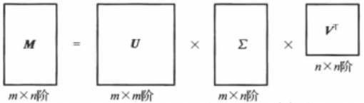

# 一、用户画像概述
【用户画像】用来勾画用户（用户背景、特征、性格标签、行为场景等）和联系用户需求与产品设计的，
旨在通过从海量用户行为数据中炼银挖金，尽可能全面细致的抽出一个【用户的信息全貌】，从而帮助解决如何把数据转为商业价值的问题。

## 1.1、用户画像数据来源

用户画像计算引擎的数据流：
```text
【用户行为日志】 ==> 【画像计算结果】 ==> 【用户属性】和【画像更新】 ==> 【用户画像】
```

以电影网站的用户画像分析为例。

用户画像数据来源中连个最终要的数据就是用户属性以及物品属性，
有了这两个，我们就可以从用户-用户、用户-电影、电影-电影三方面展开相应的相似度计算从而实施相应的推荐与应用。

### 1.1.1 用户属性
【用户属性】用来描述一个用户的个性，从而用于与其他用户加以区分，
为实现精准及个性化的推荐，系统通常对每个用户都有一个用户属性的建模，
其中包括用户的基本信息，如用户的性别、年龄、年收入、兴趣爱好、活跃时间、所在城市等。

如果计算得到用户A和用户B的属性相似度较高，那么系统就会认为用户A和用户B是相似用户，
在推荐引擎中，基于邻居用户群的观影喜好推荐给当前用于一些电影。

同时，用户属性还可以用于推荐结果进行过滤和排序，从而优化推荐结果。

### 1.1.2 物品属性
【物品属性】是用来描述一个物品的特点，比如观影，这个影片就会有相应的属性标签，比如动作片、爱情片、导演、主演、上映地区等。
通过对影片属性进行相应的标签化，为后面的推荐提供数据支撑。

# 二、用户画像建模
用户画像建模就是用户信息的标签化，以便为后面的推荐算法提供更精准的语义信息。它的核心是对用户潜在的意图和兴趣进行表示和存储，根据用户的基础信息、视频信息、访问信息、行为偏好等归纳出可读取，可计算的用户模型。用户画像通常包含定性画像和定量画像两个部分，其中定性画像主要包括用户的基本特征、行为刻画、兴趣模型和视频表征等，定量画像主要包括用户基础变量、兴趣偏好等可量化的数据特征。所谓的定量画像就是通过某种可量化的数据特征进行画像，比如某个东西的购买量，点击量等。

## 2.1 用户定量画像
定量画像建模过程中需要重点考虑的是用户画像的颗粒度，
即用户画像应该细化到何种程度，颗粒度越小，用户画像越细，也就更加有利于提高推荐系统的准确性。

然而，也不是越细越好，一方面提高了用户画像建模成本，同时也会导致用户画像的使用性降低，
如何把握好用户画像的颗粒度可以采取问卷调查的方法了解用户的使用场景、关注内容等。
可以通过表单收集捕捉用户行为。

## 2.2 用户定性画像
标签化是用户定性画像的核心。
标签化之后，
首先，计算机可以自动完成【分类统计】功能，
例如，可以统计喜欢科幻类型电影的用户有多少，还可以进一步统计喜欢观看科幻类型电影的人群中男女比例是多少，
其次，计算机也可以根据这些标签进行【深度挖掘】，
例如，可以利用关联规则计算用户年龄和喜欢电影类型的关系，还可以利用聚类算法分析喜欢科类型电影用户的年龄段分布情况。
将标签信息与用户的视频浏览、点播行为数据相结合就可以进一步预测用户的喜好，这对于搜索引擎、广告投放等应用领域都有显著的意义。

一个产品通常会设计4~6个标签代表所有的用户群体。

互联网常用用户标识方法：

| 用户标识方式   | 特点                        | 局限性                      |
|----------|---------------------------|--------------------------|
| Cookie   | 能够标识匿名、未注册用户              | 通常有一定有效期，不易跨浏览器、设备       |
| 注册ID     | 网站的用户标识                   | 用户注册意愿低，需要投入大量推广运营成本     |
| Email    | 互联网早期常用的用户标识方式            | 一个用户可能有多个Email，此标识会损失准确性 |
| 微信、微博、QQ | 互联网共识的第三方登录ID，提供OAuth授权机制 | 标识具有准确性和持久性              |
| 手机号      | 移动端最精确的标识                 | 较难获取到，视产品激励用户意愿          |
| 身份证      | 最官方的标识                    | 难获取到，视产品激励用户意愿           |

**用户定性画像结构：**
- 用户维度
  - 用户特征：姓名、年龄、职业等
  - 用户行为：视频点播、视频浏览等
  - 用户兴趣偏好：观看时间偏好、观看视频类别偏好等
- 视频维度
  - 视频特征：类别、导演、主题等

## 2.3 基于知识的用户定性画像分析
基于知识的用户定性画像分析其【核心思想】是利用本体对用户画像中的标签进行表示、验证、推理和解释等，
具体来说包括用户和视频的标签以及它们之间的关系进行形式化的表述，从语义层面描述视频、用户及其兴趣特征，
主要以观众和视频的相关知识作为画像建模的核心。

本体侧重对特定工程领域中的知识进行建模，提供专业领域中概念的词汇表以及概念间的关系，
是在语义层次上对信息进行的形式化描述。主流的本体开发工具是Protege。
本体描述语言OWL DL。

# 三、群体用户画像分析
【群体用户画像分析】是指【用户间的关联分析】。

群体用户画像分析的流程主要包括：
- 1）、用户画像的获取
- 2）、用户画像相似度计算，根据不同的用户画像计算相互间的相似度，是区分用户群体的重要指标，也是展开用户画像聚类的前提条件。
- 3）、用户画像聚类，根据用户画像间的相似度，将相似的用户画像聚为一类。
- 4）、群体用户画像生成，针对不同类别的用户分别建立有代表性的典型用户画像。

通过群体用户画像分析可以获取需求相近的用户群。

## 3.1 定量相似度计算
定量标签有确定的数值，如用户画像中年龄等数据，其相似度计算相对简单。

对与群体用户画像聚类分析中一组定量标签来说，相似度计算为：
```text
sim(Ui, Uj) = SUM{1, k}(W{k} * sim(profile{k}(Ui), profile{k}(Uj)))
```
其中，W{k}表示第k个定量标签的权重，
profile{k}(Ui)标识用户i在第k个定量标签下的值，
sim(profile{k}(Ui), profile{k}(Uj))表示用户画像Ui和用户画像Uj在第k个定量标签的相似度。
SUM{1, k}是从第1个到第k个标签的权重w与相似度求和。

在计算用户画像相似度的过程中，往往会基于多个定量标签的数据来计算相似度。
值得注意的是，不同定量标签数值的取值范围可能存在数量级别的差异，
从而使得相似度计算过程中，某些定量标签对综合相似度贡献微乎其微。
因此，在计算之前，对不同定量标签的数据进行归一化处理就尤为重要。

### 3.1.1 归一化方式
归一化是物理系统中一种无量纲处理手段。在这里，归一化是将不同取值范围的定量标签数据统一映射到【0，1】区间。
常用的归一化方法有线性函数转换、对数函数转换、反正切函数转换等。

线性函数转换（最小-最大值转换）：
```text
Y = abs((X - X最小值) / (X最大值 - X最小值))
```
其中，X、Y分别标识转换前、后的值。

对数函数转换为：
```text
Y = log10(X)
```

反正切函数转换为：
```text
Y = atan(X)^2 / pi
```

### 3.1.2 计算相似度方法
具体的某个定量标签相似度数值计算应根据具体的用户画像采用不同的计算方式，可以采用欧式距离、余弦相似度、Jaccard系数等。
对于标量标签，通常采用欧氏距离、曼哈顿距离和余弦相似度。

欧式距离，欧几里得距离，是一个通常采用的距离定义，是多维空间中两点的真实距离，其计算公式为：
```text
sim(Ui, Uj) = sqrt(SUM{1, k}((profile{k}(Ui) - profile{k}(Uj))^2))
```

曼哈顿距离，城市街区距离，是两个点在标准坐标系上的绝对轴距的总和，其计算公式为：
```text
sim(Ui, Uj) = SUM{1, k}(abs(profile{k}(Ui) - profile{k}(Uj))))
```

余弦相似度将用户评分看作一个向量，用向量的余弦夹角度量用户间的相似性，其计算公式为：
```text
sim(Ui, Uj) = SUM{1, k}(
    (profile{k}(Ui) / sqrt(SUM{1, k}(profile{k}(Ui)^2))) 
        * 
    (profile{k}(Uj) / sqrt(SUM{1, k}(profile{k}(Uj)^2)))
)
```
然而上述余弦相似性度量方法没有包含用户画像各个标签数值的统计特征。
修正的余弦相似度通过减去群体用户画像各个标签数值的平均值来改善上述缺陷。
```text
sim(Ui, Uj) = SUM{1, k}(
((profile{k}(Ui) - mean_profile(Ui)) / sqrt(SUM{1, k}((profile{k}(Ui) - mean_profile(Ui))^2)))
 * 
((profile{k}(Uj) - mean_profile(Uj)) / sqrt(SUM{1, k}((profile{k}(Uj) - mean_profile(Uj))^2)))
)
```

对于二元变量，即取值只为0和1两种，如果采用以上方法则不能很好地标识其相似度，
因此一种常用的方法是计算Jaccard系数，Jaccard系数计算公式为：
```text
sim(Ui, Uj) = abs(profile(Ui)与profile(Uj)交集 / profile(Ui)与profile(Uj)并集)
```

## 3.2 定性相似度计算
定性标签通过概念表示。由于定性标签没有确定的数值，其相似度计算不能采取像定量标签那样直接的计算方法。

定性相似度的计算可以从两个方向展开，
一个方向是将定性标签映射为定量标签，进而采用定量标签的相似度计算方法；
另一个方向是直接采用基于概念的相似度计算方法。

# 四、用户画像更新触发条件
用户画像的更新触发条件通常采用以下三种方式：
- 第一种方式：通过设置一个阈值，当获取的实时画像数据量超过这一阈值时，根据存储的画像数据构建用户画像；
- 第二种方式：设置一个时间周期，每隔该周期时间根据存储的画像数据构建用户画像；
- 第三种方式：首先从增加的数据中挖掘用户画像，然后将其与原先得到的用户画像进行比较，根据比较的结果来决定是否更新。

不同的方式有不同的适应场景，第一种方式适合数据敏感型的用户画像，第二种方式适合时效性要求较高的适应场景，第三种凡是适合相对稳定的用户画像。

更新机制：
用户数据总是处在不断更新的状态，当用户画像数据库发生变化后，如何对已经得到的用户画像进行更新维护是需要解决的重要问题。

一个直接的办法是完全更新，即读取所有历史用户数据重新生成用户画像。
其显而易见的缺点就是计算量大、耗费时间长。

而增量更新是指在进行更新操作时，只更新需要改变的地方，不需要更新或者已经更新过的地方则不会重复更新。
相对于完全更新，增量更新的优势是计算量较少，因此，赠礼更新被广泛应用。
比较常见的增量式更新算法是滑动窗口过滤算法，该算法强调滑动时间窗口的概念，
当数据库更新时，只需要移动时间窗口，删除旧有的候选集，再加上新增的候选项目集即可。

增量更新实现的前提条件是对历史用户数据进行计算并存储中间值，基于该存储的中间值和新增数据计算得到新的用户画像。
其中，存储的中间值应该涉及不同的粒度。因此，中间值具有较大的冗余，且需要较长时间的存储中间结果，耗费空间。
但正是由于这种冗余，使得增量更新时能够在不同粒度进行灵活计算。
例如，在一个推荐系统中，在不同时间粒度内，基于用户的观影行为日志，以演员为单位采用计数方式进行更新计算视频的观看次数。
采用不同粒度时间范围，可以灵活地响应用户的查询需求，方便进行快速计算。

# 五、推荐概述
常见的推荐算法，根据使用数据源的不同，可将其大致分为三类：分别是协同过滤的推荐方法、基于内容的推荐方法、基于知识的推荐方法，
以及这三类算法进行不同程度融合之后出现的混合推荐算法。

## 5.1 主流推荐方法的分类
### 5.1.1 协同过滤的推荐方法
考虑这样一个问题，当你想看调用却不知道看什么调用时你会怎么做？

大部分人会询问身边的朋友有什么值得推荐的电影，在选择时往往更倾向于与自己观看爱好相似的朋友所推荐的。
“跟你爱好相似的用户喜欢的东西你可能也会喜欢”，这就是协同过滤的基本思想，利用群体智慧以“协作”的方式进行推荐。
这种协作可以是基于用户之间的协作，首先系统要圈定与目标用户有相似偏好的用户群，然后将他们评价较高的视频推荐给该用户；
也可以是基于视频之间的协作，首先系统要建立并维护一个视频之间的相似度矩阵，然后圈定那些与该用户评过高分的视频相似的视频，再将这些视频推荐给他。

基于用户和基于视频的推荐算法都属于协同过滤推荐方法中的第一类，即基于记忆的推荐方法。
第二类算法是基于模型的推荐算法，是使用了机器学习中的模型与算法来辅助推荐的方法。

协同过滤的推荐方法，共享朋友的经验，有效地使用其他用户的反馈信息，能够提高推荐的准确度。
在基于用户的推荐中，根据爱好相似的用户喜欢的视频为用户进行推荐，可以发现用户潜在的兴趣，增加推荐的多样性。

协同过滤的推荐方法存在以下的局限性：
- 1）由于新用户没有朋友、观看的视频等有用信息，新视频没有被用户观看的信息，因此系统无法对新视频、新用户做出推荐，这被称为用户和物品的冷启动问题。
- 2）因为不对视频内容做分析，所以无法依据深层特征和属性来推荐比较复杂的视频，使得用户对推荐结果的可信度产生质疑。
- 3）受到用户打分稀疏性问题的约束。
- 4）随着用户和视频数量的增大、系统计算量的增大，受到算法可扩展性问题的约束。

### 5.1.2 基于内容的推荐方法
基于【内容（Content-based，CB）】的推荐方法起源于信息检索和信息过滤领域，它根据用户的历史信息，为用户推荐与他过去喜欢的视频相似的其他视频。
例如，一个用户喜欢观看“贞子”、“咒怨”、“鬼伎回忆录”等日本恐怖片，那么基于内容的推荐引擎就会根据“日本”、“恐怖片”等一些列关键词为用户推荐相似的影片，如“午夜凶铃”。
如果用户喜欢“速度与激情”，系统就会推荐“速度与激情2”等这一系列的其他电影或者类似的赛车题材、热血的欧美电影。

基于内容的推荐方法体现了一种很直接的推荐思路，它是从视频内容是否与用户偏好匹配的角度来向用户做出推荐的。
这就需要推荐系统首先通过分析用户的历史行为数据来建立【用户画像（User Profile）】，以之代表用户的行为偏好；
同时需要分析提取所有视频的内容特征来建立视频的【物品画像（Item Profile）】，以之代表视频的特征属性。
在得到了用户画像和物品画像的前提下，通过相似度比较来做出推荐。

基于信息检索的启发式算法和基于机器学习的自适应算法是基于内容的两大类推荐算法。
前者是将信息检索领域中的TF-IDF算法应用到推荐中，后者是使用了机器学习中的模型与算法来建立用户画像。
目前，一般视频网站采用结合视频内容和用户标签的方法进行内容过滤。

基于内容的推荐方法根据目标用户画像和物品画像的匹配程度进行推荐，不需要其他用户的数据，所以不存在视频的冷启动问题，
并能为拥有特殊兴趣爱好的用户做推荐。
基于内容的推荐在推荐视频时能够列出推荐视频的特征作为推荐理由，更容易为用户所接受。

基于内容的推荐算法存在以下的局限性：
- 1）容易受到信息获取技术的约束，难以提取视频的内容特征，而使用标签对视频进行标注的方法工作量巨大而效用低。
- 2）需要有足够的数据用来构建决策分类器，用户画像的建立需要大量的用户浏览记录。
- 3）难以为用户发现新的兴趣信息，只能推荐与用户已有兴趣相似的视频。

基于内容的推荐方法和协同过滤方法中基于视频之间的协作的最大区别是，它不需要任何用户数据，
而基于视频之间的协作它需要维护一个视频之间相似度矩阵，然后将和该用户评过高分相似的视频推荐给该用户，它的主要数据对象是用户和视频，
而基于内容的推荐方法的数据对象就只是某一个用户的历史视频。

### 5.1.3 基于知识的推荐方法
协同过滤和基于内容的推荐方法实际上是在分析系统已知数据的基础上去推测用户的选择行为，是一个比较有把握的“猜”的过程。

而基于知识（Knowledge-based，KB）的推荐方法首先是“问”的过程，通过交互、会话等方式直接了解到用户需求，然后进行视频匹配，即“找”的过程。
基于知识的推荐方法可应用于前两类推荐方法所不擅长得推荐场景，但前提是需要对“知识”进行形式化的定义和表示。

这类推荐方法包括基于约束（Constraint-based）的推荐算法和基于实例（Case-based）的推荐算法，
前者侧重于使用用户需求的形式化条件进行搜索，后者侧重于在已有实例的基础上进行匹配和调试。

基于知识的视频推荐引擎通过与用户的交互获取信息做推荐，能够很好地给出视频的推荐理由；系统不依赖于用户偏好信息，因此不存在用户的冷启动问题；
基于知识的推荐系统能够与用户交互从而及时响应用户需求，用户偏好发生改变时不需要任何训练。

基于知识的推荐算法存在以下的局限性：
- 1）知识的获取比较困难。
- 2）用户必须说明他的需求，系统才能做出推荐，在这个过程中若找不到合适的推荐视频，用户需要修改其需求。

### 5.1.4 混合推荐方法
常见的混合推荐方法及其描述：
- 并行式混合（Paralleled Hybridization）
  - 加权式（Weighted）：推荐系统对多种推荐算法的计算结果进行加权平均处理，产生出单一的推荐结果。
  - 切换式（Switching）：推荐系统在不同的推荐算法中进行切换以适应当前的推荐情境。
  - 混杂式（Mixed）：推荐系统同时呈现出其上多种推荐算法的推荐结果。
- 整体式混合（Monolithic Hybridization）
  - 特征组合（Feature Combination）：推荐系统从多种推荐数据源中获取特征，将这些特征组合起来放入单一的推荐算法中。
  - 特征补充（Feature Augmentation）：推荐系统将一种推荐算法输出的特征信息作为另一种推荐算法的输入特征信息。
- 流水线式混合（Pipelined Hybridization）
  - 层叠式（Cascade）：推荐系统中的一种推荐算法对另一种推荐算法的推荐结果进行提炼。
  - 级联式（Meta-level）：推荐系统将一种推荐算法学习到的模型作为另一种推荐算法的输入。

## 5.2 推荐系统的评测方法
如果说，推荐方法的推陈出新式为了构建高质量的推荐系统，那么评测方法就是量化系统推荐质量的有效手段。

评测方法能够帮助系统设计者在各种推荐方法的设计和使用中做出权衡和取舍，
使推荐系统经受多种层次的考验，直至能够运行于真实环境之中。

推荐系统的评测方法包括三种基本的评测过程和一些量化/非量化的评测指标。

评测过程是指推荐系统在投入运营前所经历的不同形式的评测经历。
一般可把评测过程按照成本的由低到高及阶段的先后顺序分为离线（Offline）评测、用户调查（User Study）和在线（Online）评测。

评测指标是指从不同角度来衡量系统推荐质量得参考标准。
常见得推荐系统评测指标有：单击率和转化率（CTR & Conversion Rate）、用户满意度（Guest Satisfaction Index）、
预测准确度（Prediction Accuracy）、覆盖率（Coverage）、多样性和新颖性（Diversity & Novelty）、
适应性和扩展性（Adaptivity & Scalability）等。它们之中有的可以进行定量分析，有的则只能进行定性分析。

单击率和转化率是在线评测得重要指标。

用户满意度是评测推荐系统得最重要指标，在用户调查时通过调查问卷得形式或在线评测满意度时通过用户行为统计得到。

预测准确度是最只管评价系统预测评分和用户真实评分差距得指标。
如果推荐引擎采用类似视频评分机制，则一般计算平均绝对误差（MAE）和均方根误差；
如果topN推荐，那么主要评价指标为召回率和准确率。

覆盖率评价得是推荐得广度，即所有物品是否都有被推荐得机会。

多样性和新颖性是推荐系统离线测评常用得指标，
评价系统能否给一个用户推荐多元物品来满足其广泛得兴趣爱好，以及系统向用户推荐非热门非流行物品的能力。

# 六、协同过滤推荐方法
## 6.1 概述
协同过滤推荐方法的分类其实并没有严格的定论，
维基百科上的分类为：以记忆为基础（Memory-based）的协同过滤和以模型为基础（Model-based）的协同过滤。
其中基于记忆的协同过滤又可细分为基于用户（User-based）协同过滤和基于物品（Item-based）协同过滤。

协同过滤推荐方法分类：
- 基于记忆的协同过滤（Memory-based CF）
  - 基于用户（User-based）
  - 基于物品（Item-based）
- 基于模型的协同过滤（Model-based CF）
  - 以隐因子模型、朴素贝叶斯分类为代表

下面，我们简单阐述一些协同过滤相关的概念差别。

### 6.1.1 User-based CF VS Item-based CF

【基于用户的协同过滤】根据所有用户对物品的偏好，发现与当前用户口味和偏好相似的“邻居”用户群，
然后基于“邻居”的历史偏好信息，为当前用户进行推荐。

【基于物品的协同过滤】需要发现物品和物品之间的相似度，然后根据用户的历史偏好信息，将类似的物品推荐给用户。
例如，亚马逊购买图书A后还会根据所有用户的购买历史为客户推荐相似的图书 B。

### 6.1.2 基于物品的协同过滤推荐 VS 基于内容的推荐
【协同过滤】是基于用户和用户的关联，
简单说就是看和某一用户有相似喜好的其他用户的喜好，从而预测该用户对物品的可能喜好，与具体物品本身的特征没有关系，
基于的假设是相似的用户会喜欢相似的物品，或者同一个物品下相似的用户给出的评分也相似。

【基于内容的推荐】就是根据物品与物品的关联，预测用户喜好，与具体的用户不再有关系，
只关注物品本身的特征，根据物品获得与之特征相似的项目。

从用途上来说，【协同过滤】更适合“给用户带点新鲜的东西”的使用场景，而【基于内容推荐】可以弥补协同过滤面对新产品加入的无奈。

举个小例子，我们已知道用户u1喜欢的电影是A、B、C，用户u2喜欢的电影是 A、C、E、F，用户u3喜欢的电影是B和D，
我们需要解决的问题是：决定对u1是不是应该推荐F这部电影。
【基于内容的推荐做法】：
要分析F的特征和所喜欢的 A、B、C 的特征，需要知道的信息是A(战争片)、B(战争片)、C(剧情片)，
如果F(战争片)，那么F很大程度上可以推荐给u。
而【协同过滤的推荐方法】就不再需要知道 A、B、C、F哪些是战争片，哪些是剧情片，
我们只需要知道用户u1和u2他们的相似度比较高，那么我们可以把u2所喜欢的F推荐给u1。

### 6.1.3 Memory-based CF VS Model-based CF
【基于记忆的协同过滤方法】中，原始评分数据保存在内存中，直接生成推荐结果，
缺点是资料稀疏，难以处理大数据量下的即时结果，因此逐渐发展出以模型为基础的协同过滤技术。

而【基于模型的方法】会首先离线处理原始数据，先用历史资料得到一个模型再用此模型进行预测，运行时只需预计算或学习就能预测。

从机制上可以看出两种方法的差别，打个或许不太恰当但好理解的比方，
【基于记忆的方法】就好像我们以用户ID或者物品ID为输入，实时查询数据库并计算推荐结果返回。
这种方法可解释性强，但数据库一大，查询和计算都非常慢;
而【基于模型的方法】就好像事先对离线的数据训练出一个非常复杂的模型，通过接收符合模型的输入参数才能得到预测的推荐结果，
该种方法可解释性不强，但在离线模型的计算和训练方面，可以支持大规模的数据。

实际上，在协同过滤中，无论是基于记忆还是基于模型的方法，处理对象均离不开用户与物品两个对象产生的排列组合关系，
包括【用户-用户】、【用户-物品】、【物品-物品】等我们可以统一归纳为【关系矩阵】的数学表示。
有了关系矩阵后，就可以进行向量的复杂【相似度计算】，进一步为基于记忆的协同过滤和矩阵分解等基于模型的协同过滤提供计算基础。

## 6.2 关系矩阵和矩阵计算
在一个可以应用推荐系统的网络生态环境中，用户和物品都不再是孤立的个体，而更应该被视为构成某些关系的要素。
用户与用户、物品与物品、用户与物品之间都可以因为某些特征或属性而建立起关系，
而关系的远近程度就可以作为推荐物品时的直接依据，这在协同过滤的推荐方法中尤为重要。

举例来说，假如在现实生活中，Alice与Bob彼此认识且在观影喜好上比较相似，
说明他们在这方面的关系比较近，那么他们就可以相互推荐电影来看。
放眼庞大的网络社会中，就会存在着很多彼此不认识但可能有着相似喜好的用户，
协同过滤就可以首先创建出用户之间的关系并计算关系的远近程度，
然后借助这些【关系数据】构建出潜在的推荐物品列表，最后向用户做出推荐。

在推荐系统中，“关系”是用【关系矩阵】的形式来创建和存储下来的。
以视频推荐为例，上述的三种生态关系就被表示为用户关系矩阵(U-U矩阵)、视频关系矩阵(VV矩阵)和用户-视频关系矩阵(U-V矩阵)。

【相似度计算】是矩阵处理的常用手段，是处理U-U矩阵和V-V矩阵的利器，通过计算来得出“关系的远近程度”。
在本章所介绍的协同过滤的推荐方法中，
基于记忆的协同过滤算法主要是依赖于对U-U矩阵或V-V矩阵的分析处理，
通过相似度计算得到用户相似度或视频相似度，并在此基础上形成推荐结果。

此外，除了【相似度计算】外，【矩阵分解】等技术也可以用来专门用于处理高维U-V矩阵，进行关联分析。
例如，基于模型的协同过滤算法依赖于对U-V矩阵的隐因子分析，核心计算就是矩阵分解。

### 6.2.1 U-U矩阵
构造 U-U 的数据库字段：

| 序号 | 名列             | 含义                  | 数据类型         | 约束说明  |
|----|----------------|---------------------|--------------|-------|
| 1  | user_id        | 用户编号                | VARCHAR(32)  | 非空，索引 |
| 2  | sim_user       | 相似用户ID列表，ID之间用“$”分隔 | VARCHAR(512) | 非空    |
| 3  | sim_user_value | 相似度列表，值之问利用“$”分隔    | VARCHAR(512) | 非空    |

计算用户相似度的常用方法有 Pearson 相关系数、余弦相似度，以及修正的余弦相似度、Spearman 秩相关系数和均方差等，
据有关研究表明，Pearson 相关系数(Pearson Correlation Coefficient)在基于用户的相似度计算方面的表现要优于其他计算方法，
因此本节将主要对采用相关系数计算相似度的方法做详细介绍。

基于 Pearson 的用户相似度计算如下所述。

#### Pearson相关系数 算法原理

在基于【用户相似度】的协同过滤中，需要通过计算用户相似度来找到与目标用户行为具有相似性的用户集，
然后依据预先规定的相似用户数K，按照相似度大小，选择前K个用户作为目标用户的相似用户集。
因此在这个过程中，用户相似度的计算是基本前提。

Pearson相关系数主要用于度量两个变量i和j之间的相关性，
取值范围是从 +1.0(强正相关)到 -1.0(强负相关)，
其中0.8~1.0表示极强相关，0.6~0.8表示强相关，
0.4~0.6 表示中等程度相关，0.2~0.4表示弱相关，
0.0~0.2表示极弱相关或无相关。

在视频推荐系统中，引用Pearson相关系数度量方法来计算用户间相似度，
也就是将两用户共同评价过的视频作为度量两用户相似度的依据。

Pearson相关系数在视频推荐系统中的计算公式为
```text
r = ∑(Xi-x)(Yi-y) / (∑(Xi-x)^2 * ∑(Yi-y)^2)
```
其中，i为用户评价过的视频，i属于用户X、用户Y共同评价过的视频的集合I，
Xi与Yi分别为用户X对i视频的评价分值、用户Y对i视频的评价分值，
x、y分别为用户X、用户Y共同评价过的视频评分的平均评价值。

#### Pearson相关系数 算法流程
协同过滤中用户相似度计算流程：
- 访问用户最近的行为数据
- 提取用户-视频二维矩阵
- 分别计算用户X和用户Y对视频的平均评价值
- 寻找用户X和用户Y共同评价过的视频的集合
- 根据公式计算得到用户X和用户Y的相似度

```text
算法输入：用户行为日志
算法输出：基于协同的用户相似度矩阵
```
具体的算法流程：
- 1）从“用户行为日志”中获取用户与视频之间关系的数据，即用户对视频的评分数据：user_id、video_id、preference。
- 2）对于n个用户，依次计算用户A与其他n-1个用户的相似度；紧接着计算用户B与其他n-2个用户的相似度。
  对于其中任意两个用户X和Y而言：
  - 2.1）查找两个用户共同评价过的视频集合Ixy；
  - 2.2）分别计算用户X和Y对视频的平均评价值x、y；
  - 2.3）按照公式计算用户之间的相似度，得到用户x和y的相似度。
- 3）将计算得到的相似度结果存储在数据库中。

虽然Pearson相关系数在计算用户相似度的表现上很突出，
但单纯依靠Pearson相关系数并不能应对不同用户可能对某件广受欢迎的物品都给予高评分的情况，
同时它在遇到用户只对非常少的共同物品评分时会出现预测不准的情况。

### 6.2.2 V-V矩阵
在视频推荐系统的数据库中，V-V矩阵可由如下数据库字段来构建，其中sim_video_value的值由视频相似度计算得到。

基于视频协同的视频相似度矩阵：

| 序号 | 名列              | 含义                  | 数据类型         | 约束说明  |
|----|-----------------|---------------------|--------------|-------|
| 1  | video_id        | 视频编号                | INT          | 非空，索引 |
| 2  | sim_video       | 相似用户ID列表，ID之间用“$”分隔 | VARCHAR(512) | 非空    |
| 3  | sim_video_value | 相似度列表，值之问利用“$”分隔    | VARCHAR(512) | 非空    |

在基于物品的相似度计算中，余弦相似度因为其精确度较好而广泛认同，成为通常状况下的标准度量方法。

#### 余弦相似度 算法原理
在基于项目的协同过滤中，需要通过计算视频相似度来找到与目标用户所喜欢的视频具有相似性的视频集，
然后依据预先规定的相似用户数k，按照视频相似度大小，选择前k个视频作为目标用户所喜欢的视频的相似视频集。
因此在这个过程中，视频相似度的计算是非常重要的前提。

在视频推荐系统中，视频相似度是通过计算余弦相似度得到的，即通过计算两个视频的n维向量(n>0)间的夹角的余弦测算视频相似度。
余弦相似度(绝对值)的取值范围为[0，1]，夹角的大小与余弦相似度值成反比，两个向量间的夹角越小，余弦相似度的值越大。

以计算两部电影的相似度为例，若求得的余弦值接近1，则说明这两部视频非常相似;
若余弦值接近0，则说明两部视频非常不同。

余弦相似度的计算公式为
```text
sim(X, Y)= cos(X, Y) = (X * Y) / (||X|| * ||Y||)

式中，X和Y为两个用来分别表示视频的向量，
||X||、||Y||分别为向量X和Y的模。
```

在实际的视频推荐系统中，不同用户的评分标准不尽相同。
例如，在给定了评分区间为1星到5星的情况下，对用户Alice来说评分在3星以上的就是自己喜欢的视频，
而对于用户Bob来说，评分4星以上才是自己喜欢的。
余弦相似度因为没有考虑到用户评分标准的差异问题，所以在直接计算不同用户的余弦相似度时会导致最终的预测发生很大的偏差。

修正的余弦相似性度量方法通过减去用户对物品的平均评分，有效地改善了以上问题。

修正的余弦相似度计算公式为
```text
sim(X, Y) = ∑((Xi - x) * (Yi - y)) / sqrt(∑(Xi - x)^2) * sqrt(∑(Yi - y)^2)

其中，Xi、Yi分别表示用户X和Y对视频i得评价值，
x、y分别为用户X和Y对视频得平均评价值。
```

#### 余弦相似度 算法流程
协同过滤中得视频相似度计算流程：
- 访问用户最近得行为数据
- 提取用户-视频二维矩阵
- 寻找历史上对视频i和j共同评价过得用户得集合
- 分别计算用户对视频i和j的平均评价值
- 根据公式计算得到用户i和j的相似度

```text
算法输入：用户行为日志
算法输出：基于协同的视频相似度矩阵
```
具体算法流程：
- 1）从用户行为日志中获取用户与视频之间关系的数据，即用户对视频的评分数据：user_id、video_id、preference。
- 2）对于n个视频，依次计算视频1与其他n-1个视频的相似度；紧接着计算视频2与其他n-2个视频的相似度。
  对于其中任意两个视频i和j而言：
  - 2.1）查找对视频i和j共同评价过的用户的集合Uij；
  - 2.2）分别计算用户对视频i和j的平均评价值x和y；
  - 2.3）按照公式计算视频之间的相似度，得到视频i和j的相似度；
- 3）将计算得到的相似度结果存储在数据库中。

### 6.2.3 U-V矩阵
在视频推荐系统中，U-V矩阵表示了用户与视频之间的关系，
这种关系可以是基于用户对视频的评分，也可以是基于用户观看视频的频度，
还可以是基于用户是否观看过视频的行为(用 0/1 来表示未观看过/观看过)。
其中，最常见的 U-V矩阵是用户对视频的评分矩阵，如下表。

用户-视频评分矩阵：

|    | V1 | V2 | V3 | V4 | V5 |
|----|----|----|----|----|----|
| U1 | ?  | 3  |    | 1  | 2  |
| U2 | 4  |    | 4  | 3  | 3  |
| U3 | 4  | 4  | 5  |    | 3  |
| U4 | 3  | 3  |    | 1  |    |

该表以【1，5】为评分区间，“?”表示待预测的评分项，表中空白的部分表明用户尚未对视频做出评分。

在真实的推荐系统中，
一方面，U-V矩阵的行列数会随着用户和视频数量变得庞大；
另一方面，因为用户实际上只能对有限数量的视频做出评价，所以U-V矩阵的内部会非常稀疏。
系统在直接处理这些庞大的高维U-V矩阵时，所消耗的时间、存储和计算资源都是非常巨大的，
因此就需要一种能降低这种计算复杂度的方法。

【矩阵分解技术】是一种有效降低矩阵计算复杂度的方法，它的实质是将高维矩阵进行有效降维。
这类技术的代表是奇异值分解(SVD)和主成分分析(PCA)，它们在基于模型的协同推荐算法中起着非常重要的作用，
经常被用于离线数据的预处理。

#### SVD
【奇异值分解】是由Golub和Kahan在1965年首次提出来的一种【正交矩阵分解法】，
该方法在数据压缩方面有很好的表现，在信号处理、统计学等领域得到了广泛的应用。

随后 SVD 技术被 Deerwester 等人用于发现文档中的潜在语义因子，SVD 技术成为了潜在语义分析的主要方法。

后来，SVD技术很快被引入推荐系统的研究领域中。

SVD的基本原理是将给定的 矩阵M 分解成 3个矩阵 的 乘积形式，即
```text
M = U * ∑ * Vt
```
式中，分解出的矩阵U和矩阵V被分别称为左、右奇异矩阵，其本质是西矩阵，
即与它们各自的共轭转置矩阵相乘后会得到单位矩阵；
矩阵Σ为对角矩阵，其对角线上的值即为 矩阵M的奇异值。
如果矩阵M是mxn阶矩阵，则矩阵U是mxm阶矩阵，矩阵∑是mxn阶矩阵，矩阵V是nxn阶矩阵，如下图所示。



SVD 是提取矩阵特性的好方法，矩阵∑ 中的奇异值σ是从大到小排列的，代表着矩阵M的重要特征。
在很多情况下，因为σ在矩阵工中减小得很快，矩阵∑ 中前10%的奇异值之和就占了全部奇异值之和的99%，
所以在数学计算中可以用前n个奇异值来近似表示矩阵。

将 SVD 技术应用在推荐系统时，它的意义是将一个【稀疏的评分矩阵】分解为一个表示【用户特性的矩阵U】和一个表示【物品特性的矩阵V】，
以及一个表示【用户和物品相关性的矩阵Σ】。

在视频推荐系统中，可以用矩阵U表示用户与隐因子的关系特性，用矩阵V表示视频与隐因子的关系特性。

#### PCA
PCA 也称为主分量分析，是一种多元分析中最常见的降维和赋权方法，
最旱可追溯到K.Pearson于1901年开创的非随机变量的多元转化分析。
1933年，H.A.Hotelling将其推广到随机变量。

PCA 最重要的应用是对原有数据降维，简化数据，
这种方法可以有效地找到数据中的主成分，去除噪音和冗余，
将原有复杂数据降维简化进行分析，从而揭示隐藏在复杂数据背后的简单语义。

严格意义上，PCA 回答的问题是：如何寻找到一组【正交基】，它们是标准正交基的线性组合并且能够很好地表示数据集？
该方法主要是在假设线性的基础上，通过对【协方差矩阵】进行特征分解的，以得出数据的主成分(即特征向量)与它们的权值(即特征值)。
它的优点很明显--简单，而且无参数限制，可以方便地应用于众多场合，
从实验科学到社会化推荐系统都有它的用武之地，被誉为应用线性代数最有价值的结果之一。

在视频推荐中，处理用户和视频的特征表示时，可用主成分分析处理用户和视频的相关数据。
对有拥有较多属性的视频，每个视频的信息用向量m[i1，…，in]表示，
为方便分析和处理数据，我们对向量降维，将mxn的视频矩阵转化为 mxk 的新矩阵。

首先，分别求mxn矩阵每列的平均值，然后对于每一列所有的元素，都减去对应的均值。
PCA 通过对【协方差矩阵】进行【特征分解】得出数据的主成分与它们的权值，将mXn的视频矩阵投影到选取的特征向量上。

接着，求出特征协方差矩阵，以及协方差的特征值和特征向量，
将特征值按照从大到小的顺序排序，选择其中最大的K个，然后将其对应的K个特征向量分别作为列向量组成特征向量矩阵。

假设样例数为m，特征数为n，
减去均值后的样本矩阵为DataAdjust(mXn)，
协方差矩阵是nXn，
选取的K个特征向量组成的矩阵为EigenVector(nXk)，
那么投影后的数据FinalData为
```text
FinalData(mXk)= DataAdjust(mXn)XEigenVector(nXk)
```
这样，就将原始样例的n维特征变成了k维，这k维就是原始特征在k维上的投影，
也就是实现了 mxn 阶的视频矩阵转化为 mxk 阶的新矩阵这一矩阵降维。

## 6.3 基于记忆的协同过滤算法
基于记忆的协同过滤算法（Memory-based CF）直接使用整个已知的（所谓“记忆”）评分矩阵去预测用户对未知物品的评分或者推荐，
又可以分为基于用户的协同过滤算法和基于物品的协同过滤算法。

在视频推荐中，通常用户为视频的评分是稀疏的。
基于记忆的协同过滤算法收集 用户-视频(User-Video) 的评分数据来构建用户和物品的关系矩阵，
为目标用户估计某一特定物品的评分或产生一个推荐列表。

K最近邻居算法(kNearestNeighbors，KNN)是最经典也最重要的基于记忆的协同过滤算法，
它的推荐过程主要经历两个步骤：
首先计算每一对用户之间的相似度，对某一个用户来说，将相似度较高的作为邻居；
然后根据所有邻居(有的算法取所有其他用户)的相似度在某一个物品上做加权和，获得预测用户对该物品的分值。
它最基本的优势在于实现简单，推荐精度较高；
它主要的劣势是对数据稀疏敏感，可扩展性不强，如果系统的目标不是进行预测评分而是进行 top-N推荐的话，
最后还需要对所有物品的分值进行排序，取最高的N个作为推荐对象。

### 6.3.1 基于用户的协同过滤算法
【基于用户的协同过滤】以用户为研究对象，通过分析用户所喜好的视频来计算用户之间的相似度，找到相似度最大的其他相似用户，
然后根据其他相似用户的喜好为目标用户推荐他可能感兴趣的视频，更注重社会化。

一般而言，相似度高的用户A和用户B对一些视频的评价是具有共性的，即用户A所喜欢的视频，用户B也喜欢。

例如，用户A喜欢观看“十面埋伏”、“一代宗师”，用户B喜欢观看“十面埋伏”，那么用户A和用户B的兴趣有很大的相似度：
用户B没有看过“一代宗师”，那么我们就可以为用户B推荐“一代宗师”。

假设用户为U(i=1,2,…,n)，视频M(j=1,2,…,m)，U对M的评分为r[i,j]。

User-based CF 主要分为两步：
```text
(1)收集用户和视频的历史信息，计算用户u和其他用户的相似度Sim(u,Ni)，找到与目标用户Ui相似度高的用户集合N(u)；
(2)根据所有Ni ∈ N(u)对视频的评分情况，选出N(u)中的用户喜欢的且目标用户没有观看过的视频推荐给目标用户。

基于用户的协同过滤子引擎，通过下面的公式来计算出用户对视频的喜好程度：
    P(u, j) = (∑ Sim(u, Ni) * r[i, j]) / ∑ Sim(u, Ni)

式中，Sim(u, Ni)是用户相似度，∑的求和变量是Ni，
P(u, j)表示用户u对视频j的喜好程度，r[i, j]表示用户Ni对视频j的评价，Sim(u, Ni)表示用户u和用户Ni的相似度。
最后根据P(u, j)来对候选的视频进行排序，为用户推荐分值高的 Top-N 个视频。
```


**User-based CF视频推荐算法的流程：**
```text
算法输入：用户行为日志，基于协同的用户相似矩阵。
算法输出：初始推荐结果。

1、访问用户行为日志，获取近期变化的用户ID集合U。
2、针对集合U中的每个用户u（可以并行处理）：
    2.1、访问用户相似矩阵，获取与用户u相似的用户集合N(u)。
    2.2、对于N(u)中的每个用户u：
        2.2.1、获取与用户u有关联的视频集合M(u)。
        2.2.2、针对视频集合M(u)中的每个视频，计算用户偏好值。
    2.3、对M(u)中的所有视频进行按照用户偏好进行加权、去重、排序。
    2.4、取Top-N个视频，为每个视频赋予解释。
    2.5、保存Top-N个视频到初始推荐结果中。
```

**算法举例：**

用户-视频评分矩阵：

|    | V1 | V2 | V3 | V4 | V5 |
|----|----|----|----|----|----|
| U1 | ?  | 3  |    | 1  | 2  |
| U2 | 4  |    | 4  | 3  | 3  |
| U3 | 4  | 4  | 5  |    | 3  |
| U4 | 3  | 3  |    | 1  |    |

```text
以上面U-V评分矩阵说明该方法计算P(1, 1)即用户U1对视频V1的喜好程度。
首先，采用余弦相似度方法计算用户之间的相似度，可得：
    U1 = [1, 2]
    U2 = [3, 3]
    Sim(U1, U2) = (1 * 3 + 2 * 3) / (sqrt(1^2 + 2^2) * sqrt(3^2 + 3^2)) = 0.949
同理可得
    Sim(U1, U3) = 0.998，Sim(U1, U4) = 1
进而计算
    P(1, 1) = (Sim(U1, U2) * r[2, 1] + Sim(U1, U3) * r[3, 1] + Sim(U1, U4) * r[4, 1])
                / 
              (Sim(U1, U2) + Sim(U1, U3) + Sim(U1, U4))
            = (0.949 * 4 + 0.998 * 4 + 1 * 3) / (0.949 + 0.998 + 1)
            = 3.7
以此方法计算可得，用户1对视频1的可能评分为3.7。
进一步，计算用户1对视频3的可能评分为
    P(1, 3) = (Sim(U1, U2) * r[2, 3] + Sim(U1, U3) * r[3, 3])
                / 
              (Sim(U1, U2) + Sim(U1, U3))
            = (0.949 * 4 + 0.998 * 5) / (0.949 + 0.998)
            = 4.5
当我们以此表格作为依据，为用户1推荐视频时，由于视频3的预测评分比视频1高，首先会推荐视频3，其次推荐视频1。
```

### 6.3.2 基于物品的协同过滤算法
在视频推荐中，Item-based CF通过分析用户的视频观看和打分行为来计算【视频之间的相似度】，进而为用户推荐那些与他们之前喜欢的视频相似的视频。
一般而言，视频A和视频B具有很大的相似度是因为喜欢视频A的用户大都也喜欢视频B。
Item-based CF可以利用用户的历史行为给推荐结果提供合理的推荐解释。

例如，最近很多用户同时看过电影“泰囧”和“私人定制”，可以认为这两部电影具有较强的相关或者相似性，这两部电影都属于喜剧；
如果某个用户看过“泰囧”，但是没看过“私人定制”，则系统可以为该用户推荐“私人定制”；
为用户推荐“私人定制”的解释可以是因为用户之前看过“泰囧”。

假设用户为U(i=1,2,…,n)，视频M(j=1,2,…,m)，U(i)对M(j)的评分为r(i, j)。
以物品I为例，基于物品的协同过滤算法可分为两个步骤：
```text
(1)对于目标用户U(i)及其待评分的视频M(j)，根据用户对视频的历史偏好数据，
计算视频M(j)与其他已评分视频之间的相似度Sim(j,i)，找到与视频M(j)相似度高的视频集合N(u)。

(2)根据所有视频N(u)的评分情况，选出N(u)中目标用户U(i)可能喜欢的且目标用户没有观看过的项目推荐给目标用户并预测评分。
    P(u, j) = ∑ Sim(j, i) * r(u, i) / ∑ Sim(j, i)
其中，Sim(j,i)是视频之间的相似度，∑的求和变量是j，
P(u, j)表示用户u对视频j的喜好程度，视频i是用户看过的视频，r(u, i)表示用户u对视频i的偏好程度
（对于隐式反馈数据集，如果用户u对视频i有过行为，则r(u, i) = 1）。
然后根据P(u, j)来对候选的视频进行排序，为用户推荐分值高的视频。
```

**Item-based CF视频推荐算法的流程：**
```text
算法输入：用户行为日志，基于协同的视频相似矩阵。
算法输出：初始推荐结果。

1、访问用户行为日志，获取最近浏览过视频的用户集合U。
2、针对集合U中的每个用户u（可以并行处理）：
    2.1、从用户行为日志中，获取与用户u近期观看的视频集合M(u)；
    2.2、访问视频相似矩阵，获取与M(u)相似的视频集合N(u)；
    2.3、针对视频集合N(u)中的每个视频，计算用户偏好值；
    2.4、依据用户偏好值，对N(u)的视频进行排序；
    2.5、取Top-K个视频，为每个视频赋予解释，如“您观看过类似的视频”；
    2.5、保存Top-K个视频到“初始推荐结果”中。
```

**算法举例：**

用户-视频评分矩阵：

|    | V1 | V2 | V3 | V4 | V5 |
|----|----|----|----|----|----|
| U1 | ?  | 3  |    | 1  | 2  |
| U2 | 4  |    | 4  | 3  | 3  |
| U3 | 4  | 4  | 5  |    | 3  |
| U4 | 3  | 3  |    | 1  |    |

```text
以上面U-V评分矩阵说明该方法计算P(1, 1)即用户U1对视频V1的喜好程度。
首先，采用余弦相似度方法计算视频之间的相似度，可得：
    M1 = [4, 3]
    M2 = [4, 3]
    Sim(M1, M2) = (4 * 4 + 3 * 3) / (sqrt(4^2 + 3^2) * sqrt(4^2 + 3^2)) = 1
同理可得
    M1 = [4]
    M3 = [5]
    Sim(M1, M3) = (4 * 5) / (sqrt(4^2) * sqrt(5^2)) = 1（可以不求，因为U1没有看M3，不参与计算P(1, 1)），
    
    M1 = [4, 3]
    M4 = [3, 1]
    Sim(M1, M4) = (4 * 3 + 3 * 1) / (sqrt(4^2 + 3^2) * sqrt(3^2 + 1^2)) = 0.949，
    
    M1 = [4, 4]
    M5 = [3, 3]
    Sim(M1, M5) = (4 * 3 + 4 * 3) / (sqrt(4^2 + 4^2) * sqrt(3^2 + 3^2)) = 1
进而计算
    P(1, 1) = (Sim(M1, M2) * r[1, 2] + Sim(M1, M4) * r[1, 4] + Sim(M1, M5) * r[1, 5])
                / 
              (Sim(M1, M2) + Sim(M1, M4) + Sim(M1, M5))
            = (1 * 3 + 0.949 * 1 + 1 * 2) / (1 + 0.949 + 1)
            = 5.949 / 2.949 = 2.02
以此方法计算可得，用户1对视频1的可能评分为2（与基于用户的协同过滤算法的计算结果是有差异的）。
进一步，计算用户1对视频3的可能评分为
    P(1, 1) = (Sim(M3, M2) * r[1, 2] + Sim(M3, M4) * r[1, 4] + Sim(M3, M5) * r[1, 5])
                / 
              (Sim(M3, M2) + Sim(M3, M4) + Sim(M3, M5))
            = (1 * 3 + 1 * 1 + 1 * 2) / (1 + 1 + 1)
            = 6 / 3 = 2
当我们以此表格作为依据，为用户1推荐视频时，由于视频3的预测评分比视频1高，首先会推荐视频3，其次推荐视频1。
```

具体详情请查看：https://blog.csdn.net/Jorocco/article/details/81428996