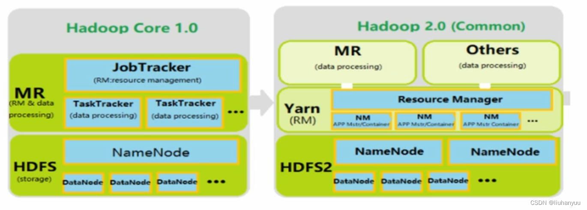
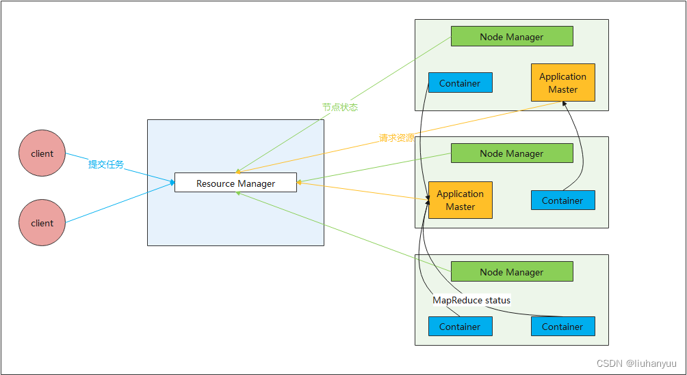
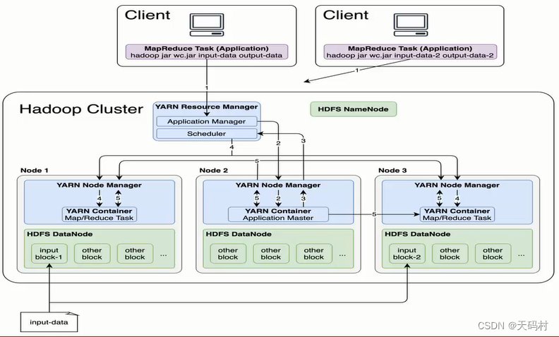

## 一、概述

YARN(Yet Another Resource Negotiator，迄今另一个资源协调者)是Hadoop2.0中提供的一套用于资源管理和任务调度的机制，
也正因为这套机制的出现，导致Hadoop1.0和Hadoop2.0不兼容。

YARN出现的原因：
```text
a. 内因：
在Hadoop1.0中，JobTracker既要对外接收任务，还要对内管理TaskTracker以及分配任务，
并且JobTracker还需要监控TaskTracker的任务执行情况，这就导致JobTracker要负责的任务非常多，从而成为整个集群的性能瓶颈。
并且Hadoop1.0中，JobTracker只允许存在一个，就意味着存在单点故障。
在Hadoop1.0的官方文档中，给定一个JobTracker最多能管理4000个TaskTracker，
多一个都会导致效率成倍下降甚至导致JobTracker的崩溃。

b. 外果：
Hadoop作为大数据的基本生态框架，有很多的计算框架(Pig，Tez，Spark等)基于它来使用。
在Hadoop1.0中，各个计算框架之间会直接各自抢占Hadoop的资源，那么就导致框架之间的资源占用会产生冲突。
```

### 1、yarn产生和发展历史

#### 背景：
数据、程序、运算资源三者组合在一起，才能完成数据的处理，单机不存在问题，但是分布式环境如何协调是一个问题。

Hadoop早期用户使用Hadoop与众多主机上运行的桌面程序类似：在几个节点上建立一个集群、将数据载入HDFS、运行mapreduce。

**Hadoop演进阶段**：
* 阶段1：
    > Ad hoc集群：以单用户的方式建立，随着私人集群的使用实现了HDFS集群的共享，不同于HDFS，共享mapreduce非常困难。
    HOD集群：解决集群条件下多租户的问题yahoo发展部署了Hadoop on Demand平台。
    在节点分配上实现了多个用户使用mapreduce集群。缺点无法支持数据本地化、资源回收效率低、无法动态扩容能力，多租户共享延迟高。

* 阶段2：共享计算集群：
    > JobTracker：中央守护进程（压力大、可靠性欠缺、计算模型单一）。
    TaskTracker：从节点任务执行守护进程（单个节点的资源管理和任务执行）。

* 阶段3：Yarn集群：
    > 拆分mapreduce，剥离出资源管理成为单独框架成为Yarn，mapreduce专注于数据处理，两者解耦。

**YARN被设计用以解决以往架构的需求和缺陷的资源管理和调度软件**。

对Yarn的需求（特性）：
* 可扩展性（平滑的扩展至数万个节点）
* 可维护性（软件和应用程序完全解耦）
* 多租户(同一集群中多个租户并存，细粒度共享单个节点)
* 位置感知（将计算移至数据所在位置）
* 可靠性和可用性（高可用）
* 对编程模型多样化的支持（支持多样化的编程模型，不仅仅以Mapreduce为中心）
* 灵活的资源模型（动态分配）
* 向后兼容

**Apache Hadoop Yarn（Yet Another Resource Negotiator，另一种资源协调者）：资源管理系统和调度平台**。
* 资源管理系统：集群的硬件资源，和程序运行相关，比如内存、CPU。
* 调度平台：多个程序同时申请资源，如何分配。
* 通用性：不仅仅支持Mapreduce，理论上支持各种计算程序。


### 2、MRv2和MRv1区别
Hadoop1中，Mapreduce负责数据计算、资源管理，
运行时环境（JobTracker--资源管理和任务管理调度，TaskTracker--单个节点的资源管理和任务执行）、
编程模型（Mapreduce）、数据处理引擎（Map Task和Reduce Task）。

Hadoop2中，编程模型和数据处理引擎没有变化，
但运行时环境（resourceManager，nodeManager）完全被重写，有Yarn来专管资源管理和任务调度。
Yarn将程序内部具体管理职责交给一个叫做ApplicationMaster。



Apache Hadoop YARN是一个主从架构集群，其中ResourceManager为Master，NodeManager为Slave。

常见的是一主多从集群，也可以搭建RM的HA高可用集群，也就是多主多从集群。

## 二、YARN的架构
YARN主要由ResourceManager、NodeManager、ApplicationMaster和Container组成，
其中ResourceManager和NodeManager是物理集群层面的节点，
ApplicationMaster是应用层面的应用，
Container(Resource Container，简称Container)是一个抽象的资源分配单位。



### 1、ResourceManager（全局资源管理）
ResourceManager（RM）为YARN中的主角色，是一个全局的资源管理器，负责整个系统的资源管理和分配。
RM接收用户的作业提交，并通过NodeManager分配、管理各个机器上的计算资源。

ResourceManager（RM）主要包括两个组件，即调度器（Scheduler）和应用程序管理器（Applications Manager）。

#### 调度器（Scheduler）
调度器 根据容量、队列等限制条件将系统中的资源分配给各个正在运行的应用程序中，
需要注意的是，该调度器是一个纯调度器，它不再从事任何与具有应用程序相关的工作，
调度器仅根据各个应用程序的资源需求按照container进行资源分配。
此外该调度器是一个可插拔的组件，用户可根据自己的需要设计新的调度器，
YARN提供多种直接可用的调度器，比如 fair scheduler和capacity scheduler等。

#### 应用程序管理器（Applications Manager）
应用程序管理器 负责管理整个系统中所有应用程序，
包括应用程序提交、与调度器协商资源以启动ApplicationMaster、监控ApplicationMaster运行状态并在失败时重启它等。

### 2、NodeManager（节点上的资源和任务管理器）
NodeManager是YARN中的从角色，是每个节点上的资源和任务管理器。
一方面（执行），它根据ResourceManager的命令，接收并处理来自AM的container启动/停止等各种请求；
另一方面（监视），它会定时地向RM汇报本节点上的资源使用情况和各个container的运行状态，使得ResourceManager能统一管理全局资源。

### 3、ApplicationMaster(监控应用执行)
ResourceManager接收用户提交的作业，按照作业的上下文信息以及从NodeManager收集来的容器状态信息，启动调度过程，
为用户作业启动一个ApplicationMaster。负责监控或者跟踪应用的执行状态、重新启动因应用程序失败或者硬件故障而产生的失败任务等。

### 4、Container（动态资源分配单位）
容器（Container）作为动态**资源**分配单位，将内存、cpu、磁盘、网络等资源封装在一起，从而限定每个任务使用的资源量。
当AM向RM申请资源时，RM为AM返回的资源便是Container表示的，YARN会为每个任务分配一个Container，
且该任务只能使用该Container中描述的资源，它是一个动态资源划分单位，是根据应用程序的需求动态生成的。

## 三、Yarn的作业执行流程
1、客户端提交Job任务，将任务提交到ResourceManager中的ApplicationsManager上。

2、ApplicationsManager收到任务之后，会先临时将任务存储到自带的队列中，然后等待NodeManager的心跳。

3、当ApplicationsManager收到心跳之后，会将任务在心跳响应中来返回，
并且要求对应的NodeManager来开启一个ApplicationMaster进程来处理这个Job任务。

4、NodeManager收到心跳响应之后，会在本节点内部开启一个进程ApplicationMaster，并且会将Job任务交给这个进程处理。

5、ApplicationMaster收到Job任务之后，会将这个Job任务来进行拆分，
拆分成子任务(如果是一个MapReduce程序，那么就是拆分为MapTask和ReduceTask，拆分越具体才好申请资源)。

6、ApplicationMaster拆分完子任务之后，就会给ApplicationsManager发请求申请资源。

7、ApplicationsManager收到请求之后，会将请求转发给ResourceScheduler。
ResourceScheduler在收到请求之后，会将需要的资源封装成一个Container(对资源的描述)对象返回给ApplicationsManager。
ApplicationsManager会再将Container对象返回给ApplicationMaster，
ApplicationMaster收到Container之后，会将资源进行二次分配，分配给具体的子任务。
资源分配完成之后，ApplicationMaster就会将子任务分配到具体的NodeManager上，并且会监控这些子任务的执行情况。



8、注意问题
```text
a.每一个Job都会对应一个新的ApplicationMaster，那么意味着一个ApplicationMaster出现故障，不会影响其他任务的执行。

b.YARN中的结构：ApplicationsManager管理ApplicationMaster，ApplicationMaster再管理具体的子任务。

c.在YARN中，会给每一个子任务来分配一份资源。
默认一份资源包含了1个CPU核+1G内存，也就意味着一个MapTask/ReduceTask执行的时候可以抢占1个CPU核+1G内存。

d.ApplicationMaster在要资源的时候会多要。
例如默认情况下，副本数量为3，假设有4个MapTask和1个ReduceTask，那么考虑到数据本地化策略，
所以ApplicationMaster要的资源数是4*3+1=13份，但是ResourceScheduler在返回资源的时候，不会超额返回，
而是会根据实际情况返回 - 核心思想就是"要的多(防止资源分配失败)，给的少(避免资源浪费)"。
```

## 四、Yarn的调度策略
### 4.1 队列调度器(FIFO Scheduler)
- 1、特点：哪个任务先来，先分配其所有需要的资源
- 2、缺点是大的应用可能会占用所有集群资源，这就导致其它应用被阻塞。
- 3、该调度方式基本不用

### 4.2 容量调度器(Capacity Scheduler) 
Apache默认的调度策略。
- 1、该调度器会将整个集群资源分成几个队列
- 2、不同的开发组只需要使用自己的资源队列即可，可以实现资源隔离
- 3、这个调度器是Hadoop默认的调度器
- 4、容量调度器默认有一个root根队列，下边有一个default子队列
- 5、调度器的使用是通过yarn-site.xml配置文件中的
  yarn.resourcemanager.scheduler.class参数进行配置的，默认采用Capacity Scheduler调度器。

  ```text
  <property>
      <name>yarn.resourcemanager.scheduler.class</name>
      <value>org.apache.hadoop.yarn.server.resourcemanager.scheduler.capacity.CapacitySchedulere>
  </property>
  ```

- 6、我们可以通过定义队列来实现资源隔离

  资源隔离
  ```text
  <!-- 无default队列 -->
  <?xml version="1.0"?>
  <configuration>
      <!-- 分为两个队列，分别为prod和dev -->  
      <property>
          <name>yarn.scheduler.capacity.root.queues</name>
          <value>prod,dev</value> 
      </property>
      <!-- 设置prod队列40% -->      
      <property>
          <name>yarn.scheduler.capacity.root.prod.capacity</name>
          <value>40</value>
      </property>
      <!-- 设置dev队列60% -->  
      <property>
          <name>yarn.scheduler.capacity.root.dev.capacity</name>
          <value>60</value> 
      </property>
      <!-- 设置dev队列可使用的资源上限为75% -->  
      <property>
          <name>yarn.scheduler.capacity.root.dev.maximum-capacity</name>
          <value>75</value> 
      </property>
      <!-- dev继续分为两个队列，分别为eng和science -->      
      <property>
          <name>yarn.scheduler.capacity.root.dev.queues</name>
          <value>eng,science</value> 
      </property>
      <!-- 设置eng队列50% -->    
      <property>
          <name>yarn.scheduler.capacity.root.dev.eng.capacity</name>
          <value>50</value> 
      </property>
      <!-- 设置science队列50% -->   
      <property>
          <name>yarn.scheduler.capacity.root.dev.science.capacity</name>
          <value>50</value>
      </property>
  </configuration>
  ```
  ```text
  <!-- 有Default队列 -->
  <?xml version="1.0"?>
  <configuration>
      <!-- 分为两个队列，分别为prod和dev -->  
      <property>
          <name>yarn.scheduler.capacity.root.queues</name>
          <value>default,prod,dev</value> 
      </property>
      <!-- 设置default队列80% -->      
      <property>
          <name>yarn.scheduler.capacity.root.default.capacity</name>
          <value>80</value>
      </property>
  
      <!-- 设置prod队列10% -->      
      <property>
          <name>yarn.scheduler.capacity.root.prod.capacity</name>
          <value>10</value>
      </property>
      <!-- 设置prod队列可使用的资源上限为80% -->  
      <property>
          <name>yarn.scheduler.capacity.root.prod.maximum-capacity</name>
          <value>80</value> 
      </property>
      
      <!-- 设置dev队列10% -->  
      <property>
          <name>yarn.scheduler.capacity.root.dev.capacity</name>
          <value>10</value> 
      </property>
      
          <!-- 设置dev队列可使用的资源上限为75% -->  
      <property>
          <name>yarn.scheduler.capacity.root.dev.maximum-capacity</name>
          <value>75</value> 
      </property>
      <!-- dev继续分为两个队列，分别为eng和science -->      
      <property>
          <name>yarn.scheduler.capacity.root.dev.queues</name>
          <value>eng,science</value> 
      </property>
      <!-- 设置eng队列50% -->    
      <property>
          <name>yarn.scheduler.capacity.root.dev.eng.capacity</name>
          <value>50</value> 
      </property>
      <!-- 设置science队列50% -->   
      <property>
          <name>yarn.scheduler.capacity.root.dev.science.capacity</name>
          <value>50</value>
      </property>
  </configuration>
  ```
  配置为需要重启yarn：
  ```text
  stop-yarn.sh
  start-yarn.sh
  ```

### 4.3 公平调度器(Fair Scheduler)
该调度器会将整个资源平均分配给job，所有执行的Job一视同仁。

## 五、Yarn的关键参数
以下参数都是在yarn-site.xml中配置：

设置container分配最小内存
```text
# 给应用程序container分配的最小内存
yarn.scheduler.minimum-allocation-mb 1024 
```

设置container分配最大内存
```text
# 给应用程序container分配的最大内存
yarn.scheduler.maximum-allocation-mb 8192 
```

设置每个container的最小虚拟内核个数
```text
# 每个container默认给分配的最小的虚拟内核个数
yarn.scheduler.minimum-allocation-vcores 1 
```

设置每个container的最大虚拟内核个数
```text
# 每个container默认给分配的最大的虚拟内核个数
yarn.scheduler.maximum-allocation-vcores 32 
```

设置NodeManager可以分配的内存大小
```text
# NodeManager可以分配的内存大小
yarn.nodemanager.resource.memory-mb 8192 
```

定义每台机器的内存使用大小
```text
# 每台机器的内存使用大小
yarn.nodemanager.resource.memory-mb 8192
```

定义交换区空间可以使用的大小，交换区空间就是讲一块硬盘拿出来做内存使用，这里指定的是nodemanager的2.1倍。
```text
yarn.nodemanager.vmem-pmem-ratio 2.1
```


