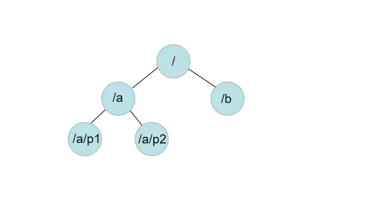
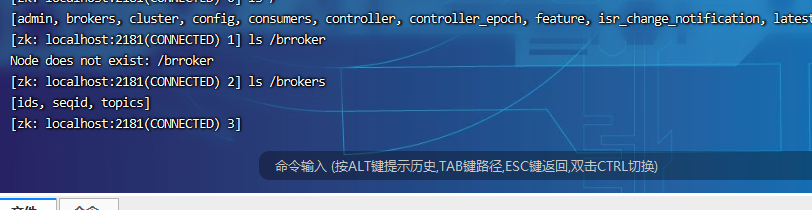
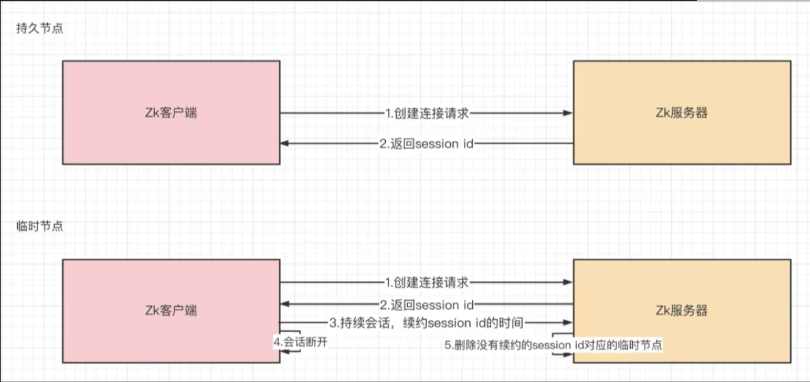

# 三、Zookeeper内部的数据模型

## 1、zk是如何保存数据的
zk中的数据是保存在节点上的，节点就是znode，多个znode之间构成一棵树的目录结构。类似于数据结构中的树，同时也很像文件系统的目录。



这样的层级结构，让每一个Znode的节点拥有唯一的路径，就像命名空间一样对不同信息做出清晰的隔离。
```text
# 查看根节点
ls /
```



## 2、zk中的znode是什么样的数据结构
zk中的znode包含了四个部分：

1）data：保存数据

2）acl：权限：
```text
c：create 创建权限，允许在该节点下创建子节点

w：write 更新权限，允许更新该节点的数据

r：read 读取权限，允许读取该节点的内容以及子节点的列表信息

d：delete 删除权限，允许删除该节点的子节点信息

a：admin 管理者权限，允许对该节点进行acl权限设置
```

3）stat：描述当前znode的元数据

4）child：当前节点的子节点

## 3、zk中节点znode的类型
1）持久节点：创建出的节点，在会话结束后依然存在。保存数据。

2）持久序号节点：创建出的节点，根据先后顺序，会在节点之后带上一个数值，越后执行数值越大，适用于分布式锁的应用场景-单调递增。

3）临时节点：临时节点是在会话结束后，自动被删除的，通过这个特性，zk可以实现服务注册与发现的效果。

4）临时序号节点：跟持久序号节点相同，适用于临时的分布式锁。



5）Container节点（3.5.3版本新增）：Container容器节点，当容器中没有任何子节点，该容器节点会被zk定期删除。

6）TTL节点：可以指定节点的到期时间，到期后被zk定时删除。只能通过系统配置zookeeper.extendedTypeEnable=true开启。

## 4、zk的数据持久化
zk的数据是运行在**内存**中，zk提供了两种持久化机制：

1）事务日志：
  zk把执行的命令以日志形式保存在dataLogDir指定的路径中的文件中（如果没有指定dataLogDir，则按照 dataDir指定的路径）。

2）数据快照：
  zk会在一定的时间间隔内做一次内存数据快照，把时刻的内存数据保存在快照文件中。

zk通过两种形式的持久化，在恢复时先恢复快照文件中的数据到内存中，再用日志文件中的数据做增量恢复，这样恢复的速度更快。
