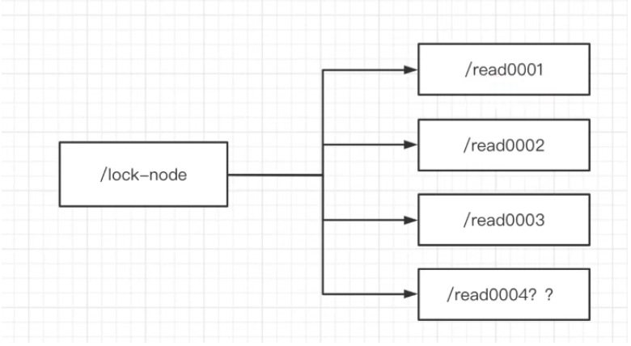
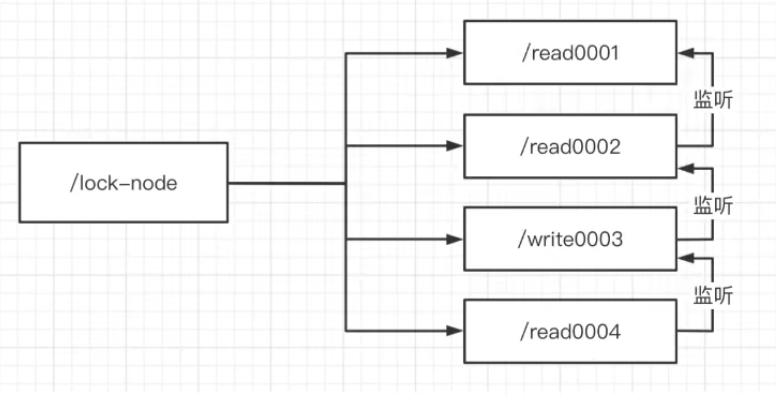

# 六、zk实现分布式锁

## 1、zk中锁的种类
* 读锁（读锁共享）：大家都可以读。上锁前提：之前的锁没有写锁。

* 写锁（写锁排他）：只有得到写锁的才能写。上锁前提：之前没有任何锁。
      
读数据并不会对数据本身产生影响所以可以同时读，写数据说明数据发生了变化，这个时候就不能读数据了。

## 2、zk如何上读锁
1）创建一个临时序号节点，节点的数据是read，表示是读锁。

2）获取当前zk中序号比自己小的所有节点。

3）判断最小节点是否是读锁。
    如果不是读锁的话，则上锁失败，为最小节点设置监听。阻塞等待，zk的watch机制会当最小节点发生变化时通知当前节点，再执行第二步的流程
    如果是读锁的话，则上锁成功。



## 3、zk如何上写锁
1）创建一个临时序号节点，节点的数据是write，表示写锁。
2）获取zk中所有的子节点。
3）判断自己是否是最小的节点：
4）如果是，则上写锁成功；如果不是，说明前面还有锁，则上锁失败，监听最小节点，如果最小节点有变化，则再执行第二步。

## 4、羊群效应
如果用上述的上锁方式，只要有节点发生变化，就会触发其他节点的监听事件，这样对zk的压力非常大，而羊群效应，可以调整成链式监听。解决这个问题。



## 5、Curator实现读写锁

获取读锁：
```text
@Test
void testGetReadLock()throws Exception{
    // 读写锁
    InterProcessReadWriteLock interProcessReadWriteLock = new InterProcessReadWriteLock(client, "/lock1");
    // 获取读锁对象
    InterProcessLock interProcessLock = interProcessReadWriteLock.readLock();
    System.out.println("等待获取读锁对象中...");
    // 获取锁
    interProcessLock.acquire();
    for(int i = 1; i <= 100; i ++){
        Thread.sleep(3000);
        System.out.println(i);
    }
    // 释放锁
    interProcessLock.release();
    System.out.println("等待释放锁...");
}
```

获取写锁：
```text
@Test
void testGetWriteLock()throws Exception{
    //读写锁
    InterProcessReadWriteLock interProcessReadWriteLock = new InterProcessReadWriteLock(client, "/lock1");
    //获取写锁对象
    InterProcessLock interProcessLock = interProcessReadWriteLock.writeLock();
    System.out.println("等待获取写锁对象中...");
    //获取锁
    interProcessLock.acquire();
    for(int i = 1; i <= 100; i ++){
        Thread.sleep(3000);
        System.out.println(i);
    }
    //释放锁
    interProcessLock.release();
    System.out.println("等待释放锁...");
}
```
