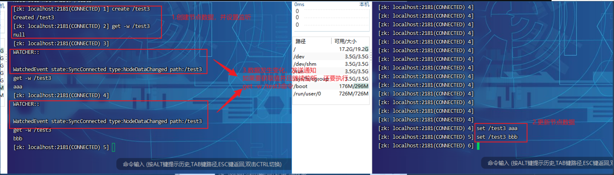

# 七、zk的watch机制

## 1、Watch机制介绍
我们可以把Watch理解成是注册在特定Znode上的触发器。
当这个Znode发生改变，也就是调用了create，delete，setData方法的时候，将会触发Znode上注册的对应事件，请求Watch的客户端会收到异步通知。

具体交互过程如下：



客户端调用getData方法，watch参数是true。
服务端接到请求，返回节点数据，并且在对应的哈希表里插入被Watch的Znode路径，以及Watcher列表。
```text
1.监听节点数据变化：get -w /xxx
2.客户端的监听只生效一次。如果想持续监听，需要在每次监听信息打印后，查看数据的时候，再使用：get -w /xxx
3.在被监听的节点上创建子节点，watch监听事件不会被触发
```

当被watch的znode已删除，服务端会查找哈希表，找到znode对应的所有watcher，异步通知客户端，并删除哈希表中对应的key-value。

客户端使用了NIO的通信模式监听服务端的调用。

## 2、zkCli客户端使用Watch
```text
create /test1 aaa
get -w /test1	一次性监听节点
ls -w /test1		监听目录，创建和删除子节点会收到通知。但是子节点中新增节点不会被监听到
ls -R -w /test1	监听子节点中节点的变化，但内容的变化不会收到通知
```

## 3、Curator客户端使用Watch
```text
@Test
public void addNodeListener() throws Exception{
    NodeCache nodeCache = new NodeCache(curatorFramework,"/curator-node");
    nodeCache.getListenable().addListener(new NodeCacheListener() {
        @Override
        public void nodeChanged() throws Exception{
            log.info("{} path nodeChanged: ", "/curator-node");
            printNodeData();
        }
    });
    nodeCache.start();
    //System.in.read();
}

public void printNodeData() throws Exception{
    byte[] bytes = curatorFramework.getData().forPath("/curator-node");
    log.info("data: {}", new String(bytes));
}
```
