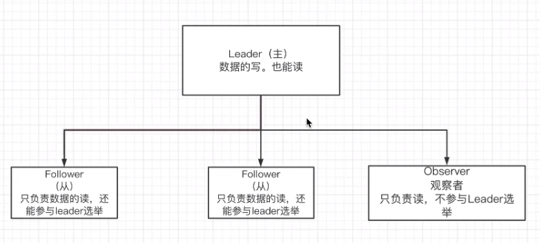
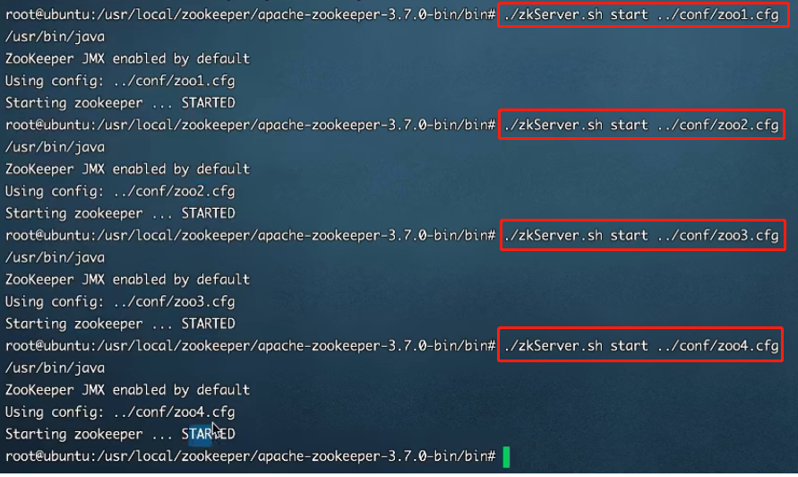
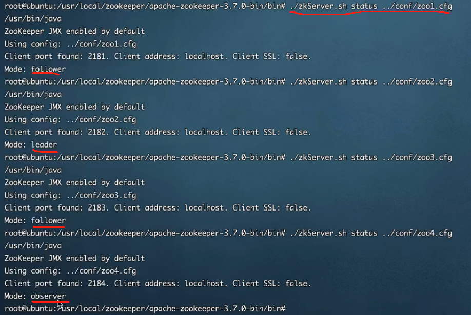

# 八、Zookeeper集群实战
## 1、Zookeeper集群角色
zookeeper集群中的节点有三种角色：
* Leader：处理集群的所有事务请求，集群中只有一个Leader
* Follower：只能处理读请求，参与Leader选举
* Observer：只能处理读请求，提升集群读的性能，但不能参与Leader选举



## 2、集群搭建
搭建4个节点，其中一个节点为Observer。

### 1.创建4个节点的myid并设值
在usr/local/zookeeper中创建一下四个文件
```text
/usr/local/zookeeper/data/zk1# echo 1 > myid
/usr/local/zookeeper/data/zk2# echo 2 > myid
/usr/local/zookeeper/data/zk3# echo 3 > myid
/usr/local/zookeeper/data/zk4# echo 4 > myid
```

### 2.编写4个zoo.cfg
```text
# The number of milliseconds of each tick
tickTime=2000
# The number of ticks that the initial
# synchronization phase can take
initLimit=10
# The number of ticks that can pass between
# sending a request and getting an acknowledgement
syncLimit=5
# the directory where the snapshot is stored.
# do not use /tmp for storage, /tmp here is just
# example sakes. 修改对应的zk1 zk2 zk3 zk4
dataDir=/usr/local/zookeeper/zkdata/zk1

# the port at which the clients will connect
clientPort=2181

# 2001为集群通信端口，3001为集群选举端口，observer（观察者身份）
server.1=127.0.0.1:2001:3001
server.2=127.0.0.1:2002:3002
server.3=127.0.0.1:2003:3003
server.4=127.0.0.1:2004:3004:observer
```

## 3.启动服务节点以及观察节点状态
启动



观察角色



## 4.连接Zookeeper集群
```text
# 在ZooKeeper集群中，客户端不需要显式地连接观察者节点。因为观察者节点只是提供额外的备份服务，并且不参与写操作的投票，
# 所以客户端只需要连接到主节点和从节点即可。
./bin/zkCli.sh -server 127.0.0.12181,127.0.0.1:2182,127.0.0.1:2183
```
