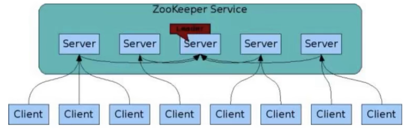
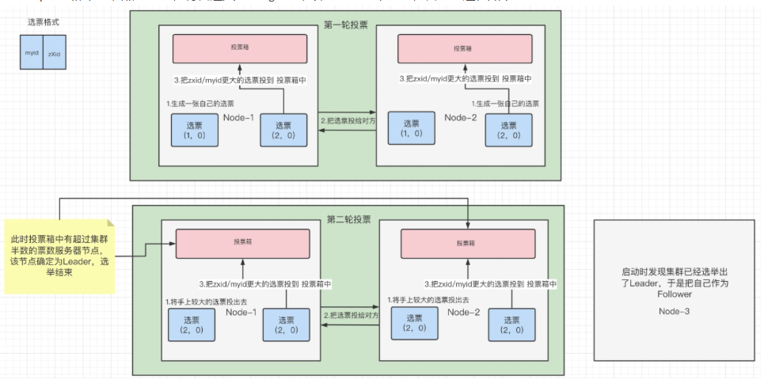
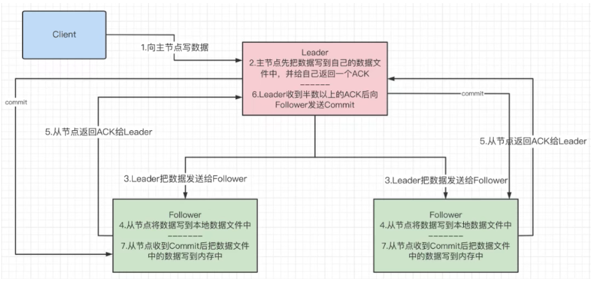

# 九、ZAB协议

## 1、什么是ZAB协议
zookeeper作为非常重要的**分布式协调组件**，需要进行集群部署，集群中会以一主多从的形式进行部署。

zookeeper为了保证**数据的一致性**，使用了ZAB（Zookeeper Atomic Broadcast）协议，
这个协议解决了Zookeeper的**崩溃恢复**和**主从数据同步**的问题。



## 2、ZAB协议定义的四种节点状态
* Looking：选举状态
* Following：Following节点（从节点）所处的状态
* Leading：Leader节点（主节点）所处状态

## 3、集群上线Leader选举过程



**选票规则**： myid和zxid，先比较zXid看谁大，如果一样大就比较myid谁大。

简单理解： 投票超过集群数一半就选定为leader
```text
阶段一：broker_1启动，此时broker_1生成一张选票；

阶段二：broker_2启动，broker_2和broker_1比较，发现zxid一样， broker_2的myid大于broker_1, 
      所以，各自节点都会有两个选票都是broker_2，此时票数超过一半，所以broker_2当选为leader；

阶段三：broker_3启动，此时leader已经选举，所以为follower；

阶段四：broker_4启动，作为observer；
```

## 4、崩溃恢复时的Leader选举
Leader建立完后，Leader周期性地不断向Follower发送心跳（ping命令，没有内容的socket）。
当Leader崩溃后，Follower发现socket通道已关闭，于是Follower开始进入到Looking状态，重新回到上一节中的Leader选举状态，
此时集群不能对外提供服务。

## 5、主从服务器之间的数据同步



leader收到半数以上follower的ack，就发送commit（向所有follower，和自己）。

为什么要半数以上？
```text
1) 提升整个集群写数据的性能。因为集群中3台节点，有两台都写成功了，说明网络通信基本正常，集群能够持续提供服务

2) 半数，指的是整个集群所有节点的半数
```
也可以理解成分布式事务中的两阶段提交。

## 6、Zookeeper中的NIO与BIO的应用
NIO：
```text
用于被客户端连接的2181端口，使用的是NIO模式与客户端建立连接；
客户端开启Watch时，也使用NIO，等待Zookeeper服务器的回调；
```
BIO：
```text
集群在选举时，多个节点之间的投票通信端口，使用BIO进行通信；
```
