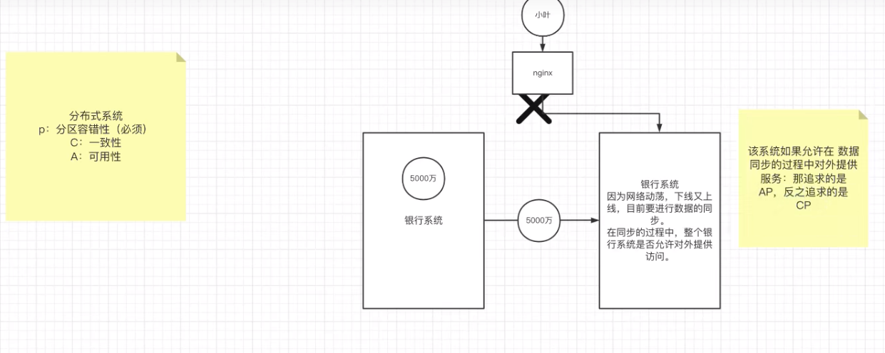

# 十、CAP理论
2000年7月，加州大学伯克利分校的 Eric Brewer教授在ACM PODC会议上提出CAP猜想。
2年后，麻省理工学院的Seth Gilbert和 Nancy Lynch 从理论上证明了CAP。
之后，CAP理论正式成为分布式计算领域的公认定理。

## 10.1 CAP理论



**CAP理论**为：
```text
一个分布式系统最多只能同时满足一致性（Consistency）、可用性（Availability）和区分容错性（Partition tolerance）这三项中的两项。
```

**—致性(Consistency)**
```text
一致性指"all nodespsee the same data at the same time"，即更新操作成功并返回客户端完成后，所有节点在同一时间的数据完全一致。
```

**可用性(Availability)**
```text
可用性指"Reads and writes always succeed"，即服务一直可用，而且是正常响应时间。
```

**分区容错性(Partition tolerance)**
```text
分区容错性指"the system continues to operate despite arbitrary message loss or failure of part of the system"，
即分布式系统在遇到某节点或网络分区故障的时候，仍然能够对外提供满足一致性或可用性的服务。
避免单点故障，就要进行冗余部署，冗余部署相当于是服务的分区，这样的分区就具备了容错性。
```

## 10.2 BASE理论
eBay的架构师Dan Pritchett源于对大规模分布式系统的实践总结，
在ACM上发表文章提出BASE理论，BASE理论是对CAP理论的延伸，
核心思想是，即使无法做到强一致性《Strong Consistency，CAP的一致性就是强一致性)，
但应用可以采用适合的方式达到最终一致性(Eventual Consistency) 。

**基本可用(Basically Available)**
```text
基本可用是指分布式系统在出现故障的时候，允许损失部分可用性，即保证核心可用。

电商大促时，为了应对访问量激增，部分用户可能会被引导到降级页面，服务层也可能只提供降级服务。这就是损失部分可用性的体现。
```

**软状态(Soft State)**
```text
软状态是指允许系统存在中间状态，而该中间状态不会影响系统整体可用性。

分布式存储中一般一份数据至少会有三个副本，允许不同节点间副本同步的延时就是软状态的体现。

mysql replication的异步复制也是一种体现。
```

**最终一致性(Eventual Consistency)**
```text
最终一致性是指系统中的所有数据副本经过一定时间后，最终能够达到一致的状态。

弱一致性和强一致性相反，最终一致性是弱一致性的—种特殊情况。
```

## 10.3 Zookeeper追求的一致性
ZooKeeper是弱一致性，能保证最终一致性。

zookeeper使用的**ZAB协议**进行**主从数据同步**，ZAB协议认为只要是过半数节点写入成为，数据就算写成功了，然后会告诉客户端A数据写入成功。
如果这个时候客户端B恰好访问到还没同步最新数据的zookeeper节点，那么读到的数据就是不一致性的。
因此，zookeeper无法保证写数据的强一致性，只能保证最终一致性，而且可以保证同一客户端的顺序一致性。

但也可以支持强一致性，通过sync()方法与Leader节点同步后可保证当前节点数据与Leader一致。
