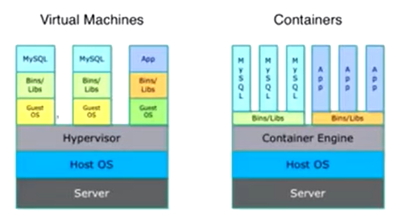

# kubernetes学习

---
## 一、kubernetes简介

### 1、简介
> kubernetes是开源的、生产级的、自动化的部署、扩展和管理 的**容器编排**系统。
>> Google于2014年开源给 ***CNCF*** (Cloud Native Computing Foundation)。
> 
>> kubernetes希腊语，意思为 “驾驶员”。（可以理解为 容器 就是一条条海上的船，k8s就是 驾驶员 来引导容器的方向）

### 2、容器
> 容器技术是指 一系列隔离运行的**进程**，提供了一种轻量级 操作系统层面的**虚拟化技术**。相对于传统VM虚拟机，具有启动快、性能损耗小、更轻量等优点。
>> 基于Linux系统的NameSpace实现资源隔离、基于CGroups实现资源限制。
> 
>> 虚拟机和容器对比：

> ***docker***是目前使用最广、最成熟的容器技术。
>> docker的3大核心：
>> * 镜像
>> * 容器
>> * 仓库
> 
>> 目前K8S默认使用的是docker引擎。
> 
> 容器化应用的优势：
>> 容器解决了应用 打包、部署、运行的问题，“一次构建、随处运行”(Build, Ship, and Run Any App, Anywhere) 
> 
> 容器化系统面临的挑战：
>> * 跨机器部署
>> * 资源调度
>> * 负载均衡
>> * 自动伸缩
>> * 容错处理
>> * 服务发现
>> 
### 3、容器编排 
> 容器编排指的是 以 **容器** 为基本对象，进行 **容器调度**、**资源管理**、**服务管理**，协同各个容器 来共同实现应用的功能。
  
### 4、kubernetes发展史
> 基于Google内部的“Borg”和“Omega”系统，于2014年10月正式开源，现在由云原生计算基金会CNCF 负责管理。并且，受到众多厂商(Google、RedHat、CoreOS、IBM、MicroSoft、HUAWEI)的积极支持，社区十分活跃。
> 
> kubernetes是Google开源的生产级的容器编排系统，是Google多年大规模容器管理技术Borg的开源版本。
>> 提供的功能特性如下：
>>> * 基于容器的应用部署、维护和滚动升级
>>> * 负载均衡和服务发现
>>> * 跨机器和跨地区的集群调度
>>> * 自动伸缩
>>> * 无状态服务和有状态服务
>>> * 广泛的Volume支持
>>> * 插件机制保证扩展性
> 
> kubernetes发展非常迅速，已经成为容器编排领域的领导者。
---

