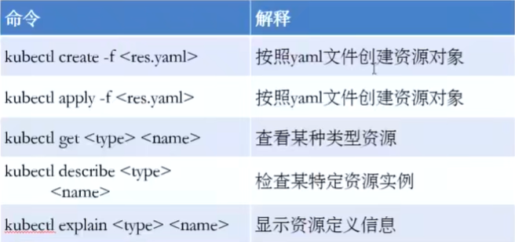

# kubernetes学习

---
## 一、kubernetes简介

### 1、简介
> kubernetes是开源的、生产级的、自动化的部署、扩展和管理 的**容器编排**系统。
>> Google于2014年开源给 ***CNCF*** (Cloud Native Computing Foundation)。
> 
>> kubernetes希腊语，意思为 “驾驶员”。（可以理解为 容器 就是一条条海上的船，k8s就是 驾驶员 来引导容器的方向）

### 2、容器
> 容器技术是指 一系列隔离运行的**进程**，提供了一种轻量级 操作系统层面的**虚拟化技术**。相对于传统VM虚拟机，具有启动快、性能损耗小、更轻量等优点。
>> 基于Linux系统的NameSpace实现资源隔离、基于CGroups实现资源限制。
> 
>> 虚拟机和容器对比：

> ***docker***是目前使用最广、最成熟的容器技术。
>> docker的3大核心：
>> * 镜像
>> * 容器
>> * 仓库
> 
>> 目前K8S默认使用的是docker引擎。
> 
> 容器化应用的优势：
>> 容器解决了应用 打包、部署、运行的问题，“一次构建、随处运行”(Build, Ship, and Run Any App, Anywhere) 
> 
> 容器化系统面临的挑战：
>> * 跨机器部署
>> * 资源调度
>> * 负载均衡
>> * 自动伸缩
>> * 容错处理
>> * 服务发现
>> 
### 3、容器编排 
> 容器编排指的是 以 **容器** 为基本对象，进行 **容器调度**、**资源管理**、**服务管理**，协同各个容器 来共同实现应用的功能。
  
### 4、kubernetes发展史
> 基于Google内部的“Borg”和“Omega”系统，于2014年10月正式开源，现在由云原生计算基金会CNCF 负责管理。并且，受到众多厂商(Google、RedHat、CoreOS、IBM、MicroSoft、HUAWEI)的积极支持，社区十分活跃。
> 
> kubernetes是Google开源的生产级的容器编排系统，是Google多年大规模容器管理技术Borg的开源版本。
>> 提供的功能特性如下：
>>> * 基于容器的应用部署、维护和滚动升级
>>> * 负载均衡和服务发现
>>> * 跨机器和跨地区的集群调度
>>> * 自动伸缩
>>> * 无状态服务和有状态服务
>>> * 广泛的Volume支持
>>> * 插件机制保证扩展性
> 
> kubernetes发展非常迅速，已经成为容器编排领域的领导者。

---

## 二、kubernetes架构与核心组件详解

### 1、kubernetes架构
> kubernetes cluster是一个master-slave的架构
> 
>>  * master
>>  * worker node (Minion)

### 2、master节点
> k8s的master节点的内部组件
> 
>> * API Server
>> * Scheduler
>> * Controller Manager
>> * DashBoard(addons)

### 3、worker 节点
> worker 节点的核心组件：
> 
> 
> * kubelet: 处理master节点下发到本节点的任务，管理pod和其中的容器，并定期向master节点汇报资源使用情况；
> * kube-proxy: 运行在work节点上的agent，实现service的抽象，为一组pod抽象的服务(service)提供统一接口并提供负责均衡功能；
> * container runtime: docker、rocket

### 4、etcd
> etcd是一个由CoreOS开发并开源的、基于Raft协议的分布式的一致性K\V存储。
> 
> 
> 在k8s架构中，用作分布式K\V存储系统，用于保存集群所有的网络配置信息和对象的状态信息。

### 5、kubernetes整体架构
>

### 6、kubernetes调用流程
> 
> 1. 用户通过“kubectl”命令进行操作，例如部署新的应用;
> 2. API Server接收到请求，并将其存储到etcd;
> 3. Watcher和Controllers检测到资源状态的变化，并进行操作;
> 4. Replica Watcher/Controller检测到新的app，创建新的pod达到期望的实例个数;
> 5. Scheduler将新的pod分配到kubelet;
> 6. kubelet检测到pods，并通过容器运行时部署它们;
> 7. kube-proxy管理pod的网络，包括服务发现、负载均衡;
>

---
## 三、kubernetes安装
> 待补充

---

## 四、kubernetes基础

### 1、资源对象
> 在kubernetes中，所有资源实体都可以表示为资源对象。
> 通过Yaml格式文件来描述资源，称为资源清单(Manifest)。
> * 资源实例化后就称为对象
> * 通过API或kubectl来管理kubernetes资源对象

### 2、资源类型
> kubernetes中的主要资源类型如下:
> 
> 

> kubernetes的对象模型(即Yaml描述文件的格式)
> 
> 
> * apiVersion: 创建该对象使用的kubernetes API的版本
> * kind: 想要创建的对象的类型
> * metadata: 帮助识别该对象的唯一性的数据，包括name字符串、UID和namespace
> * spec: 用于描述资源的容器配置信息
> 
### 3、创建资源对象时常用命令
> 
> 
> 